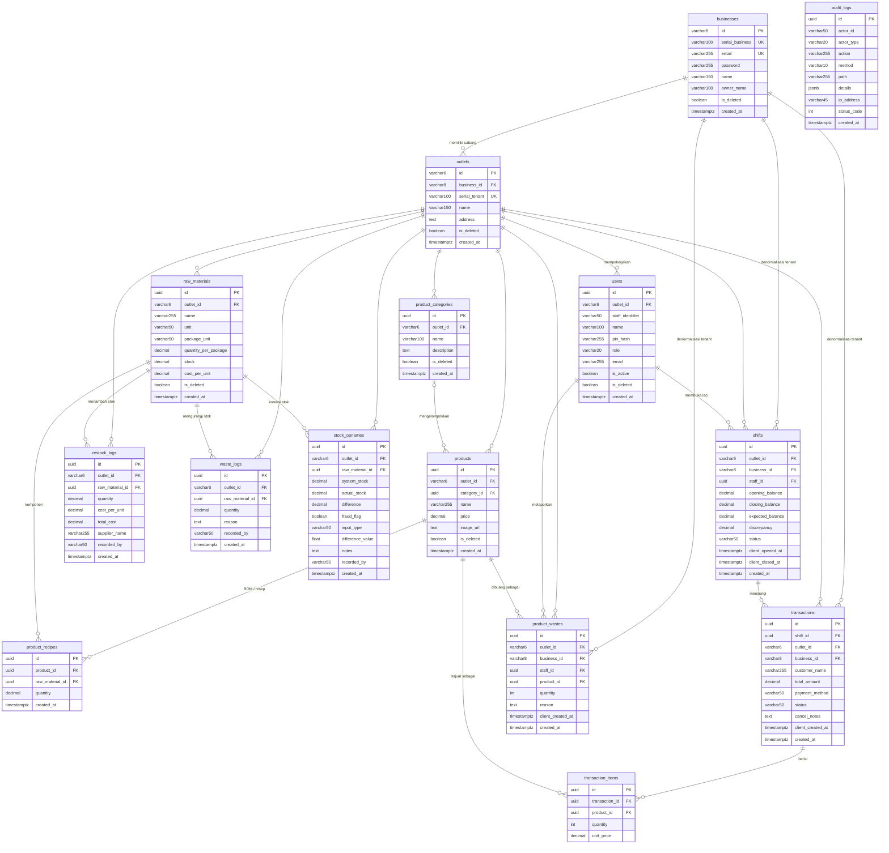

# 02 — Database Schema

> **Sumber kebenaran:** 16 file migrasi di [posgodinov-be/db/migrations/](../posgodinov-be/db/migrations/), diverifikasi silang terhadap struct GORM di [internal/domain/](../posgodinov-be/internal/domain/).
> Engine: **PostgreSQL 17** · Migrasi: `golang-migrate` (berjalan otomatis saat startup).
> Dokumen ini menggambarkan **kondisi skema setelah seluruh 16 migrasi diterapkan**.

---

## 1. Ringkasan ERD



> `audit_logs` sengaja digambarkan berdiri sendiri — tabel ini **tidak memiliki satu pun foreign key** dan tidak terhubung ke tenant mana pun.

### Diagram alur inventori (mengapa relasi ini penting)

```text
restock_logs ──(+)──┐
                    ├──► raw_materials.stock ◄──(koreksi)── stock_opnames
waste_logs   ──(−)──┘            ▲
                                 │ (−) via BOM, saat POS sync
                                 │
                 product_recipes (BOM)
                                 ▲
                                 │
      transaction_items ──► products ──► product_wastes
```

Stok bahan baku **tidak pernah** diubah langsung oleh kasir. Stok berkurang secara turunan: transaksi terjual → resep (BOM) dilihat → bahan baku dipotong sesuai `quantity × jumlah item` ([pos_sync_service.go:200-225](../posgodinov-be/internal/service/pos_sync_service.go#L200-L225)).

---

## 2. Katalog Tabel

Terdapat **15 tabel domain** ditambah `schema_migrations` (dikelola oleh golang-migrate).

Legenda: **PK** = Primary Key · **FK** = Foreign Key · **UK** = Unique Key · **NN** = NOT NULL

---

### 2.1 `businesses` — Tenant Root (Pemilik Pusat)

Migrasi: `000002`, `000011`

| Kolom | Tipe | Constraint | Keterangan |
|---|---|---|---|
| `id` | `VARCHAR(8)` | **PK** | Alfanumerik acak dari `utils.GenerateRandomString(8)` |
| `serial_business` | `VARCHAR(100)` | NN, **UK** | `UPPER(name[0:3]) + UPPER(owner[0:2]) + ddMMyy` — dipakai untuk device binding POS |
| `email` | `VARCHAR(255)` | NN, **UK** | Kredensial login owner |
| `password` | `VARCHAR(255)` | NN | Hash bcrypt (`DefaultCost`) |
| `name` | `VARCHAR(150)` | NN | Nama bisnis |
| `owner_name` | `VARCHAR(100)` | NULL | — |
| `is_deleted` | `BOOLEAN` | DEFAULT `false` | Soft delete |
| `created_at` | `TIMESTAMPTZ` | DEFAULT `CURRENT_TIMESTAMP` | — |

**Isolasi tenant:** ini adalah akar tenant itu sendiri. `businesses.id` adalah identitas tenant paling atas.

---

### 2.2 `outlets` — Sub-tenant (Cabang / Toko)

Migrasi: `000002`, `000003` (`serial_tenant` diperluas `VARCHAR(10)` → `VARCHAR(100)`), `000011`

| Kolom | Tipe | Constraint | Keterangan |
|---|---|---|---|
| `id` | `VARCHAR(6)` | **PK** | Alfanumerik acak 6 karakter |
| `business_id` | `VARCHAR(8)` | NN, **FK** → `businesses(id)` `ON DELETE CASCADE` | **Kolom isolasi tenant** |
| `serial_tenant` | `VARCHAR(100)` | NN, **UK** | `serial_business + %03d` (nomor urut outlet) |
| `name` | `VARCHAR(150)` | NN | Nama cabang |
| `address` | `TEXT` | NULL | — |
| `is_deleted` | `BOOLEAN` | DEFAULT `false` | ⚠️ Ada tetapi **tidak pernah difilter** oleh query mana pun |
| `created_at` | `TIMESTAMPTZ` | DEFAULT `CURRENT_TIMESTAMP` | — |

**Isolasi tenant:** `business_id`. Ini adalah **satu-satunya tabel** yang menghubungkan `outlet_id` kembali ke pemiliknya — seluruh pemeriksaan otorisasi bermuara ke sini.

`[NEEDS DISCUSSION]` — `outlets.is_deleted` ada di skema, namun [outlet_repository.go](../posgodinov-be/internal/repository/outlet_repository.go) tidak pernah menyertakannya dalam `WHERE`, dan tidak ada endpoint untuk menghapus outlet. Kolom ini efektif tidak berfungsi. Jika penonaktifan outlet memang dibutuhkan, perlu implementasi baru.

---

### 2.3 `users` — Staff / Kasir

Migrasi: `000002`, `000004` (+`email`), `000011`
Dipetakan oleh `domain.Staff` melalui override `TableName() → "users"`.

| Kolom | Tipe | Constraint | Keterangan |
|---|---|---|---|
| `id` | `UUID` | **PK**, DEFAULT `gen_random_uuid()` | — |
| `outlet_id` | `VARCHAR(6)` | NN, **FK** → `outlets(id)` `ON DELETE CASCADE` | **Kolom isolasi tenant** |
| `staff_identifier` | `VARCHAR(50)` | NN, bagian dari **UK** | Username kasir untuk login lokal |
| `name` | `VARCHAR(100)` | NN | — |
| `pin_hash` | `VARCHAR(255)` | NN | Hash bcrypt dari PIN 4-6 digit. **Dikirim ke perangkat POS** untuk validasi offline |
| `role` | `VARCHAR(20)` | NN, DEFAULT `'CASHIER'` | ⚠️ Tidak pernah dipakai untuk otorisasi; selalu `CASHIER` |
| `email` | `VARCHAR(255)` | NULL | Ditambahkan pada migrasi `000004` |
| `is_active` | `BOOLEAN` | DEFAULT `TRUE` | — |
| `is_deleted` | `BOOLEAN` | DEFAULT `false` | Soft delete — dihormati oleh seluruh query |
| `created_at` | `TIMESTAMPTZ` | DEFAULT `CURRENT_TIMESTAMP` | — |

**Unique constraint:** `uq_outlet_staff UNIQUE (outlet_id, staff_identifier)` — satu username kasir unik **per outlet**, sehingga dua outlet berbeda boleh memiliki kasir bernama `kasir01`.

**Isolasi tenant:** `outlet_id`. Untuk mengambil seluruh staff satu bisnis, repository melakukan `JOIN outlets ON outlets.id = users.outlet_id WHERE outlets.business_id = ?` ([staff_repository.go:59-66](../posgodinov-be/internal/repository/staff_repository.go#L59-L66)).

---

### 2.4 `product_categories` — Kategori Produk

Migrasi: `000009`, `000011`, `000013` (+`description`)

| Kolom | Tipe | Constraint | Keterangan |
|---|---|---|---|
| `id` | `UUID` | **PK**, DEFAULT `gen_random_uuid()` | — |
| `outlet_id` | `VARCHAR(6)` | NN, **FK** → `outlets(id)` `ON DELETE CASCADE` | **Kolom isolasi tenant** |
| `name` | `VARCHAR(100)` | NN | — |
| `description` | `TEXT` | NULL | — |
| `is_deleted` | `BOOLEAN` | DEFAULT `false` | Dihormati oleh query |
| `created_at` | `TIMESTAMPTZ` | DEFAULT `CURRENT_TIMESTAMP` | — |

> Kategori bersifat **per-outlet**, bukan per-bisnis. Sebuah bisnis dengan 3 outlet harus membuat kategori "Minuman" sebanyak 3 kali.

---

### 2.5 `products` — Menu / Produk Jadi

Migrasi: `000005`, `000009` (+`category_id`), `000011`, `000015` (+`image_url`)

| Kolom | Tipe | Constraint | Keterangan |
|---|---|---|---|
| `id` | `UUID` | **PK**, DEFAULT `gen_random_uuid()` | — |
| `outlet_id` | `VARCHAR(6)` | NN, **FK** → `outlets(id)` `ON DELETE CASCADE` | **Kolom isolasi tenant** |
| `category_id` | `UUID` | NULL, **FK** → `product_categories(id)` `ON DELETE SET NULL` | Opsional |
| `name` | `VARCHAR(255)` | NN | — |
| `price` | `DECIMAL(15,2)` | NN, DEFAULT `0` | Harga jual |
| `image_url` | `TEXT` | NULL | ⚠️ Hanya URL — backend tidak menyediakan upload file |
| `is_deleted` | `BOOLEAN` | DEFAULT `false` | Dihormati oleh query |
| `created_at`, `updated_at` | `TIMESTAMPTZ` | DEFAULT `CURRENT_TIMESTAMP` | — |

`[NEEDS DISCUSSION]` — **Tidak ada endpoint upload gambar.** `image_url` hanya berupa string; frontend wajib meng-host gambar sendiri (S3/Cloudinary/CDN) lalu mengirimkan URL-nya.

---

### 2.6 `product_recipes` — Bill of Materials (BOM)

Migrasi: `000005`

| Kolom | Tipe | Constraint | Keterangan |
|---|---|---|---|
| `id` | `UUID` | **PK**, DEFAULT `gen_random_uuid()` | — |
| `product_id` | `UUID` | NN, **FK** → `products(id)` `ON DELETE CASCADE`, bagian dari **UK** | — |
| `raw_material_id` | `UUID` | NN, **FK** → `raw_materials(id)` `ON DELETE CASCADE`, bagian dari **UK** | — |
| `quantity` | `DECIMAL(12,4)` | NN | Jumlah bahan baku (dalam *base unit*) per 1 produk |
| `created_at` | `TIMESTAMPTZ` | DEFAULT `CURRENT_TIMESTAMP` | — |

**Unique constraint:** `uq_product_recipe UNIQUE (product_id, raw_material_id)` — satu bahan baku tidak boleh muncul dua kali dalam satu resep. Aturan ini juga divalidasi di service layer (`"terdapat bahan baku ganda di dalam resep"`).

**Isolasi tenant:** **tidak ada kolom tenant.** Terisolasi secara transitif melalui `product_id`. Service layer memvalidasi bahwa `raw_material.outlet_id == product.outlet_id` sebelum menyimpan, sehingga resep lintas-outlet tidak mungkin terbentuk ([product_service.go:60-66](../posgodinov-be/internal/service/product_service.go#L60-L66)).

---

### 2.7 `raw_materials` — Bahan Baku / Inventori

Migrasi: `000005`, `000011`, `000012` (+`package_unit`, `quantity_per_package`)

| Kolom | Tipe | Constraint | Keterangan |
|---|---|---|---|
| `id` | `UUID` | **PK**, DEFAULT `gen_random_uuid()` | — |
| `outlet_id` | `VARCHAR(6)` | NN, **FK** → `outlets(id)` `ON DELETE CASCADE` | **Kolom isolasi tenant** |
| `name` | `VARCHAR(255)` | NN | — |
| `unit` | `VARCHAR(50)` | NN | **Base unit**, mis. `"gram"`, `"ml"` |
| `package_unit` | `VARCHAR(50)` | NULL | Satuan kemasan, mis. `"kaleng"`, `"dus"` |
| `quantity_per_package` | `DECIMAL(10,2)` | NULL | Isi per kemasan, mis. `370` (gram per kaleng) |
| `stock` | `DECIMAL(12,4)` | NN, DEFAULT `0` | Stok berjalan dalam **base unit**. **Boleh bernilai negatif** |
| `cost_per_unit` | `DECIMAL(15,2)` | NN, DEFAULT `0` | HPP per base unit — dihitung ulang sebagai *moving average* saat restock |
| `is_deleted` | `BOOLEAN` | DEFAULT `false` | Dihormati oleh query |
| `created_at`, `updated_at` | `TIMESTAMPTZ` | DEFAULT `CURRENT_TIMESTAMP` | — |

**Dua sistem satuan.** Bahan baku disimpan dalam *base unit*, tetapi stock opname boleh diinput dalam *package unit* lalu dikonversi:
`actual_stock_base = input × quantity_per_package` ([stock_opname_service.go:70-76](../posgodinov-be/internal/service/stock_opname_service.go#L70-L76)).

**Stok boleh negatif — ini disengaja.** Saat sinkronisasi POS, pemotongan stok tidak pernah ditolak (`rm.Stock -= amount // Allow negative`). Prinsipnya: transaksi offline yang sudah benar-benar terjadi lebih penting daripada konsistensi stok. Frontend harus siap menampilkan stok minus.

**Perhitungan moving average saat restock** ([restock_log_service.go:60-67](../posgodinov-be/internal/service/restock_log_service.go#L60-L67)):
```text
new_cost = (stock_lama × cost_lama + qty_masuk × cost_masuk) / (stock_lama + qty_masuk)
```

---

### 2.8 `restock_logs` — Riwayat Pembelian Bahan Baku

Migrasi: `000010`

| Kolom | Tipe | Constraint | Keterangan |
|---|---|---|---|
| `id` | `UUID` | **PK**, DEFAULT `gen_random_uuid()` | — |
| `outlet_id` | `VARCHAR(6)` | NN, **FK** → `outlets(id)` `ON DELETE CASCADE` | **Kolom isolasi tenant** |
| `raw_material_id` | `UUID` | NN, **FK** → `raw_materials(id)` `ON DELETE CASCADE` | — |
| `quantity` | `DECIMAL(12,4)` | NN | Jumlah masuk (base unit) |
| `cost_per_unit` | `DECIMAL(12,4)` | NN | Harga beli per unit pada pembelian ini |
| `total_cost` | `DECIMAL(12,4)` | NN | `quantity × cost_per_unit` |
| `supplier_name` | `VARCHAR(255)` | NULL | — |
| `recorded_by` | `VARCHAR(50)` | NN | ⚠️ Berisi **Business ID**, bukan Staff ID (lihat catatan §4) |
| `created_at` | `TIMESTAMPTZ` | DEFAULT `CURRENT_TIMESTAMP` | — |

---

### 2.9 `waste_logs` — Waste **Bahan Baku** (sisi Admin)

Migrasi: `000007`

| Kolom | Tipe | Constraint | Keterangan |
|---|---|---|---|
| `id` | `UUID` | **PK**, DEFAULT `gen_random_uuid()` | — |
| `outlet_id` | `VARCHAR(6)` | NN, **FK** → `outlets(id)` `ON DELETE CASCADE` | **Kolom isolasi tenant** |
| `raw_material_id` | `UUID` | NN, **FK** → `raw_materials(id)` `ON DELETE CASCADE` | — |
| `quantity` | `DECIMAL(12,4)` | NN | Harus > 0 |
| `reason` | `TEXT` | NN | Wajib diisi |
| `recorded_by` | `VARCHAR(50)` | NN | ⚠️ Berisi Business ID |
| `created_at` | `TIMESTAMPTZ` | DEFAULT `CURRENT_TIMESTAMP` | — |

> ⚠️ **Jangan tertukar dengan `product_wastes` (§2.13).** Keduanya berbeda entitas:
> - `waste_logs` → bahan baku terbuang (tepung basi, susu tumpah) · diinput **Admin** · **menolak** bila stok tidak mencukupi
> - `product_wastes` → produk jadi terbuang (2 gelas kopi tumpah) · diinput **Kasir** via POS · memotong bahan baku lewat BOM · **tidak** memeriksa kecukupan stok

---

### 2.10 `stock_opnames` — Perhitungan Stok Fisik & Deteksi Fraud

Migrasi: `000008`, `000014` (perluasan satuan kemasan)

| Kolom | Tipe | Constraint | Keterangan |
|---|---|---|---|
| `id` | `UUID` | **PK**, DEFAULT `gen_random_uuid()` | — |
| `outlet_id` | `VARCHAR(6)` | NN, **FK** → `outlets(id)` `ON DELETE CASCADE` | **Kolom isolasi tenant** |
| `raw_material_id` | `UUID` | NN, **FK** → `raw_materials(id)` `ON DELETE CASCADE` | — |
| `system_stock` | `DECIMAL(12,4)` | NN | Stok menurut sistem sebelum koreksi |
| `actual_stock` | `DECIMAL(12,4)` | NN | Stok fisik hasil hitung, dalam base unit |
| `difference` | `DECIMAL(12,4)` | NN | `actual − system` (negatif = kekurangan) |
| `fraud_flag` | `BOOLEAN` | NN, DEFAULT `FALSE` | `true` bila `\|difference\| / system_stock > 5%` |
| `input_type` | `VARCHAR(50)` | DEFAULT `'base_unit'` | `base_unit` \| `package_unit` |
| `system_package_quantity` | `FLOAT` | DEFAULT `0` | Terisi hanya bila `input_type = package_unit` |
| `actual_package_quantity` | `FLOAT` | DEFAULT `0` | Nilai input mentah bila `package_unit` |
| `difference_value` | `FLOAT` | DEFAULT `0` | **Nilai selisih dalam Rupiah** = `difference × cost_per_unit` |
| `notes` | `TEXT` | NULL | — |
| `recorded_by` | `VARCHAR(50)` | NN | ⚠️ Berisi Business ID |
| `created_at` | `TIMESTAMPTZ` | DEFAULT `CURRENT_TIMESTAMP` | — |

**Aturan deteksi fraud** ([stock_opname_service.go:85-95](../posgodinov-be/internal/service/stock_opname_service.go#L85-L95)):
```text
jika system_stock > 0 : fraud_flag = (|difference| / system_stock × 100) > 5
jika system_stock = 0 : fraud_flag = (difference ≠ 0)
```
Ambang 5% ini **hard-coded** dan belum dapat dikonfigurasi per tenant. `[NEEDS DISCUSSION]`

Opname bersifat destruktif: `raw_materials.stock` langsung ditimpa dengan `actual_stock`.

---

### 2.11 `shifts` — Sesi Kasir (Buka/Tutup Laci)

Migrasi: `000016`

| Kolom | Tipe | Constraint | Keterangan |
|---|---|---|---|
| `id` | `UUID` | **PK** — ⚠️ **tanpa DEFAULT** | **UUID dibuat oleh klien POS** |
| `outlet_id` | `VARCHAR(6)` | NN, **FK** → `outlets(id)` | **Kolom isolasi tenant** |
| `business_id` | `VARCHAR(8)` | NN, **FK** → `businesses(id)` | **Kolom isolasi tenant (denormalisasi)** |
| `staff_id` | `UUID` | NN, **FK** → `users(id)` | Kasir yang membuka shift |
| `opening_balance` | `DECIMAL(15,2)` | NN, DEFAULT `0` | Modal awal laci |
| `closing_balance` | `DECIMAL(15,2)` | NN, DEFAULT `0` | Uang fisik saat tutup |
| `expected_balance` | `DECIMAL(15,2)` | NN, DEFAULT `0` | Seharusnya = modal + penjualan tunai (**dihitung oleh klien**) |
| `discrepancy` | `DECIMAL(15,2)` | NN, DEFAULT `0` | Selisih kas (**dihitung oleh klien**) |
| `status` | `VARCHAR(50)` | NN | `OPEN` \| `CLOSED` |
| `client_opened_at` | `TIMESTAMPTZ` | NN | Waktu di perangkat |
| `client_closed_at` | `TIMESTAMPTZ` | NULL | — |
| `created_at` | `TIMESTAMPTZ` | NN, DEFAULT `CURRENT_TIMESTAMP` | Waktu tiba di server |

**Perilaku upsert** ([pos_repository.go:23-28](../posgodinov-be/internal/repository/pos_repository.go#L23-L28)): `ON CONFLICT (id) DO UPDATE` hanya untuk kolom `closing_balance`, `expected_balance`, `discrepancy`, `status`, `client_closed_at`. Sebuah shift boleh disinkronkan dua kali (sekali saat buka, sekali saat tutup); `opening_balance` dan `staff_id` bersifat *immutable* setelah sinkronisasi pertama.

`[NEEDS DISCUSSION]` — `expected_balance` dan `discrepancy` sepenuhnya dipercaya dari klien; server tidak menghitung ulang dari transaksi tunai. Padahal `discrepancy` inilah yang dijumlahkan pada dashboard sebagai indikator selisih kas. Perangkat POS yang dimanipulasi dapat melaporkan selisih nol.

---

### 2.12 `transactions` — Transaksi Penjualan

Migrasi: `000016`

| Kolom | Tipe | Constraint | Keterangan |
|---|---|---|---|
| `id` | `UUID` | **PK** — ⚠️ **tanpa DEFAULT** | **UUID dibuat klien** — inilah kunci idempotensi |
| `shift_id` | `UUID` | NN, **FK** → `shifts(id)` | Shift wajib disinkronkan lebih dulu |
| `outlet_id` | `VARCHAR(6)` | NN, **FK** → `outlets(id)` | **Kolom isolasi tenant** |
| `business_id` | `VARCHAR(8)` | NN, **FK** → `businesses(id)` | **Kolom isolasi tenant (denormalisasi)** |
| `customer_name` | `VARCHAR(255)` | NN | Kirim string kosong bila tidak ada |
| `total_amount` | `DECIMAL(15,2)` | NN | **Dihitung oleh klien** |
| `payment_method` | `VARCHAR(50)` | NN | Teks bebas — belum ada enumerasi |
| `status` | `VARCHAR(50)` | NN | `COMPLETED` \| `CANCELLED` |
| `cancel_notes` | `TEXT` | NULL | — |
| `client_created_at` | `TIMESTAMPTZ` | NN | Waktu transaksi sesungguhnya di perangkat |
| `created_at` | `TIMESTAMPTZ` | NN, DEFAULT `CURRENT_TIMESTAMP` | Waktu tiba di server |

**Idempotensi:** `ON CONFLICT (id) DO NOTHING`, ditambah pemeriksaan eksplisit `GetTransactionByID` sebelum insert. Mengirim ulang transaksi yang sama tidak akan memotong stok dua kali.

**Void / refund:** jika transaksi sudah ada dengan status `COMPLETED` dan payload masuk berstatus `CANCELLED`, server menjalankan *reverse deduction* — mengembalikan bahan baku ke inventori, lalu memperbarui status ([pos_sync_service.go:180-190](../posgodinov-be/internal/service/pos_sync_service.go#L180-L190)).

`[NEEDS DISCUSSION]` — **`payment_method` adalah `VARCHAR(50)` bebas tanpa validasi.** Tidak ada tabel `payments`, tidak ada integrasi payment gateway, tidak ada status pembayaran, tidak ada nomor referensi. Frontend harus menetapkan sendiri daftar nilai yang disepakati (mis. `CASH`, `QRIS`, `DEBIT`) dan menegakkannya secara disiplin — backend akan menerima string apa pun, sehingga salah ketik akan memecah pengelompokan laporan.

---

### 2.13 `transaction_items` — Baris Item Transaksi

Migrasi: `000016`

| Kolom | Tipe | Constraint | Keterangan |
|---|---|---|---|
| `id` | `UUID` | **PK** — ⚠️ **tanpa DEFAULT** | **UUID dibuat klien** |
| `transaction_id` | `UUID` | NN, **FK** → `transactions(id)` `ON DELETE CASCADE` | — |
| `product_id` | `UUID` | NN, **FK** → `products(id)` | — |
| `quantity` | `INT` | NN | Bilangan bulat — produk tidak bisa dijual pecahan |
| `unit_price` | `DECIMAL(15,2)` | NN | **Snapshot harga saat transaksi**, bukan harga terkini |

**Isolasi tenant:** tidak ada kolom tenant; terisolasi lewat `transaction_id`.

Penyimpanan `unit_price` sebagai snapshot adalah keputusan yang tepat — perubahan harga produk di kemudian hari tidak akan mengubah nilai historis struk.

---

### 2.14 `product_wastes` — Waste **Produk Jadi** (sisi POS)

Migrasi: `000016`

| Kolom | Tipe | Constraint | Keterangan |
|---|---|---|---|
| `id` | `UUID` | **PK** — ⚠️ **tanpa DEFAULT** | **UUID dibuat klien** |
| `outlet_id` | `VARCHAR(6)` | NN, **FK** → `outlets(id)` | **Kolom isolasi tenant** |
| `business_id` | `VARCHAR(8)` | NN, **FK** → `businesses(id)` | **Kolom isolasi tenant (denormalisasi)** |
| `staff_id` | `UUID` | NN, **FK** → `users(id)` | Kasir yang melaporkan |
| `product_id` | `UUID` | NN, **FK** → `products(id)` | — |
| `quantity` | `INT` | NN | Jumlah produk jadi yang dibuang |
| `reason` | `TEXT` | NN | — |
| `client_created_at` | `TIMESTAMPTZ` | NN | — |
| `created_at` | `TIMESTAMPTZ` | NN, DEFAULT `CURRENT_TIMESTAMP` | — |

Saat sinkronisasi, bahan baku dipotong melalui BOM produk, **tanpa** pemeriksaan kecukupan stok (stok boleh minus).

---

### 2.15 `audit_logs` — Jejak Audit

Migrasi: `000006`

| Kolom | Tipe | Constraint | Keterangan |
|---|---|---|---|
| `id` | `UUID` | **PK**, DEFAULT `gen_random_uuid()` | — |
| `actor_id` | `VARCHAR(50)` | NN | Business ID dari token |
| `actor_type` | `VARCHAR(20)` | NN | ⚠️ Selalu bernilai `"BUSINESS"` |
| `action` | `VARCHAR(255)` | NN | `"<METHOD> <path>"` |
| `method` | `VARCHAR(10)` | NN | — |
| `path` | `VARCHAR(255)` | NN | — |
| `details` | `JSONB` | NULL | **Body request mentah** bila berupa JSON |
| `ip_address` | `VARCHAR(45)` | NN | `X-Forwarded-For`, fallback ke `RemoteAddr` |
| `user_agent` | `TEXT` | NN | — |
| `status_code` | `INT` | NN | — |
| `created_at` | `TIMESTAMPTZ` | DEFAULT `CURRENT_TIMESTAMP` | — |

**Isolasi tenant: TIDAK ADA.** Tanpa foreign key, tanpa `outlet_id`, tanpa `business_id`. Penyaringan hanya bisa dilakukan lewat `actor_id`. Tidak ada endpoint API untuk membaca tabel ini.

`[NEEDS DISCUSSION]` — Tabel ini bertambah tanpa batas tanpa kebijakan retensi dan tanpa indeks. Setiap request terautentikasi menghasilkan satu baris berisi salinan penuh body request. Perlu dibahas: kebijakan retensi, partisi tabel, dan sanitasi field sensitif.

---

## 3. Indeks

### Indeks yang ada saat ini

Seluruhnya merupakan indeks implisit yang dibuat PostgreSQL dari constraint `PRIMARY KEY` dan `UNIQUE`. **Tidak ada satu pun pernyataan `CREATE INDEX` di 16 file migrasi.**

| Tabel | Indeks | Sumber |
|---|---|---|
| `businesses` | `(id)`, `(serial_business)`, `(email)` | PK + 2 UK |
| `outlets` | `(id)`, `(serial_tenant)` | PK + UK |
| `users` | `(id)`, `(outlet_id, staff_identifier)` | PK + UK komposit |
| `product_recipes` | `(id)`, `(product_id, raw_material_id)` | PK + UK komposit |
| `products`, `product_categories`, `raw_materials`, `waste_logs`, `stock_opnames`, `restock_logs`, `shifts`, `transactions`, `transaction_items`, `product_wastes`, `audit_logs` | `(id)` saja | PK |

### `[NEEDS DISCUSSION]` — Indeks yang hilang

PostgreSQL **tidak** membuat indeks otomatis untuk kolom foreign key. Akibatnya, setiap query pada tabel-tabel besar akan melakukan *sequential scan*. Beberapa yang paling berdampak:

| Query | Kolom yang dipindai berurutan | Frekuensi |
|---|---|---|
| Dashboard laporan | `transactions(business_id, outlet_id, status, created_at)` | Tiap kali dashboard dibuka |
| Produk terlaris (top products) | `transaction_items(product_id, transaction_id)` | Tiap kali dashboard dibuka |
| Master data POS | `products(outlet_id)`, `product_categories(outlet_id)`, `users(outlet_id)` | Setiap sinkronisasi perangkat |
| Pemotongan stok saat sync | `product_recipes(product_id)` | Setiap baris item transaksi |
| Riwayat transaksi POS | `transactions(outlet_id, created_at)` | Setiap pembukaan riwayat |

Usulan migrasi (`000017_add_performance_indexes.up.sql`):

```sql
-- Jalur laporan (paling berdampak)
CREATE INDEX idx_transactions_business_created  ON transactions (business_id, created_at DESC);
CREATE INDEX idx_transactions_outlet_created    ON transactions (outlet_id, created_at DESC);
CREATE INDEX idx_transactions_status            ON transactions (status);
CREATE INDEX idx_transaction_items_transaction  ON transaction_items (transaction_id);
CREATE INDEX idx_transaction_items_product      ON transaction_items (product_id);

-- Jalur sinkronisasi master data POS
CREATE INDEX idx_products_outlet                ON products (outlet_id) WHERE is_deleted = false;
CREATE INDEX idx_categories_outlet              ON product_categories (outlet_id) WHERE is_deleted = false;
CREATE INDEX idx_users_outlet                   ON users (outlet_id) WHERE is_deleted = false;
CREATE INDEX idx_raw_materials_outlet           ON raw_materials (outlet_id) WHERE is_deleted = false;

-- Jalur BOM (dipanggil per item transaksi saat sync)
CREATE INDEX idx_product_recipes_product        ON product_recipes (product_id);

-- Jalur inventori & shift
CREATE INDEX idx_outlets_business               ON outlets (business_id);
CREATE INDEX idx_shifts_business_status         ON shifts (business_id, status);
CREATE INDEX idx_waste_logs_outlet_created      ON waste_logs (outlet_id, created_at DESC);
CREATE INDEX idx_stock_opnames_outlet_created   ON stock_opnames (outlet_id, created_at DESC);
CREATE INDEX idx_restock_logs_outlet_created    ON restock_logs (outlet_id, created_at DESC);
CREATE INDEX idx_product_wastes_business        ON product_wastes (business_id, created_at DESC);

-- Jalur audit
CREATE INDEX idx_audit_logs_actor_created       ON audit_logs (actor_id, created_at DESC);
```

---

## 4. Matriks Isolasi Multi-Tenant

| Tabel | `business_id` | `outlet_id` | Cara isolasi | Ditegakkan di |
|---|:---:|:---:|---|---|
| `businesses` | *(adalah PK)* | — | Akar tenant | `payload.ID` dari token |
| `outlets` | ✅ | *(adalah PK)* | Langsung | Query repository |
| `users` | — | ✅ | Join ke `outlets` | Service + join repository |
| `product_categories` | — | ✅ | Cek kepemilikan outlet | Service layer |
| `products` | — | ✅ | Cek kepemilikan outlet | Service layer |
| `raw_materials` | — | ✅ | Cek kepemilikan outlet | Service layer |
| `product_recipes` | — | — | **Transitif** via `product_id` | Validasi service |
| `restock_logs` | — | ✅ | Cek kepemilikan outlet | Service layer |
| `waste_logs` | — | ✅ | Cek kepemilikan outlet | Service layer |
| `stock_opnames` | — | ✅ | Cek kepemilikan outlet | Service layer |
| `shifts` | ✅ | ✅ | **Ganda (denormalisasi)** | Ditimpa dari token saat sync |
| `transactions` | ✅ | ✅ | **Ganda (denormalisasi)** | Ditimpa dari token saat sync |
| `transaction_items` | — | — | **Transitif** via `transaction_id` | Cascade |
| `product_wastes` | ✅ | ✅ | **Ganda (denormalisasi)** | Ditimpa dari token saat sync |
| `audit_logs` | ❌ | ❌ | **Tidak terisolasi** | — |

**Catatan penting soal sinkronisasi POS:** service secara paksa menimpa identitas tenant dari token, mengabaikan apa pun yang dikirim klien ([pos_sync_service.go:110-112](../posgodinov-be/internal/service/pos_sync_service.go#L110-L112)):

```go
trx.BusinessID = businessID   // dari device token, bukan dari payload klien
trx.OutletID  = outletID
```

Ini adalah kontrol keamanan yang benar — perangkat POS yang dimodifikasi tidak dapat menyuntikkan transaksi ke outlet milik tenant lain.

---

## 5. Konvensi & Ketidakkonsistenan Skema

### Soft delete

`is_deleted BOOLEAN DEFAULT false` ada pada 6 tabel master: `businesses`, `outlets`, `users`, `raw_materials`, `product_categories`, `products`.

| Tabel | Kolom ada | Difilter oleh query | Endpoint delete |
|---|:---:|:---:|:---:|
| `products` | ✅ | ✅ | ✅ `DELETE .../products/{id}` |
| `raw_materials` | ✅ | ✅ | ✅ `DELETE .../raw-materials/{id}` |
| `users` | ✅ | ✅ | ✅ `DELETE /v1/business/staff/{id}` |
| `product_categories` | ✅ | ✅ | ❌ **tidak ada** |
| `businesses` | ✅ | ✅ | ❌ tidak ada |
| `outlets` | ✅ | ❌ **tidak pernah difilter** | ❌ tidak ada |

Tabel transaksional (`transactions`, `shifts`, dst.) sengaja tidak memiliki soft delete — data keuangan bersifat *append-only*. Ini keputusan yang tepat.

`[NEEDS DISCUSSION]` — **Kategori tidak dapat dihapus maupun diubah namanya.** Kolomnya ada, tetapi tidak ada endpoint `PUT`/`DELETE` untuk `product_categories`. Salah ketik nama kategori bersifat permanen. Hal yang sama berlaku untuk outlet.

### Ketidakkonsistenan tipe data

| Isu | Detail | Dampak |
|---|---|---|
| **`DECIMAL` di DB ↔ `float64` di Go** | Seluruh kolom uang bertipe `DECIMAL` tetapi dipetakan ke `float64` | Nilai uang melewati aritmetika biner floating-point. `total_amount` dijumlahkan lewat `SUM()` di SQL (aman), namun perhitungan seperti moving-average HPP dan `difference_value` dilakukan di Go. Rentan galat pembulatan pada dataset besar. `[NEEDS DISCUSSION]` |
| **Presisi `cost_per_unit` berbeda** | `raw_materials.cost_per_unit` = `DECIMAL(15,2)`, `restock_logs.cost_per_unit` = `DECIMAL(12,4)` | Nilai restock 4 desimal akan dibulatkan menjadi 2 desimal saat masuk ke master |
| **`FLOAT` vs `DECIMAL` pada opname** | Migrasi `000014` menambahkan `FLOAT` (`double precision`), sementara kolom asli bertipe `DECIMAL(12,4)` | `difference_value` (nilai Rupiah) disimpan sebagai floating-point biner, bukan desimal presisi |
| **`transaction_items.quantity` = `INT`** | Produk tidak dapat dijual dalam pecahan | Sesuai untuk F&B; menjadi batasan bila kelak menjual barang timbangan |

### Sumber UUID

| Pola | Tabel | Alasan |
|---|---|---|
| `DEFAULT gen_random_uuid()` (server) | `users`, `products`, `product_recipes`, `product_categories`, `raw_materials`, `waste_logs`, `stock_opnames`, `restock_logs`, `audit_logs` | Dibuat online oleh Admin |
| **Tanpa default (klien)** | `shifts`, `transactions`, `transaction_items`, `product_wastes` | **Dibuat offline oleh perangkat POS** — inilah dasar idempotensi |
| String acak (`math/rand`) | `businesses` (8 char), `outlets` (6 char) | Pendek dan mudah dibaca manusia — namun dapat ditebak, lihat [01-architecture-overview.md](01-architecture-overview.md) §6 |

### Perilaku `ON DELETE`

- Tabel-tabel Admin (`raw_materials`, `products`, `users`, dst.) → `ON DELETE CASCADE` dari `outlets`. Menghapus satu outlet akan menghapus seluruh data operasionalnya.
- Tabel POS (`shifts`, `transactions`, `product_wastes`) → `REFERENCES` **tanpa** klausa `ON DELETE`, sehingga berperilaku `NO ACTION` (restrict). Outlet yang sudah memiliki transaksi **tidak dapat** dihapus dari database.
- `products.category_id` → `ON DELETE SET NULL`.
- `transaction_items` → `ON DELETE CASCADE` dari `transactions`.

Ketidakkonsistenan ini sebenarnya bersifat protektif: catatan keuangan tidak bisa ikut terhapus bersama outlet. Namun perlu didokumentasikan agar tidak mengejutkan saat penghapusan outlet kelak diimplementasikan.

---

## 6. Riwayat Migrasi

| # | File | Perubahan |
|---|---|---|
| 000001 | `create_users_table` | Tabel `users` awal (kemudian di-`DROP`) |
| 000002 | `create_actors_schema` | **Fondasi:** `businesses`, `outlets`, `users` |
| 000003 | `alter_serial_tenant_length` | `outlets.serial_tenant`: `VARCHAR(10)` → `VARCHAR(100)` |
| 000004 | `add_email_to_users` | +`users.email` |
| 000005 | `create_inventory_schema` | `raw_materials`, `products`, `product_recipes` |
| 000006 | `create_audit_logs` | `audit_logs` |
| 000007 | `create_waste_logs` | `waste_logs` (bahan baku) |
| 000008 | `create_stock_opnames` | `stock_opnames` |
| 000009 | `create_categories` | `product_categories` + `products.category_id` |
| 000010 | `create_restock_logs` | `restock_logs` |
| 000011 | `add_is_deleted_to_master_tables` | +`is_deleted` pada 6 tabel master |
| 000012 | `add_package_unit_to_raw_materials` | +`package_unit`, `quantity_per_package` |
| 000013 | `add_description_to_categories` | +`product_categories.description` |
| 000014 | `enhance_stock_opname` | +5 kolom (satuan kemasan, nilai Rupiah, catatan) |
| 000015 | `add_image_url_to_products` | +`products.image_url` |
| 000016 | `create_pos_tables` | **Modul POS:** `shifts`, `transactions`, `transaction_items`, `product_wastes` |

Seluruh migrasi memiliki pasangan `.down.sql`. Versi dilacak di tabel `schema_migrations` bawaan `golang-migrate`.

> ⚠️ Berkas [fix_migration.go](../posgodinov-be/fix_migration.go) di root repositori akan **menghapus (DROP) seluruh tabel POS** dan memaksa versi migrasi kembali ke 15. Ini adalah skrip perbaikan sekali pakai yang tertinggal. **Jangan pernah dijalankan pada environment mana pun yang berisi data.**
