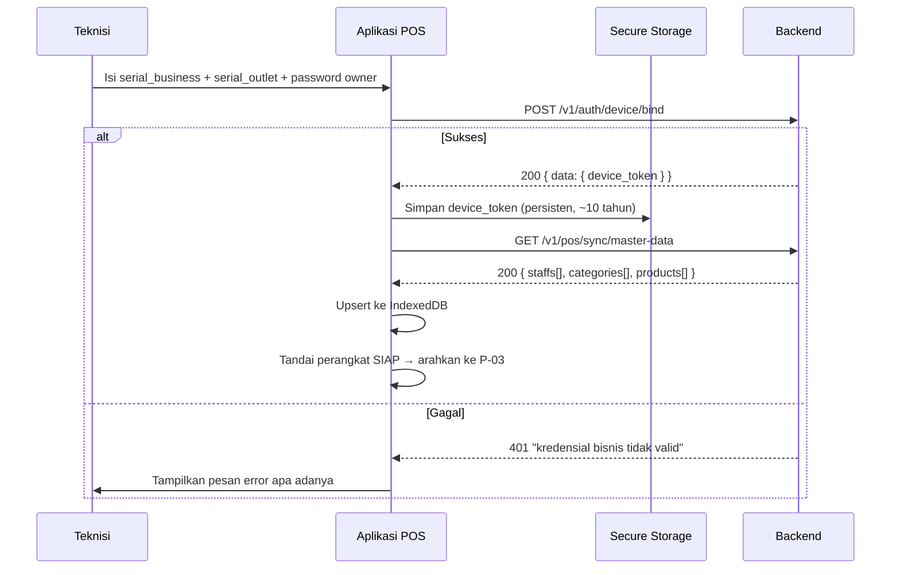
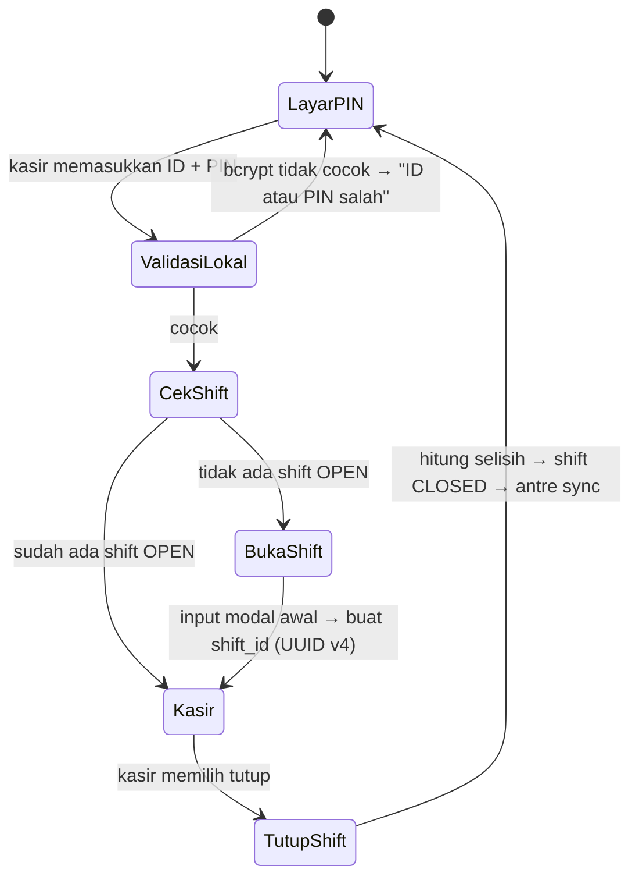
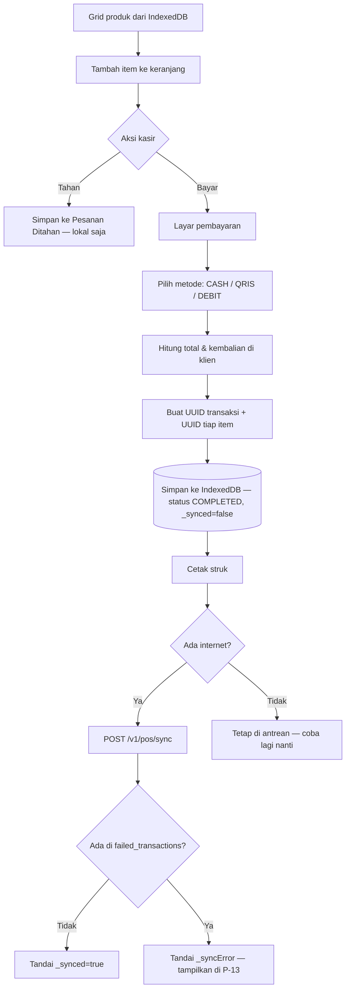
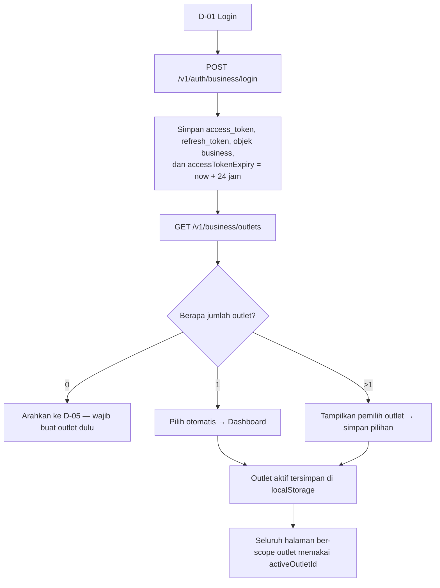
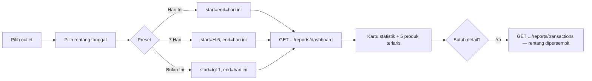

# 04 — Frontend Mobile Web Requirements

> Panduan implementasi untuk dua aplikasi frontend yang dilayani backend ini:
> **(A) POS Client** — aplikasi kasir *offline-first*, dan **(B) Admin Dashboard** — panel manajemen bagi pemilik bisnis.
> Seluruh isi dokumen ini diturunkan dari kemampuan API yang benar-benar ada — lihat [03-api-specifications.md](03-api-specifications.md).

---

## 0. Batasan Backend yang Membentuk Desain Frontend

Baca bagian ini lebih dulu. Sembilan batasan berikut bukan preferensi, melainkan konsekuensi langsung dari cara backend bekerja — dan seluruh keputusan arsitektur frontend berakar di sini.

| # | Batasan | Konsekuensi bagi frontend |
|---|---|---|
| 1 | **Backend tidak menyimpan keranjang belanja.** Tidak ada endpoint cart, tidak ada endpoint checkout. | Seluruh logika kasir — keranjang, total, pajak, kembalian, *hold order* — **wajib** hidup di klien. Backend hanya menerima transaksi yang sudah final. |
| 2 | **Klien yang membuat UUID.** `shifts`, `transactions`, `transaction_items`, `product_wastes` tidak memiliki `DEFAULT gen_random_uuid()`. | Frontend wajib membuat UUID v4 untuk setiap baris. Inilah dasar idempotensi — kirim ulang UUID yang sama aman sepenuhnya. |
| 3 | **Login kasir 100% offline.** Tidak ada endpoint login kasir. | POS harus melakukan `bcrypt.compare(pin, pin_hash)` di dalam browser terhadap hash yang diperoleh dari master data. |
| 4 | **Token PASETO terenkripsi.** Bukan JWT. | `jwt-decode` tidak akan berfungsi. Masa berlaku token **harus** dicatat sendiri saat login (`Date.now() + 24 jam`) dan disimpan di sisi klien. |
| 5 | **Master data POS tidak memuat stok maupun BOM.** | Aplikasi POS **tidak dapat** menampilkan sisa stok atau memblokir penjualan saat bahan habis. Jangan rancang UI yang menampilkan ketersediaan stok di layar kasir. |
| 6 | **Hampir semua error dikembalikan sebagai `400`.** Tidak ada `403`/`404`. | Penanganan error harus berbasis `response.message`, bukan kode status. Pesan sudah berbahasa Indonesia dan layak ditampilkan langsung. |
| 7 | **Tidak ada paginasi** pada endpoint laporan mana pun. | Rentang tanggal wajib dibatasi ketat di UI (maksimal 7 hari disarankan). Jangan sediakan pilihan "Semua waktu". |
| 8 | **Sebagian array kosong dikembalikan sebagai `null`, bukan `[]`.** Berlaku pada koleksi yang dibangun di memori dengan `append` — paling menonjol pada `GET /v1/pos/sync/master-data` (`staffs`, `categories`, `products`) serta hasil endpoint `/bulk`. Koleksi yang datang langsung dari GORM (`GET .../products`, `.../raw-materials`, dst.) mengembalikan `[]`. | Karena perbedaannya tidak konsisten dan tidak dijamin, perlakukan **setiap** koleksi secara defensif: `data.products ?? []`. Terlewat satu saja akan menyebabkan crash. |
| 9 | **Tidak ada payment gateway.** `payment_method` hanyalah string bebas. | Frontend menetapkan sendiri daftar metode pembayaran dan menegakkannya. Salah ketik akan memecah pengelompokan laporan secara permanen. |

---

## A. POS CLIENT (Aplikasi Kasir)

### A.1 Daftar Halaman / Screen

| # | Screen | Perlu online? | Endpoint yang dipakai |
|---|---|:---:|---|
| **P-01** | **Device Binding / Setup** — form `serial_business`, `serial_outlet`, password owner | ✅ Ya (1×) | `POST /v1/auth/device/bind` |
| **P-02** | **Sync Master Data** — layar progres unduhan awal | ✅ Ya | `GET /v1/pos/sync/master-data` |
| **P-03** | **Login Kasir** — papan tombol `staff_identifier` + PIN | ❌ Offline | *(lokal — bcrypt compare)* |
| **P-04** | **Buka Shift** — input modal awal laci | ❌ Offline | *(lokal)* |
| **P-05** | **Kasir Utama** — grid produk, tab kategori, panel keranjang | ❌ Offline | *(lokal)* |
| **P-06** | **Pembayaran** — pilih metode, input uang diterima, kembalian | ❌ Offline | *(lokal)* |
| **P-07** | **Struk / Konfirmasi** — pratinjau & cetak | ❌ Offline | *(lokal)* |
| **P-08** | **Pesanan Ditahan** *(hold order)* — daftar keranjang tertahan | ❌ Offline | *(lokal saja — tidak pernah dikirim)* |
| **P-09** | **Riwayat Transaksi** — tab "Hari Ini" (lokal) & "Sebelumnya" (server) | ⚠️ Sebagian | `GET /v1/pos/transactions` |
| **P-10** | **Void / Batalkan Transaksi** — pilih transaksi, isi alasan | ❌ Offline | *(lokal — ditandai `CANCELLED`, dikirim saat sync)* |
| **P-11** | **Lapor Waste Produk** — pilih produk, jumlah, alasan | ❌ Offline | *(lokal — antre untuk sync)* |
| **P-12** | **Tutup Shift** — hitung uang fisik, tampilkan selisih | ❌ Offline | *(lokal)* |
| **P-13** | **Status Sinkronisasi** — antrean, tombol sync manual, daftar gagal | ✅ Ya | `POST /v1/pos/sync` |
| **P-14** | **Pengaturan** — info perangkat, sync master data ulang, ganti kasir | ⚠️ Sebagian | `GET /v1/pos/sync/master-data` |

### A.2 Flow 1 — Device Binding & Sinkronisasi Awal



**Aturan implementasi**

- **`device_token` tidak pernah kedaluwarsa dan tidak dapat dicabut.** Simpan di lapisan paling aman yang tersedia (Keychain/Keystore lewat Capacitor; IndexedDB jika PWA murni — **jangan di `localStorage`**).
- Layar ini hanya boleh diakses teknisi/pemilik, karena membutuhkan password owner. Setelah *binding* berhasil, sembunyikan layar ini di balik gerbang khusus.
- `serial_outlet` adalah `outlets.serial_tenant` (mis. `KOPBU100826001`), **bukan** `outlets.id`. Salah paham di sini adalah kegagalan setup yang paling sering terjadi.

**Kebijakan sinkronisasi master data:** jalankan saat *binding*, saat aplikasi dibuka jika berumur > 12 jam, dan lewat tombol manual di P-14. Tidak ada sinkronisasi inkremental — setiap panggilan menarik seluruh data, jadi jangan lakukan terlalu sering.

### A.3 Flow 2 — Login Kasir & Buka Shift (Sepenuhnya Offline)



**Validasi PIN di browser**

```ts
import bcrypt from 'bcryptjs'

async function loginKasir(staffIdentifier: string, pin: string) {
  const staff = await db.staffs.where('staff_identifier').equals(staffIdentifier).first()
  if (!staff) return { ok: false, message: 'ID atau PIN salah' }

  const cocok = await bcrypt.compare(pin, staff.pin_hash)
  if (!cocok) return { ok: false, message: 'ID atau PIN salah' }   // pesan sengaja disamakan

  return { ok: true, staff }
}
```

> ⚠️ **Catatan performa:** `bcryptjs` murni JavaScript dan lambat — sebuah hash `DefaultCost` (10) memerlukan ±100-300 ms di perangkat tablet kelas menengah. Jalankan di **Web Worker** agar UI tidak membeku. Jangan menurunkan cost — nilainya ditentukan backend.

**Pembuatan objek shift saat buka:**

```ts
const shift = {
  id: crypto.randomUUID(),           // ← klien yang membuat
  staff_id: staff.id,
  opening_balance: modalAwal,
  closing_balance: 0,
  expected_balance: 0,
  discrepancy: 0,
  status: 'OPEN',
  client_opened_at: new Date().toISOString(),
  client_closed_at: null,
  _synced: false,                    // metadata lokal, jangan dikirim
}
```

Saat tutup shift, klien menghitung sendiri:

```text
expected_balance = opening_balance + Σ(transaksi COMPLETED bermetode CASH pada shift ini)
discrepancy      = closing_balance − expected_balance
```

> Server **tidak** menghitung ulang nilai ini, namun `discrepancy` inilah yang muncul di dashboard pemilik. Rumusnya harus benar.

### A.4 Flow 3 — Transaksi Kasir (Keranjang → Pembayaran → Antrean Sync)



**Bentuk keranjang (state di memori):**

```ts
type CartItem = {
  id: string           // UUID v4 — dibuat saat item ditambahkan
  product_id: string
  product_name: string // untuk tampilan; TIDAK dikirim ke server
  quantity: number     // bilangan bulat — backend memakai INT
  unit_price: number   // snapshot harga saat ini
}
```

**Metode pembayaran — WAJIB dibakukan.** Backend menerima string apa pun. Kunci nilainya di frontend:

```ts
export const PAYMENT_METHODS = ['CASH', 'QRIS', 'DEBIT', 'TRANSFER'] as const
export type PaymentMethod = typeof PAYMENT_METHODS[number]
```

> `[NEEDS DISCUSSION]` — daftar ini harus disepakati bersama tim backend dan **tidak boleh berubah setelah produksi berjalan**. Tidak ada enum di database; nilai lama akan tetap ada di data historis selamanya.

**Void / refund:** ubah status transaksi lokal menjadi `CANCELLED`, isi `cancel_notes`, set `_synced = false`. Saat sinkronisasi, server otomatis mengembalikan stok bahan baku (*reverse deduction*). Jika transaksi belum pernah tersinkronisasi, cukup kirim sebagai `CANCELLED` — server tidak akan memotong stok sama sekali.

**Pesanan ditahan (*hold order*):** murni lokal. Jangan pernah dikirim ke server. Backend hanya mengenal transaksi yang sudah lunas.

### A.5 Flow 4 — Sinkronisasi & Penanganan Partial Success

Inilah bagian POS yang paling rawan salah implementasi.

```ts
async function syncUp() {
  const shifts       = await db.shifts.where('_synced').equals(0).toArray()
  const transactions = await db.transactions.where('_synced').equals(0).toArray()
  const wastes       = await db.wastes.where('_synced').equals(0).toArray()

  if (!shifts.length && !transactions.length && !wastes.length) return

  const res = await posClient.post('/v1/pos/sync', {
    shifts:       shifts.map(stripLocalFields),
    transactions: transactions.map(stripLocalFields),   // sertakan array `items`
    wastes:       wastes.map(stripLocalFields),         // ⚠️ kuncinya `wastes`, BUKAN `product_wastes`
  })

  const { transactions_synced, failed_transactions = [] } = res.data
  const gagal = new Set(failed_transactions)

  // Transaksi: dilacak per-ID
  await db.transaction('rw', db.transactions, async () => {
    for (const t of transactions) {
      if (gagal.has(t.id)) await db.transactions.update(t.id, { _syncError: true })
      else                 await db.transactions.update(t.id, { _synced: 1, _syncError: false })
    }
  })

  // Shift & waste: TIDAK dilacak per-ID — hanya ada hitungan agregat.
  // Aman ditandai synced karena backend idempotent; kirim ulang tidak menduplikasi.
  if (res.data.shifts_synced === shifts.length) await markSynced(db.shifts, shifts)
  if (res.data.wastes_synced === wastes.length) await markSynced(db.wastes, wastes)
}
```

**Aturan yang tidak boleh dilanggar:**

1. **`200` tidak berarti semuanya berhasil.** Selalu periksa `failed_transactions`.
2. **Kirim shift bersama transaksinya.** `transactions.shift_id` memiliki foreign key ke `shifts(id)`; shift diproses lebih dulu dalam payload yang sama. Bila shift gagal, seluruh transaksinya ikut gagal — dan backend **tidak** melaporkan kegagalan shift secara eksplisit.
3. **Jangan pernah membuat ulang UUID saat mengirim ulang.** UUID yang tetap sama adalah satu-satunya alasan pengiriman ulang bersifat aman.
4. **Jangan menghapus data lokal setelah sync.** Tandai `_synced` saja — riwayat "Hari Ini" dibaca dari database lokal.
5. **Buang metadata lokal** (`_synced`, `_syncError`) sebelum mengirim. Field asing akan diabaikan Go, tapi lebih bersih dibuang.

**Pemicu sinkronisasi:** saat koneksi kembali (`window.addEventListener('online')`), berkala tiap 5 menit saat online, saat tutup shift, dan lewat tombol manual di P-13. Terapkan *exponential backoff* untuk kegagalan berulang, serta kunci mutex agar tidak ada dua proses sync berjalan bersamaan.

### A.6 Skema Database Lokal (Dexie / IndexedDB)

```ts
import Dexie, { type Table } from 'dexie'

class POSDatabase extends Dexie {
  staffs!:       Table<Staff, string>
  categories!:   Table<Category, string>
  products!:     Table<Product, string>
  shifts!:       Table<LocalShift, string>
  transactions!: Table<LocalTransaction, string>
  wastes!:       Table<LocalWaste, string>
  heldCarts!:    Table<HeldCart, string>       // murni lokal, tidak pernah dikirim

  constructor() {
    super('posgodinov')
    this.version(1).stores({
      staffs:       'id, staff_identifier',
      categories:   'id, name',
      products:     'id, category_id, name',
      shifts:       'id, status, _synced',
      transactions: 'id, shift_id, status, _synced, client_created_at',
      wastes:       'id, _synced',
      heldCarts:    'id, created_at',
    })
  }
}
```

> Master data (`staffs`, `categories`, `products`) di-*upsert* dengan `bulkPut` saat sinkronisasi — jangan pernah dihapus lalu diisi ulang, karena akan menimbulkan jendela waktu database kosong bila proses terputus.

---

## B. ADMIN DASHBOARD (Panel Pemilik Bisnis)

### B.1 Daftar Halaman / Screen

| # | Screen | Endpoint |
|---|---|---|
| **D-01** | **Login** | `POST /v1/auth/business/login` |
| **D-02** | **Registrasi** | `POST /v1/auth/business/register` |
| **D-03** | **Dashboard** — kartu statistik + 5 produk terlaris + pemilih rentang tanggal | `GET .../reports/dashboard` |
| **D-04** | **Daftar Outlet** — tabel + tombol "Tambah Outlet" | `GET /v1/business/outlets` |
| **D-05** | **Form Tambah Outlet** | `POST /v1/business/outlets` |
| **D-06** | **Info Provisioning Perangkat** — menampilkan `serial_business` & `serial_tenant` untuk pemasangan POS | *(dari D-04 + data login)* |
| **D-07** | **Daftar Staff** — filter semua outlet / per outlet | `GET /v1/business/staff`, `GET .../outlets/{id}/staff` |
| **D-08** | **Form Staff** — tambah / ubah | `POST /v1/business/staff`, `PUT /v1/business/staff/{id}` |
| **D-09** | **Kategori** — daftar + tambah (satuan & massal) | `POST .../categories`, `.../categories/bulk`, `GET .../categories` |
| **D-10** | **Daftar Produk** — tabel dengan kategori, harga, jumlah resep | `GET .../products` |
| **D-11** | **Form Produk + Penyusun BOM** — form utama untuk membangun resep | `POST/PUT .../products` |
| **D-12** | **Impor Produk Massal** — unggah/tempel CSV | `POST .../products/bulk` |
| **D-13** | **Daftar Bahan Baku** — stok, HPP, penanda stok minus | `GET .../raw-materials` |
| **D-14** | **Form Bahan Baku** | `POST/PUT .../raw-materials` |
| **D-15** | **Form Restock** — satuan & massal | `POST .../restock`, `.../restock/bulk` |
| **D-16** | **Laporan Restock** | `GET .../reports/restock` |
| **D-17** | **Form Waste Bahan Baku** | `POST .../waste`, `.../waste/bulk` |
| **D-18** | **Laporan Waste** | `GET .../reports/waste` |
| **D-19** | **Form Stock Opname** — lembar hitung massal | `POST .../opnames/bulk` |
| **D-20** | **Laporan Opname** — dengan penyorotan `fraud_flag` | `GET .../reports/opnames` |
| **D-21** | **Laporan Transaksi** — daftar transaksi + detail item | `GET .../reports/transactions` |

### B.2 Flow 1 — Login & Pemilihan / Perpindahan Outlet

> **Istilah penting:** tidak ada *tenant switching* pada sistem ini. Satu akun login = satu Business. Yang berpindah adalah **outlet (cabang)** di dalam bisnis yang sama.



**State global yang dibutuhkan**

```ts
type AuthState = {
  accessToken: string | null
  refreshToken: string | null
  accessTokenExpiry: number | null   // ← WAJIB dilacak manual; PASETO tidak bisa di-decode
  business: Business | null
}

type TenantState = {
  outlets: Outlet[]
  activeOutletId: string | null      // dipersistensi di localStorage
}
```

**Aturan implementasi**

- **Masa berlaku token harus dicatat manual.** Token PASETO terenkripsi — tidak ada cara membaca `exp` dari sisi klien. Simpan `Date.now() + 24*60*60*1000` saat login.
- **Refresh proaktif.** Panggil `POST /v1/auth/business/refresh` ketika sisa masa berlaku < 1 jam. Jika gagal → paksa logout. Refresh token tidak dirotasi, jadi nilainya tetap sama selama 7 hari.
- **Pemilih outlet bersifat global**, ditempatkan di header aplikasi. Mengganti outlet harus meng-*invalidate* seluruh query yang ber-*scope* outlet.
- **`serial_tenant` wajib ditampilkan** di halaman detail outlet (D-06) — teknisi membutuhkannya untuk *device binding*, dan tidak ada endpoint lain yang menyediakannya.

**Cache key wajib mengandung `outletId`**, agar data outlet lama tidak muncul setelah berpindah:

```ts
const { data } = useQuery({
  queryKey: ['products', activeOutletId],           // ← activeOutletId wajib ada
  queryFn: () => api.getProducts(activeOutletId!),
  enabled: !!activeOutletId,
})
```

### B.3 Flow 2 — Manajemen Produk, Kategori & Stok

**Urutan setup yang benar** (bergantung satu sama lain, jangan dibalik):

```text
1. Buat Outlet             → D-05
2. Buat Kategori           → D-09   (opsional, tapi lakukan sebelum produk)
3. Buat Bahan Baku         → D-14   (WAJIB sebelum produk, karena BOM merujuk padanya)
4. Buat Produk + BOM       → D-11
5. Daftarkan Staff         → D-08
6. Provisioning perangkat  → D-06 → binding di POS
```

UI sebaiknya menampilkan daftar periksa (*checklist*) *onboarding* dengan urutan ini — pemilik bisnis baru pasti tersesat tanpa panduan.

**Penyusun BOM (D-11)** — layar paling kompleks di Dashboard:

```text
┌─ Form Produk ──────────────────────────────────────────────┐
│ Nama      [ Kopi Susu Gula Aren                          ]  │
│ Harga     [ 22000                                        ]  │
│ Kategori  [ Minuman Panas                              ▾ ]  │
│ URL Gambar[ https://cdn.example.com/kopi.jpg             ]  │
│                                                             │
│ ── Resep (BOM) ──────────────────────────────────────────  │
│ Bahan Baku              Jumlah    Satuan   Biaya           │
│ [Biji Kopi Arabika ▾]   [ 18   ]  gram     Rp 3.240   [×]  │
│ [Susu UHT          ▾]   [ 150  ]  ml       Rp 2.775   [×]  │
│ [Gula Aren         ▾]   [ 20   ]  gram     Rp   900   [×]  │
│ [+ Tambah Bahan Baku]                                       │
│                                                             │
│ HPP     : Rp 6.915   (dihitung frontend)                    │
│ Margin  : Rp 15.085  (68,6%)                                │
└─────────────────────────────────────────────────────────────┘
```

**Aturan yang wajib ditegakkan UI:**

| Aturan | Alasan |
|---|---|
| Jumlah selalu dalam **base unit** bahan baku | Backend memperlakukannya demikian. Tampilkan label satuan di sebelah input agar tidak keliru |
| Satu bahan baku **tidak boleh** muncul dua kali | Backend menolak: `"terdapat bahan baku ganda di dalam resep"` |
| Jumlah harus **> 0** | Backend menolak `0` dan nilai negatif |
| **Update selalu mengirim BOM lengkap** | `PUT` melakukan penggantian total — resep yang hilang dari payload akan terhapus |
| HPP dan margin dihitung di frontend | Backend tidak menyediakan endpoint HPP. Ambil `cost_per_unit` dari `GET .../products` yang sudah menyertakan detail bahan baku |

**Manajemen stok — arahkan pengguna ke jalur yang benar:**

| Yang ingin dilakukan pengguna | Jalur yang benar | Bukan ini |
|---|---|---|
| "Stok saya bertambah karena beli" | **D-15 Restock** (memperbarui HPP moving-average) | ~~Edit field stok~~ |
| "Stok saya salah, mau dikoreksi" | **D-19 Stock Opname** | ~~Edit field stok~~ |
| "Ada bahan yang basi/rusak" | **D-17 Waste** | ~~Edit field stok~~ |

> `PUT .../raw-materials/{id}` **tidak memiliki field `stock`** — ini disengaja. Jangan menampilkan input stok yang bisa diedit di form D-14 (kecuali saat membuat baru, di mana `stock` berperan sebagai stok awal).

**Penyorotan wajib di UI**

- **Stok negatif** (D-13): tandai dengan warna merah beserta keterangan *"Stok minus akibat transaksi offline — lakukan Stock Opname"*. Ini kondisi normal pada sistem offline-first, bukan bug.
- **`fraud_flag === true`** (D-20): sorot barisnya, tampilkan `difference_value` dalam Rupiah sebagai indikator kerugian.

**Batasan UI yang wajib dipatuhi:**

- **Sembunyikan tombol edit/hapus kategori.** Endpoint-nya tidak ada. Beri catatan *"Kategori belum dapat diubah"* agar pengguna tidak mencari-cari.
- **Sembunyikan tombol edit/hapus outlet.** Endpoint-nya juga tidak ada.
- **Sembunyikan fitur reset PIN.** Tidak ada endpoint-nya — kasir yang lupa PIN harus dihapus lalu didaftarkan ulang.
- **Impor massal bersifat *all-or-nothing*.** Satu baris tidak valid menggagalkan seluruh batch. Validasi seluruh baris di frontend dengan Zod **sebelum** dikirim, dan tampilkan pratinjau.

### B.4 Flow 3 — Laporan Penjualan



**Isi dashboard (D-03)**

| Kartu | Sumber | Cara menampilkan |
|---|---|---|
| Total Pendapatan | `stats.total_revenue` | Format Rupiah |
| Jumlah Transaksi | `stats.total_transactions` | Angka |
| Produk Terbuang | `stats.total_wastes` | **Jumlah item, bukan Rupiah.** Beri label jelas: *"item produk"* |
| Selisih Kas | `stats.total_discrepancy` | Rupiah — merah bila negatif. Bersumber dari shift `CLOSED` |
| Produk Terlaris | `top_products[]` | Tepat 5 baris (limit *hard-coded*) |

**Peringatan wajib yang harus ditampilkan di UI laporan:**

> ⚠️ *"Laporan dikelompokkan berdasarkan waktu data diterima server, bukan waktu transaksi terjadi di kasir. Transaksi offline yang baru tersinkronisasi akan muncul pada tanggal sinkronisasi."*

Ini bukan sekadar catatan kecil. Backend memfilter `DATE(created_at)`, bukan `DATE(client_created_at)`. Penjualan hari Senin yang tersinkronisasi hari Rabu akan tercatat sebagai pendapatan hari Rabu. **Pemilik bisnis akan menganggapnya sebagai bug dan melaporkannya** — didik penggunanya lewat UI sejak awal, dan dorong perbaikan di backend.

**Mitigasi sementara di frontend:** pada D-21, tampilkan **kedua** kolom waktu (`client_created_at` dan `created_at`) dengan label *"Waktu Transaksi"* dan *"Waktu Sinkronisasi"*. Untuk laporan harian yang akurat, ambil rentang yang sedikit lebih lebar lalu kelompokkan ulang di klien berdasarkan `client_created_at`.

**Ringkasan bulanan** — `[NEEDS DISCUSSION]`: tidak ada endpoint agregasi deret waktu. Untuk membuat grafik tren harian dalam sebulan, frontend harus menarik `/reports/transactions` selama satu bulan penuh (tanpa paginasi!) dan mengagregasi di klien. **Ini tidak akan berskala baik.** Rekomendasi: batasi grafik tren maksimal 7 hari sampai backend menyediakan `/reports/summary?group_by=day`.

**Nama produk pada laporan transaksi:** `transaction_items` hanya memuat `product_id`. Ambil `GET .../products` sekali, bangun peta `Map<id, name>`, lalu gabungkan di klien. Perhatikan bahwa produk yang sudah di-*soft delete* tidak akan muncul pada endpoint produk — sediakan *fallback* `"Produk telah dihapus"`.

---

## C. Rekomendasi Tech Stack

### C.1 Dua aplikasi, dua profil kebutuhan berbeda

| | POS Client | Admin Dashboard |
|---|---|---|
| **Kebutuhan utama** | Offline-first, sentuh, cepat | Data-heavy, form kompleks, tabel |
| **Rekomendasi** | **Vite + React + PWA** | **Next.js (App Router)** |
| **Alasan** | SPA murni; SSR tidak berguna karena aplikasi harus jalan tanpa jaringan. Vite + Workbox memberi kendali penuh atas service worker | SSR/RSC menguntungkan untuk dashboard; routing, layout, dan optimasi bawaan |

> Jika tim lebih memilih satu basis kode, gunakan monorepo (Turborepo) dengan `packages/api-client` dan `packages/types` yang dipakai bersama. **Jangan** memaksa POS menjadi bagian dari Next.js hanya demi keseragaman — konfigurasi service worker offline-first di Next.js jauh lebih merepotkan.

### C.2 Stack POS Client

| Kebutuhan | Rekomendasi | Alasan |
|---|---|---|
| Build | **Vite + React 19 + TypeScript** | Cepat, kendali penuh |
| PWA / Service Worker | **`vite-plugin-pwa` (Workbox)** | Aplikasi wajib bisa dibuka tanpa jaringan |
| Database lokal | **Dexie.js (IndexedDB)** | API paling matang untuk IndexedDB; mendukung transaksi & indeks |
| State keranjang | **Zustand** | Ringan, tanpa boilerplate; keranjang bersifat ephemeral |
| State server | **TanStack Query** | Hanya untuk sync & master data; Dexie yang jadi sumber kebenaran |
| Validasi PIN | **`bcryptjs` di Web Worker** | Wajib — backend memberi hash bcrypt. Jalankan di worker agar UI tidak beku |
| UUID | **`crypto.randomUUID()`** | Bawaan browser, tanpa dependensi |
| Form | **React Hook Form + Zod** | — |
| UI | **Tailwind + shadcn/ui** | Target sentuh: tombol minimal 44×44 px |
| Uang | **Integer sen** atau **`dinero.js`** | Jangan memakai `float` untuk aritmetika uang |
| Tanggal | **`date-fns`** | Kirim ISO-8601 UTC pada `client_created_at` |

### C.3 Stack Admin Dashboard

| Kebutuhan | Rekomendasi |
|---|---|
| Framework | **Next.js 15 (App Router) + TypeScript** |
| State server | **TanStack Query** — cache key wajib ber-*scope* `outletId` |
| State global | **Zustand** untuk auth + outlet aktif |
| Form | **React Hook Form + Zod** — validasi ketat sebelum submit karena backend minim validasi |
| Tabel | **TanStack Table** — sorting/filter di klien (backend tidak menyediakan) |
| UI | **Tailwind + shadcn/ui** |
| Grafik | **Recharts** — cukup untuk statistik sederhana |
| Uang | **Integer sen** + formatter `Intl.NumberFormat('id-ID')` |

### C.4 Lapisan API Client — implementasi wajib

Lapisan ini harus menangani seluruh keanehan backend di satu tempat, sehingga sisa aplikasi tetap bersih.

```ts
// packages/api-client/src/client.ts

type Envelope<T> = { status: string; message: string; data: T }
type ApiError    = { status: string; message: string; errors?: Record<string, string> }

export class PosApiError extends Error {
  constructor(
    public statusCode: number,
    message: string,
    public fieldErrors?: Record<string, string>,
  ) { super(message) }

  /** Backend mengembalikan 400 untuk pelanggaran tenant — deteksi lewat pesan. */
  get isAccessDenied() { return this.message.includes('akses ditolak') }
  get isNotFound()     { return this.message.includes('tidak ditemukan') }
}

async function request<T>(path: string, init: RequestInit & { raw?: boolean } = {}): Promise<T> {
  const res  = await fetch(`${BASE_URL}${path}`, {
    ...init,
    headers: { 'Content-Type': 'application/json', ...authHeader(), ...init.headers },
  })
  const body = await res.json().catch(() => null)

  if (!res.ok) {
    const err = body as ApiError | null
    throw new PosApiError(res.status, err?.message ?? 'Terjadi kesalahan', err?.errors)
  }

  // Keanehan 1: tiga endpoint auth tidak memakai amplop.
  if (init.raw) return body as T

  // Keanehan 2: array kosong dikembalikan sebagai null.
  return (body as Envelope<T>).data ?? (null as T)
}

// Bentuk B — tanpa amplop
export const login = (email: string, password: string) =>
  request<LoginResponse>('/v1/auth/business/login', {
    method: 'POST', body: JSON.stringify({ email, password }), raw: true,
  })

// Bentuk A — beramplop, dengan pengaman null
export const getProducts = async (outletId: string) =>
  (await request<Product[] | null>(`/v1/business/outlets/${outletId}/products`)) ?? []
```

**Daftar periksa lapisan API client:**

- ✅ Menangani **dua bentuk response** (beramplop vs tanpa amplop)
- ✅ Mengubah `null` menjadi `[]` untuk seluruh endpoint koleksi
- ✅ Membungkus error dengan pembantu `isAccessDenied` / `isNotFound` karena tidak ada `403`/`404`
- ✅ Menyisipkan `Authorization: Bearer` secara otomatis; memakai token yang berbeda untuk POS dan Admin
- ✅ Melakukan refresh proaktif berbasis `accessTokenExpiry` yang dicatat manual
- ✅ **Tidak** mengirim header `X-Tenant-ID` (backend tidak membacanya)
- ✅ Mengirim body *array telanjang* pada seluruh endpoint `/bulk`

### C.5 Praktik Terbaik yang Spesifik untuk Proyek Ini

**Uang.** Backend memakai `DECIMAL` di database tetapi `float64` di Go, dan JSON mengirimkannya sebagai number. Simpan uang sebagai **integer sen** di frontend, konversi hanya di batas API. Jangan pernah menampilkan hasil aritmetika `float` mentah ke pengguna.

**Waktu.** Selalu kirim ISO-8601 dengan zona waktu pada `client_created_at`, `client_opened_at`, dan `client_closed_at`. Jam perangkat POS bisa melenceng — pertimbangkan sinkronisasi waktu saat *sync* dan tampilkan peringatan bila selisihnya > 5 menit, karena ketepatan waktu inilah yang menjadi dasar laporan.

**Keamanan token.**

| Token | Penyimpanan | Alasan |
|---|---|---|
| `device_token` (POS) | Secure storage / IndexedDB | Berumur ~10 tahun, tidak dapat dicabut. **Jangan di `localStorage`** |
| `access_token` (Admin) | Memori + `sessionStorage` | Umur 24 jam |
| `refresh_token` (Admin) | `httpOnly` cookie idealnya — namun backend belum mendukungnya | `[NEEDS DISCUSSION]` — saat ini terpaksa di `localStorage`, dengan risiko XSS yang disadari |

**Penanganan error.** Tampilkan `error.message` apa adanya — seluruhnya sudah berbahasa Indonesia dan ramah pengguna (`"akses ditolak: outlet ini bukan milik bisnis Anda"`). Jangan menerjemahkan atau membungkusnya dengan pesan generik. Sediakan `errors.server` hanya di balik mode debug.

**Ketahanan.** Selalu antisipasi `null` pada koleksi, produk terhapus yang masih dirujuk `transaction_items` historis, stok negatif sebagai kondisi normal, dan `image_url` kosong (siapkan gambar placeholder — backend tidak menyediakan upload gambar, jadi banyak produk akan berakhir tanpa gambar).

### C.6 Urutan Implementasi yang Disarankan

| Fase | Cakupan | Alasan |
|---|---|---|
| **1** | Lapisan API client + tipe data + auth (D-01, D-02) | Fondasi bagi semuanya |
| **2** | Outlet & staff (D-04, D-05, D-07, D-08) | Prasyarat untuk POS |
| **3** | Bahan baku & kategori (D-09, D-13, D-14) | Prasyarat untuk produk |
| **4** | Produk + penyusun BOM (D-10, D-11) | Layar tersulit di Dashboard |
| **5** | Kerangka POS: binding, sync master, login PIN, buka shift (P-01→P-04) | Membuktikan jalur offline paling awal |
| **6** | Keranjang & pembayaran POS (P-05→P-08) | Fitur inti |
| **7** | Mesin sinkronisasi POS + partial success (P-13) | **Paling rawan salah — sediakan waktu ekstra** |
| **8** | Inventori: restock, waste, opname (D-15→D-20) | — |
| **9** | Laporan (D-03, D-21) | Membutuhkan data transaksi nyata untuk diuji |
| **10** | Penyempurnaan: tutup shift, void, riwayat (P-09→P-12) | — |

Fase 7 adalah tempat sebagian besar bug akan muncul. Uji secara eksplisit: perangkat offline selama 3 hari, transaksi dikirim ulang, shift gagal beserta transaksi turunannya, dan alur void.

---

## D. Ringkasan Kesenjangan Backend yang Berdampak pada Frontend

Dikumpulkan dari seluruh dokumen ini dan [03-api-specifications.md](03-api-specifications.md). Diurutkan berdasarkan dampak terhadap pekerjaan frontend.

| Prioritas | Kesenjangan | Dampak pada frontend | Perbaikan backend |
|---|---|---|---|
| 🔴 Tinggi | Laporan memfilter `created_at`, bukan `client_created_at` | Laporan harian salah setiap kali sinkronisasi tertunda | Satu baris di `report_repository.go` |
| 🔴 Tinggi | Paginasi `GET /v1/pos/transactions` tidak berfungsi (di-*comment*) | POS terkunci pada 50 transaksi terakhir selamanya | ±6 baris — kodenya sudah ada dalam bentuk komentar |
| 🔴 Tinggi | Tidak ada paginasi pada `/reports/transactions` | Payload berukuran besar; UI harus membatasi rentang tanggal | Tambahkan `limit`/`offset` |
| 🟠 Sedang | Amplop response tidak konsisten pada 3 endpoint auth | Perlu penanganan khusus di API client | Bungkus dengan `response.Success` |
| 🟠 Sedang | Semua error dikembalikan `400`, tidak ada `403`/`404` | Penanganan error terpaksa mencocokkan string | Petakan jenis error ke kode status |
| 🟠 Sedang | Kategori tidak punya `PUT`/`DELETE` | Tombol edit/hapus harus disembunyikan | Tambahkan 2 endpoint |
| 🟠 Sedang | Tidak ada reset PIN kasir | Kasir lupa PIN harus dihapus & dibuat ulang | Tambahkan field PIN pada update staff |
| 🟠 Sedang | Koleksi yang dibangun `append` mengembalikan `null` (master-data POS, hasil `/bulk`) sementara koleksi GORM mengembalikan `[]` | Tidak konsisten — wajib *fallback* `?? []` di mana-mana | Inisialisasi slice dengan `make([]T, 0)` |
| 🟡 Rendah | Tidak ada agregasi ringkasan harian/bulanan | Grafik tren harus diagregasi di klien | Tambahkan `/reports/summary?group_by=day` |
| 🟡 Rendah | Tidak ada endpoint upload gambar | Frontend harus menyediakan CDN sendiri | Tambahkan endpoint upload |
| 🟡 Rendah | Outlet tidak punya `PUT`/`DELETE` | Tidak dapat mengubah nama outlet | Tambahkan endpoint |
| 🟡 Rendah | `failed_shifts` / `failed_wastes` tidak dilaporkan | Sinkronisasi shift gagal secara diam-diam | Perluas `SyncUpResponse` |
| 🟡 Rendah | Master data POS tidak memuat BOM/stok | POS tidak bisa menampilkan ketersediaan stok | Keputusan produk — bukan sekadar bug |
