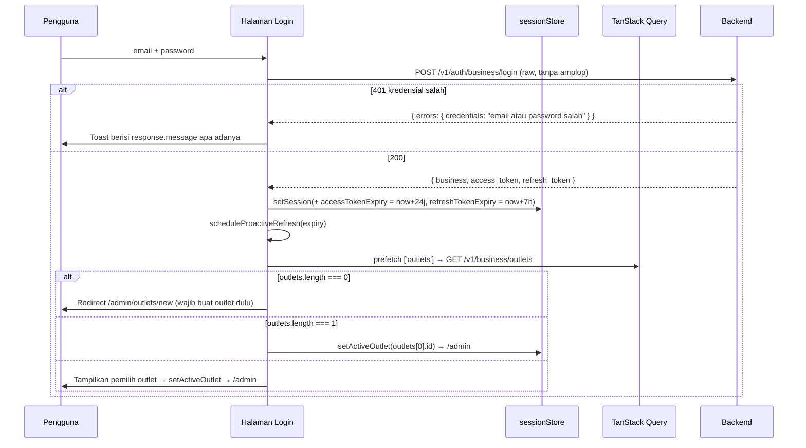
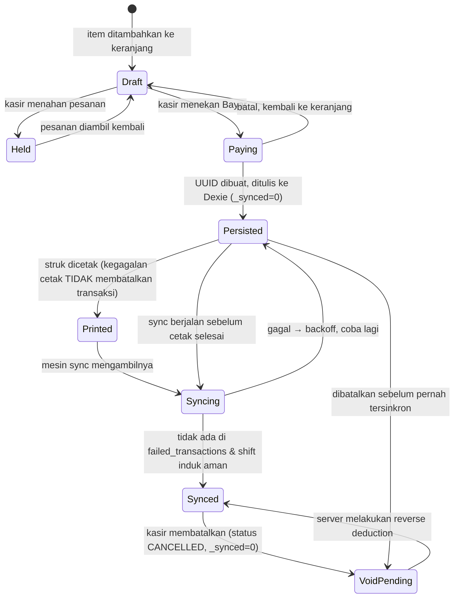

# 05 — Frontend Architecture Design

> **Ruang lingkup:** rancangan arsitektur frontend lengkap untuk POS SaaS Godinov.
> **Sumber kebenaran kontrak backend:** [01-architecture-overview.md](01-architecture-overview.md) · [02-database-schema.md](02-database-schema.md) · [03-api-specifications.md](03-api-specifications.md) · [04-frontend-mobile-web-requirements.md](04-frontend-mobile-web-requirements.md)
> **Basis kode yang sudah ada:** [posgodinov-fe/](../posgodinov-fe/) — Next.js `16.3.0`, React `19.2.8`, Tailwind CSS `v4`, TypeScript `5.x` (scaffold `create-next-app`, App Router, tanpa `src/`, path alias `@/*` → root).
>
> Dokumen ini adalah **rancangan**, bukan laporan audit. Setiap keputusan di sini diturunkan dari batasan backend yang sudah terverifikasi di dokumen 01–04. Di mana rancangan menyimpang dari rekomendasi dokumen 04, penyimpangan itu dinyatakan eksplisit beserta konsekuensinya.

---

## 0. Konteks, Keputusan Arsitektur, dan Batasan

### 0.1 Dua jalur aplikasi

| Fase | Aplikasi | Teknologi | Status rancangan |
|---|---|---|---|
| **Fase 1** (prioritas) | **Next.js Web App** — satu basis kode berisi **Admin Dashboard** (SSR/RSC) + **Web POS Client** (PWA, client SPA, offline-first) | Next.js 16 App Router | Rancangan implementasi penuh — §1 |
| **Fase 2** | **Flutter Mobile / Kiosk POS** | Flutter + Drift + Cubit | Penyiapan fondasi arsitektur — §2 |

### 0.2 Penyimpangan sadar dari dokumen 04

Dokumen [04 §C.1](04-frontend-mobile-web-requirements.md) merekomendasikan **Vite + React** untuk POS Client dan Next.js **hanya** untuk Dashboard, dengan alasan: *"Jangan memaksa POS menjadi bagian dari Next.js hanya demi keseragaman — konfigurasi service worker offline-first di Next.js jauh lebih merepotkan."*

**Rancangan ini sengaja mengambil keputusan berbeda:** satu aplikasi Next.js untuk keduanya, sesuai arahan strategi produk.

Peringatan dokumen 04 itu benar dan tidak dibantah. Biaya nyatanya ada tiga, dan seluruhnya ditangani secara eksplisit di §1.5:

| Biaya | Mitigasi di rancangan ini |
|---|---|
| **Payload RSC (`.rsc`) tidak tersedia offline.** Navigasi client-side App Router antar-segment mengambil payload RSC dari server; tanpa jaringan, navigasi gagal. | **POS memakai satu route statis** (`/pos`) dengan sub-layar sebagai client component yang dirutekan di dalam klien. Tidak ada navigasi lintas-segment saat kasir bekerja. Lihat **ADR-02**. |
| **Service worker bukan warga kelas satu di Next.js.** Tidak ada `vite-plugin-pwa`. | Workbox `injectManifest` dengan sumber SW milik sendiri (`worker/sw.ts`), dua jalur build yang dijelaskan di §1.5.2. |
| **Bundle Admin dan POS bisa saling mencemari.** Dashboard menarik Recharts/TanStack Table; POS harus ramping. | Pemisahan route group + aturan impor yang ditegakkan ESLint (§1.1.4). Route group berbeda ⇒ bundle split alami di App Router. |

`[NEEDS DISCUSSION]` — Bila kelak POS diinstal sebagai aplikasi terpasang di banyak tablet dan navigasi offline terbukti rapuh, pemisahan POS ke aplikasi Vite terpisah dalam monorepo Turborepo tetap merupakan jalan keluar yang sah. Rancangan §1.1 sengaja menempatkan seluruh logika POS di `features/pos/` dan `lib/` yang bebas Next.js, sehingga pemindahan itu tidak memerlukan penulisan ulang.

### 0.3 Architecture Decision Record

| # | Keputusan | Alasan | Konsekuensi yang diterima |
|---|---|---|---|
| **ADR-01** | Satu aplikasi Next.js, dua route group: `(admin)` dan `(pos)` | Satu pipeline build, satu lapisan API client, satu himpunan tipe data | Konfigurasi SW manual; disiplin pemisahan bundle |
| **ADR-02** | **POS = satu route statis `/pos`**, sub-layar dirutekan di klien (bukan segment App Router) | Menghilangkan ketergantungan payload RSC saat offline — akar masalah PWA di App Router | URL sub-layar POS tidak *deep-linkable*; ditukar dengan keandalan offline. Dapat diterima: kasir tidak pernah membagikan URL |
| **ADR-03** | Dexie (IndexedDB) adalah **sumber kebenaran** untuk POS; TanStack Query **tidak** meng-cache data kasir | Data kasir harus bertahan lintas restart dan bekerja tanpa jaringan; cache TanStack Query bersifat memori/ephemeral | Dua sistem baca di POS: `useLiveQuery` (Dexie) untuk data, `useMutation` (TanStack) untuk operasi jaringan |
| **ADR-04** | `accessTokenExpiry` dilacak manual di klien | PASETO v4 `local` terenkripsi — [01 §4.1](01-architecture-overview.md). `jwt-decode` mustahil | Jam klien yang melenceng dapat memicu refresh terlalu dini/lambat; dimitigasi *safety skew* + penanganan `401` |
| **ADR-05** | Uang direpresentasikan sebagai **integer sen** (1/100 Rupiah) di seluruh state klien | Backend memakai `float64` di Go ([02 §5](02-database-schema.md)); aritmetika float di klien akan memperparah galat | Konversi wajib di batas API (`×100` / `÷100`); aturan pembulatan didefinisikan di §1.8.1 |
| **ADR-06** | Sinkronisasi POS dijalankan **di konteks halaman**, bukan di service worker | Rekonsiliasi *partial success* (`failed_transactions`) memerlukan akses ke logika domain; `BackgroundSyncPlugin` Workbox hanya memutar ulang request dan **membuang response** | Sinkronisasi hanya berjalan bila ada tab/PWA terbuka. Dinyatakan sebagai batasan produk di §1.6.6 |
| **ADR-07** | Adapter printer dipisah menjadi **renderer** (murni, menghasilkan byte ESC/POS) dan **transport** (Bluetooth/LAN/RawBT) | Satu template struk, empat jalur cetak; renderer dapat diuji tanpa perangkat | Satu lapisan abstraksi tambahan |
| **ADR-08** | `pin_hash` bcrypt disimpan di IndexedDB dan dibandingkan di **Web Worker** | Tidak ada endpoint login kasir ([03 §14](03-api-specifications.md)); `bcryptjs` memblokir *main thread* 100–300 ms | Risiko *brute force offline* yang sudah dicatat di [01 §4.5](01-architecture-overview.md) tetap ada — mitigasi di §1.4.4 |
| **ADR-09** | Flutter memakai Clean Architecture berlapis + Cubit, **bukan** Bloc penuh | Alur POS didominasi mutasi state sederhana; Cubit menghilangkan boilerplate event | Untuk `TransactionCubit` yang benar-benar merupakan state machine, disiplin transisi ditegakkan lewat *sealed class* |

### 0.4 Batasan backend yang membentuk seluruh rancangan

Ringkasan dari [04 §0](04-frontend-mobile-web-requirements.md), disusun ulang menurut komponen frontend yang terdampak:

| Batasan backend | Komponen frontend yang menanggungnya |
|---|---|
| Tidak ada endpoint cart/checkout | `features/pos/cart` — seluruh logika keranjang, total, kembalian, hold order |
| UUID dibuat klien (`shifts`, `transactions`, `transaction_items`, `product_wastes`) | `lib/db` + `lib/sync` — UUID dibuat sekali, **tidak pernah** diregenerasi |
| Login kasir 100% offline | `workers/bcrypt.worker.ts` + `features/pos/auth` |
| PASETO terenkripsi | `lib/auth/session-manager.ts` — pelacakan masa berlaku manual |
| Master data POS **tanpa** stok & BOM | UI kasir **dilarang** menampilkan ketersediaan stok |
| Hampir semua error = `400` | `lib/api/errors.ts` — klasifikasi berbasis `message`, bukan status |
| Tidak ada paginasi di endpoint laporan | UI pemilih tanggal dibatasi keras (maks. 7 hari) |
| Koleksi kosong bisa `null` | `lib/api/http.ts` — normalisasi `null → []` terpusat |
| `payment_method` string bebas | `lib/constants/payment.ts` — enum dikunci di frontend |
| Response auth **tanpa amplop** (3 endpoint) | `lib/api/http.ts` — mode `raw` |
| Laporan difilter `created_at`, bukan `client_created_at` | Banner peringatan wajib di layar laporan |

### 0.5 Hal yang wajib diverifikasi sebelum implementasi

`node_modules` belum terpasang pada [posgodinov-fe/](../posgodinov-fe/), sehingga dokumentasi Next.js yang dibundel (`node_modules/next/dist/docs/`) — yang menurut [AGENTS.md](../posgodinov-fe/AGENTS.md) merupakan rujukan wajib untuk versi ini — belum dapat dibaca. Item berikut mengikuti konvensi App Router yang tampak pada scaffold, tetapi **harus dikonfirmasi ke dokumentasi bundel setelah `npm install`**:

| Item | Asumsi rancangan | Bukti dari scaffold |
|---|---|---|
| Tipe props route | Global generated: `LayoutProps<"/">`, `PageProps<"/admin/outlets/[outletId]">` | [app/layout.tsx](../posgodinov-fe/app/layout.tsx) memakai `LayoutProps<"/">` tanpa impor |
| `params` / `searchParams` | Bertipe `Promise`, wajib di-`await` | Konvensi Next 15+; belum terverifikasi untuk 16.3 |
| Tailwind | v4 CSS-first (`@import "tailwindcss"`, `@theme inline`), **tanpa** `tailwind.config.js` | [app/globals.css](../posgodinov-fe/app/globals.css) |
| Bundler | Turbopack (default `next dev` & `next build` pada Next 16) | Belum terverifikasi |
| Kompatibilitas plugin PWA | `@serwist/next` terhadap Next 16 + Turbopack | **Belum terverifikasi — lihat §1.5.2 untuk jalur cadangan** |

---

## 1. Next.js Architecture Blueprint (Dashboard + Web POS PWA)

### 1.1 Struktur Folder App Router

#### 1.1.1 Prinsip penataan

1. **Route group menentukan runtime, bukan sekadar layout.** `(admin)` bersifat server-first (RSC + SSR); `(pos)` bersifat client-only dan statis.
2. **Prefiks URL eksplisit di dalam route group.** Route group `(admin)` tetap berisi segment `admin/`, sehingga URL menjadi `/admin/*`. Ini disengaja: service worker menyaring berdasarkan prefiks URL (`/pos/*` di-precache, `/admin/*` tidak pernah). Tanpa prefiks, kedua area berbagi ruang URL akar dan penyaringan SW menjadi rapuh.
3. **`app/` hanya berisi routing dan komposisi.** Logika domain tinggal di `features/`, infrastruktur di `lib/`. Tidak ada `fetch` atau query Dexie langsung di dalam `page.tsx`.
4. **`lib/` bebas dari Next.js.** Tidak boleh mengimpor `next/*`. Ini yang membuat ADR-02 dapat dibatalkan (POS dipindah ke Vite) tanpa penulisan ulang.

#### 1.1.2 Peta direktori

```text
posgodinov-fe/
│
├── app/                                    # ROUTING & KOMPOSISI SAJA
│   ├── layout.tsx                          # Root: <html>/<body>, font, RootProviders
│   ├── globals.css                         # Tailwind v4 + token tema
│   ├── not-found.tsx
│   ├── error.tsx                           # Error boundary global
│   ├── manifest.ts                         # Web App Manifest (Route Handler)
│   │
│   ├── (public)/                           # ── Publik, tanpa sesi ──────────────
│   │   ├── layout.tsx                      #    Shell terpusat, redirect bila sudah login
│   │   ├── login/page.tsx                  #    D-01
│   │   └── register/page.tsx               #    D-02
│   │
│   ├── (admin)/                            # ── ADMIN DASHBOARD (SSR/RSC) ───────
│   │   ├── layout.tsx                      #    AdminShell: sidebar, header, OutletSwitcher
│   │   ├── template.tsx                    #    Reset state per-navigasi (opsional)
│   │   └── admin/
│   │       ├── page.tsx                    #    D-03 Dashboard analytics
│   │       ├── loading.tsx
│   │       ├── onboarding/page.tsx         #    Checklist urutan setup ([04 §B.3])
│   │       │
│   │       ├── outlets/
│   │       │   ├── page.tsx                #    D-04 Daftar outlet
│   │       │   ├── new/page.tsx            #    D-05 Form tambah outlet
│   │       │   └── [outletId]/
│   │       │       └── provisioning/page.tsx  # D-06 serial_business + serial_tenant
│   │       │
│   │       ├── staff/
│   │       │   ├── page.tsx                #    D-07 Daftar staff (semua/per outlet)
│   │       │   ├── new/page.tsx            #    D-08 Form tambah
│   │       │   └── [staffId]/edit/page.tsx #    D-08 Form ubah
│   │       │
│   │       ├── categories/page.tsx         #    D-09 (tanpa edit/hapus — endpoint tidak ada)
│   │       │
│   │       ├── products/
│   │       │   ├── page.tsx                #    D-10 Daftar produk
│   │       │   ├── new/page.tsx            #    D-11 Form + BOM Builder
│   │       │   ├── import/page.tsx         #    D-12 Impor massal CSV
│   │       │   └── [productId]/edit/page.tsx  # D-11
│   │       │
│   │       ├── inventory/
│   │       │   ├── page.tsx                #    D-13 Bahan baku (sorot stok minus)
│   │       │   ├── new/page.tsx            #    D-14
│   │       │   ├── [rawMaterialId]/edit/page.tsx  # D-14 (TANPA field stock)
│   │       │   ├── restock/page.tsx        #    D-15
│   │       │   ├── waste/page.tsx          #    D-17
│   │       │   └── opname/page.tsx         #    D-19 Lembar hitung massal
│   │       │
│   │       └── reports/
│   │           ├── transactions/page.tsx   #    D-21
│   │           ├── restock/page.tsx        #    D-16
│   │           ├── waste/page.tsx          #    D-18
│   │           └── opname/page.tsx         #    D-20 (sorot fraud_flag)
│   │
│   └── (pos)/                              # ── WEB POS (PWA, client SPA) ───────
│       ├── layout.tsx                      #    'use client' — PosProviders, tanpa chrome admin
│       └── pos/
│           ├── page.tsx                    #    ★ SATU-SATUNYA route POS (ADR-02)
│           │                               #      force-static; me-render <PosApp/>
│           ├── bind/page.tsx               #    P-01 Device binding (online, force-static)
│           └── offline/page.tsx            #    Fallback navigasi SW
│
├── features/                               # LOGIKA DOMAIN (client components + hooks)
│   ├── admin/
│   │   ├── dashboard/{components,hooks}/
│   │   ├── outlets/{components,hooks}/
│   │   ├── staff/{components,hooks}/
│   │   ├── categories/{components,hooks}/
│   │   ├── products/
│   │   │   ├── components/BomBuilder.tsx   #    Layar tersulit — [04 §B.3]
│   │   │   ├── components/HppSummary.tsx
│   │   │   ├── hooks/useProducts.ts
│   │   │   └── lib/hpp.ts                  #    Kalkulator HPP & margin (murni)
│   │   ├── inventory/{components,hooks}/
│   │   └── reports/{components,hooks}/
│   │
│   └── pos/
│       ├── PosApp.tsx                      #    ★ Root client SPA + router internal
│       ├── router/
│       │   ├── screens.ts                  #    Enum layar P-01..P-14
│       │   └── usePosRouter.ts             #    Router berbasis Zustand + History API
│       ├── screens/
│       │   ├── SyncMasterScreen.tsx        #    P-02
│       │   ├── CashierLoginScreen.tsx      #    P-03
│       │   ├── OpenShiftScreen.tsx         #    P-04
│       │   ├── RegisterScreen.tsx          #    P-05 grid produk + keranjang
│       │   ├── PaymentScreen.tsx           #    P-06
│       │   ├── ReceiptScreen.tsx           #    P-07
│       │   ├── HeldCartsScreen.tsx         #    P-08
│       │   ├── HistoryScreen.tsx           #    P-09
│       │   ├── VoidScreen.tsx              #    P-10
│       │   ├── ProductWasteScreen.tsx      #    P-11
│       │   ├── CloseShiftScreen.tsx        #    P-12
│       │   ├── SyncStatusScreen.tsx        #    P-13
│       │   └── SettingsScreen.tsx          #    P-14
│       ├── cart/
│       │   ├── cart-store.ts               #    Zustand — keranjang aktif
│       │   └── cart-math.ts                #    Murni: subtotal, total, kembalian
│       ├── shift/
│       │   ├── shift-store.ts
│       │   └── shift-math.ts               #    expected_balance, discrepancy
│       └── components/                     #    Keypad, ProductTile, CartPanel, …
│
├── lib/                                    # INFRASTRUKTUR — TANPA impor `next/*`
│   ├── api/
│   │   ├── http.ts                         #    fetch inti: amplop, null→[], error
│   │   ├── errors.ts                       #    PosApiError + klasifikasi pesan
│   │   ├── admin-client.ts                 #    Terikat access token
│   │   ├── pos-client.ts                   #    Terikat device token
│   │   └── endpoints/
│   │       ├── auth.ts        outlets.ts   staff.ts      categories.ts
│   │       ├── products.ts    raw-materials.ts           restock.ts
│   │       ├── waste.ts       opname.ts    reports.ts    pos-sync.ts
│   │
│   ├── auth/
│   │   ├── session-store.ts                #    Zustand — auth state
│   │   ├── session-manager.ts              #    Refresh proaktif, single-flight, cross-tab
│   │   ├── token-storage.ts                #    sessionStorage / localStorage / Dexie
│   │   └── device-session.ts               #    device_token POS
│   │
│   ├── db/
│   │   ├── dexie.ts                        #    Deklarasi & versi database
│   │   ├── models.ts                       #    Tipe baris lokal (Local*)
│   │   └── repositories/
│   │       ├── master.repo.ts              #    staffs, categories, products
│   │       ├── shift.repo.ts               transaction.repo.ts
│   │       ├── waste.repo.ts               held-cart.repo.ts
│   │       └── meta.repo.ts                #    key-value: lastMasterSyncAt, dll.
│   │
│   ├── sync/
│   │   ├── sync-engine.ts                  #    Orkestrator sync-up
│   │   ├── sync-triggers.ts                #    online, interval, tutup shift, manual
│   │   ├── master-sync.ts                  #    Sync-down master data
│   │   ├── lock.ts                         #    Web Locks API (mutex lintas-tab)
│   │   ├── backoff.ts                      #    Exponential backoff + jitter
│   │   └── reconcile.ts                    #    Penanganan partial success
│   │
│   ├── printer/
│   │   ├── types.ts                        #    ReceiptPrinter, PrinterStatus
│   │   ├── escpos.ts                       #    Encoder ESC/POS
│   │   ├── receipt-renderer.ts             #    Receipt → Uint8Array (murni)
│   │   ├── adapters/
│   │   │   ├── web-bluetooth.adapter.ts
│   │   │   ├── lan-epos.adapter.ts
│   │   │   ├── rawbt.adapter.ts
│   │   │   └── browser-print.adapter.ts    #    Fallback universal
│   │   └── registry.ts                     #    Deteksi kemampuan + preferensi
│   │
│   ├── query/
│   │   ├── query-client.ts
│   │   └── keys.ts                         #    Factory query key ber-scope outlet
│   │
│   ├── money/index.ts                      #    Integer sen + formatter id-ID
│   ├── time/index.ts                       #    ISO-8601, deteksi clock skew
│   ├── uuid.ts                             #    crypto.randomUUID + polyfill
│   ├── constants/
│   │   ├── payment.ts                      #    PAYMENT_METHODS (dikunci)
│   │   └── limits.ts                       #    Batas rentang tanggal, ukuran batch
│   ├── types/
│   │   ├── api.ts                          #    DTO backend (cerminan struct Go)
│   │   └── domain.ts                       #    Model domain frontend
│   └── validation/                         #    Skema Zod per modul
│
├── components/ui/                          # shadcn/ui — primitif bersama
├── workers/
│   ├── bcrypt.worker.ts                    # Verifikasi PIN kasir (ADR-08)
│   └── sw.ts                               # Sumber service worker (Workbox injectManifest)
├── public/
│   ├── icons/                              # Ikon PWA 192/512, maskable
│   └── sw.js                               # ← HASIL BUILD, jangan diedit tangan
├── next.config.ts
├── tsconfig.json
└── package.json
```

#### 1.1.3 Mengapa `(pos)` hanya punya satu route

Konsekuensi ADR-02 yang perlu dipahami tim:

- `app/(pos)/pos/page.tsx` dideklarasikan **statis** sehingga `next build` menghasilkan HTML nyata yang dapat di-*precache* Workbox.
- Seluruh 13 layar POS adalah client component di bawah `features/pos/screens/`, dipilih oleh `usePosRouter`.
- `usePosRouter` menyinkronkan layar aktif ke `history.pushState` (URL `/pos#register`, `/pos#payment`) agar tombol *Back* perangkat tetap berfungsi — **tanpa** memicu pengambilan payload RSC.
- `/pos/bind` (P-01) tetap route terpisah karena hanya dipakai sekali saat pemasangan, memerlukan jaringan, dan sebaiknya berada di balik gerbang akses teknisi.

```tsx
// app/(pos)/pos/page.tsx
import { PosApp } from '@/features/pos/PosApp'

// Wajib: memaksa prerender statis agar HTML dapat di-precache service worker.
export const dynamic = 'force-static'
export const revalidate = false

export default function PosPage() {
  return <PosApp />
}
```

#### 1.1.4 Penegakan batas modul

Tambahkan aturan berikut ke `eslint.config.mjs`. Tanpa penegakan otomatis, pemisahan bundle akan bocor dalam hitungan minggu.

```js
// eslint.config.mjs — potongan
{
  files: ['features/pos/**', 'lib/db/**', 'lib/sync/**', 'lib/printer/**'],
  rules: {
    'no-restricted-imports': ['error', {
      patterns: [
        { group: ['next/*', 'next'],        message: 'Modul POS/infra harus bebas Next.js (ADR-02).' },
        { group: ['@/features/admin/*'],    message: 'POS tidak boleh mengimpor kode Admin.' },
        { group: ['recharts', '@tanstack/react-table'], message: 'Dependensi khusus Admin — memperberat bundle POS.' },
      ],
    }],
  },
},
{
  files: ['features/admin/**'],
  rules: {
    'no-restricted-imports': ['error', {
      patterns: [{ group: ['@/features/pos/*', '@/lib/db/*', 'dexie*'],
                   message: 'Admin tidak boleh menyentuh database lokal POS.' }],
    }],
  },
}
```

#### 1.1.5 Dependensi yang perlu ditambahkan

Scaffold saat ini hanya memuat `next`, `react`, `react-dom`, `tailwindcss`. Berikut daftar lengkap penambahan beserta peruntukannya.

| Paket | Dipakai oleh | Peran |
|---|---|---|
| `@tanstack/react-query` | Admin + POS | Server state, cache ber-scope outlet |
| `@tanstack/react-query-devtools` | dev | — |
| `zustand` | Admin + POS | Auth, outlet aktif, keranjang, router POS |
| `dexie` · `dexie-react-hooks` | POS | IndexedDB + `useLiveQuery` |
| `bcryptjs` · `@types/bcryptjs` | POS | Verifikasi PIN offline (di Web Worker) |
| `zod` | Admin + POS | Validasi form & normalisasi response |
| `react-hook-form` · `@hookform/resolvers` | Admin | Form kompleks (BOM builder, opname massal) |
| `@tanstack/react-table` | Admin | Tabel dengan sort/filter klien |
| `recharts` | Admin | Grafik dashboard |
| `date-fns` · `date-fns-tz` | Semua | Rentang tanggal, ISO-8601 |
| `sonner` (atau `@radix-ui` toast) | Semua | Toast error `400` (§3.2) |
| `workbox-build` | build | `injectManifest` |
| `workbox-precaching` · `workbox-routing` · `workbox-strategies` · `workbox-expiration` · `workbox-cacheable-response` | SW | Runtime caching |
| `@serwist/next` *(opsional)* | build | Alternatif integrasi SW — **verifikasi kompatibilitas Next 16** |
| `clsx` · `tailwind-merge` · `class-variance-authority` · `lucide-react` | UI | Prasyarat shadcn/ui |

> **Tailwind v4:** shadcn/ui pada Tailwind v4 dikonfigurasi lewat CSS (`@theme inline` di [globals.css](../posgodinov-fe/app/globals.css)), **bukan** `tailwind.config.js`. Jangan membuat file konfigurasi Tailwind — scaffold ini sudah benar.

---

### 1.2 State Management Strategy

#### 1.2.1 Matriks kepemilikan state

Aturan tunggal yang menghilangkan sebagian besar perdebatan: **setiap potong state punya tepat satu pemilik.** Bila sebuah nilai muncul di dua tempat, salah satunya adalah turunan dan tidak boleh disimpan.

| Potong state | Pemilik | Persistensi | Umur | Siapa yang meng-invalidasi |
|---|---|---|---|---|
| `accessToken`, `accessTokenExpiry` | **Zustand** `sessionStore` | Memori + `sessionStorage` (mirror) | 24 jam | `session-manager` (refresh/logout) |
| `refreshToken`, `refreshTokenExpiry` | **Zustand** `sessionStore` | `localStorage` | 7 hari | Login / logout |
| `business` (profil owner) | **Zustand** `sessionStore` | `sessionStorage` | Sesi | Login |
| `outlets[]` | **TanStack Query** `['outlets']` | Cache memori | `staleTime` 5 mnt | Mutasi buat outlet |
| `activeOutletId` | **Zustand** `outletStore` | `localStorage` | Permanen | Pemilihan pengguna |
| Produk, bahan baku, kategori, staff, laporan (Admin) | **TanStack Query**, key ber-scope outlet | Cache memori | per-modul | Mutasi + pergantian outlet |
| `device_token` (POS) | **Dexie** tabel `meta` | IndexedDB | ~10 tahun | Binding ulang |
| Master data POS (`staffs`/`categories`/`products`) | **Dexie** | IndexedDB | Sampai sync berikutnya | `master-sync` |
| Shift, transaksi, waste, hold cart (POS) | **Dexie** | IndexedDB | Permanen (append-only) | Tidak pernah dihapus, hanya ditandai |
| Keranjang aktif (POS) | **Zustand** `cartStore` | Memori + snapshot Dexie tiap perubahan | Sampai bayar/tahan | Checkout / hold / clear |
| Kasir yang sedang login (POS) | **Zustand** `posAuthStore` | Memori saja | Sampai ganti kasir | Logout kasir |
| Layar POS aktif | **Zustand** `posRouterStore` | Memori + `history.state` | Navigasi | `usePosRouter` |
| Status sinkronisasi | **Zustand** `syncStore` (ringkasan) + **Dexie** (`_synced` per baris) | Campuran | — | `sync-engine` |

#### 1.2.2 TanStack Query — server state Admin

**Tanggung jawab:** semua yang berasal dari `/v1/business/*`. Tidak lebih.

`activeOutletId` **wajib** menjadi bagian query key, sesuai [04 §B.2](04-frontend-mobile-web-requirements.md). Melanggar aturan ini menghasilkan bug paling berbahaya di aplikasi ini: data outlet A ditampilkan setelah pengguna berpindah ke outlet B.

```ts
// lib/query/keys.ts
export const queryKeys = {
  outlets: () => ['outlets'] as const,

  // Semua key ber-scope outlet berbagi prefiks ['outlet', outletId]
  // sehingga satu removeQueries() dapat membersihkan seluruhnya saat berpindah outlet.
  outletScope: (outletId: string) => ['outlet', outletId] as const,

  staff:        (o: string) => [...queryKeys.outletScope(o), 'staff'] as const,
  categories:   (o: string) => [...queryKeys.outletScope(o), 'categories'] as const,
  products:     (o: string) => [...queryKeys.outletScope(o), 'products'] as const,
  rawMaterials: (o: string) => [...queryKeys.outletScope(o), 'raw-materials'] as const,

  reportDashboard: (o: string, range: DateRange) =>
    [...queryKeys.outletScope(o), 'reports', 'dashboard', range.start, range.end] as const,
  reportTransactions: (o: string, range: DateRange) =>
    [...queryKeys.outletScope(o), 'reports', 'transactions', range.start, range.end] as const,
  reportRestock: (o: string) => [...queryKeys.outletScope(o), 'reports', 'restock'] as const,
  reportWaste:   (o: string) => [...queryKeys.outletScope(o), 'reports', 'waste'] as const,
  reportOpnames: (o: string) => [...queryKeys.outletScope(o), 'reports', 'opnames'] as const,
} as const
```

**Pergantian outlet — `removeQueries`, bukan `invalidateQueries`:**

```ts
// features/admin/outlets/hooks/useOutletSwitcher.ts
function switchOutlet(nextOutletId: string) {
  const previous = useOutletStore.getState().activeOutletId

  // remove, BUKAN invalidate: invalidate menyisakan data lama sebagai `data` sementara
  // refetch berjalan — pengguna akan melihat angka outlet lama selama beberapa ratus ms.
  if (previous && previous !== nextOutletId) {
    queryClient.removeQueries({ queryKey: queryKeys.outletScope(previous) })
  }
  useOutletStore.getState().setActiveOutlet(nextOutletId)
}
```

**Konfigurasi klien** — disetel mengikuti karakter backend (tanpa paginasi, tanpa cache header):

```ts
// lib/query/query-client.ts
export const queryClient = new QueryClient({
  defaultOptions: {
    queries: {
      staleTime: 60_000,              // Data master jarang berubah
      gcTime: 5 * 60_000,
      refetchOnWindowFocus: false,    // Laporan tanpa paginasi = payload berat; jangan otomatis
      retry: (failureCount, error) => {
        // 400 dari backend adalah kegagalan bisnis yang deterministik — mengulang tidak berguna.
        if (error instanceof PosApiError && error.statusCode < 500) return false
        return failureCount < 2
      },
    },
    mutations: { retry: false },
  },
})
```

> **Jangan gunakan `enabled: true` tanpa penjaga.** Setiap query ber-scope outlet wajib memakai `enabled: !!activeOutletId`, karena `activeOutletId` bernilai `null` pada render pertama sebelum `localStorage` terbaca.

#### 1.2.3 Zustand — global auth & outlet aktif

Tiga store terpisah, bukan satu store besar. Pemisahan ini penting karena `cartStore` berubah puluhan kali per menit sementara `sessionStore` nyaris tidak pernah berubah; menggabungkannya memaksa render ulang yang tidak perlu.

```ts
// lib/auth/session-store.ts
type SessionState = {
  accessToken: string | null
  refreshToken: string | null
  accessTokenExpiry: number | null    // epoch ms — ADR-04, wajib manual
  refreshTokenExpiry: number | null   // epoch ms
  business: Business | null
  status: 'unauthenticated' | 'authenticated' | 'refreshing' | 'expired'
}

type SessionActions = {
  setSession(p: LoginResponse): void
  setAccessToken(token: string, expiry: number): void
  clear(reason: 'logout' | 'expired' | 'refresh-failed'): void
}

export const useSessionStore = create<SessionState & SessionActions>()(
  persist(
    (set) => ({ /* … */ }),
    {
      name: 'posgodinov.session',
      storage: createJSONStorage(() => sessionStorage),
      // refreshToken TIDAK ikut sessionStorage — ditulis terpisah ke localStorage
      // oleh token-storage.ts karena harus bertahan 7 hari lintas penutupan tab.
      partialize: (s) => ({
        accessToken: s.accessToken,
        accessTokenExpiry: s.accessTokenExpiry,
        business: s.business,
        status: s.status,
      }),
    },
  ),
)
```

```ts
// lib/auth/outlet-store.ts
type OutletState = {
  activeOutletId: string | null
  activeOutlet: Outlet | null        // diisi setelah query ['outlets'] selesai
  setActiveOutlet(id: string): void
}
// persist → localStorage, key 'posgodinov.active-outlet'
```

> **Hidrasi:** store yang di-`persist` menghasilkan ketidakcocokan server/klien pada render pertama. Bungkus konsumen dengan penjaga `useHasHydrated()` (memakai `persist.onFinishHydration`) dan render kerangka (*skeleton*) hingga hidrasi selesai. Ini wajib di `(admin)/layout.tsx` yang merupakan komponen server yang membungkus penyedia klien.

#### 1.2.4 Dexie — mesin offline kasir

Dexie **bukan** cache. Ia adalah basis data operasional POS (ADR-03). Konsekuensi konkret:

- Layar kasir **tidak pernah** membaca dari TanStack Query. Ia membaca dari `useLiveQuery`.
- Jaringan **tidak pernah** menjadi prasyarat render. Bila IndexedDB berisi data, layar tampil.
- TanStack Query di POS hanya dipakai untuk tiga operasi jaringan: `bindDevice`, `fetchMasterData`, `syncUp`, ditambah `GET /v1/pos/transactions` untuk tab "Sebelumnya" di P-09.

```ts
// features/pos/screens/RegisterScreen.tsx — pola baca yang benar
const products = useLiveQuery(
  () => db.products.orderBy('name').toArray(),
  [],
  [] as LocalProduct[],           // nilai awal — mencegah undefined saat render pertama
)

const pendingCount = useLiveQuery(
  () => db.transactions.where('_synced').equals(0).count(),
  [],
  0,
)
```

**Batas tegas antara ketiga sistem:**

```text
┌──────────────────────────────────────────────────────────────────┐
│  ADMIN (/admin/*)                                                │
│  TanStack Query ── HTTP ──► /v1/business/*                       │
│        ▲                                                         │
│        └── key selalu ['outlet', activeOutletId, …]              │
│  Zustand: sessionStore, outletStore                              │
│  ✗ TIDAK PERNAH menyentuh Dexie                                  │
└──────────────────────────────────────────────────────────────────┘
┌──────────────────────────────────────────────────────────────────┐
│  POS (/pos)                                                      │
│  useLiveQuery ──► Dexie (IndexedDB)  ◄── sumber kebenaran        │
│                        ▲                                         │
│                        │ tulis                                   │
│  sync-engine ── HTTP ──┴──► /v1/pos/sync (device token)          │
│  TanStack Query: HANYA untuk 4 operasi jaringan di atas          │
│  Zustand: cartStore, posAuthStore, posRouterStore, syncStore     │
└──────────────────────────────────────────────────────────────────┘
```

---

### 1.3 Lapisan API Client

Seluruh keanehan backend diserap di satu tempat. Sisa aplikasi tidak boleh tahu bahwa endpoint auth tidak beramplop atau bahwa koleksi kosong bisa `null`.

```ts
// lib/api/errors.ts
export class PosApiError extends Error {
  constructor(
    readonly statusCode: number,
    message: string,
    readonly fieldErrors?: Record<string, string>,
    readonly path?: string,
  ) {
    super(message)
    this.name = 'PosApiError'
  }

  /**
   * Backend mengembalikan 400 untuk pelanggaran tenant dan data tidak ditemukan
   * ([03 §0]). Klasifikasi terpaksa berbasis pencocokan pesan — rapuh terhadap
   * perubahan kalimat backend, dan sengaja diisolasi hanya di kelas ini.
   */
  get isAccessDenied() { return this.message.includes('akses ditolak') }
  get isNotFound()     { return this.message.includes('tidak ditemukan') }
  get isUnauthorized() { return this.statusCode === 401 }
  get isRateLimited()  { return this.statusCode === 429 }
  get isRetryable()    { return this.statusCode >= 500 || this.statusCode === 0 }
}
```

```ts
// lib/api/http.ts
type Envelope<T> = { status: string; message: string; data: T }

export type RequestOptions = RequestInit & {
  /** Endpoint auth Business tidak memakai amplop ([03 §0], Bentuk B). */
  raw?: boolean
  /** Endpoint /bulk mengirim ARRAY TELANJANG, bukan objek berpembungkus. */
  bareArrayBody?: unknown[]
  /** Injeksi header Authorization: 'access' | 'device' | 'none'. */
  auth?: 'access' | 'device' | 'none'
  signal?: AbortSignal
}

export async function request<T>(path: string, opts: RequestOptions = {}): Promise<T> {
  const { raw, bareArrayBody, auth = 'access', ...init } = opts

  const res = await fetch(`${BASE_URL}${path}`, {
    ...init,
    body: bareArrayBody ? JSON.stringify(bareArrayBody) : init.body,
    headers: {
      'Content-Type': 'application/json',
      ...(await authHeader(auth)),
      ...init.headers,
      // Sengaja TIDAK mengirim X-Tenant-ID — backend tidak membacanya ([03 §0]).
    },
  })

  detectClockSkew(res.headers.get('Date'))       // §1.8.2

  const body = await res.json().catch(() => null)

  if (!res.ok) {
    const err = body as { message?: string; errors?: Record<string, string> } | null
    throw new PosApiError(res.status, err?.message ?? 'Terjadi kesalahan jaringan', err?.errors, path)
  }

  if (raw) return body as T                       // Bentuk B — tanpa amplop
  return ((body as Envelope<T>)?.data ?? null) as T
}

/**
 * Pembungkus WAJIB untuk setiap endpoint yang mengembalikan koleksi.
 * Menutup batasan [04 §0 #8]: sebagian koleksi kosong datang sebagai `null`.
 */
export async function requestList<T>(path: string, opts: RequestOptions = {}): Promise<T[]> {
  return (await request<T[] | null>(path, opts)) ?? []
}
```

**Aturan penggunaan yang tidak boleh dilanggar** — ini adalah butir pertama checklist §3:

| Bentuk endpoint | Fungsi yang dipakai |
|---|---|
| Koleksi apa pun (`GET .../products`, `.../staff`, `.../reports/*`, hasil `/bulk`) | `requestList<T>()` — **tidak pernah** `request<T[]>()` |
| Objek tunggal beramplop | `request<T>()` |
| `login` / `register` / `refresh` | `request<T>({ raw: true, auth: 'none' })` |
| Endpoint `/bulk` | `request<T>({ bareArrayBody: items })` |
| Seluruh `/v1/pos/*` | `auth: 'device'` |

---

### 1.4 PASETO Auth & Session Manager

#### 1.4.1 Masalah inti

PASETO v4 `local` terenkripsi simetris ([01 §4.1](01-architecture-overview.md)). Frontend **tidak dapat** membaca `exp`, `sub`, maupun apa pun dari token. Semua metadata sesi harus berasal dari **body response login** dan dari **jam klien sendiri**.

Nilai yang tidak dikirim backend dan wajib dihitung sendiri:

| Nilai | Sumber | Rumus |
|---|---|---|
| `accessTokenExpiry` | Waktu login | `Date.now() + 24×60×60×1000` |
| `refreshTokenExpiry` | Waktu login | `Date.now() + 7×24×60×60×1000` |

Setelah `POST /v1/auth/business/refresh`, hanya `access_token` yang diperbarui — refresh token **tidak dirotasi** ([03 §1.3](03-api-specifications.md)), sehingga `refreshTokenExpiry` **tidak** ikut diperpanjang. Ini penting: sesi berakhir keras pada hari ke-7 sejak login, berapa kali pun refresh dilakukan.

#### 1.4.2 Kebijakan penyimpanan

| Token | Lokasi | Alasan | Risiko yang diterima |
|---|---|---|---|
| `access_token` | Memori (Zustand) + mirror `sessionStorage` | Umur 24 jam; mirror agar *reload* tab tidak memaksa login ulang | Terbaca XSS — cakupan terbatas 24 jam, per-tab |
| `refresh_token` | `localStorage` | Harus bertahan 7 hari lintas penutupan tab. Backend belum mendukung cookie `httpOnly` | **Terbaca XSS selama 7 hari.** `[NEEDS DISCUSSION]` — sesuai [04 §C.5](04-frontend-mobile-web-requirements.md); perbaikan sesungguhnya harus dari backend |
| `device_token` (POS) | **Dexie**, tabel `meta` | Umur ~10 tahun, tidak dapat dicabut ([03 §2.1](03-api-specifications.md)). IndexedDB tidak terekspos ke `document.cookie` dan tidak ikut tersalin saat pengguna menyalin `localStorage` | Tetap terbaca oleh XSS. Mitigasi sesungguhnya adalah endpoint *unbind* di backend |

> **`device_token` tidak boleh berada di `localStorage`.** Ditegaskan di [04 §A.2](04-frontend-mobile-web-requirements.md) dan diulang di sini karena ini kesalahan yang paling mudah terjadi.

#### 1.4.3 Session Manager

Empat mekanisme yang harus ada bersamaan; menghilangkan salah satunya menghasilkan kelas bug tersendiri.

```ts
// lib/auth/session-manager.ts

const ACCESS_TTL_MS  = 24 * 60 * 60 * 1000
const REFRESH_TTL_MS =  7 * 24 * 60 * 60 * 1000

/** Ambang refresh proaktif — [04 §B.2]: refresh saat sisa masa berlaku < 1 jam. */
const REFRESH_THRESHOLD_MS = 60 * 60 * 1000

/** Bantalan terhadap jam klien yang melenceng dan latensi jaringan. */
const CLOCK_SKEW_GUARD_MS = 60 * 1000

const authChannel = new BroadcastChannel('posgodinov.auth')

/** Single-flight: mencegah 6 request paralel memicu 6 refresh bersamaan. */
let inFlightRefresh: Promise<string> | null = null

function needsRefresh(expiry: number | null): boolean {
  if (expiry === null) return false
  return expiry - Date.now() < REFRESH_THRESHOLD_MS + CLOCK_SKEW_GUARD_MS
}

export async function getValidAccessToken(): Promise<string> {
  const s = useSessionStore.getState()

  if (!s.accessToken || !s.refreshToken) throw new SessionExpiredError('no-session')

  // Refresh token sudah mati → tidak ada jalan keluar selain login ulang.
  if (s.refreshTokenExpiry !== null && Date.now() >= s.refreshTokenExpiry) {
    hardLogout('expired')
    throw new SessionExpiredError('refresh-token-expired')
  }

  if (!needsRefresh(s.accessTokenExpiry)) return s.accessToken
  return refreshAccessToken()
}

export function refreshAccessToken(): Promise<string> {
  if (inFlightRefresh) return inFlightRefresh                  // ← single-flight

  inFlightRefresh = (async () => {
    const { refreshToken } = useSessionStore.getState()
    if (!refreshToken) throw new SessionExpiredError('no-refresh-token')

    useSessionStore.getState().setStatus('refreshing')
    try {
      // Bentuk B — tanpa amplop, tanpa header Authorization.
      const { access_token } = await request<{ access_token: string }>(
        '/v1/auth/business/refresh',
        { method: 'POST', body: JSON.stringify({ refresh_token: refreshToken }),
          raw: true, auth: 'none' },
      )

      const expiry = Date.now() + ACCESS_TTL_MS
      useSessionStore.getState().setAccessToken(access_token, expiry)
      authChannel.postMessage({ type: 'token-refreshed', accessToken: access_token, expiry })
      scheduleProactiveRefresh(expiry)
      return access_token
    } catch (e) {
      // 401 di sini berarti refresh token ditolak → tidak ada pemulihan.
      hardLogout('refresh-failed')
      throw e
    } finally {
      inFlightRefresh = null
    }
  })()

  return inFlightRefresh
}
```

**Mekanisme 1 — Timer proaktif.** Dijadwalkan tepat pada `expiry − 1 jam`, bukan polling.

```ts
let refreshTimer: ReturnType<typeof setTimeout> | null = null

export function scheduleProactiveRefresh(expiry: number) {
  if (refreshTimer) clearTimeout(refreshTimer)
  // setTimeout meluap di atas ~24,8 hari; 24 jam aman. Minimum 0 agar tidak negatif.
  const delay = Math.max(0, expiry - REFRESH_THRESHOLD_MS - Date.now())
  refreshTimer = setTimeout(() => { void refreshAccessToken().catch(() => {}) }, delay)
}
```

**Mekanisme 2 — Pemeriksaan sebelum setiap request.** Timer tidak berjalan saat tab di-*suspend* (mobile, tab latar). `getValidAccessToken()` dipanggil oleh `authHeader('access')` pada setiap request, sehingga tab yang bangun setelah 10 jam tetap melakukan refresh sebelum request pertamanya.

**Mekanisme 3 — Pemulihan reaktif `401`.** Backend dapat menolak token lebih awal dari perkiraan klien (mis. jam klien mundur). Satu kali percobaan ulang:

```ts
// lib/api/admin-client.ts
export async function adminRequest<T>(path: string, opts: RequestOptions = {}): Promise<T> {
  try {
    return await request<T>(path, { ...opts, auth: 'access' })
  } catch (e) {
    if (e instanceof PosApiError && e.isUnauthorized && !opts.__retried) {
      await refreshAccessToken()                      // melempar → logout paksa
      return request<T>(path, { ...opts, auth: 'access', __retried: true })
    }
    throw e
  }
}
```

**Mekanisme 4 — Sinkronisasi lintas tab.** Tanpa ini, dua tab akan saling menimpa token dan sesi menjadi tidak stabil.

```ts
authChannel.onmessage = (ev) => {
  if (ev.data.type === 'token-refreshed') {
    useSessionStore.getState().setAccessToken(ev.data.accessToken, ev.data.expiry)
    scheduleProactiveRefresh(ev.data.expiry)
  }
  if (ev.data.type === 'logout') {
    useSessionStore.getState().clear(ev.data.reason)
    queryClient.clear()
  }
}

export function hardLogout(reason: 'logout' | 'expired' | 'refresh-failed') {
  if (refreshTimer) clearTimeout(refreshTimer)
  useSessionStore.getState().clear(reason)
  localStorage.removeItem('posgodinov.refresh')
  queryClient.clear()                                  // buang seluruh data tenant dari memori
  authChannel.postMessage({ type: 'logout', reason })
  window.location.assign(reason === 'logout' ? '/login' : '/login?reason=expired')
}
```

#### 1.4.4 Alur login lengkap (D-01)

Mengikuti [04 §B.2](04-frontend-mobile-web-requirements.md), dengan penambahan penanganan `accessTokenExpiry`:



#### 1.4.5 Sesi POS — dua lapis identitas

POS memiliki dua identitas yang sepenuhnya terpisah dan tidak boleh tercampur:

| Lapis | Identitas | Sumber | Umur | Disimpan di |
|---|---|---|---|---|
| **Perangkat** | `device_token` (Outlet ID + Business ID di dalam token) | `POST /v1/auth/device/bind` — sekali saat pemasangan | ~10 tahun | Dexie `meta` |
| **Kasir** | `staff_id` hasil verifikasi PIN lokal | `bcrypt.compare` terhadap `pin_hash` dari master data | Sesi shift | Memori (`posAuthStore`) |

Kasir **tidak memiliki token**. Backend tidak pernah tahu kasir mana yang sedang bekerja kecuali lewat `staff_id` yang dikirim pada payload sync.

**Verifikasi PIN di Web Worker** (ADR-08) — `bcryptjs` murni JavaScript dan memblokir *main thread* 100–300 ms per perbandingan di tablet kelas menengah ([04 §A.3](04-frontend-mobile-web-requirements.md)):

```ts
// workers/bcrypt.worker.ts
import bcrypt from 'bcryptjs'

type Req = { id: number; pin: string; hashes: Array<{ staffId: string; hash: string }> }

self.onmessage = async (ev: MessageEvent<Req>) => {
  const { id, pin, hashes } = ev.data
  let matchedStaffId: string | null = null

  // Membandingkan terhadap SELURUH kandidat, tanpa short-circuit, agar waktu
  // eksekusi tidak membocorkan apakah staff_identifier itu ada.
  for (const { staffId, hash } of hashes) {
    if (await bcrypt.compare(pin, hash)) matchedStaffId = staffId
  }

  ;(self as unknown as Worker).postMessage({ id, matchedStaffId })
}
```

```ts
// features/pos/auth/verifyPin.ts
export async function verifyPin(staffIdentifier: string, pin: string) {
  const staff = await db.staffs.where('staff_identifier').equals(staffIdentifier).first()

  // Selalu jalankan bcrypt walau staff tidak ada — memakai hash umpan agar durasi
  // respons seragam. Pesan gagal juga disamakan ([04 §A.3]).
  const candidates = staff
    ? [{ staffId: staff.id, hash: staff.pin_hash }]
    : [{ staffId: '__decoy__', hash: DECOY_BCRYPT_HASH }]

  const { matchedStaffId } = await bcryptWorker.request({ pin, hashes: candidates })

  if (!matchedStaffId || matchedStaffId === '__decoy__') {
    return { ok: false as const, message: 'ID atau PIN salah' }
  }
  return { ok: true as const, staff: staff! }
}
```

> **Jangan menurunkan bcrypt cost.** Cost ditentukan backend (`bcrypt.DefaultCost` = 10) dan tertanam di dalam hash. Klien tidak punya pilihan.

`[NEEDS DISCUSSION]` — **Risiko yang tidak dapat ditutup frontend.** `pin_hash` seluruh kasir satu outlet berada di IndexedDB perangkat, sementara PIN hanya 4–6 digit ([01 §4.5](01-architecture-overview.md)). Siapa pun yang mengekstrak IndexedDB dapat mem-*brute force* seluruh PIN outlet dalam hitungan menit. Mitigasi yang dapat dilakukan frontend hanyalah kosmetik. Perbaikan sesungguhnya ada di backend: *pepper* sisi server, atau mengganti PIN dengan kredensial yang lebih panjang. Aplikasi Flutter (§2.3) dapat memperbaiki ini secara nyata dengan SQLCipher — PWA tidak bisa.

---

### 1.5 Web POS Offline Engine (PWA)

#### 1.5.1 Skema Dexie.js (IndexedDB)

**Aturan pemodelan yang mengikat seluruh skema:**

| Aturan | Alasan |
|---|---|
| `_synced` bertipe `0 \| 1`, **bukan `boolean`** | IndexedDB tidak dapat mengindeks nilai boolean. `where('_synced').equals(0)` hanya bekerja pada angka |
| Seluruh field lokal berprefiks `_` | `stripLocalFields()` membuangnya dengan satu aturan, bukan daftar manual |
| Uang disimpan sebagai **integer sen** (ADR-05) | Konversi ke Rupiah hanya di batas API |
| `items` transaksi disimpan **bersarang** di dalam baris transaksi | Payload sync memang bersarang ([03 §2.3](03-api-specifications.md)); memisahkannya hanya menambah kerja join |
| Baris **tidak pernah dihapus** setelah tersinkron | Riwayat "Hari Ini" dibaca dari lokal ([04 §A.5](04-frontend-mobile-web-requirements.md)) |
| UUID dibuat sekali saat entitas lahir | Dasar idempotensi. Regenerasi = duplikasi data keuangan |

```ts
// lib/db/models.ts

/** Metadata lokal yang WAJIB dibuang sebelum dikirim ke backend. */
type LocalMeta = {
  _synced: 0 | 1
  _syncError?: string | null       // pesan kegagalan terakhir, untuk P-13
  _syncAttempts: number
  _lastSyncAttemptAt?: string | null
}

// ── Master data (sync-down; sumber: GET /v1/pos/sync/master-data) ──────────
export type LocalStaff = {
  id: string                       // UUID dari server
  staff_identifier: string
  name: string
  pin_hash: string                 // ⚠️ bcrypt — lihat catatan keamanan §1.4.5
  _syncedAt: string
}

export type LocalCategory = {
  id: string
  name: string
  description: string | null
  _syncedAt: string
}

export type LocalProduct = {
  id: string
  name: string
  price: number                    // INTEGER SEN (server mengirim Rupiah desimal)
  image_url: string | null
  category_id: string | null
  _syncedAt: string
  // CATATAN: TIDAK ADA `stock` dan TIDAK ADA `recipes`.
  // Master data POS memang tidak memuatnya ([03 §2.2]). UI kasir dilarang
  // menampilkan ketersediaan stok.
}

// ── Data transaksional (sync-up; UUID dibuat klien) ────────────────────────
export type LocalShift = LocalMeta & {
  id: string                       // crypto.randomUUID()
  staff_id: string
  opening_balance: number          // sen
  closing_balance: number          // sen
  expected_balance: number         // sen — dihitung klien ([04 §A.3])
  discrepancy: number              // sen — dihitung klien
  status: 'OPEN' | 'CLOSED'
  client_opened_at: string         // ISO-8601 dengan zona waktu
  client_closed_at: string | null
}

export type LocalTransactionItem = {
  id: string                       // UUID dibuat klien
  transaction_id: string
  product_id: string
  quantity: number                 // INT — backend memakai INT, bukan desimal
  unit_price: number               // sen, snapshot saat transaksi
  _product_name: string            // hanya tampilan/struk — dibuang saat kirim
}

export type LocalTransaction = LocalMeta & {
  id: string
  shift_id: string
  customer_name: string            // string kosong bila tidak ada (kolom NOT NULL)
  total_amount: number             // sen
  payment_method: PaymentMethod    // enum dikunci frontend — §3.3
  status: 'COMPLETED' | 'CANCELLED'
  cancel_notes: string
  client_created_at: string
  items: LocalTransactionItem[]
  _cash_received?: number          // sen — untuk cetak ulang struk, tidak dikirim
  _change?: number                 // sen — idem
}

export type LocalWaste = LocalMeta & {
  id: string
  staff_id: string
  product_id: string
  quantity: number                 // INT
  reason: string
  client_created_at: string
  _product_name: string
}

// ── Murni lokal, TIDAK PERNAH dikirim ke server ────────────────────────────
export type HeldCart = {
  id: string
  label: string                    // mis. "Meja 4" / nama pelanggan
  items: LocalTransactionItem[]
  created_at: string
  _staff_id: string
}

// ── Key-value internal ─────────────────────────────────────────────────────
export type MetaRow = { key: string; value: unknown; updated_at: string }

export type SyncLogRow = {
  id?: number                      // auto-increment
  at: string
  trigger: 'online' | 'interval' | 'shift-close' | 'manual' | 'startup'
  ok: boolean
  shifts_sent: number;       shifts_synced: number
  transactions_sent: number; transactions_synced: number
  wastes_sent: number;       wastes_synced: number
  failed_transaction_ids: string[]
  error?: string
  duration_ms: number
}
```

```ts
// lib/db/dexie.ts
import Dexie, { type Table } from 'dexie'

export class POSDatabase extends Dexie {
  staffs!:       Table<LocalStaff, string>
  categories!:   Table<LocalCategory, string>
  products!:     Table<LocalProduct, string>
  shifts!:       Table<LocalShift, string>
  transactions!: Table<LocalTransaction, string>
  wastes!:       Table<LocalWaste, string>
  heldCarts!:    Table<HeldCart, string>
  meta!:         Table<MetaRow, string>
  syncLog!:      Table<SyncLogRow, number>

  constructor() {
    super('posgodinov')

    // v1 — baseline sesuai [04 §A.6], dipertahankan agar migrasi tetap linear.
    this.version(1).stores({
      staffs:       'id, staff_identifier',
      categories:   'id, name',
      products:     'id, category_id, name',
      shifts:       'id, status, _synced',
      transactions: 'id, shift_id, status, _synced, client_created_at',
      wastes:       'id, _synced',
      heldCarts:    'id, created_at',
    })

    // v2 — indeks komposit untuk jalur panas sync + dua tabel infrastruktur.
    this.version(2).stores({
      shifts:       'id, status, _synced, [status+_synced], staff_id',
      transactions: 'id, shift_id, status, _synced, client_created_at, ' +
                    '[_synced+client_created_at], [shift_id+status], [shift_id+_synced]',
      wastes:       'id, _synced, staff_id, [_synced+client_created_at]',
      meta:         'key',
      syncLog:      '++id, at, ok',
    })
  }
}

export const db = new POSDatabase()
```

**Mengapa indeks komposit itu perlu:**

| Kueri | Indeks | Dipakai di |
|---|---|---|
| Antrean sync urut waktu | `[_synced+client_created_at]` | `sync-engine` — batching kronologis |
| Penjualan tunai satu shift | `[shift_id+status]` | `shift-math` — hitung `expected_balance` saat tutup shift |
| Shift terbuka saat ini | `[status+_synced]` | Layar P-03/P-04 — deteksi shift `OPEN` |

**Kunci `meta` yang dibakukan:**

| Key | Isi | Ditulis oleh |
|---|---|---|
| `device.token` | `device_token` PASETO | P-01 binding |
| `device.boundAt` | ISO-8601 | P-01 |
| `device.outletLabel` | Nama outlet untuk ditampilkan di P-14 | P-01 |
| `master.lastSyncAt` | ISO-8601 | `master-sync` |
| `printer.preferred` | `{ kind, deviceId?, host? }` | P-14 |
| `sync.lastSuccessAt` | ISO-8601 | `sync-engine` |
| `sync.backoffUntil` | epoch ms | `sync-engine` |
| `clock.lastSkewMs` | angka | `detectClockSkew` |

**Aturan sync-down master data** ([04 §A.2](04-frontend-mobile-web-requirements.md)) — `bulkPut`, **tidak pernah** `clear()` lalu isi ulang:

```ts
// lib/sync/master-sync.ts
export async function syncMasterData() {
  const payload = await posRequest<MasterDataResponse>('/v1/pos/sync/master-data')

  // Setiap koleksi bisa null ([03 §2.2]) — normalisasi WAJIB.
  const staffs     = payload?.staffs ?? []
  const categories = payload?.categories ?? []
  const products   = payload?.products ?? []

  const now = new Date().toISOString()

  await db.transaction('rw', db.staffs, db.categories, db.products, db.meta, async () => {
    // bulkPut = upsert. clear()+bulkAdd akan menciptakan jendela waktu database
    // kosong; bila proses terputus di tengah, perangkat kehilangan master data.
    await db.staffs.bulkPut(staffs.map((s) => ({ ...s, _syncedAt: now })))
    await db.categories.bulkPut(categories.map((c) => ({ ...c, _syncedAt: now })))
    await db.products.bulkPut(products.map((p) => ({
      ...p,
      price: toMinor(p.price),        // Rupiah desimal → integer sen (ADR-05)
      _syncedAt: now,
    })))
    await db.meta.put({ key: 'master.lastSyncAt', value: now, updated_at: now })
  })
}
```

> **Penghapusan tidak tercermin.** Endpoint master data tidak mengirim daftar entitas terhapus, dan tidak ada sinkronisasi inkremental. Produk yang di-*soft delete* di Dashboard akan **tetap muncul** di grid kasir sampai perangkat menjalankan sync master penuh. Karena `bulkPut` tidak menghapus baris yatim, jalankan rekonsiliasi: setelah `bulkPut`, hapus baris master yang `_syncedAt`-nya lebih lama dari `now` (artinya tidak ada di payload terbaru). Terapkan **hanya** pada tabel master — tidak pernah pada tabel transaksional.

**Kebijakan pemicu sync master:** saat binding (P-01), saat aplikasi dibuka bila `master.lastSyncAt` berumur > 12 jam, dan lewat tombol manual di P-14. Tidak lebih sering — setiap panggilan menarik seluruh katalog ([03 §2.2](03-api-specifications.md)).

#### 1.5.2 Service Worker & strategi Workbox

**Dua jalur build.** Sumber service worker (`workers/sw.ts`) identik pada keduanya; yang berbeda hanya cara manifes precache disuntikkan.

| Jalur | Cara | Kapan dipakai |
|---|---|---|
| **A — `@serwist/next`** | Plugin membungkus `next.config.ts`, menyuntik `self.__SW_MANIFEST` | Bila terverifikasi kompatibel dengan Next 16.3 + Turbopack |
| **B — `workbox-build` (cadangan)** | Skrip `postbuild` menjalankan `injectManifest` → `public/sw.js` | Bila jalur A gagal. Bebas dari kompatibilitas plugin |

> **Jalur B punya jebakan penempatan berkas.** `public/` dibaca dari disk saat runtime oleh `next start`, sehingga menulis `public/sw.js` pada `postbuild` berfungsi untuk server mandiri. Namun pada `output: 'standalone'` dan sebagian platform hosting, isi `public/` sudah di-*snapshot* sebelum `postbuild` berjalan. **Verifikasi di pipeline deployment nyata**; bila bermasalah, jalankan `injectManifest` sebagai `prebuild` terhadap manifes build sebelumnya, atau sajikan SW lewat Route Handler `app/sw.js/route.ts` dengan header `Service-Worker-Allowed: /`.

```js
// scripts/build-sw.mjs — jalur B
import { injectManifest } from 'workbox-build'

const { count, size, warnings } = await injectManifest({
  swSrc:  'workers/sw.ts',
  swDest: 'public/sw.js',
  globDirectory: '.next',
  globPatterns: [
    'static/**/*.{js,css,woff2}',          // aset ber-hash, immutable
    'server/app/pos.html',                 // shell POS (force-static)
    'server/app/pos/bind.html',
    'server/app/pos/offline.html',
  ],
  // Admin SENGAJA tidak di-precache: HTML/RSC ber-scope tenant tidak boleh
  // tersimpan di cache perangkat bersama.
  globIgnores: ['server/app/admin/**', 'server/app/login*', 'server/app/register*'],
  maximumFileSizeToCacheInBytes: 4 * 1024 * 1024,
})
warnings.forEach((w) => console.warn(w))
console.log(`Precache: ${count} berkas, ${(size / 1024 / 1024).toFixed(2)} MB`)
```

**Sumber service worker:**

```ts
// workers/sw.ts
/// <reference lib="webworker" />
import { precacheAndRoute, createHandlerBoundToURL } from 'workbox-precaching'
import { registerRoute, NavigationRoute, setDefaultHandler } from 'workbox-routing'
import { CacheFirst, StaleWhileRevalidate, NetworkOnly } from 'workbox-strategies'
import { ExpirationPlugin } from 'workbox-expiration'
import { CacheableResponsePlugin } from 'workbox-cacheable-response'

declare const self: ServiceWorkerGlobalScope

precacheAndRoute(self.__WB_MANIFEST)

// ── 1. Endpoint POS: JANGAN PERNAH di-cache ────────────────────────────────
// Sync bersifat mutatif dan responsnya harus direkonsiliasi oleh mesin sync
// di konteks halaman (ADR-06). Respons ter-cache akan merusak data keuangan.
registerRoute(({ url }) => url.pathname.startsWith('/v1/'), new NetworkOnly())

// ── 2. Admin: tidak pernah offline-capable ─────────────────────────────────
registerRoute(({ url, request }) =>
  request.mode === 'navigate' && url.pathname.startsWith('/admin'),
  new NetworkOnly(),
)

// ── 3. Navigasi POS: dilayani shell yang sudah di-precache ─────────────────
// ADR-02 membuat ini benar-benar sederhana: hanya ada satu shell POS.
registerRoute(new NavigationRoute(createHandlerBoundToURL('/pos'), {
  allowlist: [/^\/pos(\/|$)/],
  denylist:  [/^\/admin/, /^\/login/, /^\/register/, /^\/v1\//],
}))

// ── 4. Aset build Next: immutable, aman CacheFirst ─────────────────────────
registerRoute(({ url }) => url.pathname.startsWith('/_next/static/'),
  new CacheFirst({
    cacheName: 'next-static',
    plugins: [new ExpirationPlugin({ maxAgeSeconds: 365 * 24 * 60 * 60 })],
  }),
)

// ── 5. Gambar produk dari CDN eksternal ────────────────────────────────────
// products.image_url adalah URL bebas ([02 §2.5]) — lintas origin, respons opaque.
registerRoute(({ request }) => request.destination === 'image',
  new StaleWhileRevalidate({
    cacheName: 'product-images',
    plugins: [
      new CacheableResponsePlugin({ statuses: [0, 200] }),   // 0 = opaque
      new ExpirationPlugin({ maxEntries: 400, maxAgeSeconds: 30 * 24 * 60 * 60,
                             purgeOnQuotaError: true }),
    ],
  }),
)

setDefaultHandler(new NetworkOnly())

// ── 6. Pembaruan TERKENDALI — tidak ada skipWaiting otomatis ───────────────
// Mengganti SW di tengah shift dapat memuat ulang halaman saat kasir sedang
// melayani antrean. Pembaruan diterapkan hanya atas perintah eksplisit halaman.
self.addEventListener('message', (event) => {
  if (event.data?.type === 'SKIP_WAITING') void self.skipWaiting()
})
```

**Kebijakan pembaruan aplikasi.** Halaman mendengarkan `updatefound`, lalu menampilkan penanda halus *"Pembaruan tersedia"*. Pembaruan **hanya** diterapkan pada tiga momen aman: (1) tidak ada shift `OPEN`, (2) tepat setelah tutup shift, atau (3) pengguna menekan tombol di P-14. Ini keputusan produk, bukan sekadar teknis — kasir yang halamannya ter-*reload* di tengah transaksi akan kehilangan keranjang di memori.

```ts
// features/pos/hooks/useServiceWorkerUpdate.ts — inti kebijakan
async function applyUpdateWhenSafe(waiting: ServiceWorker) {
  const openShift = await db.shifts.where('[status+_synced]').between(['OPEN', 0], ['OPEN', 1]).first()
  if (openShift) return false                      // tunda; tampilkan penanda saja
  waiting.postMessage({ type: 'SKIP_WAITING' })
  return true                                       // controllerchange akan memicu reload
}
```

**Persistensi penyimpanan — wajib diminta.** Tanpa ini, browser dapat mengusir IndexedDB berisi transaksi yang belum tersinkron saat penyimpanan menipis:

```ts
// dipanggil sekali setelah binding berhasil (P-01)
if (navigator.storage?.persist) {
  const persisted = await navigator.storage.persist()
  await db.meta.put({ key: 'storage.persisted', value: persisted,
                      updated_at: new Date().toISOString() })
  // Bila false: tampilkan peringatan di P-14 dan dorong pengguna memasang PWA,
  // karena PWA terpasang jauh lebih mungkin mendapat izin persisten.
}
```

**Web App Manifest** — POS harus terpasang sebagai aplikasi layar penuh:

```ts
// app/manifest.ts
import type { MetadataRoute } from 'next'

export default function manifest(): MetadataRoute.Manifest {
  return {
    name: 'POS Godinov',
    short_name: 'POS',
    start_url: '/pos',
    scope: '/',
    display: 'standalone',
    orientation: 'landscape',          // tablet kasir
    background_color: '#ffffff',
    theme_color: '#0a0a0a',
    icons: [
      { src: '/icons/icon-192.png', sizes: '192x192', type: 'image/png' },
      { src: '/icons/icon-512.png', sizes: '512x512', type: 'image/png' },
      { src: '/icons/maskable-512.png', sizes: '512x512', type: 'image/png', purpose: 'maskable' },
    ],
  }
}
```

### 1.6 Background Sync Engine

Dokumen [04 §C.6](04-frontend-mobile-web-requirements.md) menandai fase ini sebagai *"paling rawan salah — sediakan waktu ekstra"*. Bagian ini merinci rancangannya sampai ke tingkat aturan rekonsiliasi.

##### 1.6.1 Mengapa bukan `BackgroundSyncPlugin` Workbox (ADR-06)

`BackgroundSyncPlugin` memutar ulang request yang gagal dari antrean IndexedDB miliknya sendiri, lalu **membuang responsnya**. Padahal seluruh nilai `POST /v1/pos/sync` justru ada di response: `failed_transactions` menentukan baris mana yang boleh ditandai tersinkron. Memutar ulang tanpa membaca response berarti:

- Transaksi yang gagal akan tertandai berhasil (data hilang dari antrean, tidak pernah sampai server), **atau**
- Tidak ada yang tertandai sama sekali dan payload membengkak tanpa batas.

Karena itu antrean dikelola sendiri: **Dexie adalah antreannya** (`_synced = 0`), dan mesin sync berjalan di konteks halaman.

##### 1.6.2 Mesin sinkronisasi

```ts
// lib/sync/sync-engine.ts

const MAX_TRANSACTIONS_PER_BATCH = 200   // membatasi ukuran payload; tanpa paginasi di sisi server

export async function syncUp(trigger: SyncTrigger): Promise<SyncOutcome> {
  // Web Locks API: mutex LINTAS TAB. Mutex berbasis variabel modul tidak cukup —
  // dua tab POS terbuka akan mengirim payload yang sama dua kali.
  return navigator.locks.request('posgodinov.sync', { ifAvailable: true }, async (lock) => {
    if (!lock) return { skipped: 'locked' as const }

    if (Date.now() < (await getBackoffUntil())) return { skipped: 'backoff' as const }
    if (!navigator.onLine)                      return { skipped: 'offline' as const }

    const startedAt = performance.now()

    // ── 1. Ambil antrean ───────────────────────────────────────────────────
    const transactions = await db.transactions
      .where('[_synced+client_created_at]')
      .between([0, Dexie.minKey], [0, Dexie.maxKey])       // kronologis
      .limit(MAX_TRANSACTIONS_PER_BATCH)
      .toArray()

    const wastes = await db.wastes.where('_synced').equals(0).toArray()

    // ── 2. ATURAN KRITIS: sertakan shift induk dari SETIAP transaksi dalam
    //     batch, walau shift itu sudah pernah ditandai tersinkron.
    //
    //     transactions.shift_id memiliki FK ke shifts(id) ([02 §2.12]) dan
    //     backend memproses Shifts → Transactions → Wastes ([03 §2.3]).
    //     Kegagalan shift TIDAK dilaporkan per-ID, sehingga sebuah shift bisa
    //     saja tidak pernah benar-benar tersimpan meski kita menandainya
    //     tersinkron. Menyertakannya ulang bersifat aman: upsert backend
    //     idempotent (ON CONFLICT DO UPDATE pada kolom penutupan saja).
    const unsyncedShifts = await db.shifts.where('_synced').equals(0).toArray()
    const parentShiftIds = new Set(transactions.map((t) => t.shift_id))
    const parentShifts   = await db.shifts.bulkGet([...parentShiftIds])

    const shifts = dedupeById([
      ...unsyncedShifts,
      ...parentShifts.filter((s): s is LocalShift => !!s),
    ])

    if (!shifts.length && !transactions.length && !wastes.length) {
      return { skipped: 'empty' as const }
    }

    // ── 3. Kirim ───────────────────────────────────────────────────────────
    let response: SyncUpResponse
    try {
      response = await posRequest<SyncUpResponse>('/v1/pos/sync', {
        method: 'POST',
        body: JSON.stringify({
          shifts:       shifts.map(toWireShift),
          transactions: transactions.map(toWireTransaction),
          wastes:       wastes.map(toWireWaste),   // ⚠️ kunci `wastes`, BUKAN `product_wastes`
        }),
      })
    } catch (err) {
      await recordFailure(err, { trigger, shifts, transactions, wastes, startedAt })
      throw err
    }

    // ── 4. Rekonsiliasi ────────────────────────────────────────────────────
    const outcome = await reconcile({ sent: { shifts, transactions, wastes }, response })
    await clearBackoff()
    await writeSyncLog({ trigger, response, outcome, startedAt, sent: { shifts, transactions, wastes } })
    return outcome
  })
}
```

##### 1.6.3 Rekonsiliasi partial success

Inilah kontrak terpenting endpoint sync ([03 §2.3](03-api-specifications.md)): **`200` tidak berarti semuanya berhasil.**

```ts
// lib/sync/reconcile.ts
export async function reconcile({ sent, response }: ReconcileInput): Promise<SyncOutcome> {
  const failedIds = new Set(response.failed_transactions ?? [])   // bisa null → normalisasi
  const now = new Date().toISOString()

  // Backend melaporkan kegagalan shift HANYA lewat selisih hitungan
  // ([03 §2.3] — `failed_shifts` tidak ada). Bila jumlahnya tidak cocok, kita
  // tidak tahu shift MANA yang gagal, maka tidak satu pun boleh ditandai.
  const allShiftsOk = response.shifts_synced === sent.shifts.length
  const allWastesOk = response.wastes_synced === sent.wastes.length

  await db.transaction('rw', db.shifts, db.transactions, db.wastes, async () => {
    // ── Shift ──
    for (const s of sent.shifts) {
      if (allShiftsOk) {
        await db.shifts.update(s.id, { _synced: 1, _syncError: null, _syncAttempts: 0 })
      } else {
        await db.shifts.update(s.id, {
          _synced: 0,
          _syncAttempts: s._syncAttempts + 1,
          _lastSyncAttemptAt: now,
          _syncError: `Sebagian shift gagal tersimpan (${response.shifts_synced}/${sent.shifts.length}). ` +
                      `Transaksi pada shift ini akan ikut tertunda.`,
        })
      }
    }

    // ── Transaksi: satu-satunya entitas yang dilacak per-ID ──
    for (const t of sent.transactions) {
      if (failedIds.has(t.id)) {
        await db.transactions.update(t.id, {
          _synced: 0,
          _syncAttempts: t._syncAttempts + 1,
          _lastSyncAttemptAt: now,
          _syncError: 'Ditolak server saat sinkronisasi. Akan dicoba ulang.',
        })
      } else if (allShiftsOk) {
        await db.transactions.update(t.id, { _synced: 1, _syncError: null, _syncAttempts: 0 })
      } else {
        // Shift induk diragukan → JANGAN tandai transaksi tersinkron meski
        // tidak muncul di failed_transactions. Menandainya di sini adalah cara
        // paling mudah kehilangan data penjualan secara permanen.
        await db.transactions.update(t.id, {
          _synced: 0,
          _syncAttempts: t._syncAttempts + 1,
          _lastSyncAttemptAt: now,
          _syncError: 'Menunggu shift induk tersimpan di server.',
        })
      }
    }

    // ── Waste ──
    for (const w of sent.wastes) {
      await db.wastes.update(w.id, allWastesOk
        ? { _synced: 1, _syncError: null, _syncAttempts: 0 }
        : { _synced: 0, _syncAttempts: w._syncAttempts + 1, _lastSyncAttemptAt: now,
            _syncError: `Sebagian waste gagal (${response.wastes_synced}/${sent.wastes.length}).` })
    }
  })

  return {
    ok: allShiftsOk && allWastesOk && failedIds.size === 0,
    failedTransactionIds: [...failedIds],
    shiftsSynced: response.shifts_synced,
    transactionsSynced: response.transactions_synced,
    wastesSynced: response.wastes_synced,
  }
}
```

**Lima aturan yang tidak boleh dilanggar** ([04 §A.5](04-frontend-mobile-web-requirements.md), dengan satu tambahan dari rancangan ini):

1. `200` **bukan** berarti sukses total — selalu periksa `failed_transactions`.
2. Kirim shift bersama transaksinya, dan **sertakan shift induk walau sudah tersinkron** (tambahan §1.6.2 — menutup celah kegagalan shift yang senyap).
3. **Jangan pernah meregenerasi UUID** saat mengirim ulang.
4. **Jangan menghapus data lokal** setelah sync — hanya tandai.
5. **Buang metadata lokal** sebelum mengirim.

```ts
// lib/sync/wire.ts — pembuangan field lokal secara mekanis
const stripLocal = <T extends object>(row: T): Partial<T> =>
  Object.fromEntries(Object.entries(row).filter(([k]) => !k.startsWith('_'))) as Partial<T>

export const toWireTransaction = (t: LocalTransaction) => ({
  ...stripLocal(t),
  total_amount: toMajor(t.total_amount),          // sen → Rupiah desimal (ADR-05)
  items: t.items.map((i) => ({
    ...stripLocal(i),
    unit_price: toMajor(i.unit_price),
  })),
  // business_id / outlet_id sengaja TIDAK dikirim — backend menimpanya paksa
  // dari device token ([02 §4]).
})
```

##### 1.6.4 Backoff, percobaan ulang, dan pemicu

```ts
// lib/sync/backoff.ts
const BASE_DELAY_MS = 5_000
const MAX_DELAY_MS  = 5 * 60_000
const JITTER_RATIO  = 0.2

export function nextDelay(consecutiveFailures: number): number {
  const raw = Math.min(BASE_DELAY_MS * 2 ** (consecutiveFailures - 1), MAX_DELAY_MS)
  const jitter = raw * JITTER_RATIO * (Math.random() * 2 - 1)   // ±20%
  return Math.round(raw + jitter)
}
```

> **Tidak ada batas percobaan.** Setelah sekian kegagalan, interval berhenti bertambah di 5 menit dan mesin **terus mencoba selamanya**. Baris yang berulang kali gagal dinaikkan ke P-13 sebagai peringatan yang terlihat, tetapi tidak pernah dibuang. Ini data keuangan; menyerah bukan pilihan.

| Pemicu | Implementasi | Catatan |
|---|---|---|
| Koneksi kembali | `window.addEventListener('online')` | Beri jeda 2 detik — `online` sering menyala sebelum jaringan benar-benar dapat dipakai |
| Berkala | `setInterval` 5 menit saat online | Dihentikan saat `document.hidden` untuk menghemat baterai |
| Tutup shift | Dipanggil langsung dari P-12 | Momen paling penting — laci sudah dihitung |
| Manual | Tombol di P-13 | Selalu tersedia, mengabaikan backoff |
| Startup | Setelah Dexie terbuka | Menangkap antrean dari sesi sebelumnya |
| Tab kembali terlihat | `visibilitychange` | Menangkap tab yang lama di-*suspend* |

```ts
// lib/sync/sync-triggers.ts
export function installSyncTriggers() {
  const run = (trigger: SyncTrigger) => { void syncUp(trigger).catch(() => {}) }

  window.addEventListener('online', () => setTimeout(() => run('online'), 2_000))
  document.addEventListener('visibilitychange', () => {
    if (!document.hidden && navigator.onLine) run('interval')
  })

  let timer: ReturnType<typeof setInterval> | null = null
  const startTimer = () => { timer ??= setInterval(() => { if (!document.hidden) run('interval') }, 5 * 60_000) }
  startTimer()

  run('startup')
  return () => { if (timer) clearInterval(timer) }
}
```

##### 1.6.5 Mesin status transaksi di klien



> **Kegagalan cetak tidak boleh membatalkan transaksi.** Transaksi ditulis ke Dexie **sebelum** perintah cetak dikirim. Printer mati adalah masalah operasional, bukan alasan menghilangkan penjualan yang uangnya sudah diterima. Sediakan tombol "Cetak Ulang" di P-07 dan P-09.

##### 1.6.6 Batasan yang harus dinyatakan ke pengguna

| Batasan | Sebab | Cara menyampaikannya |
|---|---|---|
| Sinkronisasi hanya berjalan saat aplikasi terbuka | ADR-06 — mesin sync ada di konteks halaman | P-14: *"Biarkan aplikasi terbuka sampai antrean kosong."* Tampilkan hitungan antrean di header |
| Riwayat server terbatas 50 transaksi terakhir | Paginasi `GET /v1/pos/transactions` di-*hard-code*, kodenya masih komentar ([03 §2.4](03-api-specifications.md)) | P-09 tab "Sebelumnya": *"Menampilkan 50 transaksi terakhir dari server."* |
| Stok tidak terlihat di layar kasir | Master data tidak memuat BOM/stok ([03 §2.2](03-api-specifications.md)) | Jangan tampilkan apa pun tentang stok. Tidak ada penanda "habis" |
| Kegagalan shift tidak dilaporkan per-ID | `SyncUpResponse` tidak punya `failed_shifts` | P-13 menampilkan peringatan agregat bila `shifts_synced` tidak cocok |

---

### 1.7 Printer Adapter Strategy (Web)

#### 1.7.1 Pemisahan renderer dan transport (ADR-07)

Backend tidak menyediakan apa pun soal struk ([03 §14](03-api-specifications.md)) — seluruhnya tanggung jawab klien. Rancangan memisahkan dua hal yang sering tercampur:

```text
Receipt (model murni)
      │
      ▼
ReceiptRenderer ──► Uint8Array (byte ESC/POS)   ← murni, dapat diuji tanpa perangkat
      │
      ▼
ReceiptPrinter (transport)
      ├── WebBluetoothAdapter   Chrome/Edge Android & desktop
      ├── LanEposAdapter        Epson ePOS-Print via HTTP(S)
      ├── RawBtAdapter          Android, intent rawbt:
      └── BrowserPrintAdapter   window.print() — fallback universal
```

```ts
// lib/printer/types.ts
export type PrinterKind = 'web-bluetooth' | 'lan-epos' | 'rawbt' | 'browser-print'

export type PrinterStatus =
  | { state: 'unavailable'; reason: string }
  | { state: 'disconnected' }
  | { state: 'connecting' }
  | { state: 'ready' }
  | { state: 'printing' }
  | { state: 'error'; message: string }

export interface ReceiptPrinter {
  readonly kind: PrinterKind
  readonly label: string
  /** Deteksi kemampuan sinkron — tidak boleh memicu dialog izin. */
  isSupported(): boolean
  /** Boleh memerlukan gestur pengguna (Web Bluetooth mewajibkannya). */
  connect(): Promise<void>
  print(payload: Uint8Array): Promise<void>
  disconnect(): Promise<void>
  getStatus(): PrinterStatus
}
```

```ts
// lib/printer/receipt-renderer.ts
export type Receipt = {
  outletName: string
  outletAddress?: string
  transactionId: string
  cashierName: string
  customerName?: string
  createdAt: string                 // ISO-8601
  items: Array<{ name: string; qty: number; unitPrice: number; lineTotal: number }>  // sen
  total: number                     // sen
  paymentMethod: PaymentMethod
  cashReceived?: number             // sen
  change?: number                   // sen
  footerNote?: string
  isReprint: boolean
  isVoid: boolean
}

/** Murni: Receipt → byte ESC/POS. Tidak menyentuh DOM, tidak menyentuh jaringan. */
export function renderReceipt(r: Receipt, opts: { columns: 32 | 42 }): Uint8Array
```

> **Lebar kolom.** Printer 58 mm ≈ 32 kolom, 80 mm ≈ 42 kolom pada Font A. Simpan pilihannya di `meta['printer.preferred']` — struk yang dirender untuk 42 kolom akan terpotong berantakan di printer 58 mm.

> **Karakter Indonesia.** Nama produk mengandung karakter di luar ASCII (mis. "Crème"). ESC/POS memerlukan pemilihan code page eksplisit (`ESC t n`). Rekomendasi: pakai CP437 dan **transliterasi** karakter non-ASCII di renderer (`é → e`) daripada mengandalkan dukungan code page printer yang sangat bervariasi antar-merek.

#### 1.7.2 Jalur 1 — Web Bluetooth (Chrome/Android, jalur utama)

```ts
// lib/printer/adapters/web-bluetooth.adapter.ts

// UUID paling umum pada printer termal BLE generik. Merek tertentu memakai
// UUID lain — sediakan pengaturan lanjutan di P-14 untuk menimpanya.
const PRINTER_SERVICE = '000018f0-0000-1000-8000-00805f9b34fb'
const PRINTER_WRITE   = '00002af1-0000-1000-8000-00805f9b34fb'

const CHUNK_SIZE = 180          // di bawah MTU BLE umum (185 byte payload ATT)
const CHUNK_DELAY_MS = 20       // buffer printer termal mudah luber

export class WebBluetoothAdapter implements ReceiptPrinter {
  readonly kind = 'web-bluetooth' as const
  private characteristic: BluetoothRemoteGATTCharacteristic | null = null

  isSupported() {
    // Web Bluetooth mewajibkan konteks aman (HTTPS/localhost).
    return typeof navigator !== 'undefined' && 'bluetooth' in navigator && window.isSecureContext
  }

  async connect() {
    // WAJIB dipanggil dari handler gestur pengguna — jangan panggil otomatis
    // saat aplikasi dimuat; browser akan menolak dialognya.
    const device = await navigator.bluetooth.requestDevice({
      filters: [{ services: [PRINTER_SERVICE] }],
      optionalServices: [PRINTER_SERVICE],
    })
    device.addEventListener('gattserverdisconnected', () => { this.characteristic = null })

    const server  = await device.gatt!.connect()
    const service = await server.getPrimaryService(PRINTER_SERVICE)
    this.characteristic = await service.getCharacteristic(PRINTER_WRITE)

    await db.meta.put({ key: 'printer.preferred',
                        value: { kind: this.kind, deviceId: device.id, deviceName: device.name },
                        updated_at: new Date().toISOString() })
  }

  async print(payload: Uint8Array) {
    if (!this.characteristic) throw new PrinterError('Printer belum terhubung')
    for (let i = 0; i < payload.length; i += CHUNK_SIZE) {
      const chunk = payload.subarray(i, i + CHUNK_SIZE)
      // writeValueWithoutResponse jauh lebih cepat; sebagian firmware hanya
      // mendukung writeValueWithResponse — deteksi lewat properties.
      if (this.characteristic.properties.writeWithoutResponse) {
        await this.characteristic.writeValueWithoutResponse(chunk)
      } else {
        await this.characteristic.writeValue(chunk)
      }
      await sleep(CHUNK_DELAY_MS)
    }
  }
}
```

**Batasan yang harus diketahui tim sejak awal:**

| Batasan | Dampak |
|---|---|
| **Tidak tersedia di iOS/iPadOS sama sekali** (Safari maupun Chrome iOS) | iPad **tidak dapat** mencetak lewat jalur ini. Bila iPad termasuk target perangkat, jalur ini gugur dan Fase 2 Flutter menjadi jawabannya |
| Tidak tersedia di Firefox | — |
| Memerlukan HTTPS | Sama dengan syarat service worker; tidak menambah beban |
| **Memerlukan gestur pengguna tiap sesi** | `navigator.bluetooth.getDevices()` (pemulihan otomatis) masih di balik *flag* di banyak versi. Rencanakan: satu ketukan "Hubungkan Printer" setiap kali aplikasi dibuka, ditampilkan di P-04 (buka shift) agar tidak mengganggu saat melayani |
| Hanya BLE, bukan Bluetooth Classic (SPP) | Banyak printer termal murah hanya mendukung SPP. **Verifikasi model printer yang benar-benar dipakai outlet sebelum berkomitmen pada jalur ini** |

#### 1.7.3 Jalur 2 — Network / LAN printer

Browser **tidak dapat** membuka soket TCP mentah, sehingga port 9100 (RAW/JetDirect) — cara paling umum mencetak ke printer LAN — **tidak dapat dijangkau dari PWA**. Hanya ada dua jalur yang benar-benar berfungsi:

**2a. Epson ePOS-Print (HTTP/SOAP).** Printer Epson TM seri jaringan menyediakan API HTTP bawaan:

```ts
// lib/printer/adapters/lan-epos.adapter.ts
export class LanEposAdapter implements ReceiptPrinter {
  readonly kind = 'lan-epos' as const
  constructor(private host: string, private deviceId = 'local_printer') {}

  isSupported() { return true }     // hanya butuh fetch

  async print(payload: Uint8Array) {
    // ePOS-Print menerima XML; byte ESC/POS mentah dibungkus <binary>.
    const xml = buildEposXml(payload)
    const res = await fetch(`https://${this.host}/cgi-bin/epos/service.cgi?devid=${this.deviceId}`, {
      method: 'POST',
      headers: { 'Content-Type': 'text/xml; charset=utf-8', 'SOAPAction': '""' },
      body: xml,
      signal: AbortSignal.timeout(8_000),
    })
    if (!res.ok) throw new PrinterError(`Printer LAN menolak (${res.status})`)
  }
}
```

**Dua penghalang nyata yang harus diselesaikan sebelum jalur ini dipakai:**

1. **Mixed content.** PWA berjalan di HTTPS (syarat service worker). Memanggil `http://192.168.1.50` dari halaman HTTPS diblokir browser. Printer harus melayani HTTPS dengan sertifikat yang dipercaya perangkat — jarang tersedia secara bawaan.
2. **Private Network Access.** Chrome membatasi request dari origin publik ke alamat jaringan privat; diperlukan *preflight* yang harus dijawab printer, dan sebagian firmware tidak menjawabnya.

**2b. Bridge agent lokal (rekomendasi bila LAN wajib).** Program kecil di komputer kasir yang mendengarkan `https://localhost:9443` dengan sertifikat tepercaya, menerima byte ESC/POS dari PWA, lalu meneruskannya ke port 9100 printer.

```text
PWA (HTTPS)  ──POST /print (ESC/POS)──►  Bridge lokal  ──TCP :9100──►  Printer LAN
```

`[NEEDS DISCUSSION]` — **Jalur LAN adalah yang paling lemah di web dan memerlukan keputusan produk.** Pilihannya: (a) batasi ke printer Epson ePOS ber-HTTPS, (b) distribusikan bridge agent — menambah beban instalasi dan pemeliharaan, atau (c) **tunda pencetakan LAN ke aplikasi Flutter (Fase 2)**, yang memiliki soket TCP mentah dan menyelesaikan masalah ini dalam beberapa baris. Rancangan ini merekomendasikan **(c)** untuk peluncuran Fase 1, dengan Web Bluetooth dan RawBT sebagai jalur cetak yang didukung.

#### 1.7.4 Jalur 3 — Fallback RawBT (Android)

RawBT adalah aplikasi Android yang mendaftarkan skema URL `rawbt:` dan meneruskan byte ESC/POS ke printer Bluetooth/USB/jaringan yang dikonfigurasi di dalamnya. Ini jalur paling tahan banting di Android karena RawBT yang menangani seluruh urusan pemasangan perangkat.

```ts
// lib/printer/adapters/rawbt.adapter.ts
export class RawBtAdapter implements ReceiptPrinter {
  readonly kind = 'rawbt' as const

  isSupported() { return /android/i.test(navigator.userAgent) }

  async print(payload: Uint8Array) {
    const b64 = base64FromBytes(payload)
    // Fire-and-forget: skema intent tidak memberi umpan balik apa pun.
    window.location.href = `rawbt:base64,${b64}`

    // Tidak ada cara mendeteksi keberhasilan. Yang bisa dideteksi hanyalah
    // "RawBT tidak terpasang" — halaman tetap terlihat setelah beberapa detik.
    await sleep(1_200)
  }
}
```

| Kelebihan | Kekurangan |
|---|---|
| Bekerja di browser Android mana pun, termasuk WebView | **Tidak ada umpan balik status** — tidak dapat dibedakan antara berhasil, printer mati, atau RawBT belum terpasang |
| Mendukung Bluetooth Classic (SPP) yang tidak dijangkau Web Bluetooth | Memerlukan pemasangan aplikasi pihak ketiga |
| Tidak butuh HTTPS maupun izin browser | Android saja |

**Karena tidak ada umpan balik, UI wajib menyediakan konfirmasi manual:** setelah mengirim ke RawBT, P-07 menampilkan *"Struk terkirim ke printer. Tidak tercetak?"* dengan tombol **Cetak Ulang**.

#### 1.7.5 Jalur 4 — Browser print (fallback universal)

Tersedia di semua platform, termasuk iPad. Memakai driver OS, sehingga mendukung printer USB dan AirPrint.

```ts
// lib/printer/adapters/browser-print.adapter.ts — merender HTML, bukan ESC/POS
export class BrowserPrintAdapter implements ReceiptPrinter {
  readonly kind = 'browser-print' as const
  isSupported() { return true }
  async print(_: Uint8Array) { window.print() }   // memakai ReceiptHtml + @page CSS
}
```

```css
/* app/globals.css */
@media print {
  @page { size: 80mm auto; margin: 2mm; }
  body > *:not(#receipt-print-root) { display: none !important; }
  #receipt-print-root { display: block; font-family: var(--font-mono); font-size: 11px; }
}
```

Kekurangannya nyata: dialog cetak muncul setiap kali (memperlambat antrean), dan hasilnya tidak sepresisi ESC/POS. Diposisikan sebagai jaring pengaman, bukan jalur utama.

#### 1.7.6 Registry dan pemilihan otomatis

```ts
// lib/printer/registry.ts
const PRIORITY: PrinterKind[] = ['web-bluetooth', 'lan-epos', 'rawbt', 'browser-print']

export async function resolvePrinter(): Promise<ReceiptPrinter> {
  const saved = await db.meta.get('printer.preferred')
  if (saved) {
    const adapter = createAdapter(saved.value as PreferredPrinter)
    if (adapter.isSupported()) return adapter
  }
  for (const kind of PRIORITY) {
    const adapter = createAdapter({ kind })
    if (adapter.isSupported()) return adapter
  }
  return new BrowserPrintAdapter()               // selalu ada
}
```

**Matriks dukungan per platform** — dipakai untuk menentukan perangkat kasir yang direkomendasikan:

| Platform | Web Bluetooth | LAN ePOS | RawBT | Browser print |
|---|:---:|:---:|:---:|:---:|
| Chrome Android (tablet) | ✅ | ⚠️ mixed content | ✅ | ✅ |
| Chrome/Edge Desktop | ✅ | ⚠️ mixed content | ❌ | ✅ |
| Safari iPad / iOS | ❌ | ⚠️ | ❌ | ✅ |
| Firefox | ❌ | ⚠️ | ❌ | ✅ |

> **Kesimpulan pemilihan perangkat:** tablet **Android + Chrome** adalah satu-satunya konfigurasi yang memberi pengalaman cetak penuh di Fase 1. Bila outlet memakai iPad, satu-satunya jalur cetak adalah dialog cetak browser — dan itu alasan kuat untuk mempercepat Fase 2 Flutter.

---

### 1.8 Konvensi Uang dan Waktu

#### 1.8.1 Uang — integer sen (ADR-05)

Backend memetakan kolom `DECIMAL` ke `float64` di Go ([02 §5](02-database-schema.md)) dan mengirimkannya sebagai JSON number. Menyimpannya sebagai `number` desimal di frontend berarti menumpuk galat float di atas galat float.

```ts
// lib/money/index.ts

/** Rupiah desimal (dari/ke API) → integer sen (state internal). */
export const toMinor = (major: number): number => Math.round(major * 100)

/** Integer sen → Rupiah desimal (untuk dikirim ke API). */
export const toMajor = (minor: number): number => minor / 100

export const formatIdr = (minor: number): string =>
  new Intl.NumberFormat('id-ID', {
    style: 'currency', currency: 'IDR', minimumFractionDigits: 0, maximumFractionDigits: 0,
  }).format(minor / 100)
```

**Aturan pembulatan.** Seluruh aritmetika keranjang beroperasi pada integer sen dan bersifat eksak:

```text
lineTotal = unitPrice(sen) × qty(int)          → eksak
total     = Σ lineTotal                        → eksak
change    = cashReceived − total               → eksak
```

Perhitungan yang **tidak** eksak hanyalah HPP, karena `product_recipes.quantity` bertipe `DECIMAL(12,4)`:

```ts
// features/admin/products/lib/hpp.ts
export function calculateHpp(recipes: RecipeWithMaterial[]): number {
  // Jangan membulatkan per baris — akumulasi dulu, bulatkan sekali di akhir.
  const raw = recipes.reduce((sum, r) => sum + r.quantity * r.raw_material.cost_per_unit_minor, 0)
  return Math.round(raw)          // half-up ke sen, hanya di langkah terakhir
}
```

Besaran nilai di sistem ini (harga puluhan ribu Rupiah, resep beberapa ribu baris) berada jauh di dalam `Number.MAX_SAFE_INTEGER`, sehingga galat float pada langkah tunggal ini tidak berdampak. Yang berbahaya adalah pembulatan berulang — dan itu yang dihindari aturan di atas.

**Titik konversi — hanya tiga tempat:**

| Arah | Lokasi |
|---|---|
| API → sen | `master-sync.ts` (`products.price`), endpoint Admin di `lib/api/endpoints/*` |
| sen → API | `lib/sync/wire.ts` (`total_amount`, `unit_price`), form Admin saat submit |
| sen → tampilan | `formatIdr()` |

#### 1.8.2 Waktu dan deteksi jam melenceng

Seluruh field `client_*` dikirim sebagai ISO-8601 **dengan zona waktu** ([04 §C.5](04-frontend-mobile-web-requirements.md)):

```ts
export const nowIso = () => new Date().toISOString()      // selalu UTC berakhiran Z
```

Jam tablet POS bisa melenceng, dan `client_created_at` adalah dasar seluruh laporan yang akurat. Deteksi dilakukan dari header `Date` pada setiap response:

```ts
// lib/time/index.ts
const SKEW_WARN_MS = 5 * 60_000

export function detectClockSkew(serverDateHeader: string | null) {
  if (!serverDateHeader) return
  const skew = Date.now() - new Date(serverDateHeader).getTime()
  void db.meta.put({ key: 'clock.lastSkewMs', value: skew, updated_at: nowIso() })
  if (Math.abs(skew) > SKEW_WARN_MS) {
    useSyncStore.getState().setClockWarning(skew)
    // P-14 menampilkan: "Jam perangkat melenceng X menit dari server.
    //                    Waktu transaksi dan laporan akan tidak akurat."
  }
}
```

> **Jangan mengoreksi otomatis.** Menggeser `client_created_at` berdasarkan skew akan membuat data lokal tidak konsisten dengan struk yang sudah tercetak. Peringatkan operator dan minta jam perangkat diperbaiki.

#### 1.8.3 Rentang tanggal laporan

Tidak ada paginasi di endpoint laporan mana pun ([03 §11.2](03-api-specifications.md)). UI menegakkan batas keras:

```ts
// lib/constants/limits.ts
export const REPORT_MAX_RANGE_DAYS = 7          // [04 §0 #7]
export const REPORT_PRESETS = [
  { label: 'Hari Ini',  days: 1 },
  { label: '7 Hari',    days: 7 },
  { label: 'Bulan Ini', days: null },           // dihitung dari tgl 1; diperingatkan bila > 7 hari
] as const
```

Preset **"Semua waktu" sengaja tidak disediakan.** Menghilangkan filter tanggal berarti menarik seluruh riwayat sejak awal dalam satu response.

---

## 2. Flutter Architecture Setup (Mobile POS & Kiosk)

> **Status Fase 2:** yang dirancang di sini adalah **fondasi** — struktur direktori, pilihan pustaka, skema penyimpanan, dan pola state. Implementasi layar mengikuti setelah Web POS terbukti di lapangan.

### 2.0 Mengapa Flutter, dan apa yang diperbaikinya

Tiga masalah nyata Web POS yang **tidak dapat** diselesaikan di PWA, dan terselesaikan sendirinya di Flutter:

| Masalah Web POS | Penyelesaian di Flutter |
|---|---|
| `pin_hash` bcrypt tersimpan polos di IndexedDB (§1.4.5) | **SQLCipher** — basis data terenkripsi, kunci di Keystore/Keychain |
| Sinkronisasi berhenti saat aplikasi tertutup (ADR-06) | **WorkManager / BGTaskScheduler** — sinkronisasi latar sejati |
| Cetak LAN mustahil dari browser (§1.7.3) | **Soket TCP mentah** ke port 9100 |
| Bluetooth Classic (SPP) tidak dijangkau Web Bluetooth | `flutter_bluetooth_serial` / MethodChannel |
| iPad tidak dapat mencetak sama sekali | Plugin BLE lintas platform |

### 2.1 Struktur Folder Project (Clean / Layered Architecture)

Cerminan sadar dari gaya backend Go ([01 §1](01-architecture-overview.md)): kontrak di lapisan dalam, implementasi di lapisan luar.

```text
posgodinov-mobile/
├── lib/
│   ├── main.dart                       # Entry: bootstrap DI, jalankan App
│   ├── app.dart                        # MaterialApp, router, tema, BlocProviders global
│   ├── bootstrap.dart                  # Buka DB, muat sesi, pasang error handler
│   │
│   ├── core/
│   │   ├── config/
│   │   │   ├── app_config.dart         # baseUrl, flavor (dev/staging/prod)
│   │   │   └── constants.dart          # PAYMENT_METHODS, ambang batas — §3.3
│   │   ├── network/
│   │   │   ├── api_client.dart         # Dio + baseUrl + timeout
│   │   │   ├── envelope.dart           # Amplop A / raw B ([03 §0])
│   │   │   ├── interceptors/
│   │   │   │   ├── device_token_interceptor.dart
│   │   │   │   ├── error_interceptor.dart      # → ApiFailure (§3.2)
│   │   │   │   └── logging_interceptor.dart
│   │   │   └── connectivity_monitor.dart
│   │   ├── database/
│   │   │   ├── app_database.dart       # Drift @DriftDatabase + SQLCipher
│   │   │   ├── tables/
│   │   │   │   ├── staffs_table.dart          categories_table.dart
│   │   │   │   ├── products_table.dart        shifts_table.dart
│   │   │   │   ├── transactions_table.dart    transaction_items_table.dart
│   │   │   │   ├── wastes_table.dart          held_carts_table.dart
│   │   │   │   └── sync_meta_table.dart
│   │   │   ├── daos/
│   │   │   │   ├── master_dao.dart            shift_dao.dart
│   │   │   │   ├── transaction_dao.dart       waste_dao.dart
│   │   │   │   └── sync_dao.dart
│   │   │   └── converters/                    # Enum & DateTime ↔ kolom
│   │   ├── storage/
│   │   │   └── secure_storage_service.dart    # flutter_secure_storage
│   │   ├── crypto/
│   │   │   └── pin_verifier.dart              # bcrypt di isolate — §2.4
│   │   ├── printer/
│   │   │   ├── receipt_printer.dart           # abstract — cerminan §1.7.1
│   │   │   ├── escpos_builder.dart
│   │   │   ├── adapters/
│   │   │   │   ├── ble_printer_adapter.dart          # flutter_blue_plus
│   │   │   │   ├── spp_printer_adapter.dart          # MethodChannel (Android)
│   │   │   │   └── network_printer_adapter.dart      # Socket :9100
│   │   │   └── printer_registry.dart
│   │   ├── sync/
│   │   │   ├── sync_engine.dart               # cerminan §1.6.2
│   │   │   ├── reconciler.dart                # cerminan §1.6.3
│   │   │   ├── backoff.dart
│   │   │   └── background_sync_worker.dart    # WorkManager
│   │   ├── error/
│   │   │   ├── failures.dart                  # sealed class Failure
│   │   │   └── exceptions.dart
│   │   ├── di/
│   │   │   └── injection.dart                 # get_it + injectable
│   │   └── utils/
│   │       ├── money.dart                     # integer sen — ADR-05
│   │       ├── uuid.dart                      # uuid v4, dibuat klien
│   │       └── date_time_ext.dart             # ISO-8601 + skew
│   │
│   ├── features/
│   │   ├── auth/
│   │   │   ├── data/
│   │   │   │   ├── datasources/{device_remote_ds.dart, staff_local_ds.dart}
│   │   │   │   ├── models/{device_bind_request.dart, master_data_response.dart}
│   │   │   │   └── repositories/auth_repository_impl.dart
│   │   │   ├── domain/
│   │   │   │   ├── entities/{device_session.dart, cashier_session.dart}
│   │   │   │   ├── repositories/auth_repository.dart      # kontrak
│   │   │   │   └── usecases/{bind_device.dart, sync_master_data.dart, verify_pin.dart}
│   │   │   └── presentation/
│   │   │       ├── cubit/{device_binding_cubit.dart, cashier_auth_cubit.dart}
│   │   │       ├── pages/{binding_page.dart, pin_login_page.dart}
│   │   │       └── widgets/pin_keypad.dart
│   │   │
│   │   ├── shift/          # data/ domain/ presentation/ — open, close, hitung selisih
│   │   ├── pos/            # keranjang, pembayaran, struk, void, waste, riwayat
│   │   └── kiosk/          # mode pesan mandiri pelanggan
│   │
│   └── shared/
│       ├── theme/          widgets/         extensions/
│
├── android/  ios/
├── test/               # unit: math, reconciler, escpos builder
├── integration_test/   # alur offline penuh
└── pubspec.yaml
```

**Aturan ketergantungan** (ditegakkan `import_lint` / `dart_code_metrics`):

```text
presentation ──► domain ◄── data
     │                        │
     └────────► core ◄────────┘

domain TIDAK BOLEH mengimpor data/ maupun presentation/, dan tidak boleh
mengimpor Drift, Dio, maupun Flutter widget. domain hanya Dart murni.
```

### 2.2 Pustaka yang dipilih

| Kebutuhan | Paket | Alasan |
|---|---|---|
| Basis data lokal | `drift` + `sqlite3_flutter_libs` | SQL bertipe aman, migrasi ter-versi, stream reaktif |
| Enkripsi basis data | `sqlcipher_flutter_libs` | Menutup risiko `pin_hash` (§1.4.5) |
| Penyimpanan rahasia | `flutter_secure_storage` | Keystore (Android) / Keychain (iOS) untuk `device_token` |
| State management | `flutter_bloc` (Cubit) | ADR-09 |
| DI | `get_it` + `injectable` | Setara composition root manual di backend |
| HTTP | `dio` | Interceptor untuk token, error, logging |
| Model | `freezed` + `json_serializable` | Union type untuk state & Failure |
| BLE printer | `flutter_blue_plus` | Lintas platform |
| ESC/POS | `esc_pos_utils_plus` | Generator perintah |
| Bcrypt | `bcrypt` | Dijalankan di isolate — §2.4 |
| UUID | `uuid` | v4, dibuat klien |
| Sync latar | `workmanager` | Android WorkManager / iOS BGTaskScheduler |
| Konektivitas | `connectivity_plus` | Pemicu sync saat online |
| Kiosk | MethodChannel kustom | Lock Task Mode (Android) / Guided Access (iOS) |

### 2.3 Offline Storage Engine

#### 2.3.1 Drift — model relasional

Berbeda dari Dexie yang menyimpan `items` bersarang (§1.5.1), Drift bersifat relasional: `transaction_items` menjadi tabel tersendiri dengan foreign key. Penyusunan ulang menjadi payload bersarang terjadi di lapisan `data/`.

```dart
// core/database/tables/transactions_table.dart
class Transactions extends Table {
  TextColumn get id => text()();                              // UUID v4 dibuat KLIEN
  TextColumn get shiftId => text().references(Shifts, #id)();
  TextColumn get customerName => text().withDefault(const Constant(''))();
  IntColumn  get totalAmount => integer()();                  // INTEGER SEN — ADR-05
  TextColumn get paymentMethod => textEnum<PaymentMethod>()(); // enum dikunci — §3.3
  TextColumn get status => textEnum<TransactionStatus>()();
  TextColumn get cancelNotes => text().withDefault(const Constant(''))();
  DateTimeColumn get clientCreatedAt => dateTime()();

  // Metadata lokal — tidak pernah dikirim ke server
  BoolColumn get synced => boolean().withDefault(const Constant(false))();
  TextColumn get syncError => text().nullable()();
  IntColumn  get syncAttempts => integer().withDefault(const Constant(0))();

  @override Set<Column> get primaryKey => {id};

  @override List<Set<Column>> get uniqueKeys => [];
  @override List<String> get customConstraints => [];
}
```

> **Keunggulan Drift dibanding Dexie di sini:** `synced` boleh `BOOLEAN` sungguhan (SQLite mengindeksnya tanpa masalah), berbeda dengan IndexedDB yang memaksa `0 | 1` (§1.5.1). Indeks `(synced, client_created_at)` dan foreign key `shift_id` ditegakkan mesin basis data, bukan disiplin kode.

```dart
// core/database/app_database.dart
@DriftDatabase(
  tables: [Staffs, Categories, Products, Shifts, Transactions,
           TransactionItems, Wastes, HeldCarts, SyncMeta],
  daos: [MasterDao, ShiftDao, TransactionDao, WasteDao, SyncDao],
)
class AppDatabase extends _$AppDatabase {
  AppDatabase(super.e);

  @override int get schemaVersion => 1;

  @override
  MigrationStrategy get migration => MigrationStrategy(
    beforeOpen: (details) async {
      await customStatement('PRAGMA foreign_keys = ON');   // WAJIB — SQLite mematikannya secara bawaan
    },
  );
}

/// Membuka basis data terenkripsi. Kunci dibuat sekali, lalu hidup di Keystore/Keychain.
Future<AppDatabase> openEncryptedDatabase(SecureStorageService storage) async {
  final key = await storage.getOrCreateDatabaseKey();      // 32 byte acak, base64
  final dir = await getApplicationDocumentsDirectory();

  return AppDatabase(NativeDatabase.createInBackground(   // isolate terpisah — UI tidak terblokir
    File(p.join(dir.path, 'posgodinov.db')),
    setup: (raw) => raw.execute("PRAGMA key = '$key'"),   // SQLCipher
  ));
}
```

#### 2.3.2 `flutter_secure_storage` — device token

```dart
// core/storage/secure_storage_service.dart
class SecureStorageService {
  static const _kDeviceToken = 'device_token';
  static const _kDbKey       = 'db_encryption_key';

  final _storage = const FlutterSecureStorage(
    aOptions: AndroidOptions(encryptedSharedPreferences: true),   // KeyStore-backed
    iOptions: IOSOptions(accessibility: KeychainAccessibility.first_unlock),
  );

  /// device_token berumur ~10 tahun dan TIDAK DAPAT DICABUT ([03 §2.1]).
  /// Ini satu-satunya tempat yang layak untuk menyimpannya.
  Future<void> saveDeviceToken(String token) =>
      _storage.write(key: _kDeviceToken, value: token);

  Future<String?> readDeviceToken() => _storage.read(key: _kDeviceToken);

  Future<String> getOrCreateDatabaseKey() async {
    final existing = await _storage.read(key: _kDbKey);
    if (existing != null) return existing;
    final key = base64UrlEncode(List<int>.generate(32, (_) => Random.secure().nextInt(256)));
    await _storage.write(key: _kDbKey, value: key);
    return key;
  }
}
```

> **`first_unlock`, bukan `first_unlock_this_device_only`.** Dipilih agar `device_token` ikut terbawa saat perangkat dipulihkan dari backup — perangkat kasir pengganti tidak perlu di-*binding* ulang oleh teknisi. `[NEEDS DISCUSSION]` — ini menukar kemudahan operasional dengan permukaan serangan: token yang tidak dapat dicabut ikut tersalin ke perangkat hasil restore. Bila tim lebih memilih keamanan, ganti ke `first_unlock_this_device_only` dan siapkan prosedur binding ulang.

### 2.4 Bcrypt di Background Isolate

Setara Web Worker pada Web POS (ADR-08). Paket `bcrypt` Dart bersifat CPU-bound; menjalankannya di isolate utama akan membekukan UI selama 100–300 ms setiap kali kasir menekan "Masuk".

```dart
// core/crypto/pin_verifier.dart

/// WAJIB top-level (atau static). `compute` mengirim referensi fungsi ke isolate
/// baru — closure dan method instance tidak dapat dikirim.
bool _comparePinIsolate(_PinComparePayload payload) {
  return BCrypt.checkpw(payload.pin, payload.hash);
}

class _PinComparePayload {
  const _PinComparePayload(this.pin, this.hash);
  final String pin;
  final String hash;
}

class PinVerifier {
  /// Membandingkan PIN terhadap pin_hash yang diperoleh dari master data POS.
  /// Backend TIDAK memiliki endpoint login kasir ([03 §14]) — verifikasi ini
  /// adalah satu-satunya gerbang.
  Future<CashierSession?> verify({
    required String staffIdentifier,
    required String pin,
    required StaffLocalDataSource staffs,
  }) async {
    final staff = await staffs.findByIdentifier(staffIdentifier);

    // Jalankan bcrypt walau staff tidak ada, memakai hash umpan, agar durasi
    // respons tidak membocorkan keberadaan staff_identifier.
    final hash = staff?.pinHash ?? _decoyHash;

    final matched = await compute(
      _comparePinIsolate,
      _PinComparePayload(pin, hash),
      debugLabel: 'bcrypt-pin-compare',
    );

    if (!matched || staff == null) return null;   // pesan UI disamakan: "ID atau PIN salah"
    return CashierSession(staffId: staff.id, name: staff.name, loginAt: DateTime.now());
  }
}
```

> **Untuk mode Kiosk, pertimbangkan isolate yang bertahan lama.** `compute()` membuat dan menghancurkan isolate setiap panggilan (~10–30 ms overhead). Untuk verifikasi PIN yang terjadi beberapa kali per shift, biaya itu tidak berarti. Bila kelak ada operasi kriptografi per-transaksi, ganti ke `Isolate.run` berulang atau isolate pekerja permanen.

### 2.5 State Management — Cubit (flutter_bloc)

#### 2.5.1 Peta Cubit

| Cubit | State | Lingkup |
|---|---|---|
| `DeviceBindingCubit` | `idle / submitting / bound / failure` | P-01, sekali seumur pemasangan |
| `MasterSyncCubit` | `idle / downloading(progress) / done / failure` | P-02, P-14 |
| `CashierAuthCubit` | `loggedOut / verifying / loggedIn(session)` | P-03 |
| `ShiftCubit` | `noShift / open(shift) / closing / closed` | P-04, P-12 |
| `CartCubit` | `CartState(items, subtotal, total)` | P-05, P-08 |
| `TransactionCubit` | *state machine* — §2.5.3 | P-06, P-07 |
| `SyncCubit` | `idle / syncing / partialFailure(ids) / failure` | P-13, indikator header |
| `PrinterCubit` | `unavailable / disconnected / ready / printing / error` | Global |
| `KioskCubit` | `locked / browsing / cartReview / submitted` | Fitur kiosk |

#### 2.5.2 `CartCubit`

State keranjang bersifat *ephemeral* dan berubah sangat sering — dipisahkan tegas dari `TransactionCubit` yang mengurus persistensi.

```dart
@freezed
class CartState with _$CartState {
  const factory CartState({
    @Default([]) List<CartLine> lines,
    String? heldCartId,
    String? customerName,
  }) = _CartState;

  const CartState._();

  /// Turunan, BUKAN state tersimpan — tidak ada peluang jadi tidak sinkron.
  int get subtotalMinor => lines.fold(0, (s, l) => s + l.unitPriceMinor * l.quantity);
  int get totalMinor => subtotalMinor;   // tidak ada pajak/diskon di backend ([03 §14])
  bool get isEmpty => lines.isEmpty;
}

class CartCubit extends Cubit<CartState> {
  CartCubit() : super(const CartState());

  void addProduct(Product p) {
    final idx = state.lines.indexWhere((l) => l.productId == p.id);
    if (idx >= 0) {
      final updated = [...state.lines];
      updated[idx] = updated[idx].copyWith(quantity: updated[idx].quantity + 1);
      emit(state.copyWith(lines: updated));
    } else {
      emit(state.copyWith(lines: [
        ...state.lines,
        CartLine(
          id: const Uuid().v4(),          // UUID item dibuat saat lahir, tidak pernah diganti
          productId: p.id,
          productName: p.name,            // hanya tampilan & struk
          unitPriceMinor: p.priceMinor,   // snapshot harga saat ini
          quantity: 1,
        ),
      ]));
    }
  }
}
```

#### 2.5.3 `TransactionCubit` — state machine sesungguhnya

Satu-satunya tempat di aplikasi yang benar-benar berupa mesin status. Transisi dibatasi *sealed class* agar keadaan mustahil tidak dapat direpresentasikan.

```dart
@freezed
sealed class TransactionState with _$TransactionState {
  const factory TransactionState.idle() = TxIdle;
  const factory TransactionState.selectingPayment({required int totalMinor}) = TxSelectingPayment;
  const factory TransactionState.confirming({
    required PaymentMethod method, required int totalMinor, required int cashReceivedMinor,
  }) = TxConfirming;
  const factory TransactionState.persisting() = TxPersisting;
  const factory TransactionState.printing({required LocalTransaction tx}) = TxPrinting;
  const factory TransactionState.completed({
    required LocalTransaction tx, required bool printOk,
  }) = TxCompleted;
  const factory TransactionState.failed({required String message}) = TxFailed;
}
```

```dart
Future<void> confirmPayment() async {
  final s = state;
  if (s is! TxConfirming) return;                 // transisi tidak sah — abaikan

  emit(const TransactionState.persisting());

  final tx = _buildTransaction(s);                // UUID transaksi + tiap item

  try {
    // 1. PERSIST DULU. Uang sudah diterima; transaksi tidak boleh hilang
    //    karena printer bermasalah (§1.6.5).
    await _transactionDao.insertWithItems(tx);
  } catch (e) {
    emit(TransactionState.failed(message: 'Gagal menyimpan transaksi: $e'));
    return;
  }

  // 2. Cetak — kegagalan TIDAK membatalkan transaksi.
  emit(TransactionState.printing(tx: tx));
  var printOk = true;
  try {
    await _printer.printReceipt(_buildReceipt(tx));
  } catch (_) {
    printOk = false;                              // UI menawarkan "Cetak Ulang"
  }

  // 3. Picu sync — fire-and-forget; antrean tetap aman bila gagal.
  unawaited(_syncEngine.syncUp(SyncTrigger.transaction));

  emit(TransactionState.completed(tx: tx, printOk: printOk));
}
```

#### 2.5.4 `SyncCubit` dan sinkronisasi latar

Logika rekonsiliasi **identik** dengan §1.6.3 — termasuk aturan menyertakan shift induk dan aturan tidak menandai transaksi tersinkron saat jumlah shift tidak cocok. Perbedaannya hanya pada pemicu:

```dart
// core/sync/background_sync_worker.dart
@pragma('vm:entry-point')
void callbackDispatcher() {
  Workmanager().executeTask((task, _) async {
    // Isolate latar: DI harus dibangun ulang, tidak mewarisi dari isolate UI.
    await configureDependencies();
    final outcome = await getIt<SyncEngine>().syncUp(SyncTrigger.background);
    return outcome.shouldRetry ? Future.value(false) : Future.value(true);
  });
}

// Didaftarkan sekali setelah binding berhasil:
Workmanager().registerPeriodicTask(
  'pos-sync', 'pos-sync',
  frequency: const Duration(minutes: 15),        // minimum yang diizinkan Android
  constraints: Constraints(networkType: NetworkType.connected),
  existingWorkPolicy: ExistingWorkPolicy.keep,
);
```

> **Inilah keunggulan Fase 2 yang paling berdampak operasional.** Batasan §1.6.6 — *"sinkronisasi hanya berjalan saat aplikasi terbuka"* — hilang. Tablet yang tertinggal menyala di outlet akan menyinkronkan penjualan kemarin tanpa ada yang menyentuhnya. Di iOS, `BGTaskScheduler` bersifat oportunistik dan tidak menjamin waktu, jadi tetap sediakan tombol sync manual.

### 2.6 Native Bluetooth Printer Adapter

```dart
// core/printer/receipt_printer.dart — kontrak, cerminan §1.7.1
abstract interface class ReceiptPrinter {
  PrinterKind get kind;
  Future<bool> isSupported();
  Future<void> connect(PrinterTarget target);
  Future<void> printBytes(Uint8List bytes);
  Future<void> disconnect();
  Stream<PrinterStatus> get status;
}
```

| Adapter | Paket / mekanisme | Menangani |
|---|---|---|
| `BlePrinterAdapter` | `flutter_blue_plus` | Printer termal BLE, Android + iOS |
| `SppPrinterAdapter` | MethodChannel → `BluetoothSocket` Android | **Bluetooth Classic (SPP)** — mayoritas printer termal murah; tidak dapat dijangkau BLE maupun Web Bluetooth |
| `NetworkPrinterAdapter` | `dart:io` `Socket` ke `:9100` | Printer LAN — menyelesaikan masalah §1.7.3 dalam beberapa baris |

```dart
// core/printer/adapters/network_printer_adapter.dart
// Inilah yang mustahil dilakukan browser: soket TCP mentah.
Future<void> printBytes(Uint8List bytes) async {
  final socket = await Socket.connect(_host, 9100, timeout: const Duration(seconds: 5));
  try {
    socket.add(bytes);
    await socket.flush();
  } finally {
    await socket.close();
  }
}
```

```kotlin
// android/.../SppPrinterPlugin.kt — Bluetooth Classic, tidak tersedia di BLE
private val SPP_UUID = UUID.fromString("00001101-0000-1000-8000-00805F9B34FB")

fun write(macAddress: String, bytes: ByteArray) {
    val device = adapter.getRemoteDevice(macAddress)
    device.createRfcommSocketToServiceRecord(SPP_UUID).use { socket ->
        adapter.cancelDiscovery()
        socket.connect()
        socket.outputStream.write(bytes)
        socket.outputStream.flush()
    }
}
```

> **Izin runtime Android 12+.** `BLUETOOTH_CONNECT` dan `BLUETOOTH_SCAN` wajib diminta saat runtime, dan `BLUETOOTH_SCAN` memerlukan deklarasi `neverForLocation` bila aplikasi tidak menurunkan lokasi. Tanpa ini, adapter gagal dengan `SecurityException` yang menyesatkan.

### 2.7 Mode Kiosk

| Platform | Mekanisme | Catatan |
|---|---|---|
| Android | **Lock Task Mode** via `DevicePolicyManager` (MethodChannel) | Mode penuh memerlukan perangkat ter-*provision* sebagai Device Owner (via QR/NFC saat setup pabrik). Tanpa itu, tersedia *screen pinning* yang lebih lemah |
| iOS | **Guided Access** | Diaktifkan manual oleh operator; tidak dapat dinyalakan secara programatik |

`KioskCubit` menyembunyikan seluruh jalur admin: tanpa akses pengaturan, tanpa binding, tanpa riwayat, tanpa tutup shift. Keluar dari mode kiosk memerlukan PIN staff yang diverifikasi lewat `PinVerifier` yang sama (§2.4).

---

## 3. Checklist Kunci Penyelarasan Backend ↔ Frontend

Tiga butir berikut adalah sumber kegagalan produksi yang paling mungkin terjadi. Masing-masing punya satu titik penegakan tunggal, dan satu cara memverifikasinya.

### 3.1 Penanganan koleksi `null` → `[]`

**Masalah.** Service backend membangun slice dengan `append` ke variabel `nil`. Bila outlet belum punya produk, JSON yang dikirim adalah `"products": null`, bukan `[]` ([03 §2.2](03-api-specifications.md)). Koleksi yang datang langsung dari GORM mengembalikan `[]`. **Perbedaan ini tidak konsisten dan tidak dijamin** ([04 §0 #8](04-frontend-mobile-web-requirements.md)) — sehingga tidak ada gunanya menghafal endpoint mana yang aman.

**Aturan.** Perlakukan **setiap** koleksi secara defensif. Terlewat satu saja menghasilkan `Cannot read properties of null (reading 'map')` di produksi.

**Titik penegakan tunggal:** `requestList<T>()` di `lib/api/http.ts` (§1.3). Tidak ada endpoint koleksi yang boleh memanggil `request<T[]>()` langsung.

| Endpoint | Risiko `null` | Pembungkus |
|---|---|---|
| `GET /v1/pos/sync/master-data` → `staffs`, `categories`, `products` | 🔴 Terkonfirmasi | Normalisasi per-field di `master-sync.ts` (§1.5.1) |
| Hasil seluruh endpoint `/bulk` | 🔴 Terkonfirmasi | `requestList` |
| `POST /v1/pos/sync` → `failed_transactions` | 🔴 Terkonfirmasi | `response.failed_transactions ?? []` di `reconcile()` (§1.6.3) |
| `GET .../products`, `.../raw-materials`, `.../staff`, `/outlets` | 🟡 Saat ini `[]`, tidak dijamin | `requestList` |
| `GET .../reports/*` | 🟡 Idem | `requestList` |
| `reports/dashboard` → `top_products` | 🟡 Idem | `?? []` saat parsing |

**Penegakan otomatis** — jangan mengandalkan disiplin manusia:

```ts
// lib/validation/api-schemas.ts
/** Setiap skema koleksi memakai helper ini. Satu tempat, tidak mungkin terlewat. */
export const collection = <T extends z.ZodTypeAny>(item: T) =>
  z.array(item).nullish().transform((v) => v ?? [])

export const productsSchema = collection(productSchema)
export const masterDataSchema = z.object({
  staffs:     collection(masterStaffSchema),
  categories: collection(masterCategorySchema),
  products:   collection(masterProductSchema),
})
```

```js
// eslint.config.mjs — mencegah kambuhnya kesalahan yang sama
'no-restricted-syntax': ['error', {
  selector: "CallExpression[callee.name='request'][typeArguments.params.0.type='TSArrayType']",
  message: 'Gunakan requestList<T>() untuk endpoint koleksi — response bisa null (§3.1).',
}]
```

**Verifikasi:** buat outlet kosong (tanpa produk, tanpa staff, tanpa kategori), lalu buka setiap layar Admin dan jalankan binding POS. Tidak boleh ada satu pun error. Ini wajib menjadi salah satu skenario uji QA, bukan sekadar catatan.

### 3.2 Error `400` sebagai pesan Toast/Alert utama

**Masalah.** Backend tidak memakai kode status secara semantik. Outlet milik tenant lain (seharusnya `403`) dan data tidak ditemukan (seharusnya `404`) sama-sama dikembalikan sebagai **`400`** ([03 §0](03-api-specifications.md)). Percabangan berdasarkan `403`/`404` **tidak akan pernah tereksekusi.**

**Aturan.**

1. `response.message` adalah pesan utama untuk pengguna. Seluruhnya sudah berbahasa Indonesia dan layak tampil apa adanya (`"akses ditolak: outlet ini bukan milik bisnis Anda"`).
2. **Jangan menerjemahkan, jangan membungkus dengan pesan generik.** Mengganti pesan backend dengan *"Terjadi kesalahan"* menghilangkan satu-satunya informasi diagnostik yang dimiliki pengguna.
3. `errors.server` hanya ditampilkan di balik mode debug — isinya sering berupa pesan mentah PostgreSQL (`"ERROR: duplicate key value violates unique constraint …"`).
4. Klasifikasi berbasis pencocokan string **hanya boleh ada di `PosApiError`** (§1.3), tidak tersebar di komponen.

```ts
// lib/api/error-presenter.ts — satu-satunya tempat error menjadi teks pengguna
export function presentError(error: unknown): { title: string; description?: string } {
  if (error instanceof PosApiError) {
    // Kasus yang butuh penanganan khusus DAN pesan tambahan
    if (error.isUnauthorized) {
      return { title: 'Sesi berakhir', description: 'Silakan masuk kembali.' }
    }
    if (error.isRateLimited) {
      return { title: error.message, description: error.fieldErrors?.rate_limit }
    }
    // Selebihnya — termasuk SELURUH 400: tampilkan pesan backend apa adanya.
    return {
      title: error.message,
      description: DEBUG ? error.fieldErrors?.server : undefined,
    }
  }
  if (error instanceof TypeError) {
    return { title: 'Tidak dapat terhubung ke server', description: 'Periksa koneksi internet Anda.' }
  }
  return { title: 'Terjadi kesalahan yang tidak terduga' }
}
```

**Pemetaan reaksi UI** — pesan sama, perlakuan berbeda:

| Kondisi | Deteksi | Reaksi UI |
|---|---|---|
| Pelanggaran tenant | `error.isAccessDenied` (400) | Toast + paksa kembali ke pemilih outlet — `activeOutletId` kemungkinan basi |
| Data tidak ditemukan | `error.isNotFound` (400) | Toast + `removeQueries` pada key terkait |
| Validasi | 400 lain | Toast; bila `fieldErrors` ada, tempelkan ke field form terkait |
| Sesi berakhir | 401 | `hardLogout('expired')` (§1.4.3) |
| Rate limit | 429 | Toast + nonaktifkan tombol submit selama 60 detik |
| Kegagalan server | 5xx | Toast + tombol "Coba Lagi"; **boleh** diulang otomatis |

> **Khusus laporan:** outlet milik tenant lain menghasilkan **laporan kosong**, bukan error ([01 §3](01-architecture-overview.md), [03 §11.1](03-api-specifications.md)). Query laporan selalu menyertakan `WHERE business_id = ?`, sehingga outlet tak sah hanya menghasilkan nol baris. **Jangan menampilkan "Tidak ada data" begitu saja** — bila hasil kosong sementara outlet baru saja diganti, tampilkan pula petunjuk bahwa outlet mungkin tidak valid.

**Verifikasi:** panggil endpoint dengan `outlet_id` milik bisnis lain dan pastikan UI menampilkan `"akses ditolak: outlet ini bukan milik bisnis Anda"` — bukan *"Terjadi kesalahan"*, dan bukan layar 404.

### 3.3 Penguncian enum `PAYMENT_METHODS`

**Masalah.** `transactions.payment_method` adalah `VARCHAR(50)` bebas tanpa validasi, tanpa enum database, dan tanpa payment gateway ([02 §2.12](02-database-schema.md), [03 §14](03-api-specifications.md)). Backend akan menerima **string apa pun**. Salah ketik satu kali — `"Cash"`, `"cash"`, `"TUNAI"` — akan memecah pengelompokan laporan **secara permanen**, karena data historis tidak dapat diperbaiki lewat API mana pun.

**Aturan.** Frontend adalah satu-satunya penegak. Nilai dikunci di satu berkas dan tidak boleh diketik sebagai literal di tempat lain.

```ts
// lib/constants/payment.ts
//
// ⚠️ KONTRAK BEKU.
// Nilai-nilai ini masuk ke kolom VARCHAR bebas tanpa enum di sisi database.
// Mengubah, mengganti nama, atau menghapus salah satunya SETELAH produksi
// berjalan akan memecah seluruh laporan historis — tidak ada endpoint untuk
// memperbaiki data lama. Penambahan nilai baru harus disepakati lintas tim
// (Web, Flutter, Backend, Analitik) sebelum dirilis.
//
// Terakhir disepakati: [ISI TANGGAL] — [ISI NAMA PENYETUJU]
export const PAYMENT_METHODS = ['CASH', 'QRIS', 'DEBIT', 'TRANSFER'] as const

export type PaymentMethod = (typeof PAYMENT_METHODS)[number]

export const PAYMENT_METHOD_LABELS: Record<PaymentMethod, string> = {
  CASH:     'Tunai',
  QRIS:     'QRIS',
  DEBIT:    'Kartu Debit',
  TRANSFER: 'Transfer Bank',
}

/** Hanya CASH yang memengaruhi expected_balance saat tutup shift ([04 §A.3]). */
export const CASH_METHODS: readonly PaymentMethod[] = ['CASH']

export const paymentMethodSchema = z.enum(PAYMENT_METHODS)
```

```dart
// core/config/constants.dart — Flutter WAJIB identik, huruf demi huruf
enum PaymentMethod {
  cash('CASH'), qris('QRIS'), debit('DEBIT'), transfer('TRANSFER');
  const PaymentMethod(this.wireValue);
  final String wireValue;      // nilai yang dikirim ke backend
}
```

**Tiga penegakan yang harus ada bersamaan:**

1. **Tipe.** `LocalTransaction.payment_method` bertipe `PaymentMethod`, bukan `string`. TypeScript menolak nilai lain saat kompilasi.
2. **Runtime.** `paymentMethodSchema.parse()` dijalankan sebelum menulis ke Dexie — menangkap data lama atau data rusak dari IndexedDB.
3. **UI.** Layar pembayaran (P-06) **hanya** merender tombol dari `PAYMENT_METHODS.map(...)`. Tidak ada input teks bebas untuk metode pembayaran, tidak ada opsi "Lainnya".

```ts
// lib/sync/wire.ts — jaring pengaman terakhir sebelum data meninggalkan perangkat
export const toWireTransaction = (t: LocalTransaction) => {
  // Melempar bila entah bagaimana ada nilai tak sah yang lolos. Lebih baik
  // sinkronisasi gagal keras daripada mencemari laporan selamanya.
  paymentMethodSchema.parse(t.payment_method)
  return { /* … */ }
}
```

**Uji kontrak lintas platform** — mencegah Web dan Flutter menyimpang diam-diam:

```ts
// test/contract/payment-methods.test.ts
it('daftar metode pembayaran Web dan Flutter identik', () => {
  const dart = readFileSync('../posgodinov-mobile/lib/core/config/constants.dart', 'utf8')
  for (const method of PAYMENT_METHODS) {
    expect(dart).toContain(`'${method}'`)
  }
  // Deteksi nilai yang ada di Dart tapi tidak ada di Web
  const dartValues = [...dart.matchAll(/\('([A-Z_]+)'\)/g)].map((m) => m[1])
  expect(new Set(dartValues)).toEqual(new Set(PAYMENT_METHODS))
})
```

`[NEEDS DISCUSSION]` — Daftar `['CASH', 'QRIS', 'DEBIT', 'TRANSFER']` diwarisi dari [04 §A.4](04-frontend-mobile-web-requirements.md) dan **belum disepakati formal**. Ini harus dikunci **sebelum** transaksi produksi pertama. Pertanyaan yang perlu dijawab tim: apakah perlu memisahkan QRIS per-penyedia (`QRIS_GOPAY` vs `QRIS_OVO`)? Apakah `TRANSFER` dan `DEBIT` benar-benar berbeda dalam pelaporan? Menambah nilai baru nanti masih mungkin; **mengganti nama nilai lama tidak**.

### 3.4 Checklist lengkap lapisan API client

Konsolidasi dari [04 §C.4](04-frontend-mobile-web-requirements.md) beserta tambahan dari rancangan ini:

- [ ] Menangani **dua bentuk response** — beramplop (35 endpoint) vs tanpa amplop (3 endpoint auth Business)
- [ ] Mengubah `null` menjadi `[]` untuk **seluruh** endpoint koleksi (§3.1)
- [ ] Membungkus error dengan `isAccessDenied` / `isNotFound` karena `403`/`404` tidak pernah muncul (§3.2)
- [ ] Menyisipkan `Authorization: Bearer` otomatis, dengan **token berbeda** untuk `/v1/business/*` (access) dan `/v1/pos/*` (device)
- [ ] Refresh proaktif berbasis `accessTokenExpiry` yang dicatat manual, dengan *single-flight* (§1.4.3)
- [ ] **Tidak** mengirim header `X-Tenant-ID` — backend tidak membacanya
- [ ] Mengirim **array telanjang** pada seluruh endpoint `/bulk`
- [ ] Konversi uang di batas API: `toMinor` masuk, `toMajor` keluar (§1.8.1)
- [ ] Membuang seluruh field berprefiks `_` sebelum mengirim payload sync (§1.6.3)
- [ ] **Tidak** mengirim `business_id` / `outlet_id` pada payload sync — backend menimpanya paksa
- [ ] Memakai kunci `wastes`, **bukan** `product_wastes`, pada payload sync
- [ ] Deteksi *clock skew* dari header `Date` pada setiap response (§1.8.2)

### 3.5 Batasan UI yang wajib dipatuhi

Diturunkan dari endpoint yang **tidak ada** di backend ([03 §14](03-api-specifications.md), [04 §B.3](04-frontend-mobile-web-requirements.md)):

| Larangan UI | Sebab |
|---|---|
| Sembunyikan tombol edit/hapus **kategori** | Tidak ada `PUT`/`DELETE` untuk `product_categories` |
| Sembunyikan tombol edit/hapus **outlet** | Tidak ada `PUT`/`DELETE` untuk `outlets` |
| Sembunyikan fitur **reset PIN** kasir | Tidak ada endpoint; kasir lupa PIN harus dihapus & dibuat ulang |
| **Jangan** sediakan input stok yang dapat diedit di form bahan baku (kecuali saat membuat baru) | `PUT .../raw-materials/{id}` sengaja tidak punya field `stock`; arahkan ke Restock / Opname / Waste |
| **Jangan** tampilkan ketersediaan stok di layar kasir | Master data POS tidak memuat stok maupun BOM |
| **Jangan** sediakan preset rentang "Semua waktu" pada laporan | Tidak ada paginasi (§1.8.3) |
| **Jangan** sediakan pembatalan transaksi dari Dashboard | Void hanya lewat sinkronisasi POS |
| Validasi seluruh baris impor massal **sebelum** submit | `/bulk` bersifat *all-or-nothing* |

**Penyorotan yang wajib ada:**

- **Stok negatif** (D-13): warna merah + keterangan *"Stok minus akibat transaksi offline — lakukan Stock Opname"*. Ini kondisi normal pada sistem offline-first, bukan bug ([02 §2.7](02-database-schema.md)).
- **`fraud_flag === true`** (D-20): sorot baris, tampilkan `difference_value` dalam Rupiah sebagai indikator kerugian.
- **Banner laporan** (D-03, D-21): *"Laporan dikelompokkan berdasarkan waktu data diterima server, bukan waktu transaksi terjadi di kasir. Transaksi offline yang baru tersinkronisasi akan muncul pada tanggal sinkronisasi."* Backend memfilter `created_at`, bukan `client_created_at` ([03 §11.1](03-api-specifications.md)) — pemilik bisnis **pasti** akan melaporkan ini sebagai bug bila tidak dijelaskan lebih dulu.
- **D-21** menampilkan **dua kolom waktu**: `client_created_at` berlabel *"Waktu Transaksi"* dan `created_at` berlabel *"Waktu Sinkronisasi"*.

---

## 4. Urutan Implementasi

Mengikuti [04 §C.6](04-frontend-mobile-web-requirements.md), dipetakan ke struktur rancangan ini.

| Fase | Cakupan | Berkas inti | Definisi selesai |
|---|---|---|---|
| **F1** | Lapisan API client, tipe, session manager, login/register | `lib/api/*`, `lib/auth/*`, `app/(public)/*` | Login → refresh proaktif teruji → logout lintas tab bekerja |
| **F2** | Outlet & staff, outlet switcher | `features/admin/{outlets,staff}` | Ganti outlet meng-`removeQueries` seluruh scope; `serial_tenant` tampil di D-06 |
| **F3** | Bahan baku & kategori | `features/admin/{inventory,categories}` | Stok negatif tersorot; tombol edit kategori disembunyikan |
| **F4** | Produk + BOM Builder + kalkulator HPP | `features/admin/products` | `PUT` selalu mengirim BOM lengkap; bahan baku ganda ditolak di klien |
| **F5** | Kerangka POS: SW, Dexie, binding, sync master, login PIN, buka shift | `workers/sw.ts`, `lib/db/*`, `features/pos` P-01→P-04 | Aplikasi terbuka penuh dalam mode pesawat setelah binding |
| **F6** | Keranjang, pembayaran, struk, hold order | `features/pos` P-05→P-08 | Uang eksak dalam integer sen; UUID dibuat sekali |
| **F7** | **Mesin sinkronisasi + partial success** | `lib/sync/*`, P-13 | Lihat matriks uji di bawah — **sediakan waktu ekstra** |
| **F8** | Inventori: restock, waste, opname | `features/admin/inventory` | Opname massal; `fraud_flag` tersorot |
| **F9** | Laporan | `features/admin/reports` | Banner `created_at` tampil; rentang dibatasi 7 hari |
| **F10** | Penyempurnaan: tutup shift, void, riwayat, printer | P-09→P-12, `lib/printer/*` | Cetak ulang tersedia; kegagalan cetak tidak membatalkan transaksi |
| **F11** | Fondasi Flutter (§2) | `posgodinov-mobile/` | Drift + SQLCipher terbuka; binding + sync master bekerja |

**Matriks uji wajib untuk F7** — fase ini adalah tempat mayoritas bug akan muncul:

| Skenario | Hasil yang diharapkan |
|---|---|
| Perangkat offline 3 hari, lalu online | Seluruh antrean terkirim bertahap; tidak ada duplikasi |
| Transaksi dikirim ulang (UUID sama) | Backend idempotent; stok tidak terpotong dua kali |
| Shift gagal, transaksinya ikut dalam batch | **Tidak satu pun** transaksi ditandai tersinkron; P-13 memperingatkan |
| `failed_transactions` berisi sebagian ID | Hanya ID tersebut tetap di antrean; sisanya tertandai |
| Dua tab POS terbuka bersamaan | Web Locks mencegah pengiriman ganda |
| Void transaksi yang sudah tersinkron | Terkirim sebagai `CANCELLED`; server mengembalikan stok |
| Void transaksi yang belum pernah tersinkron | Terkirim sebagai `CANCELLED`; stok tidak pernah terpotong |
| Batch > 200 transaksi | Terpecah menjadi beberapa pengiriman kronologis |
| Jaringan putus di tengah `POST /v1/pos/sync` | Backoff aktif; pengiriman ulang tidak menduplikasi |
| Jam perangkat digeser 1 jam | Peringatan skew muncul; `client_created_at` tidak dikoreksi diam-diam |

---

## 5. Ringkasan Keputusan

| Aspek | Web (Fase 1) | Flutter (Fase 2) |
|---|---|---|
| Kerangka | Next.js 16 App Router, satu aplikasi, dua route group | Flutter, Clean Architecture berlapis |
| Rendering Admin | RSC / SSR | — |
| Rendering POS | Satu route statis + SPA klien (ADR-02) | Native |
| Server state | TanStack Query, key ber-scope `outletId` | Repository + Dio |
| Global state | Zustand (auth, outlet, cart, router POS) | Cubit (flutter_bloc) |
| Basis data offline | Dexie / IndexedDB, tanpa enkripsi | Drift / SQLite **+ SQLCipher** |
| Penyimpanan token | `device_token` di Dexie; access/refresh di sessionStorage/localStorage | `flutter_secure_storage` (Keystore/Keychain) |
| Verifikasi PIN | `bcryptjs` di Web Worker | `bcrypt` di background isolate |
| Sinkronisasi latar | ❌ Hanya saat aplikasi terbuka (ADR-06) | ✅ WorkManager / BGTaskScheduler |
| Cetak Bluetooth | Web Bluetooth (BLE, Android/Desktop Chrome) | BLE + **SPP Classic** |
| Cetak LAN | ⚠️ Terhalang mixed content / PNA | ✅ Soket TCP `:9100` |
| Uang | Integer sen (ADR-05) | Integer sen (identik) |
| Sumber kebenaran POS | IndexedDB | SQLite |

### Butir terbuka yang memerlukan keputusan tim

| # | Butir | Bagian | Mendesak? |
|---|---|---|---|
| 1 | Kunci daftar `PAYMENT_METHODS` secara formal | §3.3 | 🔴 Sebelum transaksi produksi pertama |
| 2 | Verifikasi model printer nyata (BLE vs SPP Classic) di outlet | §1.7.2 | 🔴 Menentukan kelayakan Fase 1 |
| 3 | Perangkat kasir: Android/Chrome vs iPad | §1.7.6 | 🔴 iPad tidak dapat mencetak di Fase 1 |
| 4 | Strategi cetak LAN: ePOS HTTPS / bridge agent / tunda ke Fase 2 | §1.7.3 | 🟠 Rekomendasi: tunda ke Fase 2 |
| 5 | Kompatibilitas `@serwist/next` dengan Next 16 + Turbopack | §1.5.2 | 🟠 Menentukan jalur build SW |
| 6 | Risiko `pin_hash` di IndexedDB — perlu *pepper* sisi server | §1.4.5 | 🟠 Tidak dapat diselesaikan frontend |
| 7 | `refresh_token` di `localStorage` — perlu cookie `httpOnly` dari backend | §1.4.2 | 🟠 Tidak dapat diselesaikan frontend |
| 8 | Aksesibilitas Keychain `device_token` saat restore perangkat | §2.3.2 | 🟡 |

### Perbaikan backend yang paling meringankan frontend

Diurutkan berdasarkan dampak, dari [04 §D](04-frontend-mobile-web-requirements.md):

| Prioritas | Perbaikan | Yang hilang dari frontend |
|---|---|---|
| 🔴 | Filter laporan pakai `client_created_at`, bukan `created_at` | Banner peringatan + pengelompokan ulang di klien |
| 🔴 | Aktifkan paginasi `GET /v1/pos/transactions` (kodenya sudah ada, masih komentar) | Batas keras 50 transaksi di P-09 |
| 🔴 | Paginasi `/reports/transactions` | Pembatasan rentang 7 hari (§1.8.3) |
| 🟠 | Inisialisasi slice dengan `make([]T, 0)` | Seluruh normalisasi `?? []` (§3.1) |
| 🟠 | Petakan error ke kode status yang benar (`403`/`404`) | Pencocokan string di `PosApiError` (§3.2) |
| 🟠 | Seragamkan amplop pada 3 endpoint auth | Mode `raw` di API client (§1.3) |
| 🟠 | Tambahkan `failed_shifts` / `failed_wastes` ke `SyncUpResponse` | Heuristik hitungan di `reconcile()` (§1.6.3) |
| 🟡 | Endpoint reset PIN kasir | Larangan UI di D-08 |
| 🟡 | `PUT`/`DELETE` kategori & outlet | Tombol yang disembunyikan (§3.5) |
| 🟡 | `/reports/summary?group_by=day` | Agregasi tren di klien |
| 🟡 | Endpoint unbind perangkat | Tidak ada mitigasi — perangkat hilang tetap punya akses |


