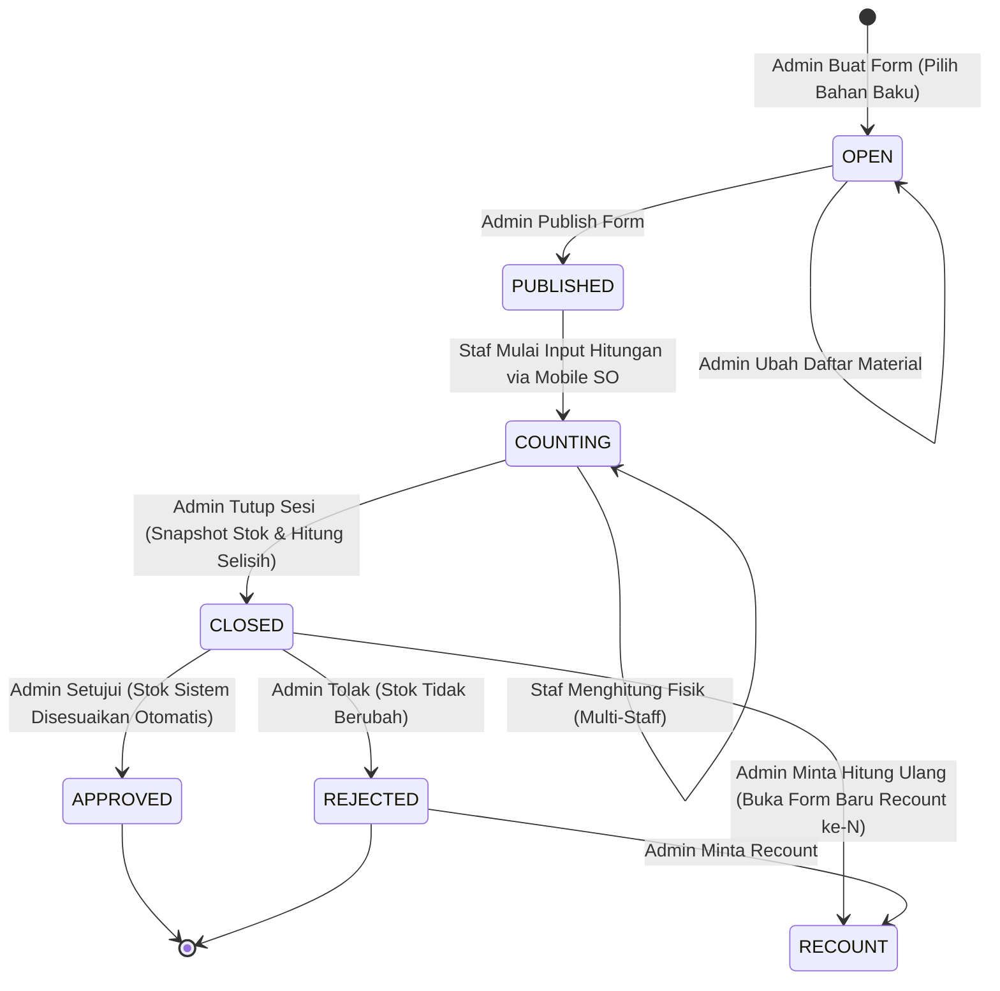

# 13 — Stock Opname Mobile App Architecture & Specifications (`posgodinov-so`)

> **Komponen:** `posgodinov-so`  
> **Teknologi:** Flutter 3.47+ (Dart 3.13+) · Android / iOS  
> **Backend Service:** `posgodinov-be` (Go 1.26+, PostgreSQL 17)  
> **Peran Sistem:** Aplikasi Handheld Khusus Penghitungan Fisik Inventori Bahan Baku (Stock Opname Multi-Staf Kolaboratif)

---

## 1. Arsitektur & Peran Ekosistem

Aplikasi `posgodinov-so` dirancang khusus sebagai aplikasi genggam (*handheld mobile-first*) untuk staf operasional gudang, dapur, dan bar dalam mencatat persediaan fisik (*Stock Opname*). Berbeda dengan aplikasi kasir utama `posgodinov-mobile` yang berjalan di tablet 10" lanskap meja kasir, `posgodinov-so` difokuskan pada mobilitas staf bergerak yang mengitari rak gudang, freezer, dan lemari penyimpanan.

```mermaid
flowchart TD
    subgraph MultiClient ["Klien POS-GODINOV"]
        AdminWeb["Admin Web Dashboard (posgodinov-fe)<br>Next.js 19"]
        TabletPOS["Aplikasi Kasir Meja (posgodinov-mobile)<br>Tablet Android 10 Inch"]
        MobileSO["Aplikasi Stock Opname (posgodinov-so)<br>Smartphone Handheld Portrait"]
    end

    subgraph BackendGateway ["Backend REST API (posgodinov-be)"]
        AdminSOAPI["/v1/business/outlets/{id}/so/forms<br>(Auth: Business Owner / Manager Token)"]
        MobileSOAPI["/v1/so/*<br>(Auth: Device Token Scope OPNAME + X-Staff-Id)"]
        SyncStaffAPI["/v1/so/sync/staff-data<br>(Sinkronisasi Staf & Hash PIN)"]
    end

    subgraph Persistence ["PostgreSQL 17 (Tenant Business DB)"]
        SessionsDB[("opname_sessions")]
        EntriesDB[("opname_count_entries")]
        ItemsDB[("opname_session_items")]
        RMDB[("raw_materials (Dual-Stock)")]
    end

    AdminWeb -->|1. Create Form & Publish| AdminSOAPI
    AdminSOAPI --> SessionsDB

    MobileSO -->|2. Sync Staff Data| SyncStaffAPI
    MobileSO -->|3. Get Available Sessions & Count| MobileSOAPI
    MobileSOAPI --> EntriesDB

    AdminWeb -->|4. Close Session (SUM Aggregation & Diff Snapshot)| AdminSOAPI
    AdminSOAPI --> ItemsDB
    AdminSOAPI --> RMDB

    AdminWeb -->|5. Approve Form & Auto Stock Adjustment| AdminSOAPI
    AdminSOAPI --> RMDB
```

---

## 2. Prinsip Keamanan & Anti-Fraud

### 2.1 Blind Counting (Penghitungan Buta)
Untuk menjaga integritas data dan mencegah kecurangan inventori:
- **Server Tidak Pernah Mengirim `system_stock` ke Mobile**:
  - Endpoint `GET /v1/so/{form_id}` hanya mengirimkan identitas bahan baku (`id`, `name`, `sku`, `unit`, `package_unit`, `quantity_per_package`).
  - Staf lapangan wajib mencatat apa yang mereka lihat secara fisik tanpa terpengaruh oleh angka di komputer.
- **Kalkulasi Selisih Terisolasi di Sisi Server**:
  - Selisih stok (`difference`), selisih nilai rupiah (`difference_value`), dan indikator kecurangan (`fraud_flag`) dihitung secara otomatis saat sesi ditutup oleh Admin di Web Dashboard melalui `POST /v1/business/outlets/{outlet_id}/so/forms/{form_id}/close`.

### 2.2 Token Perangkat & Autentikasi Staf Bertingkat
1. **Device Binding (Perangkat Outlet)**:
   - Perangkat ditautkan ke outlet dengan menyetor serial bisnis, serial outlet, dan password pemilik outlet ke `POST /v1/device/bind`.
   - Backend memvalidasi dan mengembalikan token PASETO berjangka panjang dengan scope `OPNAME`.
2. **Local PIN Verification (Tanpa Bergantung Jaringan)**:
   - Data staf outlet (termasuk hash PIN bcrypt) disinkronkan ke storage aman lokal via `GET /v1/so/sync/staff-data`.
   - Saat staf masuk, verifikasi PIN dilakukan di perangkat menggunakan algoritma `BCrypt.checkpw` pada isolate terpisah (`compute()`) agar UI tetap responsif (*60 FPS*).
3. **Penyematan Identitas Staf**:
   - Seluruh mutasi hitungan mengirimkan header HTTP `X-Staff-Id: <uuid>`, memastikan setiap entri fisik tercatat atas nama staf yang bersangkutan.

---

## 3. Siklus Hidup Sesi Stock Opname (State Machine)



### Penjelasan Status:
1. **`OPEN`**: Draf form dibuat oleh Admin di web dashboard. Bahan baku dapat ditambah/dikurangi. Belum muncul di aplikasi mobile staf.
2. **`PUBLISHED`**: Form telah dipublikasikan dan muncul di aplikasi mobile staf (`GET /v1/so/available`). Staf dapat membuka form dan bersiap menghitung.
3. **`COUNTING`**: Berubah otomatis begitu staf pertama kali menyimpan hitungan bahan baku.
4. **`CLOSED`**: Admin menutup sesi penghitungan. Backend mengunci baris bahan baku (`SELECT FOR UPDATE`), mengambil snapshot stok sistem saat itu, melakukan SUM agregasi hitungan dari seluruh staf, dan menghitung selisih nominal.
5. **`APPROVED`**: Admin menyetujui hasil opname. Backend secara atomik memperbarui stok bahan baku (`raw_materials`) sesuai dengan total hitungan fisik.
6. **`REJECTED`**: Form ditolak karena selisih tidak wajar atau dicurigai kecurangan. Stok sistem tidak berubah.
7. **`RECOUNT`**: Jika terdapat selisih besar, Admin dapat memicu hitung ulang (*Recount ke-N*). Sistem secara otomatis menduplikasi form dengan nomor urut recount baru.

---

## 4. Model Perhitungan Dual-Stock Fisik

Bahan baku di POS-GODINOV mendukung sistem **Dual-Stock** (Kemasan Utuh dan Eceran Terbuka). Contoh: Minyak Goreng (Dus isi 12 Botol).

### Rumus Agregasi:
$$\text{Actual Stock} = (\text{actual\_packages} \times \text{quantity\_per\_package}) + \text{actual\_loose}$$

### Struktur Pengiriman Data:
Aplikasi mobile mengirimkan nilai spesifik `actual_packages` (integer) dan `actual_loose` (desimal desimal) melalui payload:
```json
{
  "items": [
    {
      "raw_material_id": "4164bfa7-5310-444a-939e-b5f7e75e9b34",
      "actual_packages": 5,
      "actual_loose": 3.5,
      "notes": "Rak A-02 basah sebagian"
    }
  ]
}
```

### Agregasi Multi-Staf di Database:
Saat sesi ditutup, PostgreSQL melakukan agregasi menggunakan query:
```sql
INSERT INTO opname_session_items (id, session_id, raw_material_id, actual_stock, actual_package_quantity, input_type)
SELECT gen_random_uuid(), ce.session_id, ce.raw_material_id, SUM(ce.actual_stock),
       CASE WHEN SUM(CASE WHEN ce.actual_package_quantity IS NOT NULL THEN 1 ELSE 0 END) > 0
           THEN SUM(COALESCE(ce.actual_package_quantity, 0)) ELSE NULL END,
       'base_unit'
FROM opname_count_entries ce WHERE ce.session_id = $1
GROUP BY ce.session_id, ce.raw_material_id
ON CONFLICT (session_id, raw_material_id) DO UPDATE SET
    actual_stock = EXCLUDED.actual_stock,
    actual_package_quantity = EXCLUDED.actual_package_quantity;
```

---

## 5. Antarmuka Pemindai Barcode (1D & 2D)

- **Format yang Didukung**: Seluruh format standar industri (`BarcodeFormat.all`):
  - **1D Linear**: Code 128, Code 39, Code 93, EAN-13, EAN-8, UPC-A, UPC-E, ITF, Codabar.
  - **2D Matrix**: QR Code, Data Matrix.
- **Rasio Viewfinder**: Berbentuk persegi panjang mendatar (300 × 170 px) dengan garis panduan laser merah mendatar, disesuaikan dengan posisi stiker barcode memanjang pada dus kemasan atau rak gudang.
- **Interaksi Instan**: Setelah barcode/SKU terdeteksi, kamera langsung memicu haptic feedback dan membuka modal hitung (*stepper modal*) bahan baku terkait secara otomatis.

---

## 6. Penanganan Kesalahan & Pengalaman Pengguna (Error Handling)

Untuk menjaga tampilan tetap profesional dan bersih (*Zero Technical Leaks*), seluruh respon error dari jaringan maupun sistem disaring melalui modul `ErrorFormatter`:

| Kondisi Sistem | Tampilan Pengguna |
| :--- | :--- |
| `connectionTimeout` / `receiveTimeout` | *"Koneksi ke server terputus (waktu habis). Pastikan koneksi internet stabil dan coba lagi."* |
| `connectionError` / `SocketException` | *"Tidak dapat terhubung ke server. Pastikan server aktif dan perangkat terhubung ke jaringan yang sama."* |
| HTTP 401 Unauthorized | *"Sesi autentikasi telah berakhir. Silakan login kembali."* |
| HTTP 403 Forbidden | *"Akses ditolak. Perangkat atau akun ini tidak memiliki izin."* |
| HTTP 404 Not Found | *"Data yang diminta tidak ditemukan di server."* |
| HTTP 500+ Internal Server Error | *"Server sedang mengalami gangguan sementara. Silakan coba lagi nanti."* |

---

## 7. Rangkuman Spesifikasi Endpoint Backend

| HTTP Method | Path | Autentikasi | Catatan Kunci |
| :--- | :--- | :--- | :--- |
| `POST` | `/v1/device/bind` | Body: `serial_business`, `serial_outlet`, `password` | Mengembalikan `device_token` (scope `OPNAME`) |
| `GET` | `/v1/so/sync/staff-data` | `Bearer <device_token>` | Mengembalikan daftar staf aktif beserta `pin_hash` untuk validasi lokal |
| `GET` | `/v1/so/available` | `Bearer <device_token>` | Mengambil sesi dengan status `PUBLISHED` dan `COUNTING` |
| `GET` | `/v1/so/{form_id}` | `Bearer <device_token>` | Mengambil material dan SKU (tanpa `system_stock`) |
| `PUT` | `/v1/so/{form_id}/counts` | `Bearer <device_token>` + `X-Staff-Id` | Menyimpan hitungan per staf (`actual_packages`, `actual_loose`) |
| `GET` | `/v1/so/{form_id}/my-counts` | `Bearer <device_token>` + `X-Staff-Id` | Mengambil data hitungan spesifik milik staf yang sedang aktif |

---

## 8. Verifikasi & Pengujian Otomatis

Aplikasi dilengkapi test suite komprehensif:
- **Analisis Statis**: `flutter analyze` (Zero issues, lint standar Google Flutter).
- **Pengujian Logika (Unit Test)**: `flutter test`
  - Perhitungan Dual-Stock (kemasan utuh + eceran terbuka).
  - Kasus batas (hanya kemasan utuh, hanya eceran, desimal presisi tinggi).
  - Smoke test rendering widget root.
