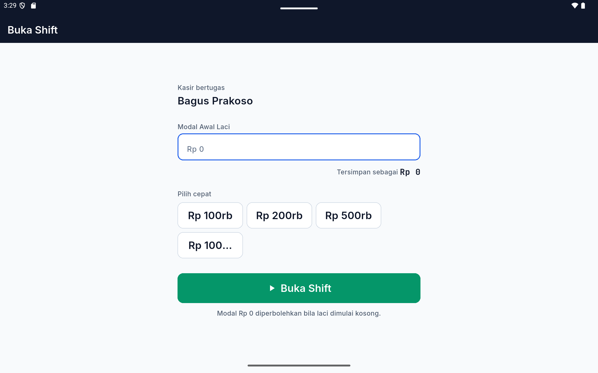
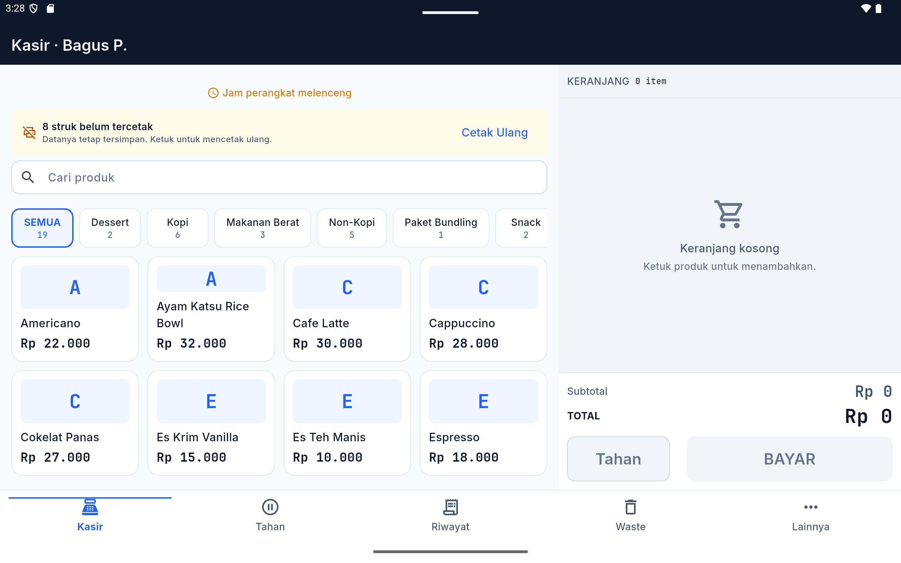
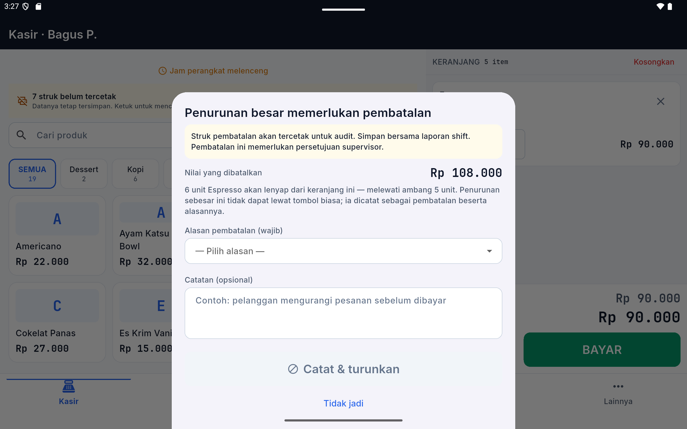
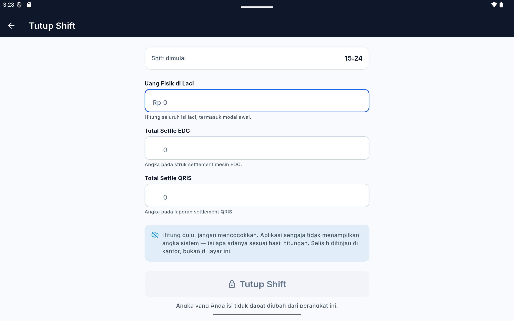

# Panduan Kasir — POSGODINOV Mobile

**Untuk:** Kasir dan Supervisor outlet
**Perangkat:** Tablet / handheld POSGODINOV
**Versi:** 2.0

---

Panduan ini menjelaskan empat hal yang paling sering Anda lakukan setiap hari:
membuka shift, berpindah antar menu, mengurangi barang dari keranjang, dan
menutup shift di akhir jam kerja.

Ikuti gambar di setiap bagian. Bila layar Anda terlihat berbeda dari gambar,
hubungi supervisor sebelum melanjutkan.

---

## 1. Membuka Shift

Shift adalah satu periode kerja Anda. Semua penjualan yang Anda lakukan tercatat
di bawah shift yang sedang terbuka, jadi **shift harus dibuka sebelum melayani
pelanggan pertama**.

### Langkah

1. Masuk menggunakan **ID staf** dan **PIN** Anda.
2. Layar **Buka Shift** akan muncul secara otomatis.
3. Hitung uang yang ada di laci kas saat ini, lalu ketik jumlahnya pada kolom
   **Modal Awal Laci**.
4. Untuk mempercepat, gunakan tombol **Pilih cepat** (Rp 100rb, Rp 200rb,
   Rp 500rb, Rp 1jt) bila nominalnya pas.
5. Tekan **Buka Shift**.

> **Modal Rp 0 diperbolehkan.** Bila laci memang dimulai kosong, isi `0`. Yang
> tidak boleh adalah mengarang angka — jumlah ini menjadi titik awal
> perhitungan laci Anda hari itu.

### Bila muncul layar "Unduh Data & Coba Lagi"

Artinya tablet belum menerima data produk terbaru. Tekan tombolnya dan tunggu
sampai selesai. Anda tidak dapat membuka shift tanpa data ini, dan **tidak ada
tombol untuk melewatinya** — ini disengaja, agar Anda tidak berjualan memakai
daftar harga yang sudah kedaluwarsa.

---

## 2. Navigasi Bar Bawah

Semua perpindahan menu dilakukan lewat **bar bawah**. Bar ini selalu berada di
bagian bawah layar, dalam jangkauan ibu jari, dan berisi tepat lima tombol.

| Tombol | Fungsi |
|---|---|
| **Kasir** | Layar penjualan utama — daftar produk dan keranjang belanja. |
| **Tahan** | Menyimpan pesanan sementara, misalnya pelanggan yang belum siap membayar. Beri label agar mudah dikenali (contoh: *Meja 4*). |
| **Riwayat** | Daftar transaksi pada shift yang sedang berjalan. |
| **Waste** | Melaporkan barang rusak, tumpah, atau kedaluwarsa. |
| **Lainnya** | Membuka menu tambahan, termasuk **Tutup Shift** dan **Pengaturan**. |

> **Bagian atas layar tidak memiliki tombol.** Judul di atas hanya menampilkan
> nama kasir yang sedang bertugas. Semua tindakan ada di bar bawah — Anda tidak
> perlu menjangkau sudut atas layar sambil memegang tablet.

### Ringkasan keranjang

Saat keranjang berisi, sebuah bar ringkasan muncul **di atas** bar navigasi,
menampilkan jumlah item, total belanja, dan tombol **BAYAR**. Bar navigasi tetap
terlihat, sehingga Anda dapat membuka Riwayat tanpa harus mengosongkan keranjang
lebih dulu.

---

## 3. Mengurangi Jumlah Barang — Aturan Pembatalan Besar

Menambah jumlah barang tidak pernah dibatasi. **Mengurangi** dalam jumlah besar
diperlakukan berbeda, karena barang yang hilang dari keranjang adalah barang
yang tidak jadi dibayar.

### Aturan yang berlaku

> **Selama total pengurangan Anda tidak lebih dari 5 unit, tombol minus bekerja
> seperti biasa.** Begitu total pengurangan melewati 5 unit, sistem berhenti dan
> meminta alasan.

Yang dihitung adalah **jumlah tertinggi** barang itu pernah ada di keranjang,
bukan jumlahnya saat ini. Contoh nyata:

| Anda memasukkan | Anda menekan minus | Total berkurang | Yang terjadi |
|---:|---:|---:|---|
| 10 unit | 1 kali | 1 unit | Langsung berkurang |
| 10 unit | 5 kali | 5 unit | Langsung berkurang |
| 10 unit | **6 kali** | **6 unit** | **Sistem meminta alasan pembatalan** |

### Formulir Alasan Pembatalan

Pada penekanan yang melewati batas, layar berikut muncul:

Formulir ini menampilkan:

- **Nilai yang dibatalkan** — berapa rupiah barang yang akan hilang dari keranjang.
- **Keterangan** berapa unit yang akan hilang dan mengapa formulir ini muncul.
- **Peringatan** bahwa struk pembatalan akan tercetak untuk keperluan audit.

### Langkah mengisinya

1. Buka daftar **Alasan pembatalan (wajib)** dan pilih yang paling sesuai:
   *Pelanggan membatalkan*, *Item salah*, *Jumlah salah*, *Selisih harga*,
   *Latihan / uji coba*, *Kesalahan sistem*, *Input ganda*, atau *Lainnya*.
2. Bila Anda memilih **Lainnya**, kolom catatan menjadi **wajib diisi** minimal
   10 karakter. Tulis penjelasan singkat yang sebenarnya.
3. Tekan **Catat & turunkan**.

Jumlah barang baru berkurang **setelah** alasan tercatat. Bila Anda menekan
**Tidak jadi**, tidak ada yang berubah sama sekali.

> **Tombol hapus baris dan tombol "Kosongkan" mengikuti aturan yang sama.**
> Keduanya bukan jalan pintas untuk menghindari formulir ini. Bila total barang
> yang akan hilang melewati batas, formulir yang sama akan muncul.

### Mengapa aturan ini ada

Struk pembatalan yang tercetak adalah bukti tertulis bahwa pengurangan besar itu
memang terjadi dan ada alasannya. **Simpan struk tersebut bersama laporan
shift Anda.** Aturan ini melindungi Anda: bila di kemudian hari ada pertanyaan
tentang selisih, catatan inilah yang menunjukkan bahwa Anda bekerja sesuai
prosedur.

---

## 4. Menutup Shift (Blind Closing)

Di akhir jam kerja, Anda menutup shift dengan melaporkan **apa yang benar-benar
Anda hitung**, bukan mencocokkan angka dengan layar.

Buka lewat **Lainnya → Tutup Shift**.

### Tiga angka yang Anda laporkan

| Kolom | Yang Anda isi |
|---|---|
| **Uang Fisik di Laci** | Hitung seluruh isi laci, **termasuk modal awal**. Wajib diisi. |
| **Total Settle EDC** | Total setoran mesin kartu. Isi `0` bila tidak ada. |
| **Total Settle QRIS** | Total setoran QRIS. Isi `0` bila tidak ada. |

Tombol **TUTUP SHIFT** baru aktif setelah **Uang Fisik di Laci** terisi.

### Mengapa layar ini tidak menampilkan angka sistem

Layar ini **sengaja** tidak menampilkan total penjualan, jumlah transaksi, saldo
yang seharusnya ada di laci, maupun selisih. Ini bukan kekurangan aplikasi.

> Angka yang Anda ketik sambil melihat angka yang seharusnya bukan lagi hasil
> hitungan — dan tidak memiliki nilai sebagai bukti. Dengan cara ini, hitungan
> Anda berdiri sendiri dan justru **melindungi Anda** bila ada selisih:
> catatannya menunjukkan Anda melaporkan apa adanya.

Pencocokan dan peninjauan selisih dilakukan di kantor oleh pemilik, bukan di
layar ini.

### Setelah shift ditutup

1. Layar konfirmasi **"Shift ditutup"** muncul sebentar, tanpa menampilkan angka apa pun.
2. Aplikasi kembali ke halaman **Masuk**.
3. Struk tutup shift tercetak berisi nama Anda, jam mulai dan tutup, serta
   **ketiga angka deklarasi**. Terdapat dua baris tanda tangan: **Kasir** dan
   **Penerima Setoran**.
4. Tanda tangani struk, serahkan bersama uang setoran.

> **Bila jaringan sedang mati, tetap lanjutkan.** Shift tersimpan di tablet dan
> terkirim sendiri begitu jaringan kembali. Anda akan tetap diarahkan ke halaman
> Masuk dalam beberapa detik — tidak perlu menunggu.

---

## 5. Ringkasan Cepat

| Situasi | Yang harus dilakukan |
|---|---|
| Mulai bekerja | Masuk → hitung laci → isi Modal Awal → **Buka Shift** |
| Pelanggan menunda bayar | **Tahan** → beri label meja |
| Salah input, perlu kurangi ≤ 5 unit | Tekan minus seperti biasa |
| Perlu kurangi > 5 unit | Tekan minus → **pilih alasan** → **Catat & turunkan** → simpan struk |
| Barang rusak / tumpah | **Waste** → catat jumlahnya |
| Selesai bekerja | **Lainnya → Tutup Shift** → isi tiga angka → tanda tangani struk |

---

## 6. Bila Terjadi Masalah

| Yang Anda lihat | Artinya | Tindakan |
|---|---|---|
| "ID atau PIN salah" | ID atau PIN tidak cocok | Periksa ulang. Bila lupa PIN, hubungi pemilik — PIN tidak dapat direset sendiri. |
| Layar "Unduh Data & Coba Lagi" | Data produk belum lengkap | Tekan tombolnya, tunggu selesai |
| "N struk belum tercetak" | Ada struk yang gagal keluar | Periksa printer, lalu tekan **Cetak Ulang** pada spanduk tersebut |
| Tombol **Ganti kasir** tidak ada | Shift Anda masih terbuka | Tutup shift lebih dulu. Bila benar-benar mendesak, minta supervisor melakukan **Tutup Paksa Shift**. |
| Keranjang tidak bisa dikosongkan tanpa alasan | Total barang melewati batas 5 unit | Isi formulir alasan pembatalan |

---

*Dokumen ini dibuat otomatis dari sistem pengujian POSGODINOV. Gambar di dalamnya
adalah tangkapan layar aplikasi yang sesungguhnya, bukan ilustrasi.*
