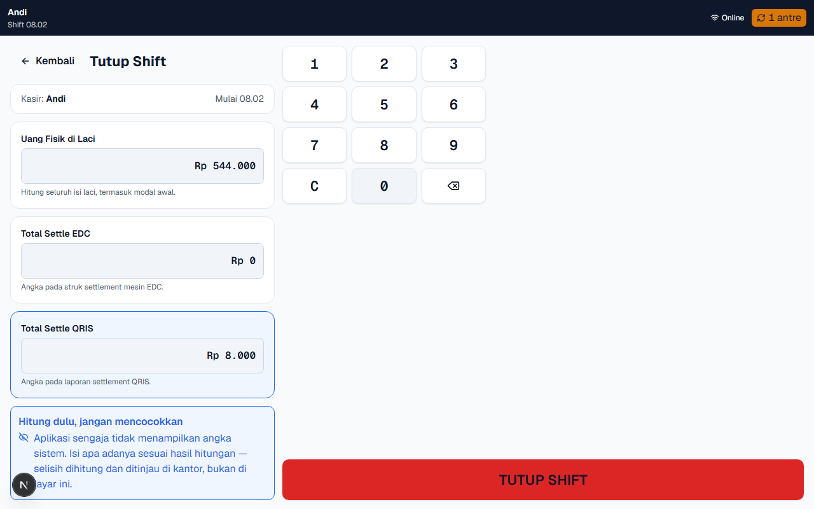
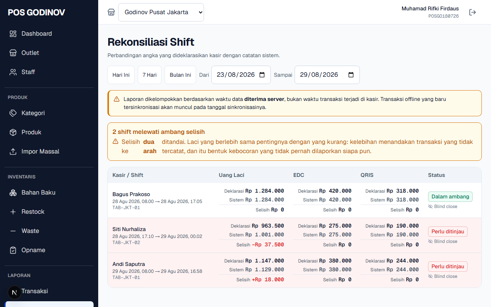
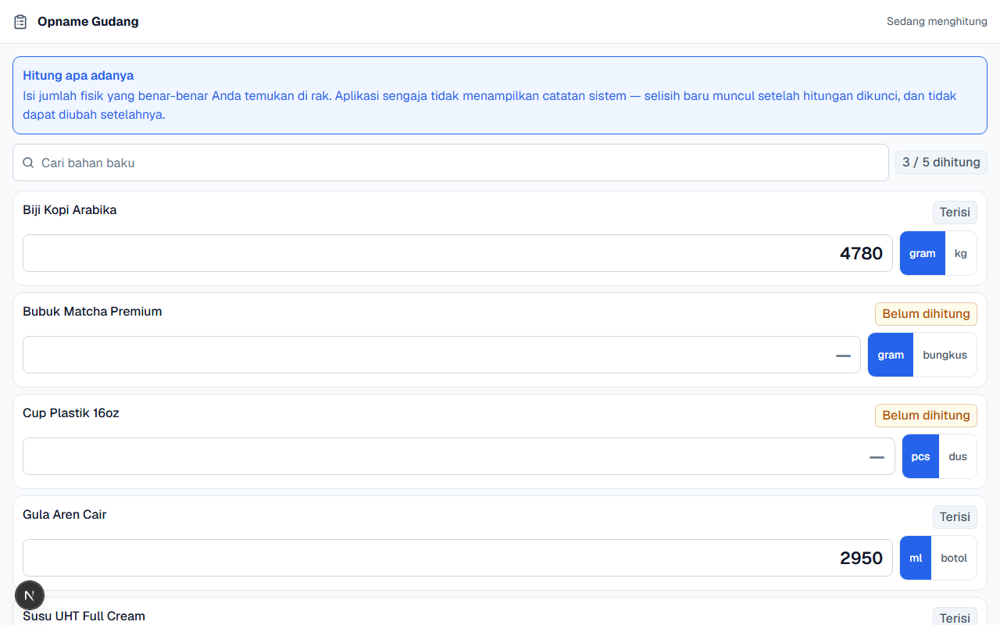
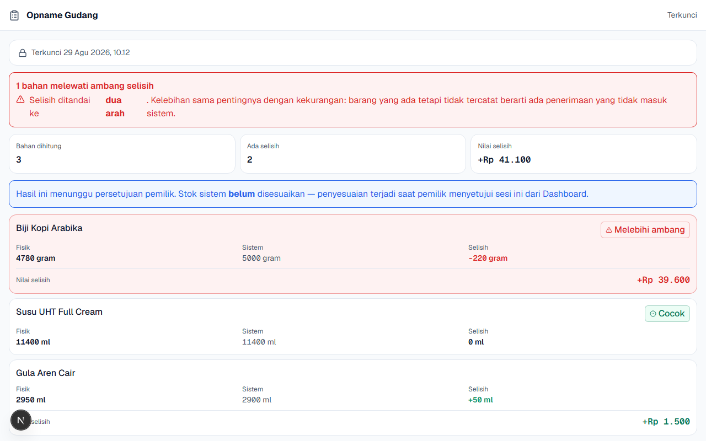
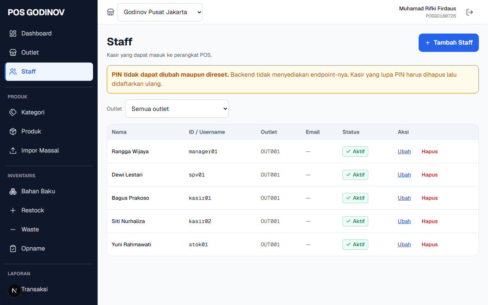
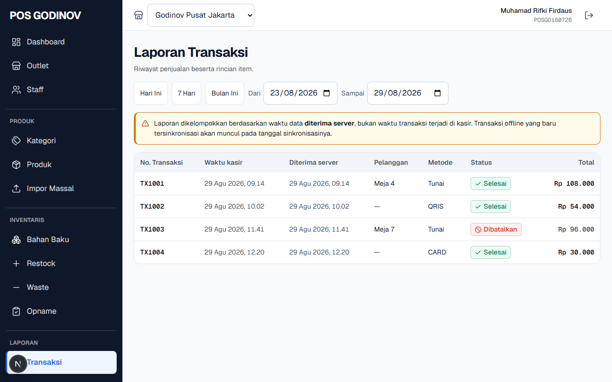

# Panduan Pemilik — POSGODINOV Web

**Untuk:** Pemilik bisnis dan Manajer outlet
**Perangkat:** Peramban desktop / laptop
**Versi:** 2.0

---

Panduan ini menjelaskan empat hal yang menjadi tanggung jawab Anda dan **tidak
dapat dilakukan dari perangkat kasir**: meninjau hasil penutupan laci, menyetujui
hasil hitung stok, mengatur siapa yang boleh keluar dari Mode Kiosk, dan membaca
jejak kejadian keamanan.

Keempatnya berbagi satu prinsip yang sama:

> Orang yang **menghitung** tidak boleh melihat angka yang **seharusnya**.
> Pemilihan itulah yang membuat angka hasil hitungan layak dipercaya — dan
> Anda, sebagai pemilik, adalah pihak yang melihat kedua angka tersebut.

---

## 1. Memeriksa Hasil Blind Closing

Setiap akhir shift, kasir melaporkan tiga angka hasil hitungan: uang fisik di
laci, total setoran mesin kartu, dan total setoran QRIS.

### Yang dilihat kasir

Layar penutupan di sisi kasir sengaja dibuat **kosong dari angka sistem**:

Tidak ada total penjualan, tidak ada jumlah transaksi, tidak ada saldo yang
seharusnya, dan tidak ada selisih — bahkan pada dialog konfirmasinya. Kasir
melaporkan apa yang ia hitung, titik.

### Yang Anda lihat

Buka **Laporan → Rekonsiliasi Shift**. Di sinilah kedua sisi angka
dipertemukan.

Untuk setiap shift, halaman ini menampilkan:

| Kolom | Artinya |
|---|---|
| **Deklarasi** | Angka yang dilaporkan kasir |
| **Sistem** | Angka yang dihitung dari transaksi yang tercatat |
| **Selisih** | Perbedaan keduanya, per kelompok setoran |

### Membaca penandanya

Shift yang selisihnya melewati **Rp 5.000** diberi penanda **"Perlu ditinjau"**.

> **Penanda muncul untuk selisih ke dua arah** — kekurangan maupun **kelebihan**.
> Laci yang lebih banyak dari seharusnya sama layak ditanyakan dengan laci yang
> kurang: keduanya berarti ada sesuatu yang tidak tercatat.

Selisih kecil adalah hal normal dalam operasi harian. Yang perlu Anda perhatikan
adalah **pola**: kasir yang sama, jam yang sama, atau arah selisih yang selalu
sama.

### Yang tidak dapat diubah kasir

Angka sistem dihitung di server dan **tidak dapat dipengaruhi dari perangkat
kasir**, bahkan bila perangkat itu dimodifikasi. Angka pada halaman ini selalu
merupakan hasil hitungan yang berdiri sendiri.

---

## 2. Blind Opname — Fase Draft dan Terkunci

Penghitungan stok fisik (opname) memakai prinsip yang sama: petugas menghitung
tanpa melihat stok sistem.

### Fase 1 — DRAFT (petugas menghitung)

Selama fase ini, layar hitung **tidak menampilkan** stok sistem, selisih, nilai
rupiah, maupun penanda warna hijau/merah.

Petugas hanya melihat daftar bahan dan kolom untuk mengisi jumlah fisik. Lencana
pada baris yang sudah terisi bernada netral — bukan hijau — supaya tidak ada
isyarat "benar" atau "salah" selama menghitung.

### Fase 2 — LOCKED (Anda meninjau)

Setelah petugas menekan **Selesai Menghitung**, muncul dialog konfirmasi berisi
jumlah bahan yang sudah dan belum dihitung — **tanpa** menyebut berapa yang
menyimpang.

Setelah dikunci, seluruh angka terbuka:

| Kolom | Artinya |
|---|---|
| **Fisik** | Hasil hitungan petugas |
| **Sistem** | Stok menurut catatan |
| **Selisih** | Perbedaan keduanya |
| **Nilai** | Selisih dalam rupiah |

### Tiga hal penting tentang penguncian

> **1. Penguncian bersifat satu arah.** Setelah dikunci, hitungan tidak dapat
> diubah dan tidak ada jalan kembali ke fase Draft. Bila hitungan perlu diulang,
> buat sesi opname baru.
>
> **2. Stok sistem diambil pada saat DIKUNCI, bukan saat sesi dibuka.** Bila toko
> tetap berjualan selama petugas menghitung, penjualan itu ikut diperhitungkan.
> Inilah yang membuat selisihnya adil bagi petugas yang menghitung berjam-jam.
>
> **3. Opname bersifat menimpa.** Stok sistem akan digantikan oleh hasil
> hitungan fisik. Dialog konfirmasi akan menyatakan hal ini sebelum Anda
> menyetujui.

---

## 3. Hak Akses Keluar Mode Kiosk

**Mode Kiosk** mengubah tablet menjadi layar pesanan mandiri untuk pelanggan.
Selama mode ini aktif, tombol Home dan Recents perangkat diblokir — pelanggan
tidak dapat keluar dari aplikasi.

### Siapa yang boleh keluar

Keluar dari Mode Kiosk **bukan sekadar soal PIN yang benar**. PIN yang sah milik
kasir biasa akan **ditolak**.

Yang dapat keluar hanyalah staf yang Anda beri **izin keluar Kiosk** secara
eksplisit. Atur ini lewat **Pengaturan → Staf**, pada daftar izin masing-masing
orang.

Berdasarkan data awal, izin ini umumnya dipegang **Manajer** dan **Supervisor**,
tidak dipegang kasir.

### Cara petugas berizin keluar

1. Ketuk logo pada layar Kiosk sebanyak **5 kali dalam 3 detik**.
2. Masukkan PIN staf yang berizin.

> **Pesan penolakan dibuat sama persis** untuk PIN yang salah dan untuk PIN yang
> benar tetapi tanpa izin. Ini disengaja: orang yang menebak-nebak tidak boleh
> tahu bahwa PIN yang ia masukkan sebenarnya sudah benar.

### Perlindungan terhadap percobaan berulang

Tiga kegagalan berturut-turut memicu **jeda 60 detik**. Selama jeda, ketukan
logo tidak membuka dialog sama sekali — hanya muncul pemberitahuan sisa waktu.

Setiap penolakan dan setiap penguncian tercatat pada jejak audit, lengkap dengan
jumlah percobaannya.

---

## 4. Membaca Jejak Pembatalan & Kejadian Keamanan

### Yang tersedia hari ini: Laporan Transaksi

Buka **Laporan → Transaksi**. Di sinilah pembatalan terbaca: setiap transaksi
yang dibatalkan tampil dengan statusnya sendiri beserta **catatan pembatalan**
yang diketik kasir.

Pilih rentang tanggal, lalu telusuri baris yang berstatus dibatalkan. Setiap
baris memuat waktu, metode bayar, nilai, dan alasan.

> **Belum ada halaman khusus "Keamanan" di Dashboard.** Kejadian pada tabel di
> bawah **dicatat** oleh sistem, tetapi layar untuk membacanya sendiri belum
> tersedia. Sampai halaman itu ada, mintalah tim operasional menariknya untuk
> Anda. Tabel ini dipertahankan supaya Anda tahu apa saja yang sudah terekam
> dan layak ditanyakan — bukan supaya Anda mencarinya di menu yang belum ada.

### Kejadian yang sudah terekam dan paling layak diperhatikan

| Kejadian | Artinya | Yang sebaiknya Anda lakukan |
|---|---|---|
| **Tutup Paksa Shift** | Supervisor menutup shift kasir lain memakai PIN-nya sendiri. Shift itu ditutup dengan deklarasi **nol**. | Tanyakan alasannya. Laci shift tersebut tidak pernah dihitung. |
| **Penolakan keluar Kiosk** | Ada yang mencoba keluar Mode Kiosk tanpa izin. | Sesekali wajar. Berulang pada jam yang sama layak ditanyakan. |
| **Penguncian keluar Kiosk** | Tiga kegagalan berturut-turut. | Periksa siapa yang bertugas saat itu. |
| **Buka Shift ditolak — data kedaluwarsa** | Tablet mencoba membuka shift dengan daftar harga lama. | Pastikan tablet tersebut mendapat jaringan secara berkala. |
| **Struk pembatalan gagal cetak** | Pembatalan tercatat, tetapi buktinya tidak keluar dari printer. | **Prioritaskan.** Perbaiki printer dan cetak ulang, agar bukti tertulisnya lengkap. |
| **Percobaan PIN melewati batas** | Banyak kegagalan PIN berturut-turut. | Konfirmasi ke staf bersangkutan. |

### Cara membaca daftar pembatalan

Setiap pengurangan besar di keranjang kasir menghasilkan satu baris pembatalan
berisi: nama produk, jumlah **sebelum** dan **sesudah**, nilai rupiah yang
dibatalkan, alasan yang dipilih kasir, dan catatannya.

> **Yang paling berguna bukan satu barisnya, melainkan polanya.** Alasan
> *"Lainnya"* yang mendominasi adalah tanda kamus alasan tidak lagi dipakai
> dengan serius — dan laporan kecurangan kehilangan seluruh dayanya. Bila hal
> itu terjadi, tinjau kembali pelatihan kasir Anda.

---

## 5. Ringkasan Tanggung Jawab

| Tugas | Letak menu | Seberapa sering |
|---|---|---|
| Meninjau selisih laci | Laporan → Rekonsiliasi Shift | Setiap hari |
| Menyetujui hasil opname | Persediaan → Opname | Sesuai jadwal opname |
| Mengatur izin keluar Kiosk | Pengaturan → Staf | Saat ada perubahan staf |
| Menelusuri pembatalan | Laporan → Transaksi | Mingguan, dan setiap ada laporan selisih |

---

## 6. Catatan Penting

> **Laporan dikelompokkan berdasarkan waktu server**, bukan waktu perangkat
> kasir. Sebuah spanduk peringatan menyatakan hal ini pada halaman laporan.
> Transaksi larut malam dapat masuk ke tanggal berikutnya.

> **Rentang tanggal laporan dibatasi 7 hari.** Batas ini menjaga halaman tetap
> responsif. Untuk periode lebih panjang, ambil beberapa rentang berurutan.

> **Perangkat yang sudah dipasang tidak dapat dilepas dari jarak jauh.** Bila
> tablet hilang atau dicuri, aksesnya ke outlet tetap berlaku. Jaga perangkat
> secara fisik, dan laporkan segera bila hilang.

---

*Dokumen ini dibuat otomatis dari sistem pengujian POSGODINOV. Gambar di dalamnya
adalah tangkapan layar aplikasi yang sesungguhnya, bukan ilustrasi.*
