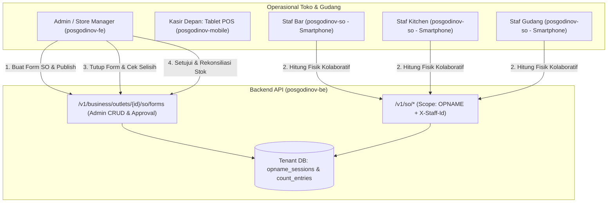
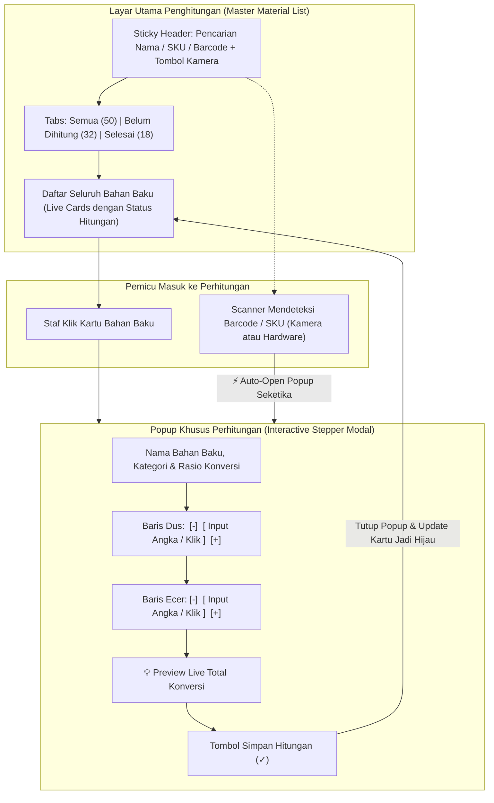
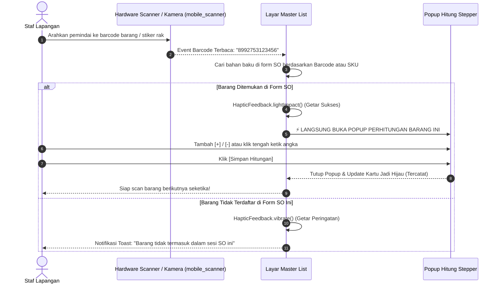
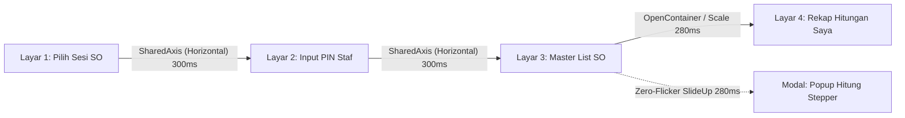
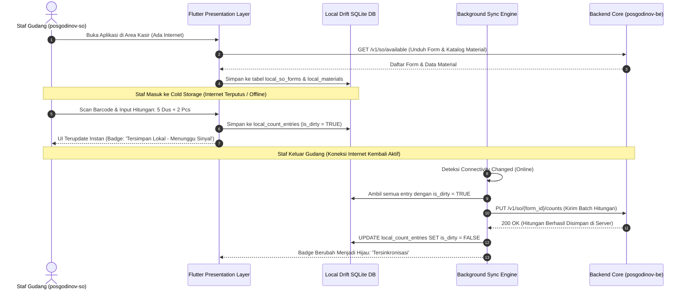
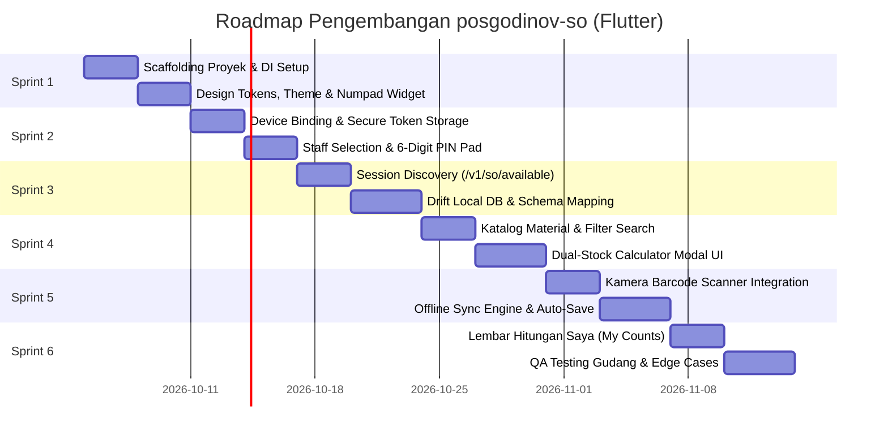

# Perancangan Aplikasi Mobile Stock Opname: `posgodinov-so`
**Mobile-First Handheld Stock Opname App (Flutter Android & iOS)**  
**Versi**: 1.0  
**Tanggal**: 2026-10-02  
**Status**: Proposal Arsitektur & Spesifikasi Implementasi

---

## 1. Eksekutif & Ringkasan Produk

Aplikasi `posgodinov-so` adalah aplikasi mobile khusus **penghitungan fisik inventori bahan baku (Stock Opname)** yang dirancang untuk perangkat genggam (*smartphone / mobile handheld*) berbasis Flutter (Android & iOS).

### Mengapa Terpisah dari `posgodinov-mobile`?

| Parameter | **`posgodinov-mobile` (Aplikasi POS Kasir)** | **`posgodinov-so` (Aplikasi Stock Opname)** |
| :--- | :--- | :--- |
| **Form Factor** | Tablet Android 10" (*Landscape*) | Smartphone 5.5"–6.7" (*Portrait / Handheld*) |
| **Lokasi Operasional** | Meja Kasir / Counter Transaksi | Lorong Gudang, Rak Penyimpanan, Cold Storage / Chiller |
| **Perangkat Pendukung** | Cash Drawer, Mesin EDC, Thermal Printer USB/BT | Kamera Smartphone (Barcode Scanner), Haptic Engine |
| **Karakter Pengguna** | Kasir fokus pada kecepatan transaksi kasir | Staf gudang, barista, dan kitchen crew bergerak aktif |
| **Kondisi Jaringan** | Wi-Fi counter toko relatif stabil | Sering berada di *blank spot* (ruang bawah tanah/chiller tertutup) |
| **Scope Token Perangkat** | `godinov-device-pos` | `godinov-device-so` (Scope: `OPNAME`) |



---

## 2. Prinsip Inti & Tata Kelola Keamanan

### 2.1 Blind Counting (Pencegahan Kecurangan & Fraud Guard)
Sesuai standar audit inventori profesional dan kontrak backend pada [stock-opname-redesign-plan.md](file:///home/ryyz/.gemini/antigravity-cli/brain/c318bea0-6866-4ac9-8d5d-9486fa89f961/stock-opname-redesign-plan.md):
- **Staf Lapangan DILARANG Melihat Stok Sistem (`system_stock`)**:
  - Endpoint `GET /v1/so/{form_id}` **tidak pernah mengirimkan** kolom `system_stock` atau saldo komputer ke aplikasi mobile.
  - Staf yang melakukan penghitungan murni mencatat apa yang ada di mata mereka secara fisik.
  - Hal ini mencegah perilaku malas (langsung menginput angka sesuai komputer tanpa menghitung) dan mencegah manipulasi untuk menutupi kehilangan bahan baku.
- **Perhitungan Selisih Hanya di Sisi Admin**:
  - Snapshot stok sistem, kalkulasi selisih (`difference`), selisih nominal rupiah (`difference_value`), dan indikator kecurangan (`fraud_flag`) baru dieksekusi di database backend saat Admin menutup sesi melalui `POST /v1/.../close`.

### 2.2 Multi-Staff Collaborative Counting (SUM Aggregation)
- Dalam satu outlet, beberapa staf dapat menghitung bersamaan pada satu form opname yang aktif:
  - **Staf A (Barista)** menghitung stok sirup dan biji kopi di bar area.
  - **Staf B (Cook)** menghitung stok daging dan saus di dapur.
  - **Staf C (Gudang)** menghitung persediaan cadangan di gudang belakang.
- Setiap kali staf melakukan submit, backend menyimpan catatan hitungan secara atomik di `opname_count_entries` berdasarkan kombinasi unik `(session_id, raw_material_id, counted_by)`.
- Saat sesi ditutup, backend secara otomatis melakukan **SUM aggregasi** dari seluruh lembar hitungan staf menjadi satu lembar final yang utuh.

---

## 3. Desain Pengalaman Pengguna (UX & Mobile Interaction)

Aplikasi `posgodinov-so` dioperasikan dengan satu tangan (*one-handed mobile ergonomics*) di lorong gudang dan ruang penyimpanan. Berbeda dengan alur pengisian bertahap satu per satu yang kaku, `posgodinov-so` menerapkan **Single-Screen Master List Flow** yang dipadukan dengan **Popup Hitung Stepper Interaktif** dan **Auto-Popup Scanner**.



---

### 3.1 Layar Utama: Master Material List & Sticky Search Header

Saat sesi penghitungan dimulai, aplikasi **tidak memindahkan layar staf satu per satu**, melainkan menampilkan **seluruh daftar bahan baku form SO sekaligus** dalam satu layar yang gegas:

```
┌─────────────────────────────────────────────────────┐
│ 🔍 Cari nama bahan baku, SKU, atau Barcode...    📷 │ <- Sticky Search + Cam Scan
├─────────────────────────────────────────────────────┤
│ [ Semua (48) ]   [ Belum Dihitung (30) ]   [ Selesai (18) ]
├─────────────────────────────────────────────────────┤
│ 🥛 Susu UHT Diamond Full Cream                      │
│ SKU: RM-0012 · Barcode: 8992753123456               │
│ Kemasan: Dus (Isi 12 Liter) · Eceran: Liter         │
│ Status: [ ✓ Tercatat: 4 Dus + 2.5 L ] (50.5 L)      │ <- Badge Hijau
├─────────────────────────────────────────────────────┤
│ ☕ Biji Kopi Arabika Gayo 1Kg                       │
│ SKU: RM-0045 · Barcode: 8993882110022               │
│ Kemasan: Karung (Isi 10 Kg) · Eceran: Kg            │
│ Status: [ ⚪ Belum Dihitung ]                       │ <- Badge Abu-abu
├─────────────────────────────────────────────────────┤
│ 🧂 Gula Pasir Gulaku Premium                        │
│ SKU: RM-0089 · Barcode: 8991002441199               │
│ Kemasan: Ball (Isi 20 Kg) · Eceran: Kg              │
│ Status: [ ✓ Tercatat: 2 Ball ] (40 Kg)              │ <- Badge Hijau
└─────────────────────────────────────────────────────┘
```

#### Fitur Utama Layar Master List:
1. **Sticky Header Pencarian**:
   - Kolom pencarian berada di posisi paling atas dan tetap terlihat saat daftar di-scroll (*sticky*).
   - Mendukung pencarian real-time berdasarkan **Nama Bahan Baku, SKU, maupun Barcode**.
   - Input teks instan memfilter daftar dalam hitungan $< 50\text{ ms}$ melalui SQLite in-memory query.
2. **Tab Filter Cepat**:
   - `Semua`: Menampilkan seluruh katalog bahan baku form.
   - `Belum Dihitung`: Menyaring bahan baku yang belum tersentuh oleh staf aktif, memudahkan penyisiran rak.
   - `Selesai`: Menampilkan bahan baku yang sudah tercatat hitungannya.
3. **Kartu Material Informatif**:
   - Menampilkan detail rasio konversi dus ke eceran secara transparan.
   - Menampilkan status hitungan terkini milik staf tersebut.

---

### 3.2 Pemindai Barcode Cerdas & Alur Kerja Auto-Popup

Aplikasi mendukung dua jenis pemindai barcode di lapangan:
1. **Hardware Barcode Scanner**: Pada perangkat genggam khusus kasir / warehouse PDA (seperti Sunmi L2, iMin Swift, atau barcode scanner gun Bluetooth/USB), aplikasi menyimak sinyal pemindaian secara global (*Hardware Key Listener / Broadcast Receiver*).
2. **Kamera Smartphone**: Tombol ikon kamera di sudut kanan search bar membuka overlay viewfinder kamera cepat menggunakan pustaka **`mobile_scanner`**.

#### Alur Kerja Auto-Popup:


*Keuntungan*: Staf di lorong gudang cukup berjalan dari rak ke rak sambil mengarahkan scanner ke kardus $\rightarrow$ popup hitung langsung muncul otomatis tanpa perlu menyentuh layar untuk memilih nama barang.

---

### 3.3 Popup Khusus Perhitungan (Interactive Stepper Modal)

Ketika kartu bahan baku diklik manual atau terbuka otomatis via pemindai barcode, aplikasi memunculkan **Bottom Sheet Modal Khusus Perhitungan**:

```
┌─────────────────────────────────────────────────────┐
│ 🥛 Susu UHT Diamond Full Cream                      │
│ Kategori: Dairy & Milk · SKU: RM-0012               │
│ Rasio Konversi: 1 Dus = 12 Liter                    │
├─────────────────────────────────────────────────────┤
│ KEMASAN UTUH (Dus):                                 │
│ ┌─────────┐      ┌─────────────────────┐┌─────────┐ │
│ │   [-]   │      │        4 Dus        ││   [+]   │ │
│ └─────────┘      └─────────────────────┘└─────────┘ │
│                   ▲ Klik tengah untuk ketik angka   │
│                                                     │
│ ECERAN TERBUKA (Liter):                             │
│ ┌─────────┐      ┌─────────────────────┐┌─────────┐ │
│ │   [-]   │      │      2.5 Liter      ││   [+]   │ │
│ └─────────┘      └─────────────────────┘└─────────┘ │
│                   ▲ Klik tengah untuk ketik angka   │
├─────────────────────────────────────────────────────┤
│ 💡 TOTAL AKHIR DIHITUNG:                            │
│    50.5 Liter (4 Dus × 12 L + 2.5 L)                │
│                                                     │
│ Catatan Kondisi (Opsional):                         │
│ [ 1 Dus kemasan penyok di pojok rak               ] │
├─────────────────────────────────────────────────────┤
│ [      BATAL      ]       [  SIMPAN HITUNGAN (✓)  ] │
└─────────────────────────────────────────────────────┘
```

#### Spesifikasi Elemen Interaktif:
1. **Baris Input Stepper (Tengah, Kiri, Kanan)**:
   - **Tombol `[-]` di Kiri**: Mengurangi 1 nilai kemasan atau 1 nilai eceran. Tombol otomatis nonaktif jika nilai mencapai 0.
   - **Baris Input di Tengah**: Menampilkan nilai angka saat ini dan nama satuan. **Area tengah ini dapat diklik langsung** untuk memunculkan keyboard numerik layar / numpad, sehingga staf yang menghitung puluhan dus bisa langsung mengetik angka `50` tanpa perlu menekan tombol `[+]` lima puluh kali.
   - **Tombol `[+]` di Kanan**: Menambah 1 nilai kemasan atau 1 nilai eceran.
2. **Dukungan Dual-Stock & Single-Stock Adaptif**:
   - Jika bahan baku memiliki kemasan dus/karton (`quantity_per_package > 0`), modal otomatis merender **dua baris stepper**: baris kemasan utuh dan baris eceran terbuka.
   - Jika bahan baku tunggal (tanpa kemasan dus), modal otomatis hanya merender **satu baris stepper**.
3. **Kalkulator Konversi Real-Time**:
   - Menghitung total eceran secara otomatis:
     $$\text{Total} = (\text{Kemasan Utuh} \times \text{Isi per Kemasan}) + \text{Eceran Terbuka}$$
   - Operator tidak perlu mengalikan secara manual di luar aplikasi.
4. **Alur Penyimpanan Cepat**:
   - Menekan tombol **`Simpan Hitungan (✓)`** menyimpan nilai ke database lokal Drift, menutup popup, memperbarui badge kartu di list utama menjadi hijau, dan mengembalikan fokus ke pemindai barcode untuk barang berikutnya.

---

### 3.4 Standar Transisi Halus & Zero-Flicker Rendering (60/120 FPS Fluidity)

Kelancaran visual (*visual fluidity*) adalah prioritas utama pengalaman pengguna di aplikasi `posgodinov-so`. Gudang yang remang-remang membuat kedipan (*screen flicker*) atau patahan animasi (*jank*) sangat mengganggu mata staf. Arsitektur tampilan menerapkan standar rekayasa grafis berikut:

#### A. Mekanisme Zero-Flicker pada Buka-Tutup Modal Popup Perhitungan:
Penyebab utama kedipan pada modal bottom sheet di Flutter biasanya bersumber dari tiga hal: *raster cache invalidation*, *re-rendering* widget parent di belakang modal, serta *layout snapping* saat keyboard angka muncul. `posgodinov-so` mengatasinya dengan:

1. **Isolasi Layer Grafis (`RepaintBoundary`)**:
   - Seluruh konten Bottom Sheet dibungkus di dalam widget `RepaintBoundary`.
   - Hal ini memisahkan render tree modal dari daftar Master List di belakangnya. Saat modal meluncur naik atau turun, GPU tidak menggambar ulang (repaint) puluhan kartu di daftar utama, menjaga frame rate stabil di **60 FPS / 120 FPS (High Refresh Rate)** tanpa frame drop.
2. **Kurva Gerak Alami (*Natural Easing Curves*)**:
   - **Buka Popup**: Durasi `280 ms` dengan kurva `Curves.easeOutCubic` (gerakan awal cepat lalu melambat anggun saat merapat ke posisi).
   - **Tutup Popup**: Durasi `220 ms` dengan kurva `Curves.easeInCubic` (berakselerasi halus keluar layar tanpa meninggalkan frame bayangan/flicker).
   - Menggunakan `barrierColor: Colors.black.withOpacity(0.45)` dengan fade transparan yang sinkron dengan gerakan modal.
3. **Peredam Kejutan Keyboard (*Fluid Keyboard Avoidance*)**:
   - Saat staf mengetuk area input angka di tengah, keyboard numerik muncul. Untuk mencegah pergeseran layout yang menyentak (*abrupt layout jump*), modal menggunakan pembungkus `AnimatedPadding` yang terikat pada `MediaQuery.viewInsetsOf(context).bottom` dengan kurva `Curves.fastOutSlowIn` durasi `250 ms`. Modal terangkat secara mulus selaras dengan kenaikan keyboard layar.
4. **Isolasi State Lokal (Mencegah Parent Rebuild)**:
   - Kalkulator stepper menggunakan `ValueNotifier` atau `Cubit` lokal di tingkat modal. Perubahan angka stepper `[+]` dan `[-]` hanya merender ulang angka terkait, **bukan merender ulang halaman Master List**.
5. **Animasi Angka Bergulir (*Micro-Interaction Stepper*)**:
   - Nilai angka di kolom input tengah dibungkus widget `AnimatedSwitcher` dengan transisi *slide-and-fade* vertikal halus. Setiap penekanan tombol `[+]` atau `[-]` menghasilkan efek visual angka bergulir anggun, bukan teks yang berkedip berganti secara kaku.

#### B. Standar Transisi Perpindahan Antar-Layar & Aktivitas (Global Motion Design):
Seluruh perpindahan layar di dalam aplikasi tidak menggunakan pemotongan kaku (*instant cut*) ataupun transisi fade default Android lama yang lambat:



1. **Material 3 Shared Axis Transitions (Pustaka `animations`)**:
   - **Navigasi Hierarkis (Horizontal Axis)**:
     - Alur: `Device Binding` $\rightarrow$ `Pilih Sesi Opname` $\rightarrow$ `Input PIN Staf` $\rightarrow$ `Master List Penghitungan`.
     - Menggunakan `SharedAxisTransitionType.horizontal` berdurasi `300 ms` dengan kurva `Curves.easeInOutCubic`. Halaman asal bergeser ke kiri dengan lembut bersamaan dengan masuknya halaman baru dari kanan, memberikan sensasi spasial yang elegan.
   - **Navigasi Ringkasan & Dialog (Scaled Axis)**:
     - Membuka lembar ringkasan (*My Counts Summary*) dan dialog konfirmasi final menggunakan `SharedAxisTransitionType.scaled` atau `OpenContainer`, di mana elemen UI membesar secara organik dari kartu asalnya.
2. **Global Theme Configuration (`PageTransitionsTheme`)**:
   - Dikonfigurasi secara konsisten di `ThemeData`:
     - **Android**: Menerapkan `PredictiveBackPageTransitionsBuilder` (Android 14+) dan transisi Material 3 tanpa flicker.
     - **iOS**: Menerapkan transisi native *Cupertino swipe-back gesture* yang responsif terhadap tarikan jari staf.
3. **Database Non-Blocking Asynchronous**:
   - Seluruh operasi query dan penyimpanan ke database Drift SQLite dijalankan secara asynchronous (menggunakan background isolate). Tidak ada aktivitas penulisan database yang memblokir main UI thread (*0% frame stutter*).

---

### 3.5 Lembar Rekap Hitungan Saya (*My Counts Review*)

Di pojok kanan atas layar master list, terdapat tombol *"Hitungan Saya"* yang membuka lembar ringkasan pribadi staf:
- Menampilkan total item yang telah diselesaikan oleh staf bersangkutan.
- Memberikan tombol *"Konfirmasi Penghitungan Selesai"* saat staf telah menuntaskan seluruh area tugasnya.

---

## 4. Arsitektur Offline-First & Mesin Sinkronisasi (Sync Engine)

Lingkungan gudang bawah tanah dan ruangan pendingin (*cold storage*) rentan terhadap kehilangan sinyal Wi-Fi. `posgodinov-so` dirancang **100% tahan offline**:



### Tabel Basis Data Lokal (Drift / SQLite):

1. **`LocalSoForms`**: Menyimpan snapshot form SO yang diunduh (`id`, `outlet_id`, `scope`, `status`, `recount_number`, `published_at`).
2. **`LocalSoMaterials`**: Katalog bahan baku yang tercakup dalam form tersebut (`id`, `form_id`, `name`, `category`, `barcode`, `package_unit_name`, `base_unit_name`, `quantity_per_package`).
3. **`LocalCountEntries`**: Catatan hitungan fisik staf aktif (`form_id`, `raw_material_id`, `staff_id`, `actual_stock`, `actual_package_quantity`, `input_type`, `notes`, `is_dirty`, `updated_at`).
4. **`LocalActiveStaff`**: Sesi staf yang sedang bertugas (`staff_id`, `name`, `pin_verified_at`).

---

## 5. Arsitektur Autentikasi & Tata Kelola Perangkat

Aplikasi `posgodinov-so` menggunakan pola keamanan berlapis yang terpisah dari akun kasir POS:

```
┌──────────────────────────────────────────────────────────────────┐
│ LAPISAN 1: BINDING PERANGKAT SMARTPHONE (Scope: OPNAME)          │
│ • Dilakukan 1x oleh Teknisi / Store Manager                      │
│ • Input: serial_business, serial_outlet, password outlet         │
│ • API: POST /v1/auth/device/bind (scope = "OPNAME")              │
│ • Output: Device PASETO Token (TTL: 30 Hari)                     │
│ • Disimpan di: flutter_secure_storage (Android KeyStore / iOS)   │
└─────────────────────────────────┬────────────────────────────────┘
                                  │
                                  ▼
┌──────────────────────────────────────────────────────────────────┐
│ LAPISAN 2: VERIFIKASI PIN STAF KASIR / GUDANG                    │
│ • Sebelum menghitung, staf memilih profil namanya                │
│ • Memasukkan 6-Digit PIN kasir                                   │
│ • PIN diverifikasi secara lokal/server                           │
│ • Seluruh HTTP request menyertakan header:                       │
│   X-Staff-Id: <uuid-staf>                                        │
│   X-Device-Id: <uuid-smartphone>                                 │
└──────────────────────────────────────────────────────────────────┘
```

---

## 6. Spesifikasi Kontrak Endpoint Backend yang Dikonsumsi

Aplikasi `posgodinov-so` mengonsumsi rute grup **Mobile Routes** (`/v1/so/*`) yang telah distandardisasi pada backend:

| Method | Endpoint | Fungsi di Aplikasi SO | Header Wajib |
| :--- | :--- | :--- | :--- |
| `POST` | `/v1/auth/device/bind` | Pemasangan awal perangkat smartphone ke outlet | *None* (Body: credentials + `scope: "OPNAME"`) |
| `GET` | `/v1/so/available` | Mengambil daftar form SO berstatus `PUBLISHED` & `COUNTING` | `Authorization: Bearer <device_token>` |
| `GET` | `/v1/so/{form_id}` | Mengambil detail form dan daftar bahan baku yang harus dihitung | `Authorization: Bearer <device_token>` |
| `PUT` | `/v1/so/{form_id}/counts` | Menyinkronkan hasil hitungan fisik staf ke backend | `Authorization: Bearer <device_token>`, `X-Staff-Id: <uuid>` |
| `GET` | `/v1/so/{form_id}/my-counts` | Mengambil lembar hitungan yang telah dimasukkan oleh staf ini | `Authorization: Bearer <device_token>`, `X-Staff-Id: <uuid>` |

### Format Payload Pengiriman Hitungan (`PUT /v1/so/{form_id}/counts`):
```json
{
  "items": [
    {
      "raw_material_id": "8a3d1234-bcde-4567-8901-23456789abcd",
      "actual_stock": 51.5,
      "actual_package_quantity": 4.0,
      "input_type": "base_unit",
      "notes": "1 Dus penyok di pojok rak"
    },
    {
      "raw_material_id": "9f2c5678-cdef-4123-9012-3456789abcde",
      "actual_stock": 12.0,
      "actual_package_quantity": 1.0,
      "input_type": "package_unit",
      "notes": "Kondisi utuh"
    }
  ]
}
```

---

## 7. Struktur Direktori Proyek Flutter (`posgodinov-so`)

Mengadopsi pola **Clean Architecture & Feature-First** yang selaras dengan `posgodinov-mobile`:

```
posgodinov-so/
├── android/                   # Konfigurasi native Android (applicationId: id.godinov.so)
├── ios/                       # Konfigurasi native iOS (Bundle ID: id.godinov.so)
├── assets/
│   ├── images/                # Logo Godinov, ilustrasi empty state, barcode icon
│   └── fonts/                 # Inter (Regular, Medium, SemiBold, Bold)
├── lib/
│   ├── main.dart              # Entry point aplikasi
│   ├── app.dart               # MaterialApp, theme configuration, router
│   ├── core/                  # Fondasi bersama non-fitur
│   │   ├── config/            # Environment variables (API_BASE_URL via String.fromEnvironment)
│   │   ├── database/          # Drift Database: schema, daos, migrations
│   │   ├── di/                # Dependency Injection (GetIt & Injectable)
│   │   ├── error/             # Failure models, exceptions, error mapper
│   │   ├── network/           # Dio client, AuthInterceptor, StaffHeaderInterceptor, RetryInterceptor
│   │   ├── storage/           # FlutterSecureStorage wrapper (Device Token & Credentials)
│   │   └── utils/             # Formatters (angka, tanggal), Debouncer, HapticHelper
│   ├── features/              # Modul fungsional per kapabilitas bisnis
│   │   ├── device_binding/    # Layar setup awal & scan serial outlet
│   │   │   ├── data/
│   │   │   ├── domain/
│   │   │   └── presentation/  # DeviceBindingScreen, Cubit
│   │   ├── staff_auth/        # Pemilihan staf aktif & verifikasi 6-Digit PIN
│   │   │   ├── data/
│   │   │   ├── domain/
│   │   │   └── presentation/  # StaffSelectScreen, PinKeypadModal, Cubit
│   │   ├── opname_session/    # Pemilihan form SO yang aktif di outlet
│   │   │   ├── data/
│   │   │   ├── domain/
│   │   │   └── presentation/  # SessionListScreen, SessionCardWidget, Cubit
│   │   ├── counting/          # Inti aplikasi: Lembar hitung & scanner barcode
│   │   │   ├── data/          # Repositories & Local Cache DAOs
│   │   │   ├── domain/        # Entities: MaterialItem, CountSheet, UseCases
│   │   │   └── presentation/
│   │   │       ├── screens/   # CountingSheetScreen, MaterialDetailScreen
│   │   │       ├── widgets/   # DualStockCalculatorModal, BarcodeScannerSheet, MaterialItemCard
│   │   │       └── cubit/     # CountingCubit, CountingState
│   │   ├── my_summary/        # Review hitungan staf sebelum submit akhir
│   │   │   ├── data/
│   │   │   ├── domain/
│   │   │   └── presentation/  # MySummaryScreen, CountReviewList
│   │   └── sync/              # Mesin background sync queue ke backend
│   │       ├── data/          # SyncQueueManager, NetworkWatcher
│   │       └── cubit/         # SyncStatusCubit, SyncBadgeWidget
│   └── shared/                # Komponen UI bersama
│       ├── theme/             # GodinovTheme, ColorTokens, Typography
│       ├── widgets/           # PrimaryButton, NumberKeypad, SearchBarWidget, StatusChip
│       └── extensions/        # ContextExtensions, NumberFormattingExtensions
├── pubspec.yaml               # Deklarasi pustaka & aset
└── analysis_options.yaml      # Aturan linter & standarisasi kode
```

---

## 8. Spesifikasi Kebutuhan Dependensi (`pubspec.yaml`)

```yaml
name: posgodinov_so
description: Aplikasi Mobile Stock Opname Godinov POS untuk smartphone staf gudang & kasir.
publish_to: none
version: 1.0.0+1

environment:
  sdk: ">=3.5.0 <4.0.0"
  flutter: ">=3.24.0"

dependencies:
  flutter:
    sdk: flutter

  # ── State Management ────────────────────────────────────────────────────────
  flutter_bloc: ^8.1.6
  bloc: ^8.1.4
  equatable: ^2.0.5

  # ── Basis Data Lokal (Offline-First Engine) ──────────────────────────────────
  drift: ^2.20.0
  sqlite3_flutter_libs: ^0.5.24
  path_provider: ^2.1.4
  path: ^1.9.0

  # ── Penyimpanan Kredensial Aman ─────────────────────────────────────────────
  flutter_secure_storage: ^9.2.2

  # ── Jaringan & Konektivitas ─────────────────────────────────────────────────
  dio: ^5.7.0
  connectivity_plus: ^6.0.5

  # ── Hardware: Pemindai Barcode Kamera & Haptic Feedback ─────────────────────
  mobile_scanner: ^5.2.3
  vibration: ^2.0.1

  # ── Kriptografi & Id ────────────────────────────────────────────────────────
  uuid: ^4.5.1
  device_info_plus: ^10.1.2

  # ── Dependency Injection & Utilitas ─────────────────────────────────────────
  get_it: ^8.0.0
  injectable: ^2.5.0
  intl: ^0.19.0
  collection: ^1.18.0

  # ── Animasi & Gerak Transisi Halus (Smooth Motion & Zero-Flicker) ────────────
  animations: ^2.0.11

dev_dependencies:
  flutter_test:
    sdk: flutter
  build_runner: ^2.4.13
  drift_dev: 2.20.0
  json_serializable: ^6.8.0
  injectable_generator: ^2.6.2
  bloc_test: ^9.1.7
  mocktail: ^1.0.4
  flutter_lints: ^4.0.0

flutter:
  uses-material-design: true
  assets:
    - assets/images/
```

---

## 9. Roadmap Implementasi Bertahap



### Rincian Sprint Kerja:
- **Sprint 1: Fondasi Proyek & Design System**
  - Scaffold project `posgodinov-so` menggunakan Flutter 3.24.
  - Setup dependency injection (`get_it`), routing, dan konfigurasi environment `API_BASE_URL`.
  - Implementasi Design System: Typography Inter, Color Tokens Godinov, tombol kalkulator, dan reusable widgets.
- **Sprint 2: Keamanan Perangkat & Autentikasi Staf**
  - Alur Device Binding (`POST /v1/auth/device/bind` dengan `scope: "OPNAME"`).
  - Penyimpanan token di `FlutterSecureStorage`.
  - Layar pemilihan staf outlet & verifikasi 6-Digit PIN.
- **Sprint 3: Discovery Sesi SO & Basis Data Lokal**
  - Mengambil daftar form SO yang tersedia dari backend (`GET /v1/so/available`).
  - Pembuatan database lokal Drift SQLite (`LocalSoForms`, `LocalSoMaterials`, `LocalCountEntries`).
  - Mekanisme unduh katalog material saat form dibuka.
- **Sprint 4: Layar Penghitungan & Kalkulator Dual-Stock**
  - Halaman katalog bahan baku dengan pencarian instan dan tab filter (Semua / Belum / Sudah).
  - Modal **Dual-Stock Calculator**: Tombol cepat stepper dus utuh (`+1`, `+5`, `+10`), input eceran terbuka, dan kalkulasi otomatis.
- **Sprint 5: Integrasi Barcode Scanner & Sync Engine**
  - Integrasi kamera `mobile_scanner` dengan haptic vibration feedback.
  - Background Sync Queue: Mengirim data ke `PUT /v1/so/{form_id}/counts` dengan header `X-Staff-Id`.
  - Auto-save setiap 15 detik dan penanganan saat internet terputus di dalam chiller.
- **Sprint 6: Review Hitungan Saya & Finalisasi QA**
  - Halaman "Hitungan Saya" (`GET /v1/so/{form_id}/my-counts`).
  - Pengujian lapangan: Skenario offline, baterai habis, barcode kotor, dan multi-staf menghitung serentak.

---

## 10. Kriteria Keberhasilan & QA Checklist

1. **Integritas Blind Counting**:
   - Terbukti tidak ada angka `system_stock` yang bocor ke antarmuka atau logs aplikasi mobile.
2. **Keandalan Offline**:
   - Staf dapat menghitung 100+ item di dalam cold storage tanpa sinyal selama 45 menit tanpa ada data yang hilang atau crash.
   - Saat keluar dari cold storage, seluruh 100+ item otomatis tersinkronisasi ke server dalam waktu $< 5\text{ detik}$.
3. **Ergonomi & Kecepatan Input**:
   - Menggunakan kalkulator dual-stock memangkas waktu input per item menjadi $< 4\text{ detik}$ (dibandingkan manual mencatat di kertas lalu mengetik ulang di komputer).
4. **Multi-Staff Conflict-Free**:
   - Tiga smartphone yang menghitung form SO yang sama secara serentak berhasil diagregasi oleh backend tanpa race condition.
