# Perancangan Sistem SaaS: Memberships, Plan & Free Tier Restriction
**POS-GODINOV Backend Architecture Plan**  
**Versi**: 1.0  
**Tanggal**: 2026-10-02  
**Status**: Proposal Arsitektur & Spesifikasi Implementasi

---

## 1. Eksekutif & Ringkasan Masalah

POS-GODINOV menggunakan model **Multi-Tenant Hybrid**:
- **Landlord Database (`posgodinov_landlord`)**: Menyimpan metadata global, kredensial akun bisnis (`businesses`), profil pemilik, dan status tenant.
- **Tenant Database (`posgodinov_tenant_<business_id>`)**: Basis data terisolasi per bisnis yang memuat outlet, produk, bahan baku, transaksi, stok opname, shift kasir, dan log audit.

### Kebutuhan Bisnis:
1. **Monetisasi SaaS**: Menyediakan tingkatan paket (Free/Starter, Pro/Growth, Enterprise).
2. **Perlindungan Sumber Daya (Free Tier Quota)**: Mencegah penyalahgunaan kuota server, storage gambar, dan ukuran database tenant oleh pengguna gratis.
3. **Upselling Organik**: Memberikan pembatasan yang jelas pada Free Tier (misal: 1 outlet, maks 50 produk, 2 staf/outlet, riwayat laporan 30 hari) dengan pesan error terstruktur agar pengguna tertarik upgrade ke Pro.
4. **Separasi Bersih**: Logika pengecekan kuota tidak boleh memperlambat jalur transaksi kasir (`/v1/pos/*`) yang mengutamakan latensi rendah.

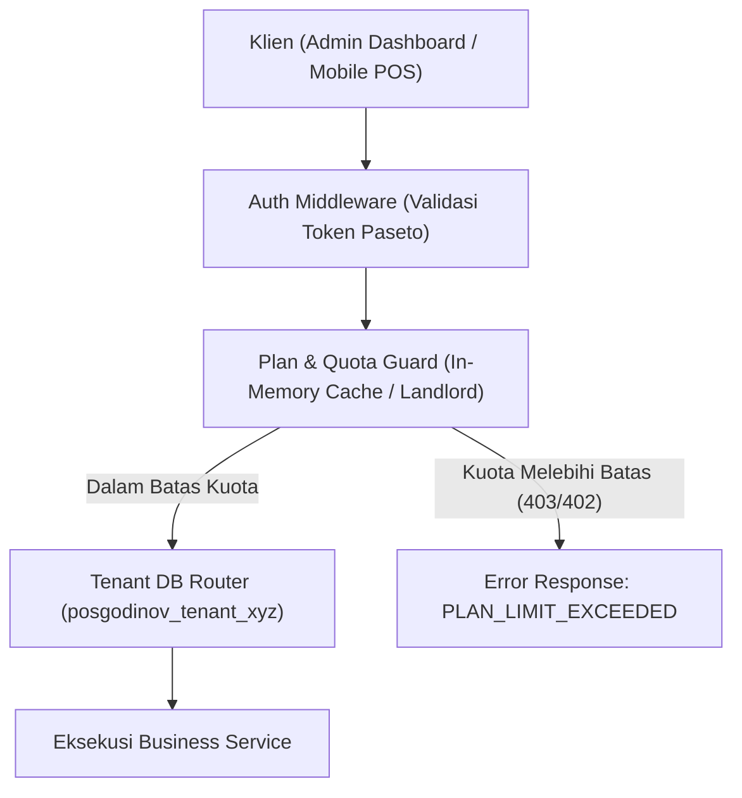

---

## 2. Struktur Paket & Fitur (Tiering Matrix)

Berikut adalah matriks pembagian fitur dan batasan kapasitas:

| Fitur / Parameter | **Free Tier (Starter)** | **Pro Tier (Growth)** | **Enterprise** |
| :--- | :--- | :--- | :--- |
| **Harga** | Rp 0 / selamanya | Rp 149.000 / bulan | Custom / Kontak Sales |
| **Maksimal Outlet** | **1 Outlet** | **5 Outlet** (bisa add-on) | **Unlimited** |
| **Maksimal Produk** | **50 Produk** | **Unlimited** | **Unlimited** |
| **Maksimal Raw Material** | **50 Bahan Baku** | **Unlimited** | **Unlimited** |
| **Maksimal Staf Kasir** | **2 Staf** / outlet | **10 Staf** / outlet | **Unlimited** |
| **Dual-Stock & Auto-Unpack** | Ya (Dasar) | Ya (Penuh) | Ya (Penuh) |
| **Stock Opname (SO)** | 1 sesi aktif, single-count | Multi-staf kolaboratif + Recount chain | Multi-staf + AI Fraud Detection |
| **Transfer Staf Antar Outlet** | ❌ Dinonaktifkan |  Aktif |  Aktif |
| **Kapasitas Upload Gambar** | Maks 50 gambar (WebP 1600px) | Maks 1.000 gambar | Unlimited + Custom Cloudinary |
| **Riwayat Transaksi & Laporan** | **30 Hari Terakhir** | **Unlimited (Selamanya)** | **Unlimited (Selamanya)** |
| **Ekspor Laporan (Excel/CSV/PDF)** | ❌ Dinonaktifkan |  Aktif |  Aktif |
| **Audit Logs & Security Events** | Terbatas (7 hari) | Penuh (1 tahun) | Real-time Stream / Webhook |
| **Iklan In-App Native (Popup & Carousel)** | ⚠️ **Aktif** (Popup & Slide Carousel) | ❌ **100% Bebas Iklan (Clean)** | ❌ **100% Bebas Iklan (Clean)** |
| **Dukungan Pelanggan** | Komunitas / Email | WhatsApp Priority | Dedicated Account Manager |

---

## 3. Arsitektur Autentikasi & Tata Kelola Identitas Multi-Tier

Sistem POS-GODINOV memiliki 3 tingkatan pengguna dengan batas wewenang yang terisolasi secara ketat (*principle of least privilege*). Token antar-lapisan **tidak dapat saling ditukarkan**:

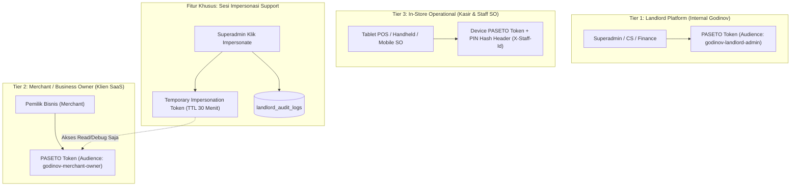

### 3.1 Spesifikasi Token PASETO & Klaim Per Lapisan

| Atribut / Klaim | **Tier 1: Landlord Admin** | **Tier 2: Business Owner** | **Tier 3: Device / Kasir** |
| :--- | :--- | :--- | :--- |
| **Lokasi Akun** | `posgodinov_landlord.landlord_users` | `posgodinov_landlord.businesses` | `posgodinov_tenant_<id>.users` |
| **Audience (`aud`)** | `godinov-landlord-admin` | `godinov-merchant-owner` | `godinov-device-pos` / `godinov-device-so` |
| **Masa Aktif Token** | 8 Jam (Kerja shift) | 24 Jam (Refresh token 7 hari) | 30 Hari (Perangkat terkunci) |
| **Klaim Token Payload** | `user_id`, `email`, `role` (`SUPERADMIN`, `SUPPORT`, `FINANCE`) | `business_id`, `email`, `serial_business`, `plan_code` | `business_id`, `outlet_id`, `device_id` |
| **Verifikasi Kasir** | — | — | 6-Digit PIN bcrypt + `X-Staff-Id` header |
| **Middleware Penjaga** | `LandlordAuthMiddleware` | `BusinessAuthMiddleware` | `DeviceAuthMiddleware` + `StaffContext` |

### 3.2 Protokol Impersonasi ("Login-as-Tenant") yang Aman & Ter-Audit

Bagi tim Customer Support dan Technical Support, kemampuan login ke dashboard merchant untuk investigasi bug adalah kebutuhan mutlak. Namun, hal ini tidak boleh mengorbankan keamanan data:
1. **Permintaan Impersonasi**:
   - Superadmin membuka detail tenant di `posgodinov-landlord` lalu mengklik tombol *"Masuk sebagai Pemilik Bisnis"*.
   - Backend memanggil `POST /v1/landlord/businesses/{id}/impersonate`.
2. **Penerbitan Token Sementara**:
   - Backend menerbitkan Token Paseto bertenggat singkat (maksimal 30 menit).
   - Menyertakan klaim khusus: `is_impersonated: true`, `impersonated_by: superadmin.ID`, `impersonated_by_name: superadmin.Name`.
3. **Audit Trail Wajib**:
   - Setiap kali token impersonasi dibuat, record permanen disimpan di `landlord_audit_logs` (`action = 'IMPERSONATE'`).
4. **Indikator Visual di Frontend Merchant (`posgodinov-fe`)**:
   - Jika dashboard mendeteksi `payload.is_impersonated == true`, antarmuka menampilkan **Sticky Warning Banner Kuning/Amber** di bagian paling atas:
     > ⚠️ **Sesi Impersonasi Aktif**: Anda sedang melihat akun ini sebagai Administrator Godinov (`support@godinov.id`). Seluruh aktivitas tercatat di audit log. [Akhiri Sesi Impersonasi]
   - Fitur-fitur kritis seperti penggantian email pemilik, ganti password akun, atau penghapusan bisnis otomatis dinonaktifkan (*read-only*) selama sesi impersonasi.

---

## 4. Desain Skema Basis Data Dinamis (Dynamic Plan & Feature Registry)

Agar sistem keanggotaan dan pembatasan fitur **100% dinamis melalui database & dashboard** (tanpa perlu deploy ulang atau restart server backend saat ada perubahan kuota, harga, atau fitur baru), skema Landlord dirancang menggunakan pola **Feature Flag & Quota Matrix Relasional**.

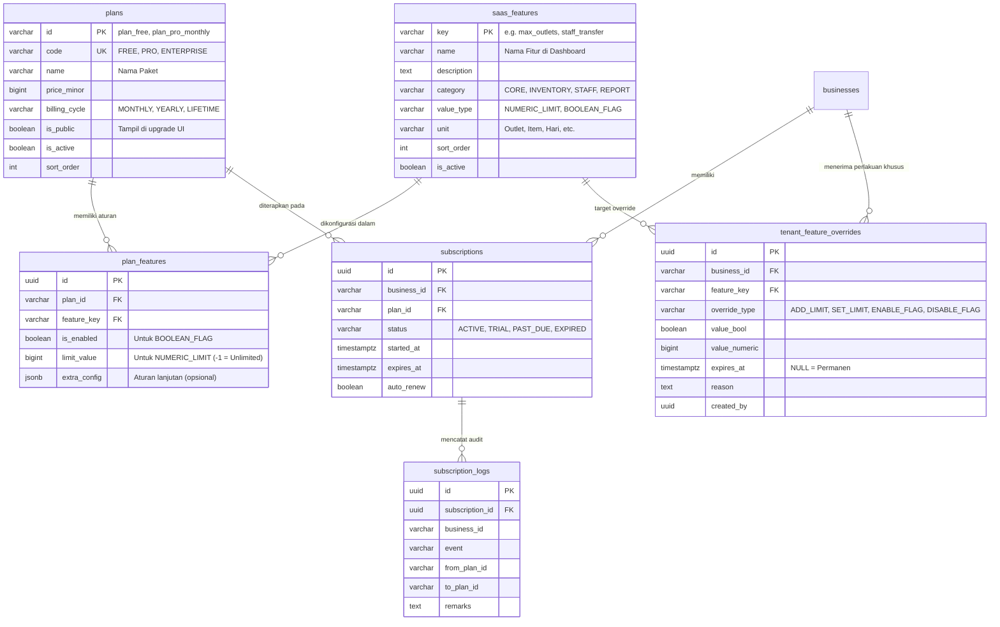

---

### 4.1 SQL Migration: `db/migrations/landlord/000002_create_saas_dynamic_plans.up.sql`

```sql
-- 1. Master Katalog Fitur Platform (Dynamic Feature Registry)
CREATE TABLE saas_features (
    key          VARCHAR(50) PRIMARY KEY, -- 'max_outlets', 'max_products', 'staff_transfer', dll.
    name         VARCHAR(100) NOT NULL,
    description  TEXT,
    category     VARCHAR(50) NOT NULL DEFAULT 'CORE', -- 'CORE', 'INVENTORY', 'STAFF', 'REPORTS', 'INTEGRATION'
    value_type   VARCHAR(20) NOT NULL,                -- 'NUMERIC_LIMIT' atau 'BOOLEAN_FLAG'
    unit         VARCHAR(30),                         -- 'Outlet', 'Produk', 'Staf', 'Hari', NULL
    sort_order   INT NOT NULL DEFAULT 0,
    is_active    BOOLEAN NOT NULL DEFAULT TRUE,
    created_at   TIMESTAMP WITH TIME ZONE DEFAULT CURRENT_TIMESTAMP
);

-- 2. Master Katalog Paket Langganan
CREATE TABLE plans (
    id            VARCHAR(32) PRIMARY KEY, -- 'plan_free', 'plan_pro_monthly', 'plan_enterprise'
    code          VARCHAR(50) NOT NULL UNIQUE, -- 'FREE', 'PRO', 'ENTERPRISE', 'PROMO_RAMADAN'
    name          VARCHAR(100) NOT NULL,
    description   TEXT,
    price_minor   BIGINT NOT NULL DEFAULT 0,
    billing_cycle VARCHAR(20) NOT NULL DEFAULT 'MONTHLY', -- 'MONTHLY', 'YEARLY', 'LIFETIME'
    is_public     BOOLEAN NOT NULL DEFAULT TRUE,          -- Apakah terlihat di katalog upgrade merchant
    is_active     BOOLEAN NOT NULL DEFAULT TRUE,
    sort_order    INT NOT NULL DEFAULT 0,
    created_at    TIMESTAMP WITH TIME ZONE DEFAULT CURRENT_TIMESTAMP,
    updated_at    TIMESTAMP WITH TIME ZONE DEFAULT CURRENT_TIMESTAMP
);

-- 3. Matriks Relasi Paket vs Fitur (Matrix Rules yang dikendalikan dari Dashboard)
CREATE TABLE plan_features (
    id           UUID PRIMARY KEY DEFAULT gen_random_uuid(),
    plan_id      VARCHAR(32) NOT NULL REFERENCES plans(id) ON DELETE CASCADE,
    feature_key  VARCHAR(50) NOT NULL REFERENCES saas_features(key) ON DELETE CASCADE,
    is_enabled   BOOLEAN NOT NULL DEFAULT FALSE,       -- Nilai aktif jika value_type = 'BOOLEAN_FLAG'
    limit_value  BIGINT NOT NULL DEFAULT 0,            -- Angka batas jika value_type = 'NUMERIC_LIMIT' (-1 = Unlimited)
    extra_config JSONB NOT NULL DEFAULT '{}'::jsonb,   -- Konfigurasi lanjutan jika dibutuhkan
    updated_at   TIMESTAMP WITH TIME ZONE DEFAULT CURRENT_TIMESTAMP,

    CONSTRAINT uq_plan_feature UNIQUE (plan_id, feature_key)
);

-- 4. Tabel Langganan Aktif Bisnis
CREATE TABLE subscriptions (
    id            UUID PRIMARY KEY DEFAULT gen_random_uuid(),
    business_id   VARCHAR(8) NOT NULL REFERENCES businesses(id) ON DELETE CASCADE,
    plan_id       VARCHAR(32) NOT NULL REFERENCES plans(id),
    status        VARCHAR(20) NOT NULL DEFAULT 'ACTIVE', -- 'TRIAL', 'ACTIVE', 'PAST_DUE', 'EXPIRED'
    started_at    TIMESTAMP WITH TIME ZONE NOT NULL DEFAULT CURRENT_TIMESTAMP,
    expires_at    TIMESTAMP WITH TIME ZONE,              -- NULL = Lifetime (Free Tier)
    auto_renew    BOOLEAN DEFAULT FALSE,
    created_at    TIMESTAMP WITH TIME ZONE DEFAULT CURRENT_TIMESTAMP,
    updated_at    TIMESTAMP WITH TIME ZONE DEFAULT CURRENT_TIMESTAMP,

    CONSTRAINT uq_business_subscription UNIQUE (business_id)
);

-- 5. Tabel Kustomisasi Khusus per Tenant (Add-ons & VIP Perks)
-- Memungkinkan Superadmin memberikan +2 Outlet atau mengaktifkan fitur khusus untuk satu tenant tanpa ganti plan
CREATE TABLE tenant_feature_overrides (
    id            UUID PRIMARY KEY DEFAULT gen_random_uuid(),
    business_id   VARCHAR(8) NOT NULL REFERENCES businesses(id) ON DELETE CASCADE,
    feature_key   VARCHAR(50) NOT NULL REFERENCES saas_features(key) ON DELETE CASCADE,
    override_type VARCHAR(20) NOT NULL, -- 'ADD_LIMIT', 'SET_LIMIT', 'ENABLE_FLAG', 'DISABLE_FLAG'
    value_bool    BOOLEAN,
    value_numeric BIGINT,
    expires_at    TIMESTAMP WITH TIME ZONE, -- NULL = Selamanya selama tenant aktif
    reason        TEXT,
    created_by    UUID,                     -- ID Superadmin Landlord
    created_at    TIMESTAMP WITH TIME ZONE DEFAULT CURRENT_TIMESTAMP
);

-- 6. Tabel Log Riwayat Mutasi Paket
CREATE TABLE subscription_logs (
    id              UUID PRIMARY KEY DEFAULT gen_random_uuid(),
    subscription_id UUID NOT NULL REFERENCES subscriptions(id) ON DELETE CASCADE,
    business_id     VARCHAR(8) NOT NULL,
    event           VARCHAR(50) NOT NULL, -- 'PROVISIONED', 'UPGRADED', 'DOWNGRADED', 'RENEWED', 'OVERRIDE_ADDED'
    from_plan_id    VARCHAR(32),
    to_plan_id      VARCHAR(32) NOT NULL,
    remarks         TEXT,
    created_at      TIMESTAMP WITH TIME ZONE DEFAULT CURRENT_TIMESTAMP
);

CREATE INDEX idx_subscriptions_business ON subscriptions(business_id);
-- 7. Master Kampanye Iklan In-App Native (Anti-AdBlock Native Promo Engine)
CREATE TABLE saas_campaigns (
    id                   UUID PRIMARY KEY DEFAULT gen_random_uuid(),
    title                VARCHAR(150) NOT NULL,
    subtitle             TEXT,
    format               VARCHAR(30) NOT NULL, -- 'POPUP_MODAL', 'CAROUSEL_SLIDE', 'HEADER_BANNER'
    placement            VARCHAR(50) NOT NULL DEFAULT 'DASHBOARD_HOME', -- 'DASHBOARD_HOME', 'REPORTS_PAGE', 'ON_LOGIN'
    image_url            TEXT NOT NULL,
    action_type          VARCHAR(30) NOT NULL DEFAULT 'INTERNAL_UPGRADE', -- 'INTERNAL_UPGRADE', 'EXTERNAL_URL', 'INFO_ONLY'
    action_url           TEXT,
    action_label         VARCHAR(50) NOT NULL DEFAULT 'Tingkatkan Sekarang',
    target_tier          VARCHAR(20) NOT NULL DEFAULT 'FREE_ONLY', -- 'FREE_ONLY', 'ALL'
    priority             INT NOT NULL DEFAULT 0,
    skip_delay_seconds   INT NOT NULL DEFAULT 5,
    starts_at            TIMESTAMP WITH TIME ZONE NOT NULL DEFAULT CURRENT_TIMESTAMP,
    ends_at              TIMESTAMP WITH TIME ZONE,
    is_active            BOOLEAN NOT NULL DEFAULT TRUE,
    impression_count     BIGINT DEFAULT 0,
    click_count          BIGINT DEFAULT 0,
    created_at           TIMESTAMP WITH TIME ZONE DEFAULT CURRENT_TIMESTAMP
);

-- 8. Master Tagihan / Faktur Langganan (Invoices & Payment Records)
CREATE TABLE subscription_invoices (
    id                 UUID PRIMARY KEY DEFAULT gen_random_uuid(),
    business_id        VARCHAR(8) NOT NULL REFERENCES businesses(id) ON DELETE CASCADE,
    subscription_id    UUID NOT NULL REFERENCES subscriptions(id) ON DELETE CASCADE,
    invoice_number     VARCHAR(50) NOT NULL UNIQUE, -- 'INV-202610-00045'
    plan_id            VARCHAR(32) NOT NULL REFERENCES plans(id),
    billing_cycle      VARCHAR(20) NOT NULL DEFAULT 'MONTHLY', -- 'MONTHLY', 'YEARLY'
    amount_minor       BIGINT NOT NULL,                        -- Harga dasar
    tax_minor          BIGINT NOT NULL DEFAULT 0,              -- PPN 11%
    total_minor        BIGINT NOT NULL,                        -- Total tagihan
    status             VARCHAR(20) NOT NULL DEFAULT 'PENDING', -- 'PENDING', 'PAID', 'EXPIRED', 'FAILED', 'REFUNDED'
    payment_gateway    VARCHAR(30) NOT NULL,                   -- 'MIDTRANS', 'XENDIT', 'MANUAL_TRANSFER'
    gateway_reference  VARCHAR(100),                           -- ID order / transaksi dari PG
    payment_method     VARCHAR(50),                            -- 'QRIS', 'BCA_VA', 'MANDIRI_VA', 'CREDIT_CARD', 'MANUAL'
    payment_url        TEXT,                                   -- URL Snap / Invoice PG
    va_number          VARCHAR(50),
    qr_payload         TEXT,
    paid_at            TIMESTAMP WITH TIME ZONE,
    expired_at         TIMESTAMP WITH TIME ZONE NOT NULL,
    created_at         TIMESTAMP WITH TIME ZONE DEFAULT CURRENT_TIMESTAMP
);

-- 9. Master Kanal Pembayaran Terkelola Platform (Managed Payment Channels)
CREATE TABLE managed_payment_channels (
    code          VARCHAR(30) PRIMARY KEY, -- 'QRIS', 'BCA_VA', 'MANDIRI_VA', 'BRI_VA', 'BNI_VA'
    name          VARCHAR(100) NOT NULL,
    category      VARCHAR(20) NOT NULL,    -- 'QRIS', 'VIRTUAL_ACCOUNT', 'E_WALLET', 'CREDIT_CARD'
    provider      VARCHAR(50) NOT NULL,    -- 'INTERNAL_RAILS', 'MIDTRANS', 'XENDIT', 'DIRECT_BANK'
    fee_type      VARCHAR(20) NOT NULL DEFAULT 'PERCENTAGE', -- 'PERCENTAGE', 'FIXED'
    fee_value     NUMERIC(10,4) NOT NULL DEFAULT 0.0070,     -- misal 0.7% untuk QRIS
    min_amount    BIGINT NOT NULL DEFAULT 1000,
    max_amount    BIGINT NOT NULL DEFAULT 10000000,
    is_active     BOOLEAN NOT NULL DEFAULT TRUE,
    created_at    TIMESTAMP WITH TIME ZONE DEFAULT CURRENT_TIMESTAMP
);

-- 10. Dompet Merchant untuk Penampungan Hasil Transaksi Kasir Nontunai
CREATE TABLE merchant_wallets (
    id                 UUID PRIMARY KEY DEFAULT gen_random_uuid(),
    business_id        VARCHAR(8) NOT NULL REFERENCES businesses(id) ON DELETE CASCADE,
    balance_minor      BIGINT NOT NULL DEFAULT 0,      -- Saldo tersedia untuk dicairkan
    held_balance_minor BIGINT NOT NULL DEFAULT 0,     -- Saldo tertahan / proses settlement
    payout_bank_code   VARCHAR(20),                   -- 'BCA', 'MANDIRI', 'BRI', 'BNI'
    payout_account_no  VARCHAR(50),
    payout_account_name VARCHAR(100),
    is_frozen          BOOLEAN NOT NULL DEFAULT FALSE,
    updated_at         TIMESTAMP WITH TIME ZONE DEFAULT CURRENT_TIMESTAMP,

    CONSTRAINT uq_business_wallet UNIQUE (business_id)
);

-- 11. Buku Besar Mutasi Saldo Dompet Merchant (Wallet Ledger)
CREATE TABLE merchant_wallet_ledger (
    id               UUID PRIMARY KEY DEFAULT gen_random_uuid(),
    wallet_id        UUID NOT NULL REFERENCES merchant_wallets(id) ON DELETE CASCADE,
    business_id      VARCHAR(8) NOT NULL,
    entry_type       VARCHAR(20) NOT NULL, -- 'CREDIT_SALE', 'DEBIT_PAYOUT', 'DEBIT_FEE', 'DEBIT_SUBSCRIPTION'
    amount_minor     BIGINT NOT NULL,
    fee_minor        BIGINT NOT NULL DEFAULT 0,
    balance_before   BIGINT NOT NULL,
    balance_after    BIGINT NOT NULL,
    reference_type   VARCHAR(30) NOT NULL, -- 'POS_ORDER', 'PAYOUT_REQUEST', 'SAAS_INVOICE'
    reference_id     VARCHAR(100) NOT NULL,
    description      TEXT,
    created_at       TIMESTAMP WITH TIME ZONE DEFAULT CURRENT_TIMESTAMP
);

-- 12. Permintaan Pencairan Dana / Penarikan Merchant (Payout / Disbursement)
CREATE TABLE merchant_payout_requests (
    id               UUID PRIMARY KEY DEFAULT gen_random_uuid(),
    business_id      VARCHAR(8) NOT NULL REFERENCES businesses(id) ON DELETE CASCADE,
    payout_number    VARCHAR(50) NOT NULL UNIQUE, -- 'PO-202610-0012'
    amount_minor     BIGINT NOT NULL,
    disbursement_fee BIGINT NOT NULL DEFAULT 0,  -- Biaya transfer antar-bank
    net_amount_minor BIGINT NOT NULL,
    bank_code        VARCHAR(20) NOT NULL,
    account_number   VARCHAR(50) NOT NULL,
    account_name     VARCHAR(100) NOT NULL,
    status           VARCHAR(20) NOT NULL DEFAULT 'PENDING', -- 'PENDING', 'PROCESSING', 'COMPLETED', 'REJECTED'
    disbursement_ref VARCHAR(100),                            -- ID transfer dari payment rail / bank
    rejected_reason  TEXT,
    requested_at     TIMESTAMP WITH TIME ZONE DEFAULT CURRENT_TIMESTAMP,
    processed_at     TIMESTAMP WITH TIME ZONE,
    processed_by     UUID REFERENCES landlord_users(id)
);

CREATE INDEX idx_tenant_overrides_business ON tenant_feature_overrides(business_id);
CREATE INDEX idx_plan_features_lookup ON plan_features(plan_id, feature_key);
CREATE INDEX idx_saas_campaigns_active ON saas_campaigns(is_active, target_tier, placement);
CREATE INDEX idx_subscription_invoices_business ON subscription_invoices(business_id);
CREATE INDEX idx_subscription_invoices_status ON subscription_invoices(status);
CREATE INDEX idx_merchant_wallets_business ON merchant_wallets(business_id);
CREATE INDEX idx_merchant_wallet_ledger_wallet ON merchant_wallet_ledger(wallet_id);
CREATE INDEX idx_merchant_payout_requests_business ON merchant_payout_requests(business_id);
CREATE INDEX idx_merchant_payout_requests_status ON merchant_payout_requests(status);
```

---

### 4.2 Data Awal (Seed Master Fitur & Paket Default)

```sql
-- Seed Master Fitur Platform
INSERT INTO saas_features (key, name, description, category, value_type, unit, sort_order) VALUES
('max_outlets', 'Maksimal Outlet', 'Jumlah maksimal cabang toko yang dapat didaftarkan', 'CORE', 'NUMERIC_LIMIT', 'Outlet', 1),
('max_products', 'Maksimal Produk', 'Batas maksimal katalog produk yang tersimpan', 'CORE', 'NUMERIC_LIMIT', 'Produk', 2),
('max_raw_materials', 'Maksimal Bahan Baku', 'Batas maksimal bahan baku inventori', 'INVENTORY', 'NUMERIC_LIMIT', 'Bahan', 3),
('max_staff_per_outlet', 'Maksimal Staf Kasir', 'Batas pengguna staf/kasir per outlet', 'STAFF', 'NUMERIC_LIMIT', 'Staf', 4),
('history_days_limit', 'Batas Riwayat Laporan', 'Rentang hari data transaksi dan log audit yang bisa diakses (-1 = unlimited)', 'REPORTS', 'NUMERIC_LIMIT', 'Hari', 5),
('cloud_storage_mb', 'Kapasitas Penyimpanan Gambar', 'Total kuota gambar WebP Cloudinary (-1 = unlimited)', 'CORE', 'NUMERIC_LIMIT', 'MB', 6),
('staff_transfer', 'Transfer Staf Antar Outlet', 'Izin mutasi staf kasir antar cabang', 'STAFF', 'BOOLEAN_FLAG', NULL, 7),
('export_reports', 'Ekspor Laporan Excel/CSV/PDF', 'Unduh berkas laporan keuangan dan audit', 'REPORTS', 'BOOLEAN_FLAG', NULL, 8),
('stock_opname_collaborative', 'Stock Opname Kolaboratif', 'Hitung stok fisik multi-staf serentak via mobile SO', 'INVENTORY', 'BOOLEAN_FLAG', NULL, 9),
('dual_stock_auto_unpack', 'Dual-Stock & Auto-Unpack', 'Pencatatan dus & eceran serta auto-unpack saat stok minus', 'INVENTORY', 'BOOLEAN_FLAG', NULL, 10),
('custom_branding', 'Kustomisasi Logo Struk & Nota', 'Kustomisasi logo outlet pada struk belanja', 'CORE', 'BOOLEAN_FLAG', NULL, 11),
('api_webhook_access', 'Akses REST API & Webhooks', 'Integrasi API langsung dengan sistem pihak ketiga', 'INTEGRATION', 'BOOLEAN_FLAG', NULL, 12),
('no_ads', 'Bebas Iklan (Ad-Free Experience)', 'Bebas dari iklan pop-up interstitial dan slide carousel promo', 'CORE', 'BOOLEAN_FLAG', NULL, 13);

-- Seed Paket Default
INSERT INTO plans (id, code, name, description, price_minor, billing_cycle, is_public, sort_order) VALUES
('plan_free', 'FREE', 'Free Tier (Starter)', 'Paket gratis permanen untuk UMKM rintisan 1 outlet', 0, 'LIFETIME', TRUE, 1),
('plan_pro_monthly', 'PRO', 'Pro Growth Monthly', 'Solusi lengkap bisnis berkembang multi-outlet & multi-staf', 14900000, 'MONTHLY', TRUE, 2),
('plan_enterprise', 'ENTERPRISE', 'Enterprise Unlimited', 'Solusi kustom untuk jaringan franchise dan chain store', 0, 'MONTHLY', FALSE, 3);

-- Hubungkan Aturan Fitur ke Paket FREE
INSERT INTO plan_features (plan_id, feature_key, is_enabled, limit_value) VALUES
('plan_free', 'max_outlets', FALSE, 1),
('plan_free', 'max_products', FALSE, 50),
('plan_free', 'max_raw_materials', FALSE, 50),
('plan_free', 'max_staff_per_outlet', FALSE, 2),
('plan_free', 'history_days_limit', FALSE, 30),
('plan_free', 'cloud_storage_mb', FALSE, 100),
('plan_free', 'staff_transfer', FALSE, 0),
('plan_free', 'export_reports', FALSE, 0),
('plan_free', 'stock_opname_collaborative', FALSE, 0),
('plan_free', 'dual_stock_auto_unpack', TRUE, 0),
('plan_free', 'custom_branding', FALSE, 0),
('plan_free', 'api_webhook_access', FALSE, 0),
('plan_free', 'no_ads', FALSE, 0); -- Iklan Aktif di Free Tier

-- Hubungkan Aturan Fitur ke Paket PRO
INSERT INTO plan_features (plan_id, feature_key, is_enabled, limit_value) VALUES
('plan_pro_monthly', 'max_outlets', FALSE, 5),
('plan_pro_monthly', 'max_products', FALSE, -1),       -- Unlimited
('plan_pro_monthly', 'max_raw_materials', FALSE, -1),  -- Unlimited
('plan_pro_monthly', 'max_staff_per_outlet', FALSE, 10),
('plan_pro_monthly', 'history_days_limit', FALSE, -1), -- Unlimited
('plan_pro_monthly', 'cloud_storage_mb', FALSE, 5000),  -- 5 GB
('plan_pro_monthly', 'staff_transfer', TRUE, 0),
('plan_pro_monthly', 'export_reports', TRUE, 0),
('plan_pro_monthly', 'stock_opname_collaborative', TRUE, 0),
('plan_pro_monthly', 'dual_stock_auto_unpack', TRUE, 0),
('plan_pro_monthly', 'custom_branding', TRUE, 0),
('plan_pro_monthly', 'api_webhook_access', FALSE, 0),
('plan_pro_monthly', 'no_ads', TRUE, 0); -- 100% Bebas Iklan
```

---

## 5. Arsitektur Integrasi Payment Hub Eksternal & Abstraksi Klien

Sesuai visi jangka panjang arsitektur Godinov, platform menerapkan pemisahan layanan finansial secara independen:
- **Prinsip Pendaftaran Tunggal (*Single Gateway Registration*)**: Entitas perusahaan Godinov **hanya mendaftar satu kali** ke payment gateway upstream (Midtrans, Xendit, Direct Bank API, atau Switcher QRIS Nasional BI).
- **Layanan Berdiri Sendiri (*Standalone Project / Repo `godinov-payment-hub`*)**: Payment Hub dibangun sebagai **repositori / microservice terpisah** di luar repositori `POS-GODINOV`. Layanan ini dirancang multi-SaaS untuk melayani seluruh ekosistem produk Godinov masa depan (POS, HRMS, ERP, Accounting, dll.).
- **Peran Repositori `POS-GODINOV` (Konsumen API Murni)**: Di dalam repositori POS-GODINOV ini, kita **tidak menanam SDK payment gateway vendor manapun secara langsung**. Sebaliknya, repositori ini **hanya menyiapkan fitur, kontrak abstraksi antarmuka (`PaymentHubClient`), serta adapter klien** yang modular dan dapat disesuaikan dengan mudah ketika Payment Hub nanti diimplementasikan.

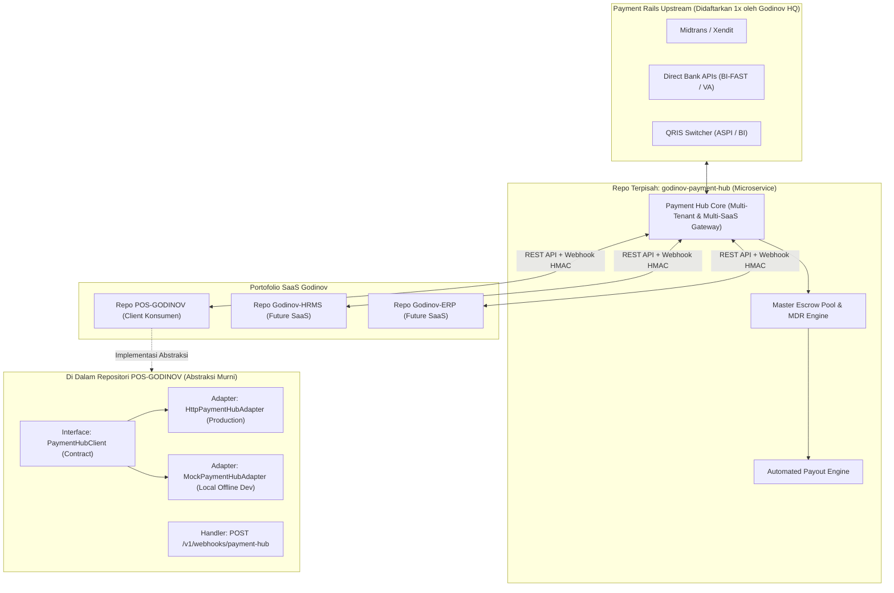

---

### 5.1 Dual-Domain Finansial pada POS-GODINOV

Meskipun logika switching gateway berada di Payment Hub eksternal, repositori POS-GODINOV mengelola dua domain use-case melalui abstraksi klien:

1. **Domain 1: Tagihan Langganan SaaS (Business $\rightarrow$ Landlord)**
   - Pembayaran tagihan paket Pro bulanan/tahunan atau add-on cabang oleh pemilik bisnis.
   - POS-GODINOV memanggil Payment Hub untuk menerbitkan invoice / QRIS / VA.
   - Begitu pelanggan melunasi tagihan, Payment Hub mengirimkan webhook ke POS-GODINOV untuk mengaktifkan paket Pro secara instan.

2. **Domain 2: Pembayaran Kasir Nontunai Toko (Customer $\rightarrow$ Business)**
   - Kasir POS toko menerbitkan **QRIS Dinamis** atau **Virtual Account** untuk pembeli tanpa merchant harus daftar PG sendiri (*Zero Setup Effort*).
   - Payment Hub menampung dana di rekening penampung (*Escrow Pool*), memotong biaya MDR platform secara transparan, lalu mencatat saldo bersih ke dompet merchant.
   - POS-GODINOV menerima webhook konfirmasi pembayaran lunas dari Payment Hub dan mencetak struk kasir seketika.
   - Pemilik bisnis dapat mengajukan penarikan dana (*disbursement/payout*) ke rekening bank pribadi mereka.

---

### 5.2 Abstraksi Klien di Backend Go (`PaymentHubClient`)

Agar POS-GODINOV dapat dikembangkan, diuji, dan dijalankan secara penuh tanpa harus menunggu proyek `godinov-payment-hub` selesai dibangun, backend menggunakan abstraksi murni:

1. **`MockPaymentHubAdapter`**: Adapter lokal di memori yang langsung mensimulasikan pembayaran sukses (sangat ideal untuk development offline dan automated testing).
2. **`HttpPaymentHubAdapter`**: Adapter HTTP REST yang memanggil microservice Payment Hub sesungguhnya menggunakan kredensial:
   - `PAYMENT_HUB_BASE_URL`: URL microservice (misal: `https://payment.godinov.id`)
   - `PAYMENT_HUB_APP_ID`: Identifier aplikasi (`pos_godinov`)
   - `PAYMENT_HUB_API_KEY`: Kunci otentikasi API
   - `PAYMENT_HUB_WEBHOOK_SECRET`: Kunci verifikasi signature HMAC untuk webhook masuk.

```go
package domain

import (
	"context"
	"net/http"
	"time"
)

// PaymentHubClient adalah kontrak antarmuka klien yang memanggil microservice standalone godinov-payment-hub.
// Repositori POS-GODINOV tidak mengetahui vendor gateway di baliknya, hanya memanggil metode di bawah ini.
type PaymentHubClient interface {
	// 1. Kasir Nontunai Toko (Customer -> Business)
	GenerateDynamicQRIS(ctx context.Context, req *QRISRequest) (*QRISResponse, error)
	CreateVirtualAccount(ctx context.Context, req *VARequest) (*VAResponse, error)
	CheckPaymentStatus(ctx context.Context, referenceID string) (*PaymentStatusResult, error)
	CancelPayment(ctx context.Context, referenceID string) error

	// 2. Tagihan Langganan SaaS (Business -> Landlord)
	CreateSubscriptionInvoice(ctx context.Context, inv *SubscriptionInvoice) (*CheckoutResponse, error)

	// 3. Pencairan Saldo Dompet Merchant (Escrow -> Rekening Bank Pemilik Toko)
	CreateDisbursement(ctx context.Context, req *DisbursementRequest) (*DisbursementResponse, error)
	CheckDisbursementStatus(ctx context.Context, disbursementID string) (*DisbursementResult, error)

	// 4. Keamanan Webhook Masuk dari godinov-payment-hub
	VerifyWebhookSignature(r *http.Request) (*PaymentHubWebhookPayload, error)
}
```

#### DTO & Struktur Data Terkait:

```go
type QRISRequest struct {
	TransactionID string            `json:"transaction_id"`
	BusinessID    string            `json:"business_id"`
	OutletID      string            `json:"outlet_id"`
	AmountMinor   int64             `json:"amount_minor"`
	ExpiryMinutes int               `json:"expiry_minutes"` // Default: 15 Menit
	Metadata      map[string]string `json:"metadata"`
}

type QRISResponse struct {
	TransactionID string    `json:"transaction_id"`
	QRPayload     string    `json:"qr_payload"`     // String EMVCo QRIS (00020101021226...)
	QRImageURL    string    `json:"qr_image_url"`    // URL Gambar PNG QR untuk dicetak / ditampilkan di layar
	ExpiredAt     time.Time `json:"expired_at"`
}

type VARequest struct {
	TransactionID string            `json:"transaction_id"`
	BusinessID    string            `json:"business_id"`
	BankCode      string            `json:"bank_code"` // 'BCA', 'MANDIRI', 'BRI', 'BNI', 'PERMATA'
	CustomerName  string            `json:"customer_name"`
	AmountMinor   int64             `json:"amount_minor"`
	ExpiryMinutes int               `json:"expiry_minutes"`
	Metadata      map[string]string `json:"metadata"`
}

type VAResponse struct {
	TransactionID string    `json:"transaction_id"`
	BankCode      string    `json:"bank_code"`
	VANumber      string    `json:"va_number"`
	ExpiredAt     time.Time `json:"expired_at"`
}

type DisbursementRequest struct {
	PayoutNumber    string `json:"payout_number"`
	BusinessID      string `json:"business_id"`
	BankCode        string `json:"bank_code"`
	AccountNumber   string `json:"account_number"`
	AccountName     string `json:"account_name"`
	AmountMinor     int64  `json:"amount_minor"`
	DisbursementFee int64  `json:"disbursement_fee"`
	Remarks         string `json:"remarks"`
}

type DisbursementResponse struct {
	PayoutNumber    string    `json:"payout_number"`
	DisbursementRef string    `json:"disbursement_ref"`
	Status          string    `json:"status"` // 'PROCESSING', 'COMPLETED', 'FAILED'
	EstimatedTime   time.Time `json:"estimated_time"`
}

type SubscriptionInvoice struct {
	ID               string        `json:"id" gorm:"primaryKey"`
	BusinessID       string        `json:"business_id"`
	SubscriptionID   string        `json:"subscription_id"`
	InvoiceNumber    string        `json:"invoice_number"`
	PlanID           string        `json:"plan_id"`
	BillingCycle     string        `json:"billing_cycle"` // 'MONTHLY', 'YEARLY'
	AmountMinor      int64         `json:"amount_minor"`
	TaxMinor         int64         `json:"tax_minor"`
	TotalMinor       int64         `json:"total_minor"`
	Status           PaymentStatus `json:"status"`
	PaymentGateway   string        `json:"payment_gateway"`
	GatewayReference string        `json:"gateway_reference"`
	PaymentMethod    string        `json:"payment_method"`
	PaymentURL       string        `json:"payment_url"`
	VANumber         string        `json:"va_number"`
	QRPayload        string        `json:"qr_payload"`
	PaidAt           *time.Time    `json:"paid_at"`
	ExpiredAt        time.Time     `json:"expired_at"`
	CreatedAt        time.Time     `json:"created_at"`
}
```

---

### 5.3 Alur Transaksi Kasir Nontunai (Customer $\rightarrow$ POS Kasir $\rightarrow$ Merchant Wallet)

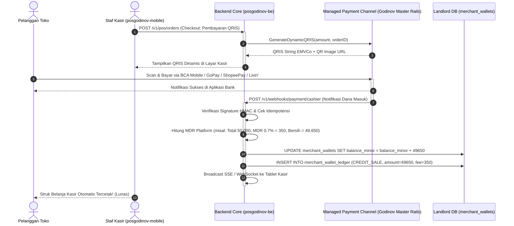

---

### 5.4 Alur Pembayaran Langganan SaaS (Business ke Landlord)

Untuk pembayaran paket Pro, pemilik bisnis dapat membayar menggunakan kanal transfer eksternal ataupun **memotong langsung saldo hasil penjualan toko** yang telah terkumpul di dompet merchant (*Zero Friction Upgrade*):

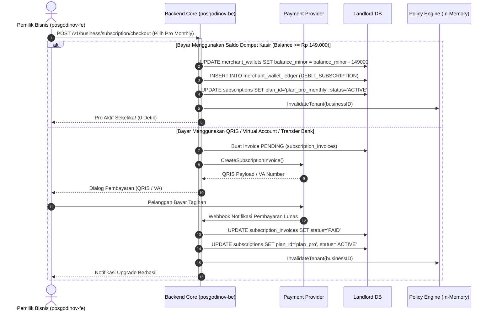

---

### 5.5 Keamanan Webhook & Perlindungan Idempotensi

Webhook dari microservice `godinov-payment-hub` ke backend POS-GODINOV (`POST /v1/webhooks/payment-hub`) diamankan menggunakan header `X-Godinov-Signature`:
1. **Verifikasi Tanda Tangan Kriptografi (HMAC-SHA256)**:
   - Setiap payload request diverifikasi menggunakan Webhook Secret bersama:
     $$\text{Signature} = \text{HMAC-SHA256}(\text{request\_body\_bytes}, \text{PAYMENT\_HUB\_WEBHOOK\_SECRET})$$
   - Request dengan signature tidak cocok langsung ditolak dengan status HTTP 401 Unauthorized tanpa menyentuh database.
2. **Kunci Idempotensi (Zero Double-Crediting)**:
   - Database POS-GODINOV menerapkan transaksi atomik (`txManager.WithTransaction`).
   - Jika webhook event (misal `event = "payment.settled"`) tiba dua kali untuk ID transaksi yang sama, backend memeriksa `invoice.Status == PaymentStatusPaid` atau keberadaan `reference_id` di ledger. Jika sudah pernah diproses, sistem segera mengembalikan HTTP 200 tanpa mengkreditkan saldo ganda atau memperpanjang masa aktif berulang.

---

### 5.6 Siklus Jatuh Tempo & Dunning Management (Grace Period 7 Hari)

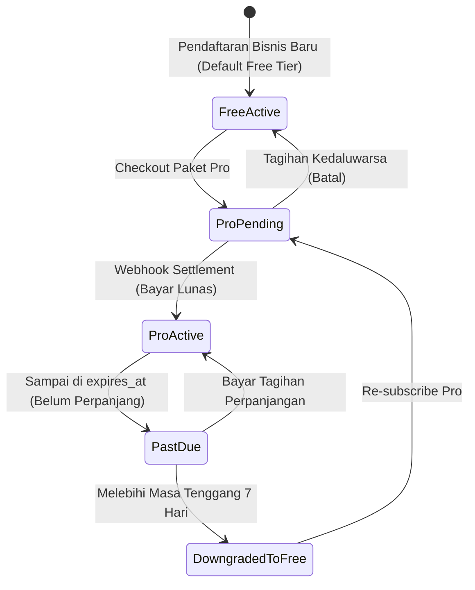

1. **Pra-Jatuh Tempo (H-7 & H-3)**:
   - Sistem background cron mengirimkan email pengingat dan invoice perpanjangan otomatis ke pemilik bisnis.
2. **Masa Tenggang (*Grace Period* 7 Hari)**:
   - Jika saat `expires_at` tercapai belum ada pembayaran, status langganan diubah menjadi `PAST_DUE`.
   - **Bisnis tidak langsung dimatikan**: Transaksi kasir dan operasional outlet tetap berjalan normal agar operasional merchant tidak terganggu, namun dashboard admin menampilkan banner peringatan merah jatuh tempo.
3. **Penurunan Otomatis (*Downgrade*) ke Free Tier**:
   - Jika setelah 7 hari masa tenggang tagihan tetap belum dibayar:
     - Status langganan otomatis diubah menjadi `EXPIRED` dan paket dikembalikan ke `plan_free`.
     - **Data Aman (Tidak Ada Data yang Dihapus)**: Data outlet ke-2, produk ke-51 ke atas, dan akun staf tetap aman di database, namun masuk mode **beku (*read-only*)** hingga paket Pro diaktifkan kembali.

---

### 5.7 Kebijakan Batas Kuota Berlebih Saat Downgrade (Over-Quota & Downgrade Handling Policy)

Salah satu skenario paling kritis dalam SaaS adalah perlindungan data dan integritas operasional ketika merchant Pro yang memiliki 3 outlet, 200 produk, dan 6 staf diturunkan ke Free Tier (kuota: 1 outlet, 50 produk, 2 staf):

1. **Outlet Berlebih (Maksimal 1 di Free Tier)**:
   - **Outlet Utama (*Primary* / Outlet Pertama)**: Tetap aktif 100% dan melayani transaksi kasir seperti biasa tanpa gangguan.
   - **Outlet Tambahan (Outlet ke-2 dst.)**:
     - Masuk ke status **"Dibekukan / Read-Only"** (`is_locked_by_plan = true`).
     - Kasir di outlet tambahan tidak dapat membuka shift kasir baru (`shiftService.OpenShift()` mengembalikan `403 FORBIDDEN: OUTLET_LOCKED_BY_PLAN`).
     - Pesan ramah kasir: *"Cabang ini sementara dinonaktifkan karena paket telah beralih ke Free Tier (Maksimal 1 Cabang). Hubungi pemilik bisnis untuk mengaktifkan kembali paket Pro."*
     - Data transaksi masa lalu, inventori bahan baku, dan riwayat shift di outlet ini **TIDAK DIHAPUS**, tersimpan aman di database tenant sampai Pro diaktifkan kembali.
2. **Katalog Produk & Bahan Baku Berlebih (Maksimal 50 di Free Tier)**:
   - **Prinsip Nol Disrupsi Penjualan Kasir**: 200 produk yang sudah terlanjur ada di database tetap aktif di katalog POS dan dapat ditransaksikan di kasir (tidak membatalkan transaksi yang sedang berjalan di toko).
   - **Pemblokiran Penambahan (*Creation Lock*)**: Pemilik bisnis dilarang membuat produk baru (`POST /v1/products` ditolak oleh `policyEngine.AssertQuota`) sampai jumlah produk aktif dikurangi menjadi di bawah 50, ATAU meng-upgrade kembali ke Pro.
3. **Akun Staf Kasir Berlebih (Maksimal 2 di Free Tier)**:
   - Staf yang sudah terdaftar tetap dapat login menggunakan PIN masing-masing di outlet aktif.
   - Pendaftaran staf baru diblokir sampai jumlah staf $\le 2$.
4. **Fitur Pro Eksklusif yang Dinonaktifkan Seketika**:
   - **Stock Opname Kolaboratif**: Input dari staf ke-2 ditolak (`ErrSOCollaborativeDisabled`). Sesi SO hanya dapat dihitung oleh 1 staf kasir.
   - **Ekspor Laporan Excel/CSV/PDF**: Tombol ekspor menampilkan prompt modal upgrade ke Pro.
   - **Iklan In-App Native (Carousel & Pop-up)**: Kembali aktif muncul di dashboard merchant Free Tier.

---

### 5.8 Keandalan Webhook & Rekonsiliasi Otomatis Gateway

1. **Ketahanan Jaringan (*Automatic Retry & Idempotency*)**:
   - Endpoint webhook Midtrans/Xendit/Kanal Internal (`POST /v1/webhooks/payment/*`) merespons HTTP 200 dalam waktu $< 200\text{ ms}$.
   - Pemrosesan pembaruan status invoice dan subscription dieksekusi dalam transaksi atomik dengan penanganan idempotensi ketat berbasis `invoice.status == 'PAID'`.
   - Jika terjadi kendala jaringan sementara, payment gateway secara otomatis melakukan percobaan pengiriman ulang (*retry*) hingga 5 kali dengan skema *exponential backoff*.
2. **Sinkronisasi Manual & Rekonsiliasi Landlord (*Gateway Sync Button*)**:
   - Di dashboard Superadmin (`posgodinov-landlord`) dan halaman Billing Merchant (`posgodinov-fe`), disediakan tombol *"Periksa Status Pembayaran"*.
   - Tombol ini langsung memanggil API gateway (`GET /v2/{order_id}/status`) untuk mencocokkan status secara seketika jika webhook sempat terhalang firewall atau downtime jaringan internet.

---

### 5.9 Manajemen Pembayaran & Approval Manual di Landlord Dashboard

Bagi transaksi manual B2B atau pencairan saldo (*payout*), tim Finance Godinov memiliki kontrol penuh di `posgodinov-landlord`:
- **Menu Billing & Invoices**:
  - Melihat riwayat tagihan seluruh tenant beserta status (`PENDING`, `PAID`, `EXPIRED`).
  - Tombol *"Setujui Pembayaran Manual"*: Memungkinkan admin mencocokkan mutasi bank, mengunggah bukti bayar, dan mengaktifkan Pro secara manual.
- **Menu Merchant Payouts & Escrow Operations**:
  - Melihat permohonan penarikan dana dari para pemilik bisnis (`merchant_payout_requests`).
  - Verifikasi otomatis / manual transfer dana ke rekening pemilik toko.
  - Membekukan dompet merchant jika terdeteksi aktivitas transaksi mencurigakan (*fraud / anti-money laundering guard*).

---

## 6. Engine Kebijakan Dinamis (High-Performance Dynamic Policy Engine)

Karena batasan fitur diatur secara dinamis oleh database, backend **tidak boleh** melakukan query join kompleks ke Landlord DB di setiap HTTP request tenant.

POS-GODINOV menerapkan **High-Performance In-Memory Policy Engine** dengan invalidasi real-time:
1. **Resolved Policy**: Struktur data ringkas di memori yang menghitung nilai akhir batasan (*Effective Limit*) dan status fitur (*Effective Flag*) per bisnis.
2. **Kalkulasi Nilai Efektif**:
   $$\text{Effective Limit} = \text{Plan Limit} + \sum \text{ADD\_LIMIT Overrides}$$
   $$\text{Effective Flag} = (\text{Plan Flag} \lor \text{Has Active ENABLE\_FLAG}) \land \neg(\text{Has Active DISABLE\_FLAG})$$
3. **Invalidasi Event-Driven**: Saat Superadmin mengubah paket atau kuota tenant di Dashboard Landlord, engine langsung mengosongkan cache tenant terkait (`policyEngine.Invalidate(businessID)`), sehingga perubahan aktif secara instan dalam hitungan milidetik.

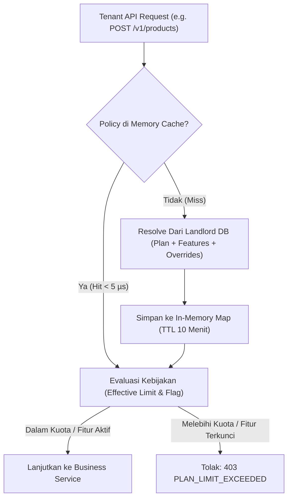

---

### 6.1 Definisi Domain & Kebijakan (`internal/domain/subscription.go`)

```go
package domain

import (
	"context"
	"time"
)

type FeatureValueType string

const (
	ValueTypeNumericLimit FeatureValueType = "NUMERIC_LIMIT"
	ValueTypeBooleanFlag  FeatureValueType = "BOOLEAN_FLAG"
)

// SaaSFeature merepresentasikan master fitur dari tabel saas_features
type SaaSFeature struct {
	Key         string           `json:"key" gorm:"primaryKey"`
	Name        string           `json:"name"`
	Description string           `json:"description"`
	Category    string           `json:"category"`
	ValueType   FeatureValueType `json:"value_type"`
	Unit        string           `json:"unit"`
	SortOrder   int              `json:"sort_order"`
	IsActive    bool             `json:"is_active"`
}

// Plan merepresentasikan paket langganan dinamis
type Plan struct {
	ID           string        `json:"id" gorm:"primaryKey"`
	Code         string        `json:"code"`
	Name         string        `json:"name"`
	Description  string        `json:"description"`
	PriceMinor   int64         `json:"price_minor"`
	BillingCycle string        `json:"billing_cycle"`
	IsPublic     bool          `json:"is_public"`
	IsActive     bool          `json:"is_active"`
	SortOrder    int           `json:"sort_order"`
	Features     []PlanFeature `json:"features,omitempty" gorm:"foreignKey:PlanID"`
}

// PlanFeature merepresentasikan nilai aturan fitur pada suatu paket
type PlanFeature struct {
	ID          string  `json:"id" gorm:"primaryKey"`
	PlanID      string  `json:"plan_id"`
	FeatureKey  string  `json:"feature_key"`
	IsEnabled   bool    `json:"is_enabled"`
	LimitValue  int64   `json:"limit_value"` // -1 = Unlimited
	ExtraConfig JSONMap `json:"extra_config" gorm:"type:jsonb"`

	Feature *SaaSFeature `json:"feature,omitempty" gorm:"foreignKey:FeatureKey"`
}

// TenantFeatureOverride merepresentasikan add-on / kustomisasi per bisnis
type TenantFeatureOverride struct {
	ID           string     `json:"id" gorm:"primaryKey"`
	BusinessID   string     `json:"business_id"`
	FeatureKey   string     `json:"feature_key"`
	OverrideType string     `json:"override_type"` // 'ADD_LIMIT', 'SET_LIMIT', 'ENABLE_FLAG', 'DISABLE_FLAG'
	ValueBool    *bool      `json:"value_bool"`
	ValueNumeric *int64     `json:"value_numeric"`
	ExpiresAt    *time.Time `json:"expires_at"`
	Reason       string     `json:"reason"`
}

// ResolvedTenantPolicy adalah snapshot kebijakan aktif di memori untuk latensi mikrodetik
type ResolvedTenantPolicy struct {
	BusinessID string
	PlanCode   string
	PlanName   string
	IsExpired  bool
	ExpiresAt  *time.Time
	Limits     map[string]int64 // feature_key -> effective limit (-1 = unlimited)
	Flags      map[string]bool  // feature_key -> effective boolean state
	CachedAt   time.Time
}

// PolicyEngine mengelola evaluasi dan cache kebijakan
type PolicyEngine interface {
	GetEffectivePolicy(ctx context.Context, businessID string) (*ResolvedTenantPolicy, error)
	AssertQuota(ctx context.Context, businessID string, featureKey string, currentCount int64) error
	AssertFeature(ctx context.Context, businessID string, featureKey string) error
	InvalidateTenant(businessID string)
	InvalidatePlan(planID string)
}
```

---

### 6.2 Penerapan Sentinel Errors Terstruktur

Saat batas kuota tercapai, backend mengembalikan format error standar yang memuat metadata upgrade untuk dashboard frontend:

```go
var (
	ErrPlanQuotaExceeded    = errors.New("kuota paket telah tercapai")
	ErrPlanFeatureDisabled  = errors.New("fitur ini tidak tersedia pada paket Anda")
	ErrSubscriptionExpired  = errors.New("langganan Anda telah berakhir")
)
```

**Format Payload Respons JSON (HTTP 403 Forbidden / HTTP 402 Payment Required)**:
```json
{
  "success": false,
  "message": "Batas kuota produk untuk paket Free telah tercapai (Maksimal 50 produk)",
  "error": {
    "code": "PLAN_LIMIT_EXCEEDED",
    "feature_key": "max_products",
    "feature_name": "Maksimal Produk",
    "tier": "FREE",
    "current": 50,
    "limit": 50,
    "unit": "Produk",
    "upgrade_target": "PRO",
    "upgrade_url": "/admin/settings/billing"
  }
}
```

---

### 6.3 Titik-Titik Sentuh Penegakan Kuota (Enforcement Touchpoints)

| Modul | Endpoint Target | Titik Pengecekan | Tindakan Validasi Dinamis |
| :--- | :--- | :--- | :--- |
| **Outlet** | `POST /v1/business/outlets` | `outletService.Register()` | `policyEngine.AssertQuota(ctx, businessID, "max_outlets", currentOutlets)` |
| **Produk** | `POST /v1/business/outlets/{id}/products` | `productService.Create()` | `policyEngine.AssertQuota(ctx, businessID, "max_products", currentProducts)` |
| **Raw Material** | `POST /v1/business/outlets/{id}/inventory/raw-materials` | `rawMaterialService.Create()` | `policyEngine.AssertQuota(ctx, businessID, "max_raw_materials", currentRM)` |
| **Staf** | `POST /v1/business/outlets/{id}/staff` | `staffService.Register()` | `policyEngine.AssertQuota(ctx, businessID, "max_staff_per_outlet", currentStaffInOutlet)` |
| **Transfer Staf** | `POST /v1/business/staff/{id}/transfer` | `staffService.TransferOutlet()` | `policyEngine.AssertFeature(ctx, businessID, "staff_transfer")` |
| **Ekspor Laporan** | `GET /v1/reports/*/export` | `reportService.Export()` | `policyEngine.AssertFeature(ctx, businessID, "export_reports")` |
| **Rentang Laporan** | `GET /v1/reports/*` | `reportService.Get*Report()` | Jika `history_days_limit > 0`, potong `start_date = max(start_date, NOW() - limit days)`. |
| **Stock Opname** | `PUT /v1/so/{form_id}/counts` | `opnameSessionService.SubmitCounts()` | Jika `stock_opname_collaborative = false`, tolak input dari staf kedua. |
| **Upload Gambar** | `POST /v1/uploads/signature` | `uploadService.GenerateUploadSignature()` | Cek kuota storage `cloud_storage_mb` sebelum menandatangani request upload Cloudinary. |

---

## 7. Alur Otomatisasi Registrasi Bisnis (Opsi 1: Direct Lifetime Free Tier)

Sesuai keputusan arsitektur, seluruh pengguna baru yang mendaftar melalui `POST /v1/business/register` akan langsung ditempatkan pada **Opsi 1: Free Tier Permanen (Rp 0 / Selamanya)**:
- **Tanpa Masa Trial Paksaan**: Menghindari kebingungan pemilik UMKM yang khawatir kasirnya tiba-tiba mati setelah 14 hari. Pemilik usaha mendapatkan kepastian bahwa fitur kasir dasar (1 outlet, 50 produk, 2 staf) dapat digunakan selamanya secara gratis.
- **Kesiapan Finansial Instan (*Zero-Setup QRIS Ready*)**: Di samping database operasional, sistem juga langsung menginisialisasi dompet digital merchant (`merchant_wallets`), sehingga kasir baru dapat langsung menerima pembayaran QRIS nontunai sejak detik pertama pendaftaran!
- **Transparansi Fitur Pro**: Fitur-fitur Pro (multi-outlet, ekspor Excel, SO kolaboratif) terkunci rapi dengan badge gembok dan modal penawaran upgrade jika diklik.

### Langkah Transaksional Registrasi Bisnis:
1. Sistem membuat record `businesses` di Landlord DB.
2. Menginisialisasi dompet merchant di Landlord DB:
   - `INSERT INTO merchant_wallets (business_id, balance_minor=0, held_balance_minor=0)`
3. Mengaktifkan paket langganan Free Tier permanen:
   - `plan_id = "plan_free"`
   - `status = "ACTIVE"`
   - `expires_at = NULL` (Lifetime Free)
   - Mencatat log di `subscription_logs` (`event = 'PROVISIONED'`).
4. Menjalankan migrasi database tenant terisolasi (`posgodinov_tenant_<id>`).
5. Menerbitkan Token PASETO Merchant Owner dan mengembalikan profil bisnis.

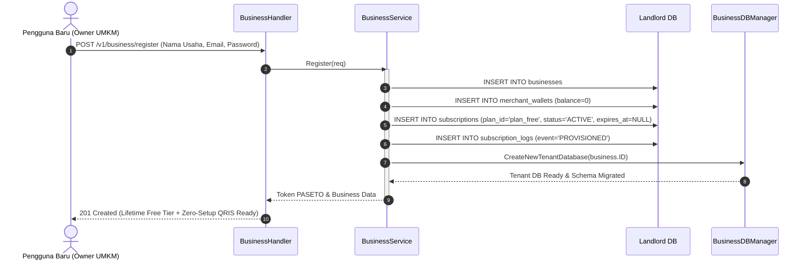

---

## 8. Sistem Iklan In-App Native & Slide Carousel (Anti-AdBlock Native Promo Engine)

Sesuai model bisnis freemium modern, pengguna **Free Tier** akan disajikan iklan in-app terkurasi (baik promo internal upgrade ke Pro maupun sponsor kemitraan B2B pihak ketiga). 

Namun, alih-alih menggunakan skrip iklan pihak ketiga konvensional (seperti Google AdSense / banner tag eksternal), POS-GODINOV menerapkan **100% First-Party Native In-Code Ads Engine** (serupa dengan pendekatan *freeCodeCamp* dan *Substack*).

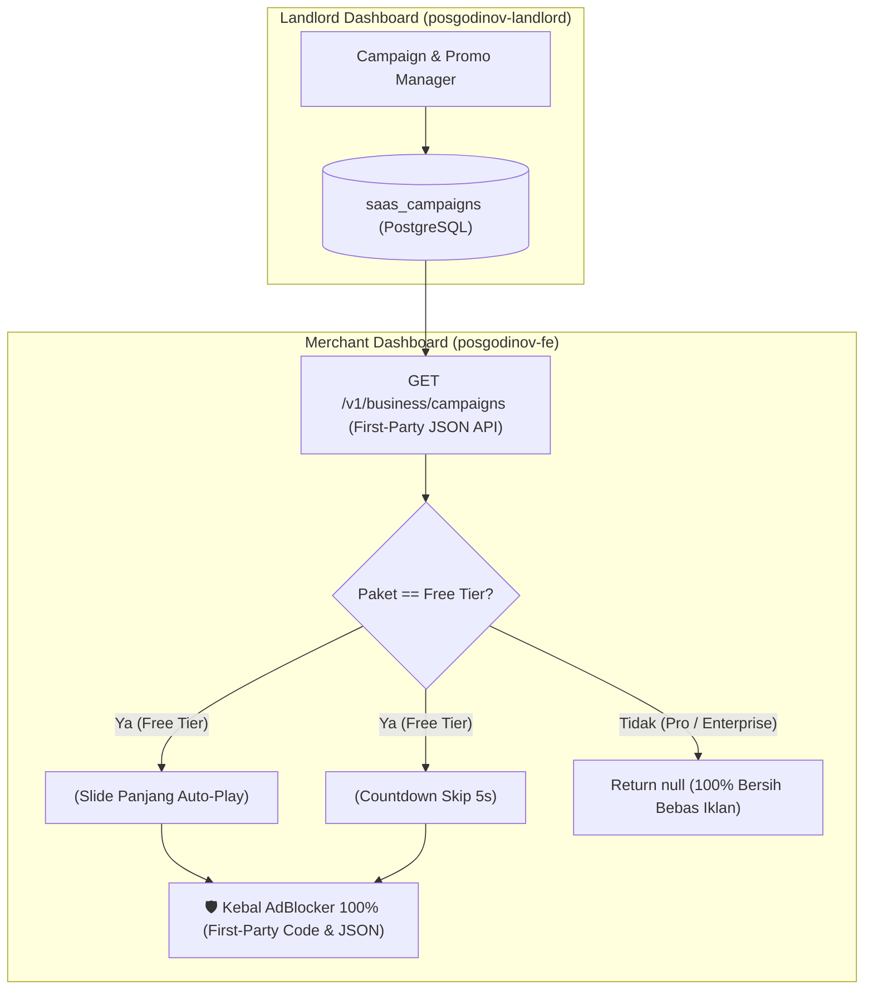

---

### 8.1 Keunggulan Arsitektur First-Party Native Code

1. **100% Kebal Terhadap Semua Jenis AdBlocker**:
   - Pemblokir iklan seperti **uBlock Origin, AdGuard, Brave Shields, Pi-hole, dan DNS Filter** bekerja dengan cara memblokir domain pihak ketiga (misal `doubleclick.net`, `googleadservices.com`) dan nama kelas CSS standar (`.ads`, `.ad-banner`).
   - Iklan POS-GODINOV disajikan **langsung dari domain API utama platform** (`/v1/business/campaigns`) dalam format JSON dan dirender oleh komponen asli React/Tailwind (`<NativePromoCarousel />` dan `<NativePromoModal />`).
   - Bagi browser dan AdBlocker, request ini identik dengan pengambilan data master produk atau inventori biasa, sehingga **mustahil diblokir tanpa merusak fungsi aplikasi kasir itu sendiri**.
2. **Nol Kebocoran Privasi (Privacy-First)**:
   - Tidak ada pelacak atau *tracking pixel* pihak ketiga yang disusupkan ke dashboard kasir merchant. Data operasional bisnis terlindungi sepenuhnya.
3. **Performa Instan & Ringan**:
   - Aset gambar dikompresi ke WebP beresolusi optimal dan disajikan dari CDN/Cloudinary internal. Tidak memperlambat waktu rendering halaman dashboard.

---

### 8.2 Format & Penempatan Iklan di Merchant Dashboard

#### A. Native Hero Slide Carousel (Banner Memanjang)
- **Lokasi Penempatan**: Bagian atas Beranda Dashboard (`/admin`) atau di atas header Laporan Keuangan (`/admin/reports/*`).
- **Spesifikasi UI**:
  - Banner memanjang horizontal responsif (rasio aspek 16:5 di desktop, 16:9 di mobile/tablet).
  - Rotasi otomatis (*auto-scroll*) setiap 6 detik, dengan jeda otomatis saat kursor mouse berada di atas banner (*pause on hover*).
  - Indikator titik (*dots*) dan panah navigasi transparan yang elegan.
  - Menampung hingga 3–5 banner kampanye aktif yang dirotasi berdasarkan bobot `priority`.
- **Konten Carousel**:
  - Penawaran diskon langganan tahunan Pro Tier.
  - Edukasi fitur premium (misal: *"Gunakan Dual-Stock untuk mencegah kebocoran bahan baku"*).
  - Iklan kemitraan merchant (misal: penyedia mesin EDC, supplier kertas thermal kasir rekanan Godinov, atau pinjaman modal usaha resmi).

#### B. Native Interstitial Pop-up Modal (Pop-up Cerdas dengan Countdown)
- **Spesifikasi UI**:
  - Modal pop-up di tengah layar dengan latar belakang *backdrop blur*.
  - Visual grafis vertikal yang menarik dengan teks ajakan persuasif.
  - **Countdown Skip Timer 5 Detik (Anti-Annoyance UX)**:
    - Di sudut kanan atas, tombol tutup awalnya terkunci dan menampilkan hitungan mundur: *"Dapat dilewati dalam 5s"*.
    - Setelah 5 detik berlalu, tombol berubah menjadi *"Tutup [X]"* dan dapat diklik dengan bebas.
  - **Tombol CTA Utama**: Tombol aksen kontras bertuliskan *"Tingkatkan Sekarang"* yang langsung memicu dialog checkout upgrade Pro atau membuka tautan promosi.
- **Frekuensi Capping**:
  - Dibatasi maksimal **1 kali per 24 jam** per sesi akun bisnis (disimpan di `localStorage` klien dengan validasi timestamp).
  - Pemicu (*Trigger*): Muncul saat **Login Pertama Harian** pemilik bisnis.

---

### 8.3 Manajemen Kampanye dari Dashboard Landlord (`posgodinov-landlord`)

Superadmin dapat mengelola seluruh siklus hidup iklan melalui menu **Campaign & Ads Manager**:
1. **Formulir Pembuatan Kampanye**:
   - Judul & Subjudul kampanye.
   - Pilihan Format: `CAROUSEL_SLIDE` atau `POPUP_MODAL`.
   - Pilihan Penempatan: `DASHBOARD_HOME`, `REPORTS_PAGE`, atau `ON_LOGIN`.
   - Upload Gambar Banner (WebP) langsung ke Cloudinary.
   - Tombol Aksi (CTA): Tipe aksi (`INTERNAL_UPGRADE`, `EXTERNAL_URL`, `INFO_ONLY`), Label Tombol, dan URL Target.
   - Penjadwalan: Tanggal mulai tayang (`starts_at`) dan tanggal berakhir (`ends_at`).
   - Durasi Countdown Skip (default: 5 detik).
   - Pengaturan Prioritas Bobot (urutan tayang banner).
2. **Analitik Performa Real-Time**:
   - Menghitung total impresi tayangan (*Impression Count*).
   - Menghitung total klik merchant (*Click Count*).
   - Rasio Konversi / CTR (*Click-Through Rate*).

---

### 8.4 Jaminan Bebas Iklan untuk Pro & Enterprise (Ad-Free Guarantee)

- Di dalam Policy Engine, paket Pro dan Enterprise memiliki aturan `no_ads = true`.
- Endpoint `GET /v1/business/campaigns` secara otomatis mengembalikan daftar kosong `[]` jika pemanggil adalah tenant Pro/Enterprise.
- Komponen `<NativePromoCarousel />` dan `<NativePromoModal />` di frontend mengembalikan `null` tanpa merender elemen DOM apapun, menjaga pengalaman pengguna berbayar tetap 100% bersih, cepat, dan profesional.

---

## 9. Desain Dashboard Khusus Landlord Admin (Superadmin Platform Console)

Pemisahan antara **Merchant/Tenant Admin** (`posgodinov-fe` yang digunakan pemilik bisnis untuk mengurus outlet, kasir, dan produk) dan **Platform Superadmin** (Landlord Admin milik tim Godinov) adalah pondasi krusial bagi kelangsungan operasional SaaS.

Tim internal Godinov (Developer, Customer Support, Finance, dan Management) membutuhkan konsol kontrol terpusat untuk memantau kesehatan seluruh ekosistem tanpa mencemari logika aplikasi merchant.

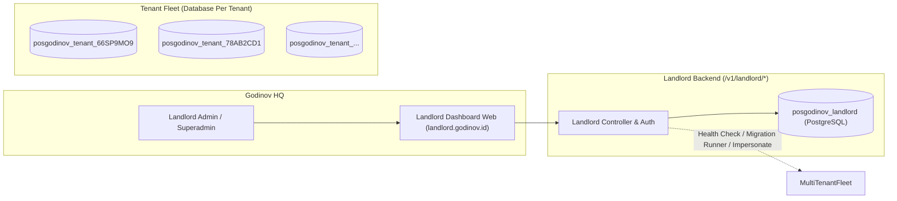

---

### 9.1 Skema Basis Data Landlord Admin (`posgodinov_landlord`)

```sql
-- 1. Pengguna Khusus Landlord (Internal Godinov Team)
CREATE TABLE landlord_users (
    id            UUID PRIMARY KEY DEFAULT gen_random_uuid(),
    name          VARCHAR(100) NOT NULL,
    email         VARCHAR(255) NOT NULL UNIQUE,
    password_hash VARCHAR(255) NOT NULL,
    role          VARCHAR(30)  NOT NULL DEFAULT 'SUPPORT', -- 'SUPERADMIN', 'FINANCE', 'SUPPORT'
    is_active     BOOLEAN      DEFAULT TRUE,
    last_login_at TIMESTAMP WITH TIME ZONE,
    created_at    TIMESTAMP WITH TIME ZONE DEFAULT CURRENT_TIMESTAMP
);

-- 2. Audit Log Landlord (Mencatat segala tindakan sensitif internal)
CREATE TABLE landlord_audit_logs (
    id          UUID PRIMARY KEY DEFAULT gen_random_uuid(),
    user_id     UUID NOT NULL REFERENCES landlord_users(id),
    action      VARCHAR(50) NOT NULL, -- 'SUSPEND_TENANT', 'IMPERSONATE', 'OVERRIDE_PLAN', 'RUN_MIGRATION'
    target_type VARCHAR(50) NOT NULL, -- 'BUSINESS', 'PLAN', 'SUBSCRIPTION'
    target_id   VARCHAR(100) NOT NULL,
    metadata    JSONB DEFAULT '{}'::jsonb,
    ip_address  VARCHAR(45),
    created_at  TIMESTAMP WITH TIME ZONE DEFAULT CURRENT_TIMESTAMP
);

-- 3. Broadcast Pengumuman Sistem Global
CREATE TABLE system_announcements (
    id           UUID PRIMARY KEY DEFAULT gen_random_uuid(),
    title        VARCHAR(200) NOT NULL,
    message      TEXT NOT NULL,
    severity     VARCHAR(20) NOT NULL DEFAULT 'INFO', -- 'INFO', 'WARNING', 'CRITICAL'
    target_tier  VARCHAR(20) DEFAULT 'ALL',          -- 'ALL', 'FREE', 'PRO'
    is_active    BOOLEAN DEFAULT TRUE,
    starts_at    TIMESTAMP WITH TIME ZONE NOT NULL DEFAULT CURRENT_TIMESTAMP,
    ends_at      TIMESTAMP WITH TIME ZONE NOT NULL,
    created_at   TIMESTAMP WITH TIME ZONE DEFAULT CURRENT_TIMESTAMP
);
```

---

### 9.2 Fitur & Modul Utama Landlord Admin Dashboard

#### A. Tenant 360 & Operations Console
1. **Daftar Seluruh Bisnis (Tenant Directory)**:
   - Pencarian real-time berdasarkan `id`, `serial_business`, nama bisnis, email, atau owner.
   - Kolom status: Status Akun (`Active`, `Suspended`), Status Paket (`Free`, `Pro`, `Expired`), Jumlah Outlet terdaftar, Tanggal Pendaftaran.
2. **Detail Tenant 360**:
   - Menampilkan total produk, total bahan baku, total kasir, dan riwayat volume transaksi bisnis.
   - Status koneksi database tenant (`posgodinov_tenant_<id>`), ukuran database fisik di PostgreSQL, dan versi migrasi (`schema_migrations`).
3. **Impersonation ("Login-as-Tenant")**:
   - Fitur wajib bagi tim Customer Service / Support teknis.
   - Admin Landlord dapat mengklik *"Masuk sebagai Pemilik Bisnis"*, yang menghasilkan token sesi bisnis bertanda khusus (*impersonated session*).
   - Seluruh tindakan selama sesi impersonasi dicatat di `landlord_audit_logs` untuk mencegah penyalahgunaan wewenang.
4. **Suspensi & Pemblokiran Akun**:
   - Kemampuan membekukan akses bisnis jika terindikasi fraud, spam, atau menunggak pembayaran.
   - Saat disuspend, seluruh API dari dashboard owner maupun POS kasir tenant langsung ditolak dengan pesan jelas: *"Akun bisnis Anda telah dinonaktifkan oleh administrator platform"*.

#### B. Subscription & Dynamic Plan Governance
1. **Interactive Plan & Feature Matrix Editor (Editor Matriks Dinamis)**:
   - Tampilan berbentuk tabel matriks interaktif dua dimensi:
     - **Kolom**: Daftar seluruh paket langganan aktif (`FREE`, `PRO Monthly`, `PRO Yearly`, `ENTERPRISE`, serta tombol `+ Tambah Paket Baru`).
     - **Baris**: Daftar seluruh kapabilitas platform dari tabel `saas_features`, dikelompokkan berdasarkan kategori (`CORE`, `INVENTORY`, `STAFF`, `REPORTS`, `INTEGRATION`).
   - Setiap sel menyediakan kontrol interaktif:
     - Fitur bertipe `BOOLEAN_FLAG`: Toggle Switch (On/Off) real-time.
     - Fitur bertipe `NUMERIC_LIMIT`: Input angka batas kuota, dengan tombol centang *"Unlimited (-1)"*.
   - Tombol **"Simpan & Terapkan Perubahan Global"**:
     - Memperbarui tabel `plan_features` di Landlord DB.
     - Mengirimkan sinyal invalidasi cache ke Policy Engine (`policyEngine.InvalidatePlan(planID)`).
     - Seluruh merchant pada paket tersebut langsung tunduk pada aturan baru dalam hitungan milidetik tanpa restart backend!

2. **Master Feature Catalog Registry (Pendaftaran Fitur Baru Platform)**:
   - Form pendaftaran fitur baru:
     - `Key` (identifier unik, misal: `ai_smart_reorder`).
     - `Nama Fitur` (misal: "Prediksi Pembelian Stok Otomatis").
     - `Kategori` & `Tipe Nilai` (`NUMERIC_LIMIT` atau `BOOLEAN_FLAG`).
   - Begitu disimpan, fitur baru otomatis muncul sebagai baris baru di Plan Matrix Editor dan siap dikonfigurasi untuk masing-masing paket.

3. **Per-Tenant Custom Overrides & Add-ons Modal**:
   - Di halaman detail setiap merchant, terdapat tab *"Custom Overrides & Add-ons"*.
   - Superadmin dapat menambahkan penyesuaian khusus per tenant:
     - Memberikan bonus kuota (misal: Merchant Free membeli add-on +1 Outlet seharga Rp 50.000/bln $\rightarrow$ override `ADD_LIMIT` +1 pada `max_outlets`).
     - Memberikan uji coba fitur Pro selama 14 hari tanpa mengubah paket utamanya (override `ENABLE_FLAG` dengan masa kedaluwarsa `expires_at`).
   - Otomatis mencatat ID Superadmin dan alasan pemberian override untuk audit transparansi.

4. **Manual Subscription Override (B2B & Promo Activation)**:
   - Mengubah paket langganan bisnis secara manual (misal pembayaran transfer bank manual atau kontrak tahunan korporat).
   - Penambahan tanggal kedaluwarsa (`expires_at`) dengan audit log lengkap.

#### C. God's Eye Analytics (Executive Dashboard)
1. **Metrik Finansial**:
   - MRR (*Monthly Recurring Revenue*), ARR (*Annual Recurring Revenue*), dan estimasi pendapatan berjalan.
2. **Pertumbuhan Tenant**:
   - Grafik pertumbuhan pendaftaran tenant baru (Harian, Mingguan, Bulanan).
   - Rasio Konversi: Persentase pengguna Free Tier yang beralih ke Pro Tier.
   - Tingkat Churn (merchant yang tidak memperpanjang Pro).
3. **Beban Ekosistem Platform**:
   - Total volume transaksi gabungan seluruh tenant hari ini.
   - Total konsumsi penyimpanan gambar Cloudinary lintas tenant.

#### D. System Maintenance & Fleet Operations
1. **Tenant Migration Orchestrator**:
   - Memeriksa versi migrasi seluruh database tenant.
   - Tombol *Run Batch Migration* untuk mengeksekusi migrasi skema baru ke seluruh database tenant secara serentak.
2. **Global System Announcement**:
   - Membuat pengumuman pemeliharaan server yang otomatis muncul sebagai banner di bagian atas dashboard merchant (`posgodinov-fe`).

---

### 9.3 Arsitektur Teknis Frontend: Opsi A (Standalone `posgodinov-landlord`)

Sesuai keputusan arsitektur, platform mengadopsi **Opsi A: Project Terpisah `posgodinov-landlord`**:

```
POS-GODINOV/
├── posgodinov-be/          # Backend Go (Landlord API + Multi-Tenant DBs)
├── posgodinov-fe/          # Frontend Web: Dashboard Pemilik Bisnis (app.godinov.id)
├── posgodinov-landlord/    # Frontend Web: Platform Superadmin Console (landlord.godinov.id)
├── posgodinov-mobile/      # Mobile POS Kasir (Flutter - Tablet/Handheld)
├── posgodinov-so/          # Mobile Stock Opname (Flutter - Smartphone)
└── posgodinov-landingpage/ # Website Promosi & Registrasi Publik (godinov.id)
```

#### Keuntungan Opsi A:
1. **Keamanan Maksimal (Zero Attack Surface Leak)**:
   - Rute, komponen form superadmin, logika impersonasi, dan token handling Landlord tidak pernah masuk ke bundle JavaScript merchant publik.
2. **Subdomain Mandiri**:
   - Dideploy pada `landlord.godinov.id` dengan konfigurasi CORS, rate limiter, dan IP whitelist yang lebih ketat.
3. **Independensi Siklus Rilis**:
   - Perubahan dashboard internal tidak memerlukan pengujian ulang atau re-deploy pada dashboard merchant.

---

## 10. Integrasi Frontend Dashboard Merchant (`posgodinov-fe`)

Agar pengalaman pengguna transparan, elegan, dan menghasilkan konversi upgrade yang optimal:
1. **Badge Paket & Indikator Kuota**:
   - Navbar/Sidebar menampilkan badge status paket aktif (`Free Plan`) dengan tombol aksen `Upgrade to Pro`.
   - Di halaman daftar produk & bahan baku: Tampilkan bar indikator kuota dinamis (`28 / 50 Produk Digunakan`).
   - Di halaman outlet: Saat mencapai batas (1 outlet pada Free Tier), tombol `Tambah Outlet Baru` menampilkan ikon gembok kecil (*Pro Feature*).
2. **Komponen Iklan In-App Native (Anti-AdBlock)**:
   - `<NativePromoCarousel />`: Komponen slide banner horizontal responsif di beranda dashboard merchant Free Tier, memuat promo Pro dan rekanan resmi.
   - `<NativePromoModal />`: Modal pop-up interstitial yang muncul 1x per hari dengan hitungan mundur skip 5 detik.
3. **Upgrade Modal Dialog**:
   - Saat backend mengembalikan respons `PLAN_LIMIT_EXCEEDED` atau `FEATURE_NOT_IN_PLAN`, Axios interceptor langsung membuka modal *"Tingkatkan ke Pro"* lengkap dengan perbandingan fitur dan tombol kontak/pembayaran.

---

## 11. CMS Dinamis Landing Page via Landlord Dashboard (`posgodinov-lp`)

Sesuai rencana induk landing page pada `posgodinov-lp/LANDING_PAGE_MASTER_PLAN.md`, landing page publik (`godinov.id`) dirancang tidak hanya statis di kode, melainkan terhubung langsung ke **Landlord Dashboard sebagai Headless CMS**.

Hal ini memungkinkan tim marketing dan manajemen Godinov untuk mengubah konten komersial secara instan tanpa perlu menyentuh kode program, tanpa commit git, dan tanpa proses build ulang.

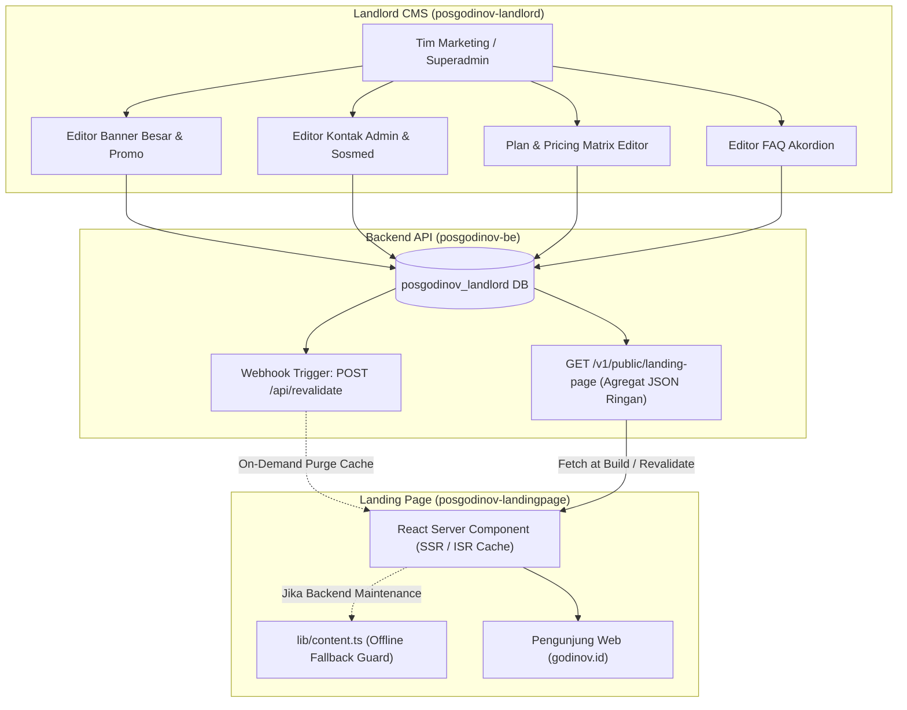

---

### 11.1 Cakupan Komponen Landing Page yang Dikelola Dinamis

| Bagian Halaman | Data yang Dikelola Dinamis via Landlord Dashboard | Komponen di `posgodinov-lp` |
| :--- | :--- | :--- |
| **Hero & Top Banner** | Banner besar promosi (Desktop & Mobile WebP), Judul, Subjudul, Tagline, Tombol Dual CTA, status aktif, dan masa tayang. | `components/sections/HeroSection.tsx` & `components/layout/TopAnnouncementBar.tsx` |
| **Pricing & Plans** | 3 Tier Paket (`Warung`, `Bisnis`, `Enterprise`), Harga Bulanan vs Tahunan (Hemat 2 Bulan), Checklist fitur centang/silang, Badge *"Paling Populer"*, dan link pendaftaran. | `components/sections/PricingSection.tsx` & `components/interactive/PricingToggle.tsx` |
| **Kontak Admin & CS** | Nomor WhatsApp Sales & Support (bisa ganti nomor seketika tanpa rilis kode), Email resmi (`sales@godinov.id`), jam kerja, dan alamat kantor. | `components/layout/SiteFooter.tsx` & Floating WhatsApp Button |
| **Media Sosial Perusahaan** | Tautan akun resmi Instagram, TikTok, LinkedIn, YouTube, dan Twitter/X. | `components/layout/SiteFooter.tsx` |
| **Trust Bar (Social Proof)** | Metrik dinamis (*"1.5jt+ Transaksi"*, *"99.9% Uptime"*, *"0 Data Loss"*) serta daftar logo-logo merchant rekanan Godinov. | `components/sections/TrustBar.tsx` |
| **FAQ Akordion** | Daftar tanya jawab umum seputar offline-first, garansi keamanan, dan tata cara langganan (bisa tambah/hapus pertanyaan). | `components/sections/FaqSection.tsx` & `components/interactive/FaqAccordion.tsx` |

---

### 11.2 Skema Basis Data CMS Landing Page di Landlord DB

```sql
-- 1. Pengaturan Kontak, Sosmed, dan Metrik Global Landing Page
CREATE TABLE landing_page_settings (
    key          VARCHAR(100) PRIMARY KEY, -- 'company_contacts', 'social_links', 'trust_metrics', 'top_announcement'
    value        JSONB NOT NULL,
    description  TEXT,
    updated_at   TIMESTAMP WITH TIME ZONE DEFAULT CURRENT_TIMESTAMP,
    updated_by   UUID REFERENCES landlord_users(id)
);

-- 2. Banner Besar Hero & Promosi
CREATE TABLE landing_hero_banners (
    id                 UUID PRIMARY KEY DEFAULT gen_random_uuid(),
    title              VARCHAR(150) NOT NULL,
    subtitle           TEXT,
    tagline            VARCHAR(50), -- misal: "PROMO LAUNCHING V2"
    image_desktop_url  TEXT NOT NULL,
    image_mobile_url   TEXT,
    primary_cta_text   VARCHAR(50) DEFAULT 'Coba Gratis 14 Hari',
    primary_cta_url    TEXT DEFAULT '/register',
    secondary_cta_text VARCHAR(50) DEFAULT 'Lihat Demo Interaktif',
    secondary_cta_url  TEXT DEFAULT '#offline',
    starts_at          TIMESTAMP WITH TIME ZONE DEFAULT CURRENT_TIMESTAMP,
    ends_at            TIMESTAMP WITH TIME ZONE,
    sort_order         INT NOT NULL DEFAULT 0,
    is_active          BOOLEAN NOT NULL DEFAULT TRUE,
    created_at         TIMESTAMP WITH TIME ZONE DEFAULT CURRENT_TIMESTAMP
);

-- 3. Daftar Tanya Jawab (FAQ) Dinamis
CREATE TABLE landing_faqs (
    id         UUID PRIMARY KEY DEFAULT gen_random_uuid(),
    question   TEXT NOT NULL,
    answer     TEXT NOT NULL,
    category   VARCHAR(50) DEFAULT 'UMUM', -- 'UMUM', 'KEAMANAN', 'TEKNIS', 'LANGGANAN'
    sort_order INT NOT NULL DEFAULT 0,
    is_active  BOOLEAN NOT NULL DEFAULT TRUE,
    created_at TIMESTAMP WITH TIME ZONE DEFAULT CURRENT_TIMESTAMP
);

-- Data Awal Pengaturan Kontak & Metrik
INSERT INTO landing_page_settings (key, value, description) VALUES
('company_contacts', '{
    "whatsapp_sales": "6281234567890",
    "whatsapp_support": "6281234567891",
    "email_sales": "sales@godinov.id",
    "email_support": "support@godinov.id",
    "office_address": "Jakarta Selatan, DKI Jakarta, Indonesia",
    "office_hours": "Senin - Jumat: 09:00 - 18:00 WIB"
}'::jsonb, 'Kontak resmi operasional dan customer service'),

('social_links', '{
    "instagram": "https://instagram.com/godinov.pos",
    "tiktok": "https://tiktok.com/@godinov.pos",
    "linkedin": "https://linkedin.com/company/godinov",
    "youtube": "https://youtube.com/@godinov"
}'::jsonb, 'Tautan akun media sosial resmi'),

('trust_metrics', '{
    "total_transactions": "1.5jt+",
    "sync_success_rate": "99.9%",
    "data_loss_rate": "0 Kasus",
    "active_outlets": "500+ Cabang"
}'::jsonb, 'Angka statistik pencapaian di Trust Bar');
```

---

### 11.3 Endpoint Agregat Publik: `GET /v1/public/landing-page`

Agar performa loading landing page tetap instan tanpa melakukan multiple request HTTP terpisah, backend menyediakan 1 endpoint agregat publik berlatensi rendah:

```json
{
  "success": true,
  "data": {
    "announcement": {
      "is_active": true,
      "text": "🎉 Promo Launching V2: Diskon 50% untuk 3 bulan pertama paket Bisnis!",
      "link_url": "#harga"
    },
    "hero_banner": {
      "title": "Kasir tetap jalan. Uang tidak ikut jalan-jalan.",
      "subtitle": "Godinov POS V2 terus melayani transaksi walau internet mati total...",
      "image_desktop_url": "https://res.cloudinary.com/.../hero-desktop.webp",
      "primary_cta_text": "Coba Gratis 14 Hari",
      "primary_cta_url": "/register"
    },
    "trust_metrics": {
      "total_transactions": "1.5jt+",
      "sync_success_rate": "99.9%",
      "data_loss_rate": "0 Kasus"
    },
    "plans": [
      {
        "id": "plan_free",
        "code": "FREE",
        "name": "Warung",
        "price_monthly": 0,
        "price_yearly": 0,
        "is_highlight": false,
        "features": [ ... ]
      },
      {
        "id": "plan_pro_monthly",
        "code": "PRO",
        "name": "Bisnis",
        "price_monthly": 149000,
        "price_yearly": 1490000,
        "is_highlight": true,
        "badge": "Paling Populer",
        "features": [ ... ]
      }
    ],
    "contacts": {
      "whatsapp_sales": "6281234567890",
      "email_sales": "sales@godinov.id"
    },
    "socials": {
      "instagram": "https://instagram.com/godinov.pos"
    },
    "faqs": [
      {
        "question": "Apakah benar bisa transaksi tanpa internet sama sekali?",
        "answer": "Ya. Setiap transaksi tersimpan di database lokal browser/tablet..."
      }
    ]
  }
}
```

---

### 11.4 Arsitektur Integrasi dengan Next.js App Router (`posgodinov-landingpage`)

1. **Selaras dengan `LANDING_PAGE_MASTER_PLAN.md` (§0.3)**:
   - Landing page tetap di-render murni sebagai **React Server Component (RSC)** di server:
     ```tsx
     // app/page.tsx
     import { getLandingPageData } from '@/lib/api/landing'
     import { defaultContent } from '@/lib/content'

     export default async function LandingPage() {
       // Fetch agregat dengan Next.js Cache & Tag
       const cmsData = await getLandingPageData().catch(() => defaultContent)

       return (
         <main>
           <TopAnnouncementBar data={cmsData.announcement} />
           <SiteHeader contacts={cmsData.contacts} />
           <HeroSection data={cmsData.hero_banner} />
           <TrustBar metrics={cmsData.trust_metrics} />
           <PricingSection plans={cmsData.plans} />
           <FaqSection faqs={cmsData.faqs} />
           <SiteFooter contacts={cmsData.contacts} socials={cmsData.socials} />
         </main>
       )
     }
     ```
2. **On-Demand Cache Revalidation Webhook**:
   - Next.js menyimpan cache hasil render dengan tag `landing-page` (`revalidate: 86400` / 24 jam).
   - Saat Superadmin mengubah banner, kontak WhatsApp, harga, atau FAQ di Landlord Dashboard:
     Backend Go otomatis memanggil webhook:
     `POST https://godinov.id/api/revalidate?tag=landing-page&secret=LANDLORD_SECRET`
   - Cache langsung di-*purge* seketika. Pengunjung berikutnya langsung melihat perubahan dalam hitungan detik!
3. **Bulletproof Fallback Guard**:
   - Jika server backend sedang maintenance atau koneksi API terputus, `getLandingPageData()` otomatis menggunakan data statis dari `lib/content.ts`.
   - **Landing page tidak akan pernah down atau menampilkan layar putih error 500.**

---

## 12. Roadmap Implementasi Bertahap

### Tahap 1: Fondasi Landlord & Database Migration
- [ ] Buat file migrasi `posgodinov-be/db/migrations/landlord/000002_create_saas_dynamic_plans.up.sql`.
- [ ] Buat tabel `saas_features`, `plans`, `plan_features`, `subscriptions`, `tenant_feature_overrides`, `subscription_logs`, `saas_campaigns`, `subscription_invoices`, `managed_payment_channels`, `merchant_wallets`, `merchant_wallet_ledger`, `merchant_payout_requests`, `landing_page_settings`, `landing_hero_banners`, `landing_faqs`, `landlord_users`, dan `landlord_audit_logs`.
- [ ] Eksekusi seeder fitur master, paket default (Free & Pro), kanal pembayaran awal (QRIS Dinamis, BCA/Mandiri/BRI VA), banner awal, kontak default, dan akun superadmin awal `admin@godinov.id`.
- [ ] Buat domain models & repository di backend Go: `domain.SaaSFeature`, `domain.Plan`, `domain.PlanFeature`, `domain.Subscription`, `domain.TenantFeatureOverride`, `domain.SaaSCampaign`, `domain.SubscriptionInvoice`, `domain.ManagedPaymentChannel`, `domain.MerchantWallet`, `domain.MerchantWalletLedger`, `domain.MerchantPayoutRequest`, `domain.LandingPageData`, `domain.LandlordUser`.

### Tahap 2: Multi-Tier Authentication, Policy Engine & Payment Abstractions
- [ ] Implementasikan `LandlordAuthMiddleware` dan `BusinessAuthMiddleware` dengan pemisahan klaim audiens Paseto.
- [ ] Endpoint `POST /v1/landlord/auth/login` untuk autentikasi Superadmin.
- [ ] Hubungkan `businessService.Register()` agar otomatis mem-provisioning subscription `plan_free` (Opsi 1: Lifetime Free Tier) dan dompet digital kasir `merchant_wallets` pada bisnis baru.
- [ ] Implementasikan `PolicyEngine` di Go (`internal/service/policy_engine.go`):
  - Penghitungan nilai efektif (Base Plan + Overrides).
  - High-performance in-memory cache dengan invalidasi real-time.
- [ ] Rancang kontrak antarmuka (*Interface Abstractions*) di Go: `PaymentChannelProvider`, `BillingProvider`, dan `DisbursementProvider`.
- [ ] Buat implementasi `MockPaymentChannelAdapter` untuk pengujian pembayaran kasir QRIS & tagihan Pro secara lokal tanpa koneksi payment rail eksternal.
- [ ] Buat error mapper HTTP 402/403 dengan format payload upgrade standar.

### Tahap 3: Pemasangan Quota Guards pada Layanan Tenant
- [ ] Pasang `policyEngine.AssertQuota` di `outletService.Register()` (Maksimal Outlet).
- [ ] Pasang `policyEngine.AssertQuota` di `productService.Create()` (Maksimal Produk).
- [ ] Pasang `policyEngine.AssertQuota` di `rawMaterialService.Create()` (Maksimal Bahan Baku).
- [ ] Pasang `policyEngine.AssertQuota` di `staffService.Register()` (Maksimal Staf/Outlet).
- [ ] Pasang `policyEngine.AssertFeature` di `staffService.TransferOutlet()` (Transfer Staf).
- [ ] Pasang `policyEngine.AssertFeature` di `reportService.Export()` (Ekspor Laporan).
- [ ] Pasang pembatasan rentang hari query pada `reportService`.

### Tahap 4: Endpoint API Publik (Iklan In-App & Landing Page CMS)
- [ ] `GET /v1/public/landing-page`: Endpoint agregat publik untuk landing page (paket, banner, kontak, FAQ, trust metrics).
- [ ] `GET /v1/business/campaigns`: Endpoint tenant untuk mengambil promo aktif (Free Tier only, Pro otomatis kosong).
- [ ] `POST /v1/business/campaigns/{id}/click`: Tracking klik iklan in-app.

### Tahap 5: Endpoint API Landlord Superadmin (`/v1/landlord/*`)
- [ ] `GET /v1/landlord/features` & `POST /v1/landlord/features`: CRUD Master Fitur.
- [ ] `GET /v1/landlord/plans` & `PUT /v1/landlord/plans/{id}/matrix`: Ambil dan update matriks fitur paket dinamis.
- [ ] `GET /v1/landlord/landing/settings` & `PUT /v1/landlord/landing/settings`: Kelola banner hero, kontak admin, dan FAQ.
- [ ] `POST /v1/landlord/landing/revalidate`: Trigger webhook revalidasi cache ke Next.js landing page.
- [ ] `GET /v1/landlord/campaigns` & `POST /v1/landlord/campaigns`: Manajemen banner & pop-up iklan native merchant.
- [ ] `GET /v1/landlord/businesses`: Direktori tenant dengan pagination, pencarian, dan filter paket.
- [ ] `POST /v1/landlord/businesses/{id}/suspend` & `unsuspend`.
- [ ] `POST /v1/landlord/businesses/{id}/impersonate`: Generate token sesi impersonasi merchant.
- [ ] `POST /v1/landlord/businesses/{id}/overrides`: Tambah atau hapus add-on kustom per tenant.
- [ ] `GET /v1/landlord/metrics/overview`: Statistik eksekutif (MRR, tenant growth, kapasitas sistem).

### Tahap 6: Setup Frontend Standalone `posgodinov-landlord`
- [ ] Inisialisasi Next.js app di folder `posgodinov-landlord/`.
- [ ] Halaman Login Superadmin & Autentikasi Landlord Token.
- [ ] Dashboard Ringkasan Metrik (MRR, Tenant Count, Health status).
- [ ] Halaman Direktori Tenant 360 + Tombol Impersonate & Suspend.
- [ ] Halaman **Interactive Plan & Feature Matrix Editor** (Tabel Grid interaktif untuk edit fitur dan kuota langsung).
- [ ] Halaman **Landing Page CMS Manager** (Editor Banner Besar, Form Kontak Admin WhatsApp/Email, FAQ Manager).
- [ ] Halaman **In-App Campaign & Ads Manager** (Upload banner in-app merchant, popup countdown 5s, analitik CTR).
- [ ] Modal Tenant Add-ons & Feature Overrides.

### Tahap 7: Frontend Merchant Native Promo Components (`posgodinov-fe`)
- [ ] Komponen `<NativePromoCarousel />` dengan auto-scroll dan pause on hover.
- [ ] Komponen `<NativePromoModal />` dengan hitungan mundur 5 detik dan frequency capping harian.
- [ ] Sticky amber warning bar untuk sesi impersonasi admin support.

### Tahap 8: Integrasi Dynamic Headless CMS pada `posgodinov-landingpage`
- [ ] Hubungkan `components/sections/PricingSection.tsx` ke endpoint `GET /v1/public/landing-page`.
- [ ] Hubungkan Hero Banner, Top Announcement Bar, FAQ Accordion, dan Footer Contacts ke data CMS.
- [ ] Pasang endpoint webhook On-Demand Revalidation: `app/api/revalidate/route.ts`.
- [ ] Pastikan fallback ke `lib/content.ts` bekerja mulus saat backend offline.

### Tahap 9: Pengujian Otomatis & Verifikasi
- [ ] Unit test: `PolicyEngine_EffectivePolicyCalculation` (validasi Base Limit + Add-on Delta).
- [ ] Unit test: `PolicyEngine_CacheInvalidation` (memastikan perubahan langsung berlaku tanpa restart).
- [ ] Feature test: Menolak registrasi outlet/produk/staf saat kuota habis.
- [ ] Feature test: Memastikan Pro Tier bebas iklan 100%.
- [ ] Feature test: Menguji hak akses superadmin vs merchant (pencegahan cross-access) dan validitas sesi impersonasi.
- [ ] E2E test: Verifikasi perubahan banner/harga di Landlord Dashboard langsung terefleksi di landing page publik via webhook revalidasi.

---

## 13. Kesimpulan & Rekomendasi
Arsitektur **Dynamic SaaS Engine** yang dikombinasikan dengan **Dashboard Landlord Khusus (Opsi A)**, **Native Anti-AdBlock Promo Engine**, dan **Headless CMS untuk Landing Page** memberikan POS-GODINOV ekosistem bisnis kelas enterprise:
1. **Pusat Kendali Tunggal (One Control Center)**: Superadmin mengelola seluruh operasional platform dari satu tempat: mulai dari landing page publik, banner promosi, kontak CS, paket langganan, fitur dinamis, hingga pemantauan database seluruh cabang klien.
2. **Monetisasi & Konversi Maksimal**:
   - Landing page selalu menyajikan penawaran dan harga terupdate.
   - Merchant Free Tier dimonetisasi melalui iklan in-app native yang kebal AdBlocker.
   - Proses upgrade ke Pro Tier terintegrasi mulus dengan batasan kuota terukur.
3. **Keamanan & Performa Tanpa Kompromi**:
   - Isolasi keamanan total antara platform internal dan merchant.
   - Operasional transaksi kasir di lapangan tetap berjalan secepat kilat dengan arsitektur offline-first.

