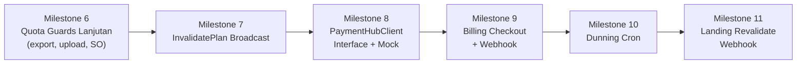

# SaaS Backend — Phase 2 Execution Plan

> [!NOTE]
> Phase 1 (Milestone 1–5) sudah selesai dan di-commit di branch `feature/backend/landlord`.
> Phase 2 ini melanjutkan gap yang tersisa dari `plan-saas-service.md`.

**Branch:** `feature/backend/landlord`  
**Referensi Plan:** [`../future-dev/plan-saas-service.md`](file:///home/ryyz/Repository/POS-GODINOV/future-dev/plan-saas-service.md)

---

## Milestone 6 — Quota Guards Lanjutan

**Scope:** Pasang sisa 3 titik enforcement quota yang belum ada.

### 6.1 `export_reports` guard — `reportService`

**File:** [`internal/service/report_service.go`](file:///home/ryyz/Repository/POS-GODINOV/posgodinov-be/internal/service/report_service.go)

Tambahkan method `Export()` ke `domain.ReportService` interface dan implementasinya, lalu pasang `AssertFeature` di dalamnya:

```go
// Sebelum mengembalikan data ekspor:
if err := s.policyEngine.AssertFeature(ctx, businessID, "export_reports"); err != nil {
    return nil, err
}
```

Handler [`internal/handler/report_handler.go`](file:///home/ryyz/Repository/POS-GODINOV/posgodinov-be/internal/handler/report_handler.go):
- Return `403 PLAN_LIMIT_EXCEEDED` jika `QuotaExceededError` atau feature disabled error.

Routes baru di router:
```
GET /v1/business/outlets/{outlet_id}/reports/transactions/export
GET /v1/business/outlets/{outlet_id}/reports/waste/export
GET /v1/business/outlets/{outlet_id}/reports/restock/export
```

---

### 6.2 `cloud_storage_mb` guard — `uploadService`

**File:** [`internal/service/upload_service.go`](file:///home/ryyz/Repository/POS-GODINOV/posgodinov-be/internal/service/upload_service.go)

Tambahkan `PolicyEngine` sebagai optional dependency via `UploadServiceOption`:

```go
type UploadServiceOption func(*uploadService)

func WithUploadPolicyEngine(pe domain.PolicyEngine) UploadServiceOption {
    return func(s *uploadService) { s.policyEngine = pe }
}
```

Logic guard di `GenerateUploadSignature()`:
```go
// Cek kuota storage sebelum sign request
limit, _ := s.policyEngine.GetNumericLimit(ctx, businessID, "cloud_storage_mb")
// Bandingkan dengan usage saat ini (dari metadata Cloudinary atau counter internal)
// Jika limit != -1 dan usage >= limit → tolak 403
```

> [!NOTE]
> Untuk MVP: gunakan counter sederhana di DB (tabel `merchant_wallets` atau kolom baru `storage_used_mb` di `businesses`). Tracking usage Cloudinary real-time bisa di-defer ke Phase 3.

---

### 6.3 `stock_opname_collaborative` guard — `opnameSessionService`

**File:** [`internal/service/opname_session_service.go`](file:///home/ryyz/Repository/POS-GODINOV/posgodinov-be/internal/service/opname_session_service.go)

Tambahkan policy engine via option (pola sama seperti service lain yang sudah ada).

Di `SubmitCounts()`, cek apakah staf yang submit **bukan staf pertama** yang submit di form ini:

```go
// Jika jumlah staf yang sudah submit di form > 0 dan staffID berbeda dari submitter pertama:
if existingSubmittersCount > 0 && !isFirstSubmitter {
    if err := s.policyEngine.AssertFeature(ctx, businessID, "stock_opname_collaborative"); err != nil {
        return errors.New("fitur SO multi-staf tidak tersedia pada paket Anda")
    }
}
```

Handler [`internal/handler/opname_session_handler.go`](file:///home/ryyz/Repository/POS-GODINOV/posgodinov-be/internal/handler/opname_session_handler.go):
- Return `403` dengan pesan jelas jika fitur disabled.

---

## Milestone 7 — `InvalidatePlan` Broadcast

**Scope:** Saat admin update plan matrix di dashboard, seluruh cache tenant yang pakai plan tersebut harus ter-invalidate.

### 7.1 Tambah `GetBusinessIDsByPlanID` ke `SaaSRepository`

**File:** [`internal/domain/saas.go`](file:///home/ryyz/Repository/POS-GODINOV/posgodinov-be/internal/domain/saas.go)

```go
// Tambah ke SaaSRepository interface:
GetBusinessIDsByPlanID(ctx context.Context, planID string) ([]string, error)
```

**File:** [`internal/repository/saas_repository.go`](file:///home/ryyz/Repository/POS-GODINOV/posgodinov-be/internal/repository/saas_repository.go)

```go
func (r *postgresSaaSRepository) GetBusinessIDsByPlanID(ctx context.Context, planID string) ([]string, error) {
    var ids []string
    err := r.db.Model(&domain.Subscription{}).
        Where("plan_id = ? AND status IN ('ACTIVE','TRIAL','PAST_DUE')", planID).
        Pluck("business_id", &ids).Error
    return ids, err
}
```

### 7.2 Tambah `InvalidatePlan` ke `PolicyEngine` interface

**File:** [`internal/domain/saas.go`](file:///home/ryyz/Repository/POS-GODINOV/posgodinov-be/internal/domain/saas.go)

```go
// Tambah ke PolicyEngine interface:
InvalidatePlan(ctx context.Context, planID string) error
```

**File:** [`internal/service/policy_engine.go`](file:///home/ryyz/Repository/POS-GODINOV/posgodinov-be/internal/service/policy_engine.go)

```go
func (pe *policyEngine) InvalidatePlan(ctx context.Context, planID string) error {
    ids, err := pe.saasRepo.GetBusinessIDsByPlanID(ctx, planID)
    if err != nil {
        return err
    }
    for _, id := range ids {
        pe.cache.Delete(id)
    }
    return nil
}
```

### 7.3 Panggil `InvalidatePlan` di `UpdatePlanFeature`

**File:** [`internal/service/landlord_service.go`](file:///home/ryyz/Repository/POS-GODINOV/posgodinov-be/internal/service/landlord_service.go)

```go
func (s *landlordService) UpdatePlanFeature(ctx context.Context, planID, featureKey string, pf *domain.PlanFeature) error {
    if err := s.saasRepo.UpdatePlanFeature(ctx, pf); err != nil {
        return err
    }
    // Broadcast invalidasi ke semua tenant plan ini
    return s.policyEngine.InvalidatePlan(ctx, planID)
}
```

---

## Milestone 8 — `PaymentHubClient` Interface & Mock Adapter

**Scope:** Siapkan abstraksi payment sesuai §5.2 plan. POS-GODINOV tidak menanam SDK gateway — hanya kontrak interface + mock untuk dev/test.

### 8.1 Domain contract

**File baru:** [`internal/domain/payment.go`](file:///home/ryyz/Repository/POS-GODINOV/posgodinov-be/internal/domain/payment.go)

```go
package domain

import (
    "context"
    "net/http"
    "time"
)

type PaymentHubClient interface {
    // Kasir nontunai (Customer → Business)
    GenerateDynamicQRIS(ctx context.Context, req *QRISRequest) (*QRISResponse, error)
    CreateVirtualAccount(ctx context.Context, req *VARequest) (*VAResponse, error)
    CheckPaymentStatus(ctx context.Context, referenceID string) (*PaymentStatusResult, error)
    CancelPayment(ctx context.Context, referenceID string) error

    // Tagihan langganan SaaS (Business → Landlord)
    CreateSubscriptionInvoice(ctx context.Context, inv *SubscriptionInvoiceRequest) (*CheckoutResponse, error)

    // Pencairan saldo (Escrow → Rekening Bank)
    CreateDisbursement(ctx context.Context, req *DisbursementRequest) (*DisbursementResponse, error)
    CheckDisbursementStatus(ctx context.Context, disbursementID string) (*DisbursementResult, error)

    // Keamanan webhook
    VerifyWebhookSignature(r *http.Request) (*PaymentHubWebhookPayload, error)
}

// DTO structs
type QRISRequest struct {
    TransactionID string            `json:"transaction_id"`
    BusinessID    string            `json:"business_id"`
    OutletID      string            `json:"outlet_id"`
    AmountMinor   int64             `json:"amount_minor"`
    ExpiryMinutes int               `json:"expiry_minutes"`
    Metadata      map[string]string `json:"metadata"`
}

type QRISResponse struct {
    TransactionID string    `json:"transaction_id"`
    QRPayload     string    `json:"qr_payload"`
    QRImageURL    string    `json:"qr_image_url"`
    ExpiredAt     time.Time `json:"expired_at"`
}

type VARequest struct {
    TransactionID string `json:"transaction_id"`
    BusinessID    string `json:"business_id"`
    BankCode      string `json:"bank_code"`
    CustomerName  string `json:"customer_name"`
    AmountMinor   int64  `json:"amount_minor"`
    ExpiryMinutes int    `json:"expiry_minutes"`
}

type VAResponse struct {
    TransactionID string    `json:"transaction_id"`
    BankCode      string    `json:"bank_code"`
    VANumber      string    `json:"va_number"`
    ExpiredAt     time.Time `json:"expired_at"`
}

type PaymentStatusResult struct {
    ReferenceID string `json:"reference_id"`
    Status      string `json:"status"` // PENDING, PAID, EXPIRED, CANCELLED
}

type SubscriptionInvoiceRequest struct {
    InvoiceNumber string `json:"invoice_number"`
    BusinessID    string `json:"business_id"`
    PlanName      string `json:"plan_name"`
    AmountMinor   int64  `json:"amount_minor"`
    TaxMinor      int64  `json:"tax_minor"`
    TotalMinor    int64  `json:"total_minor"`
}

type CheckoutResponse struct {
    GatewayReference string `json:"gateway_reference"`
    PaymentURL       string `json:"payment_url"`
    QRPayload        string `json:"qr_payload,omitempty"`
    VANumber         string `json:"va_number,omitempty"`
}

type DisbursementRequest struct {
    PayoutNumber    string `json:"payout_number"`
    BusinessID      string `json:"business_id"`
    BankCode        string `json:"bank_code"`
    AccountNumber   string `json:"account_number"`
    AccountName     string `json:"account_name"`
    AmountMinor     int64  `json:"amount_minor"`
    DisbursementFee int64  `json:"disbursement_fee"`
}

type DisbursementResponse struct {
    PayoutNumber    string    `json:"payout_number"`
    DisbursementRef string    `json:"disbursement_ref"`
    Status          string    `json:"status"`
    EstimatedTime   time.Time `json:"estimated_time"`
}

type DisbursementResult struct {
    DisbursementRef string `json:"disbursement_ref"`
    Status          string `json:"status"`
}

type PaymentHubWebhookPayload struct {
    Event         string `json:"event"`  // payment.settled, payment.expired, disbursement.completed
    ReferenceID   string `json:"reference_id"`
    AmountMinor   int64  `json:"amount_minor"`
    BusinessID    string `json:"business_id"`
}
```

### 8.2 Mock adapter

**File baru:** [`internal/adapter/mock_payment_hub.go`](file:///home/ryyz/Repository/POS-GODINOV/posgodinov-be/internal/adapter/mock_payment_hub.go)

```go
package adapter

// MockPaymentHubAdapter — langsung approve semua payment (dev/test only).
// Ganti dengan HttpPaymentHubAdapter saat godinov-payment-hub live.

type MockPaymentHubAdapter struct{}

func (m *MockPaymentHubAdapter) GenerateDynamicQRIS(...) (*domain.QRISResponse, error) {
    // return dummy QR payload
}
func (m *MockPaymentHubAdapter) CreateSubscriptionInvoice(...) (*domain.CheckoutResponse, error) {
    // return mock checkout URL
}
// ... implement semua method interface
```

---

## Milestone 9 — Subscription Billing Flow (Checkout Pro)

**Scope:** Merchant bisa checkout upgrade ke Pro. Dua jalur: potong saldo wallet atau generate invoice QRIS/VA.

### 9.1 Domain types baru

**File:** [`internal/domain/saas.go`](file:///home/ryyz/Repository/POS-GODINOV/posgodinov-be/internal/domain/saas.go)

```go
type SubscriptionInvoice struct {
    ID               string     `gorm:"primaryKey"`
    BusinessID       string
    SubscriptionID   string
    InvoiceNumber    string     `gorm:"uniqueIndex"`
    PlanID           string
    BillingCycle     string
    AmountMinor      int64
    TaxMinor         int64
    TotalMinor       int64
    Status           string     // PENDING, PAID, EXPIRED, FAILED
    PaymentGateway   string
    GatewayReference string
    PaymentMethod    string
    PaymentURL       string
    VANumber         string
    QRPayload        string
    PaidAt           *time.Time
    ExpiredAt        time.Time
    CreatedAt        time.Time
}
```

Tambah ke `SaaSRepository`:
```go
CreateInvoice(ctx context.Context, inv *SubscriptionInvoice) error
GetInvoiceByReference(ctx context.Context, gatewayRef string) (*SubscriptionInvoice, error)
UpdateInvoiceStatus(ctx context.Context, id string, status string, paidAt *time.Time) error
```

### 9.2 Endpoint checkout

**Endpoint baru:**
```
POST /v1/business/subscription/checkout
```

**Request body:**
```json
{ "plan_id": "plan_pro_monthly", "payment_method": "QRIS" }
```

**Logic di `landlordService.CheckoutSubscription()`:**
1. Cek current wallet balance
2. Jika `payment_method == "WALLET"` dan balance cukup → potong balance + update subscription langsung + `InvalidateCache(businessID)`
3. Jika QRIS/VA → create invoice PENDING → panggil `paymentHub.CreateSubscriptionInvoice()` → return payment URL
4. Catat `subscription_logs` event `CHECKOUT_INITIATED`

### 9.3 Webhook receiver

**Endpoint baru:**
```
POST /v1/webhooks/payment-hub
```

Handler: verifikasi HMAC signature → lookup invoice by `gateway_reference` → idempotency check (`invoice.Status == PAID` → return 200 langsung) → update invoice PAID → update subscription plan + status ACTIVE → `InvalidateCache(businessID)` → catat `subscription_logs` event `UPGRADED`

---

## Milestone 10 — Dunning & Grace Period Cron Job

**Scope:** Background job untuk PAST_DUE → downgrade otomatis setelah 7 hari (§5.6 plan).

### 10.1 Dunning service

**File baru:** [`internal/service/dunning_service.go`](file:///home/ryyz/Repository/POS-GODINOV/posgodinov-be/internal/service/dunning_service.go)

```go
type DunningService interface {
    RunDunningCheck(ctx context.Context) error
}
```

Logic `RunDunningCheck()`:
1. Query semua subscription dengan `status = 'ACTIVE'` dan `expires_at <= NOW()` → set ke `PAST_DUE`
2. Query semua subscription dengan `status = 'PAST_DUE'` dan `expires_at <= NOW() - 7 days` → set ke `EXPIRED`, reset `plan_id = 'plan_free'`
3. Untuk setiap yang di-downgrade: `InvalidateCache(businessID)` + catat `subscription_logs` event `DOWNGRADED`

Tambah metode baru ke `SaaSRepository`:
```go
ListSubscriptionsExpiredBefore(ctx context.Context, t time.Time, status string) ([]*Subscription, error)
BulkUpdateSubscriptionStatus(ctx context.Context, ids []string, status string) error
```

### 10.2 Cron runner di `main.go`

```go
// Jalankan setiap jam via goroutine + ticker
go func() {
    ticker := time.NewTicker(1 * time.Hour)
    for range ticker.C {
        if err := dunningService.RunDunningCheck(context.Background()); err != nil {
            log.Printf("[dunning] error: %v", err)
        }
    }
}()
```

> [!WARNING]
> Untuk production, gunakan distributed lock (Redis atau advisory lock PostgreSQL) agar cron tidak bentrok jika backend jalan multi-instance.

---

## Milestone 11 — Landing Page Revalidate Webhook

**Scope:** Setelah admin update settings/banner di Landlord Dashboard, trigger cache purge ke Next.js landing page.

### 11.1 Config baru

Tambah env var:
```
LANDING_PAGE_REVALIDATE_URL=https://godinov.id/api/revalidate
LANDING_PAGE_REVALIDATE_SECRET=your-secret
```

### 11.2 Service method

**File:** [`internal/service/landlord_service.go`](file:///home/ryyz/Repository/POS-GODINOV/posgodinov-be/internal/service/landlord_service.go)

```go
func (s *landlordService) TriggerLandingRevalidate(ctx context.Context) error {
    // POST ke LANDING_PAGE_REVALIDATE_URL dengan query ?tag=landing-page&secret=SECRET
    // Timeout 5 detik, fire-and-forget (error di-log, tidak di-return ke user)
}
```

Auto-dipanggil setelah:
- `UpsertLandingSetting()` berhasil
- Operasi banner/FAQ berhasil

### 11.3 Endpoint manual

**Route baru:**
```
POST /v1/landlord/landing/revalidate
```

Handler memanggil `TriggerLandingRevalidate()` secara eksplisit (untuk tombol "Force Revalidate" di dashboard).

---

## Ringkasan Prioritas Eksekusi



| Milestone | Kompleksitas | Estimasi | Prioritas |
|---|---|---|---|
| **M6** — Quota guards lanjutan | Rendah | ~1 jam | 🔴 Tinggi — pola sama, tinggal pasang |
| **M7** — InvalidatePlan broadcast | Rendah | ~30 menit | 🔴 Tinggi — bug correctness |
| **M8** — PaymentHubClient + Mock | Sedang | ~2 jam | 🟡 Menengah — groundwork M9 |
| **M9** — Billing checkout + webhook | Tinggi | ~4 jam | 🟡 Menengah — butuh M8 |
| **M10** — Dunning cron | Sedang | ~2 jam | 🟡 Menengah — butuh M9 |
| **M11** — Landing revalidate | Rendah | ~30 menit | 🟢 Rendah — nice to have |

---

## File yang Akan Diubah / Dibuat

### Diubah
| File | Perubahan |
|---|---|
| [`internal/domain/saas.go`](file:///home/ryyz/Repository/POS-GODINOV/posgodinov-be/internal/domain/saas.go) | Tambah `SubscriptionInvoice`, `GetBusinessIDsByPlanID`, `InvalidatePlan`, `CreateInvoice`, `ListSubscriptionsExpiredBefore` |
| [`internal/service/policy_engine.go`](file:///home/ryyz/Repository/POS-GODINOV/posgodinov-be/internal/service/policy_engine.go) | Implementasi `InvalidatePlan()` |
| [`internal/service/report_service.go`](file:///home/ryyz/Repository/POS-GODINOV/posgodinov-be/internal/service/report_service.go) | Tambah `Export()` dengan `AssertFeature("export_reports")` |
| [`internal/service/upload_service.go`](file:///home/ryyz/Repository/POS-GODINOV/posgodinov-be/internal/service/upload_service.go) | Tambah `WithUploadPolicyEngine`, cek `cloud_storage_mb` di `GenerateUploadSignature()` |
| [`internal/service/opname_session_service.go`](file:///home/ryyz/Repository/POS-GODINOV/posgodinov-be/internal/service/opname_session_service.go) | Tambah `WithOpnamePolicyEngine`, cek `stock_opname_collaborative` di `SubmitCounts()` |
| [`internal/service/landlord_service.go`](file:///home/ryyz/Repository/POS-GODINOV/posgodinov-be/internal/service/landlord_service.go) | Tambah `CheckoutSubscription()`, `TriggerLandingRevalidate()`, panggil `InvalidatePlan` di `UpdatePlanFeature` |
| [`internal/repository/saas_repository.go`](file:///home/ryyz/Repository/POS-GODINOV/posgodinov-be/internal/repository/saas_repository.go) | Implementasi metode baru repository |
| [`internal/handler/router.go`](file:///home/ryyz/Repository/POS-GODINOV/posgodinov-be/internal/handler/router.go) | Daftarkan routes baru: checkout, webhook, revalidate, export |
| [`internal/handler/landlord_handler.go`](file:///home/ryyz/Repository/POS-GODINOV/posgodinov-be/internal/handler/landlord_handler.go) | Handler checkout, webhook, revalidate |
| [`cmd/api/main.go`](file:///home/ryyz/Repository/POS-GODINOV/posgodinov-be/cmd/api/main.go) | Wire dunning service + cron goroutine, upload policy, opname policy |

### Dibuat Baru
| File | Isi |
|---|---|
| [`internal/domain/payment.go`](file:///home/ryyz/Repository/POS-GODINOV/posgodinov-be/internal/domain/payment.go) | `PaymentHubClient` interface + semua DTO |
| [`internal/adapter/mock_payment_hub.go`](file:///home/ryyz/Repository/POS-GODINOV/posgodinov-be/internal/adapter/mock_payment_hub.go) | `MockPaymentHubAdapter` — approve semua payment |
| [`internal/service/dunning_service.go`](file:///home/ryyz/Repository/POS-GODINOV/posgodinov-be/internal/service/dunning_service.go) | `DunningService` — PAST_DUE checker + downgrade |
| [`tests/unit/dunning_service_test.go`](file:///home/ryyz/Repository/POS-GODINOV/posgodinov-be/tests/unit/dunning_service_test.go) | Unit test dunning: past_due trigger, 7-day downgrade |
| [`tests/feature/billing_feature_test.go`](file:///home/ryyz/Repository/POS-GODINOV/posgodinov-be/tests/feature/billing_feature_test.go) | Feature test: checkout wallet, checkout QRIS mock, webhook settlement idempotency |
